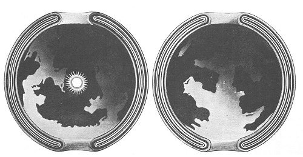

  
[Intangible Textual Heritage](../../index)  [Earth Mysteries](../index) 

------------------------------------------------------------------------

<table width="75%">
<colgroup>
<col style="width: 50%" />
<col style="width: 50%" />
</colgroup>
<tbody>
<tr class="odd">
<td width="50%" data-valign="CENTER"> 
</td>
<td width="50%" data-valign="CENTER"><h1 id="a-journey-to-the-earths-interior" data-align="CENTER">A Journey to the Earth's Interior</h1>
<h2 id="by-marshall-b.-gardner" data-align="CENTER">by Marshall B. Gardner</h2>
<h4 id="section" data-align="CENTER">[1920]</h4></td>
</tr>
</tbody>
</table>

------------------------------------------------------------------------

[Contents](#contents)    [Start Reading](jei00)  

------------------------------------------------------------------------

Marshall B. Gardner, a hollow-earth proponent, published the first
edition of this book in 1913, *after* Peary reached the North Pole in
1909. Gardner thus had a much harder job than [William
Reed](../potp/index); that is, overcoming the public perception that the
poles had been reached.

Gardner's book is in some ways superior to other books in this genre. He
attempts to come up with a scientific hypothesis to explain the
formation of hollow planets, instead of divine fiat or no explanation at
all. He is also a lot more readable. One of the most enjoyable parts of
this book is Gardner's fantasy account of a journey into the interior of
the hollow earth, which, while not up to the standards of Jules Verne,
seems almost plausible if you can suspend your disbelief temporarily.

Naturally, a great deal of the book consists of narratives of arctic
explorers (covering some of same material as Reed). The book marshals a
great deal of anomalous polar evidence, such as attested warm regions
near the poles, red dust, strange auroras and so on. Last but not least
are those poor flash-frozen Siberian mammoths, who seem to crop up with
such regularity in the crank literature,--probably because traditional
scientific explanations of their demise always sound so fishy when
quoted out of context.

There is a long section at the end where he deals with the response to
the first edition of his book, including an opponent who raises a theory
of a prehistoric 90 degree polar shift to account for some of the same
evidence! By contrast, a hollow earth would definitely be more
plausible.

Although Gardner doesn't attack the scientific method or basic physical
laws, as other alternative earth theorists do, perhaps he *should* have.
According to traditional physics, inside of a hollow earth-sized sphere
there should be zero gravity; and centrifugal force caused by the
earth's rotation would be insufficient to keep things inside the hollow
earth from floating away, either. Working out the math of a star small
enough to fit inside the earth, not too hot to fry the interior surface,
and not too dense to turn into a black hole is 'left as an exercise.'
The charming idea of denizens of the hollow earth going about their
business lit by a never-setting mini-sun is simply a fantasy.

*--John Bruno Hare, 6/28/2005*

------------------------------------------------------------------------

 [Title Page](jei00)  
[Contents](jei01)  
[Illustrations](jei02)  
[Preface](jei03)  
[Chapter I. Introductory](jei04)  
[Chapter II. The Nebula and its Evolution](jei05)  
[Chapter III. Mars](jei06)  
[Chapter IV. Early Polar Exploration](jei07)  
[Chapter V. Further Arctic Exploration](jei08)  
[Chapter VI. Greely's Explorations](jei09)  
[Chapter VII. Nordenskiold's Voyages](jei10)  
[Chapter VII. With Nansen in the North](jei11)  
[Chapter IX. Was the North Pole Discovered?](jei12)  
[Chapter X. Two Congressional Opinions on Peary and Cook](jei13)  
[Chapter XI. The Mammoth](jei14)  
[Chapter XII. The Life of the Arctic](jei15)  
[Chapter XIII. Other Interesting Animals of the Interior](jei16)  
[Chapter XIV. The Aurora](jei17)  
[Chapter XV. The Eskimo](jei18)  
[Chapter XVI. Evidence in the Antarctic](jei19)  
[Chapter XVII. The Journey to the Earth's Interior](jei20)  
[Chapter XVIII. The Formation of the Earth](jei21)  
[Chapter XIX. How Our Theory Differs From That of Symmes](jei22)  
[Chapter XX. The Moon And Our Theory](jei23)  
[Chapter XXI. A Note on Gravitation](jei24)  
[Chapter XXII. How Our Theory Has Been Received](jei25)  
[Chapter XXIII. Our Controversy with Dominian](jei26)  
[Chapter XXIV. Our Country and Our Theory](jei27)  
[Chapter XXV. In Conclusion](jei28)  
[Bibliography](jei29)  
