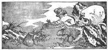
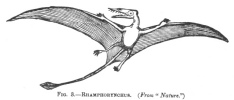
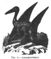

  
[Intangible Textual Heritage](../../index)  [Earth Mysteries](../index) 
[Index](index)  [Previous](mm02)  [Next](mm04) 

------------------------------------------------------------------------

[Buy this Book at
Amazon.com](https://www.amazon.com/exec/obidos/ASIN/1851709444/internetsacredte)

------------------------------------------------------------------------

*Mythical Monsters*, by Charles Gould, \[1886\], at Intangible Textual
Heritage

------------------------------------------------------------------------

p. 1

# MYTHICAL MONSTERS.

### INTRODUCTION.

IT would have been a bold step indeed for anyone, some thirty years ago,
to have thought of treating the public to a collection of stories
ordinarily reputed fabulous, and of claiming for them the consideration
due to genuine realities, or to have advocated tales, time-honoured as
fictions, as actual facts; and those of the nursery as being, in many
instances, legends, more or less distorted, descriptive of real beings
or events.

Now-a-days it is a less hazardous proceeding. The great era of advanced
opinion, initiated by Darwin, which has seen, in the course of a few
years, a larger progress in knowledge in all departments of science than
decades of centuries preceding it, has, among other changes, worked a
complete revolution in the estimation of the value of folk-lore; and
speculations on it, which in the days of our boyhood would have been
considered as puerile, are now admitted to be not merely interesting but
necessary to those who endeavour to gather up the skeins of unwritten
history, and to trace the antecedents and early migrations from parent
sources of nations long since alienated from each other by customs,
speech, and space.

p. 2

I have, therefore, but little hesitation in gravely proposing to submit
that many of the so-called mythical animals, which throughout long ages
and in all nations have been the fertile subjects of fiction and fable,
come legitimately within the scope of plain matter-of-fact Natural
History, and that they may be considered, not as the outcome of
exuberant fancy, but as creatures which really once existed, and of
which, unfortunately, only imperfect and inaccurate descriptions have
filtered down to us, probably very much refracted, through the mists of
time.

I propose to follow, for a certain distance only, the path which has
been pursued in the treatment of myths by mythologists, so far only, in
fact, as may be necessary to trace out the homes and origin of those
stories which in their later dress are incredible; deviating from it to
dwell upon the possibility of their having preserved to us, through the
medium of unwritten Natural History, traditions of creatures once
co-existing with man, some of which are so weird and terrible as to
appear at first sight to be impossible. I propose stripping them of
those supernatural characters with which a mysteriously implanted love
of the wonderful has invested them, and to examine them, as at the
present day we are fortunately able to do, by the lights of the modern
sciences of Geology, Evolution, and Philology.

For me the major part of these creatures are not chimeras but objects of
rational study. The dragon, in place of being a creature evolved out of
the imagination of Aryan man by the contemplation of lightning flashing
through the caverns which he tenanted, as is held by some mythologists,
is an animal which once lived and dragged its ponderous coils, and
perhaps flew; which devastated herds, and on occasions swallowed their
shepherd; which, establishing its lair in some cavern overlooking the
fertile plain, spread terror and destruction around, and, protected from
assault by dread or superstitious feeling, may even have been subsidised
by the

p. 3

terror-stricken peasantry, who, failing the power to destroy it, may
have preferred tethering offerings of cattle adjacent to its cavern to
having it come down to seek supplies from amongst their midst. [\*](#fn_0)

To me the specific existence of the unicorn seems not incredible, and,
in fact, more probable than that theory which assigns its origin to a
lunar myth. [†](#fn_1)

Again, believing as I do in the existence of some great undescribed
inhabitant of the ocean depths, the much-derided sea-serpent, whose home
seems especially to be adjacent to Norway, I recognise this monster as
originating the myths of the midgard serpent which the Norse Elder Eddas
have collected, this being the contrary view to that taken by
mythologists, who invert the derivation, and suppose the stories current
among the Norwegian fishermen to be modified versions of this important
element of Norse mythology. [‡](#fn_2)

p. 4

I must admit that, for my part, I doubt the general derivation of myths
from the contemplation of the visible workings of external
nature." [\*](#fn_3) It seems to me easier to
suppose that the palsy of time has enfeebled the utterance of these
oft-told tales until their original appearance is almost unrecognisable,
than that uncultured savages should possess powers of imagination and
poetical invention far beyond those enjoyed by the most instructed
nations of the present day; less hard to believe that these wonderful
stories of gods and demigods, of giants and dwarfs, of dragons and
monsters of all descriptions, are transformations than to believe them
to be inventions. [†](#fn_4)

The author of *Atlantis*, [‡](#fn_5) indeed,
claims that the gods and goddesses of the ancient Greeks, the
Phœnicians, the Hindoos, and the Scandinavians were simply the kings,
queens, and heroes of Atlantis, and the acts attributed to them in
mythology a confused recollection of real historical events. Without
conceding the locus of the originals, which requires much greater
examination than I am able to make at the

p. 5

present time, I quite agree with him as to the principle. I believe that
the mythological deities represent a confused chronology of far-distant
times, and that the destruction of the Nemean lion, the Lernean hydra,
and the Minotaur are simply the records of acts of unusual bravery in
combating ferocious animals.

On the first landing of Pizarro the Mexicans entertained the opinion
that man and horse were parts of one strange animal, [\*](#fn_6) and we have thus a clue to the explanation
of the origin of the belief in centaurs from a distant view of horsemen,
a view possibly followed by the immediate flight of the observer, which
rendered a solution of the extraordinary phenomenon impossible.

#### ON THE CREDIBILITY OF REMARKABLE STORIES.

Ferdinand Mendez Pinto quaintly observes, in one of his earlier
chapters, "I will not speak of the Palace Royal, because I saw it but on
the outside, howbeit the Chinese tell such wonders of it as would amaze
a man; for it is my intent to relate nothing save what we beheld here
with our own eyes, and that was so much as that I am afraid to write it;
not that it would seem strange to those who have seen and read the
marvels of the kingdom of China, but because I doubt that they which
would compare those wondrous things that are in the countries they have
not seen, with that little they have seen in their own, will make some
question

p. 6

of it, or, it may be, give no credit at all to these truths, because
they are not conformable to their understanding and small
experience." [\*](#fn_7)

p. 7

Now as some of the creatures whose existence I shall have to contend for
in these volumes are objects of derision to a large proportion of
mankind, and of reasonable doubt to another, I cannot help fortifying
myself with some such outwork of reasoning as the pith of Pinto's
remarks affords, and supplementing it by adding that, while the balance
between scepticism and credulity is undoubtedly always difficult to
hold, yet, as Lord Bacon well remarks, "There is nothing makes a man
suspect much more than to know little; and therefore men should remedy
suspicion by procuring to know more."

Whately extends Bacon's proposition by adding, "This is equally true of
the suspicions that have reference to things as persons"; in other
words, ignorance and suspicion go hand-in-hand, and so travellers’
tales, even when supported by good evidence, are mostly denied credence
or accepted with repugnance, when they offend the experience of those
who, remaining at home, are thus only partially educated. Hence it is,
not to go too far back for examples, that we have seen Bruce, Mungo
Park, Du Chaillu, Gordon Cumming, Schliemann, [\*](#fn_8) and Stanley treated with the most
ungenerous criticism and contemptuous disbelief by persons who, however
well informed in many subjects, lacked the extended and appreciative
views which can only be acquired by travel.

Nor is this incredulity limited to travellers’ tales about savage life.
It is just as often displayed in reference to the

p. 8

surroundings of uneventful life, provided they are different from those
with which we are familiar.

Saladin rebuked the Knight of the Leopard for falsehood when the latter
assured him that the waters of lakes in his own country became at times
solidified, so that armed and mounted knights could cross them as if on
dry land. And the wise Indian who was taken down to see the large
American cities, with the expectation that, being convinced of the
resources and irresistible power of civilization he would influence his
tribe to submission on his return, to the surprise of the commissioners
who had conveyed him, spoke in directly contrary terms to those expected
of him, privately explaining in reply to their remonstrances, that had
he told the truth to his tribe he would have been indelibly branded for
the remainder of his life as an outrageous and contemptible liar.
Chinese students, despatched for education in American or European
capitals, are compelled on their return to make similar reservations,
under pain of incurring a like penalty; and officials who, from contact
with Europeans at the open ports, get their ideas expanded too quickly,
are said to be liable to isolation in distant regions, where their
advanced and fantastic opinions may do as little harm to right-thinking
people as possible. [\*](#fn_9)

Even scientific men are sometimes as crassly incredulous as the
uncultured masses. On this point hear Mr. A. R. Wallace. [†](#fn_10) "Many now living remember the time (for it
is

p. 9

little more than twenty years ago) when the antiquity of man, as now
understood, was universally discredited. Not only theologians, but even
geologists taught us that man belonged to the existing state of things;
that the extinct animals of the tertiary period had finally disappeared,
and that the earth's surface had assumed its present condition before
the human race first came into existence. So prepossessed were
scientific men with this idea, which yet rested on purely negative
evidence, and could not be supported by any argument of scientific
value, that numerous facts which had been presented at intervals for
half a century, all tending to prove the existence of man at very remote
epochs, were silently ignored, and, more than this, the detailed
statements of three distinct and careful observers confirming each other
were rejected by a great scientific society as too improbable for
publication, only because they proved (if they were true) the
co-existence of man with extinct animals." [\*](#fn_11)

The travels of that faithful historian, Marco Polo, were for a long time
considered as fables, and the graphic descriptions of the Abbé Huc even
still find detractors continuing the rôle of those who maintained that
he had never even visited the countries which he described.

Gordon Cumming was disbelieved when he asserted that he had killed an
antelope, out of a herd, with a rifle-shot at a distance of eight
hundred yards.

Madame Merian [†](#fn_12) was accused of
deliberate falsehood in reference to her description of a bird-eating
spider nearly

p. 10

two hundred years ago. But now-a-days Mr. Bates and other reliable
observers have confirmed it in regard to South America, India, and
elsewhere.

Audubon was similarly accused by botanists of having invented the yellow
water-lily, which he figured in his *Birds of the South* under the name
of Nymphæa lutea, and after having lain under the imputation for years,
was confirmed at last by the discovery of the long-lost flower, in
Florida, by Mrs. Mary Trent, in the summer of 1876; [\*](#fn_13) and this encourages us to hope that some
day or other a fortunate sportsman may rediscover the Haliætus
Washingtonii, in regard to which Dr. Cover says: "That famous bird of
Washington was a myth; either Audubon was mistaken, or else, as some do
not hesitate to affirm, he lied about it."

[  
Click to enlarge](img/fig01.jpg)  
FIG. 1.—FISHERMAN ATTACKED BY OCTOPUS.  

(*Facsimile from a drawing by Hokusai, a celebrated Japanese artist who
lived about the beginning of the present century*.)

Victor Hugo was ridiculed for having exceeded the bounds of poetic
license when he produced his marvellous word-painting of the devil-fish,
and described a man as becoming its helpless victim. The thing was
derided as a monstrous

p. 11

impossibility; yet within a few years were discovered, on the shores of
Newfoundland, cuttle-fishes with arms extending to thirty feet in
length, and capable of dragging a good-sized boat beneath the surface;
and their action has been reproduced for centuries past, as the
representation of a well-known fact, in *net sukes* (ivory carvings) and
illustrations by Japanese artists. [\*](#fn_14)

p. 12

Before the days of Darwinism, what courage was requisite in a man who
propounded any theory a little bit extravagant! Hark how, even less than
twenty years ago, the ghost of the unfortunate Lord Monboddo had bricks
of criticism pelted at it, half earnestly, half contemptuously, by one
of our greatest thinkers, whose thought happened to run in grooves
different from those travelled in by the mind of the unfortunate
Scotchman.

"Lord Monboddo [\*](#fn_15) had just finished
his great work, by which he derives all mankind from a couple of apes,
and all the dialects of the world from a language originally framed by
some Egyptian gods, when the discovery of Sanskrit came on him like a
thunderbolt. It must be said, however, to his credit, that he at once
perceived the immense importance of the discovery. He could not be
expected to sacrifice his primordial monkeys or his Egyptian idols, &c."

And again: "It may be of interest to give one other extract in order to
show how well, apart from his men with, and his monkeys without, tails,
Lord Monboddo could sift and handle the evidence that was placed before
him."

Max Müller also furnishes us with an amazing example of scepticism on
the part of Dugald Stewart. He says [†](#fn_16):
" However, if the facts about Sanskrit were true, Dugald Stewart was too
wise not to see that the conclusions drawn from them were inevitable. He
therefore denied the reality of such a language as Sanskrit altogether,
and wrote his famous essay to prove that Sanskrit had been put together,
after the model of Greek and Latin, by those archforgers and liars, the
Brahmans, and that the whole of Sanskrit literature was an imposition."

So Ctesias attacked Herodotus. The very existence of

p. 13

\[paragraph continues\] Homer has been
denied, and even the authorship of Shakespeare's plays questioned. [\*](#fn_17)

We are all familiar enough now with the black swan, but Ovid [†](#fn_18) considered it as so utterly impossible
that he clinched, as it were, an affirmation by saying, "If I doubted, O
Maximus, of thy approval of these words, I could believe that there are
swans of the colour of Memnon" \[*i.e.* black\]; and even so late as the
days of Sir Thomas Browne, we find them classed by him with flying
horses, hydras, centaurs, harpies, and satyrs, as monstrosities,
rarities, or else poetical fancies. [‡](#fn_19)

Now that we have all seen the great hippopotamus disport himself in his
tank in the gardens of the Zoological Society, we can smile at the grave
arguments of the savant who, while admitting the existence of the
animal, disputed the possibility of his walking about on the bed of a
river, because his great bulk would prevent his rising again. [§](#fn_20) But I daresay

p. 14

it passed muster in his days as a very sound and shrewd observation,
just as, possibly, but for the inconvenient waggery of Peter Pindar,
might have done the intelligent inquiry, which he records, after the
seam in the apple-dumpling.

Poor Fray Gaspar de Jan Bernardine who, in 1611, undertook the journey
by land from India to Portugal, was unfortunate enough to describe the
mode in which the captain of the caravan communicated intelligence to
Bagdad by carrier pigeon. "He had pigeons whose young and nests were at
his house in that city, and every two days he let fly a pigeon with a
letter tied to its foot containing the news of his journey. This account
met with but little belief in Europe, and was treated there as a matter
of merriment." [\*](#fn_21)

The discredit under which this traveller fell is the more surprising
because the same custom had already been noted by Sir John Mandeville,
who, in speaking of Syria and adjacent countries, says: "In that
contree, and other contrees beyond, thei have custom, whan thei schulle
usen warre, and when men holden sege abouten Cytee or Castelle, and thei
withinen dur not senden messagers with lettres frō Lord to Lord for to
ask Sokour, thei maken here Lettres and bynden hem to the Nekke of a
Colver and leten the Colver flee, and the Colveren ben so taughte, that
thei flun with the Lettres to the very place that men wolde send hem to.
For the Colveres

p. 15

ben norrysscht in the Places Where thei been sent to, and thei senden
them there, for to beren here Lettres, and the Colveres retournen agen,
where as thei ben norrischt, and so thei dou commonly."

While, long before, Pliny had referred to it in his Natural
History [\*](#fn_22) as follows: "In addition to
this, pigeons have acted as messengers in affairs of importance. During
the siege of Mutina, Decimus Brutus, who was in the town, sent
despatches to the camp of the Consuls, fastened to pigeons’ feet. Of
what use to Antony, then, were his entrenchments? and all the vigilance
of the besieging army? his nets, too, which he had spread in the river,
while the messenger of the besieged was cleaving the air?"

The pace of railways; steam communication across the Atlantic; the Suez
Canal [†](#fn_23); were not all these considered
in former days to be impossible? With these examples of failure of
judgment before us, it may be fairly asked whether, in applying our
minds to the investigation of the reality of creatures apparently
monstrous, we duly reflect upon the extraordinary, almost miraculous,
events which incessantly occur in the course of the short existence of
all animated nature? Supposing the history of insects were unknown to
us, could the wildest imagination conceive such a marvellous
transformation as that which takes place continually around us in the
passage from the larva through the chrysalis to the butterfly? or human
ingenuity invent one so bizarre as that recorded by Steenstrup in his
theory of the alternation of generation?

We accept as nothing marvellous, only because we see them daily, the
organization and the polity of a community

p. 16

of ants; their collaboration, their wars, and their slaveries have been
so often stated that they cease to astonish. The same may be said of the
marvellous architecture of birds, their construction of houses to live
in, of bowers to play in, and even of gardens to gratify their sense of
beauty. [\*](#fn_24)

We admire the ingenious imagination of Swift, and essayists dwell upon
his happy conceits and upon the ability with which, in his celebrated
work, he has ordered all things to harmonise in dimensions with the
enlarged and reduced scales on which he has conceived the men and
animals of Brobdignag and Lilliput. So much even has this quaint idea
been appreciated, that his story has achieved a small immortality, and
proved one of the numerous springs from which new words have been
imported into our language. Yet the peculiar and essential singularities
of the story are quite equalled, or even surpassed, by creatures which
are, or have been, found in nature. The imaginary diminutive cows which
Gulliver brought back from Lilliput, and placed in the meadows at
Dulwich, are not one bit more remarkable, in respect to relative size,
than the pigmy elephant (*E. Falconeri*) whose remains have been found
in the cave-deposits of Malta, associated with those of pigmy
hippopotami, and which was only two feet six inches high; or the still
existing *Hippopotamus* (*Chœropsis*) *liberiensis*, which M. Milne
Edwardes [†](#fn_25) figures as little more than
two feet in height.

The lilliputian forests from which the royal navy was constructed
contained even large trees in comparison with the dwarf oaks of
Mexico, [‡](#fn_26) or with the allied, even
smaller

p. 17

species, which crawls like heather about the hill-slopes of China and
Japan, and still more so in comparison with that singular pine, the most
diminutive known (*Dacrydium taxifolium*), fruiting specimens of which,
according to Kirk, are sometimes only two inches high, while the average
height is only six to ten inches; while even among the forests of
Brobdignag, a very respectable position could be held by the mammoth
trees of California (*Sequoia gigantea*), or by the loftier white gums
of Australia (*Eucalyptus amygdalina*), which occasionally reach,
according to Von Mueller, [\*](#fn_27) the
enormous height of 480 feet. Nor could more adequate tenants (in point
of size) be found to occupy them than the gigantic reptilian forms
lately discovered by Marsh among the deposits of Colorado and Texas.

Surely a profound acquaintance with the different branches of natural
history should render a man credulous rather than incredulous, for there
is hardly conceivable a creature so monstrous that it may not be
paralleled by existing ones in every-day life. [†](#fn_28)

p. 18

Are the composite creatures of Chaldæan mythology so very much more
wonderful than the marsupial kangaroo, the duck-billed platypus, and the
flying lizard of Malaysia which

[  
Click to enlarge](img/fig02.jpg)  
FIG. 2.—PTERODLCTYLUS. (*After Figuier*.)  

are, or the pterodactylus, rhamphorynchus, and archæopteryx which have
been? Does not geological science, day by day, trace one formation by
easy gradation to another, bridge over

[  
Click to enlarge](img/fig03.jpg)  
FIG. 3.—RHAMPHORYNCHUS. (From  

the gaps which formerly separated them, carry the proofs of the
existence of man constantly further and further back into remote time,
and disclose the previous existence of intermediate

p. 19

types (satisfying the requirements of the Darwinian theory) connecting
the great divisions of the animal kingdom, of reptile-like birds and
bird-like reptiles? Can we suppose that we have at all exhausted the
great museum of nature? Have we, in fact, penetrated yet beyond its
ante-chambers?

[  
Click to enlarge](img/fig04.jpg)  
FIG. 4.—ARCHÆOPTERYX.  

Does the written history of man, comprising a few thousand years,
embrace the whole course of his intelligent existence? or have we in the
long mythical eras, extending over hundreds of thousands of years and
recorded in the chronologies of Chaldæa and of China, shadowy mementoes
of pre-historic man, handed down by tradition, and perhaps transported
by a few survivors to existing lands from others which, like the fabled
(?) Atlantis of Plato, may have been submerged, or the scene of some
great catastrophe which destroyed them with all their civilization.

The six or eight thousand years which the various interpreters of the
Biblical record assign for the creation of the world and the duration of
man upon the earth, allow little enough space for the development of his
civilization—a civilization which documental evidence carries almost to
the verge of the limit—for the expansion and divergence of stocks, or
the obliteration of the branches connecting them.

p. 20

But, fortunately, we are no more compelled to fetter our belief within
such limits as regards man than to suppose that his appearance on the
globe was coeval with or immediately successive to its own creation at
that late date. For while geological science, on the one hand, carries
back the creation of the world and the appearance of life upon its
surface to a period so remote that it is impossible to estimate it, and
difficult even to faintly approximate to it, so, upon the other, the
researches of paleontologists have successively traced back the
existence of man to periods variously estimated at from thirty thousand
to one million years—to periods when he co-existed with animals which
have long since become extinct, and which even excelled in magnitude and
ferocity most of those which in savage countries dispute his empire at
the present day. Is it not reasonable to suppose that his combats with
these would form the most important topic of conversation, of tradition,
and of primitive song, and that graphic accounts of such struggles, and
of the terrible nature of the foes encountered, would be handed down
from father to son, with a fidelity of description and an accuracy of
memory unsuspected by us, who, being acquainted with reading and
writing, are led to depend upon their artificial assistance, and thus in
a measure fail to cultivate a faculty which, in common with those of
keenness of vision and hearing, are essential to the existence of man in
a savage or semi-savage condition? [\*](#fn_29)

The illiterate backwoodsman or trapper (and hence by inference the
savage or semi-civilized man), whose mind is

p. 21

occupied merely by his surroundings, and whose range of thought, in
place of being diffused over an illimitable horizon, is confined within
very moderate limits, develops remarkable powers of observation and an
accuracy of memory in regard to localities, and the details of his daily
life, surprising to the scholar who has mentally to travel over so much
more ground, and, receiving daily so many and so far more complex ideas,
can naturally grasp each less firmly, and is apt to lose them entirely
in the haze of a period of time which would still leave those of the
uneducated man distinguishable or even prominent landmarks. [\*](#fn_30) Variations in traditions must, of course,
occur in time, and the same histories, radiating in all directions from
centres, vary from the original ones by increments dependent on
proportionately altered phases of temperament and character, induced by
change of climate, associations and conditions of life; so that the
early written history of every country reproduces under its own garb,
and with a claim to originality, attenuated, enriched, or deformed
versions of traditions common in their origin to many or all. [†](#fn_31)

p. 22

Stories of divine progenitors, demigods, heroes, mighty hunters, slayers
of monsters, giants, dwarfs, gigantic serpents, dragons, frightful
beasts of prey, supernatural beings, and myths of all kinds, appear to
have been carried into all corners of the world with as much fidelity as
the sacred Ark of the Israelites, acquiring a moulding—graceful, weird
or uncouth—according to the genius of the people or their capacity for
superstitious belief; and these would appear to have been materially
affected by the varied nature of their respective countries. For
example, the long-continuing dwellers in the open plains of a
semi-tropical region, relieved to a great extent from the cares of
watchfulness, and nurtured in the grateful rays of a genial but not
oppressive sun, must have a more buoyant disposition and more open
temperament than those inhabiting vast forests, the matted overgrowth of
which rarely allows the passage of a single ray, bathes all in gloom,
and leaves on every side undiscovered depths, filled with shapeless
shadows, objects of vigilant dread, from which some ferocious monster
may emerge at any moment. Again, on the one hand, the nomad roaming in
isolation over vast solitudes, having much leisure for contemplative
reflection, and on the other, the hardy dwellers on storm-beaten coasts,
by turns fishermen, mariners, and pirates, must equally develop traits
which affect their religion, polity, and customs, and stamp their
influences on mythology and tradition.

The Greek, the Celt, and the Viking, descended from the same Aryan
ancestors, though all drawing from the same sources their inspirations
of religious belief and tradition, quickly diverged, and respectively
settled into a generous martial race—martial in support of their
independence rather than from any lust of conquest—polite, skilled, and
learned; one brave but irritable, suspicious, haughty, impatient of
control; and the last, the berserker, with a ruling passion for maritime
adventure, piracy, and hand-to-hand heroic

p. 23

struggles, to be terminated in due course by a hero's death and a
welcome to the banqueting halls of Odin in Walhalla.

The beautiful mythology of the Greek nation, comprising a pantheon of
gods and demigods, benign for the most part, and often interesting
themselves directly in the welfare of individual men, was surely due to,
or at least greatly induced by, the plastic influences of a delicious
climate, a semi-insular position in a sea comparatively free from stormy
weather, and an open mountainous country, moderately fertile. Again, the
gloomy and sanguinary religion of the Druids was doubtless moulded by
the depressing influences of the seclusion, twilight haze, and dangers
of the dense forests in which they hid themselves—forests which, as we
know from Cesar, spread over the greater part of Gaul, Britain, and
Spain; while the Viking, having from the chance or choice of his
ancestors, inherited a rugged seaboard, lashed by tempestuous waves and
swept by howling winds, a seaboard with only a rugged country shrouded
with unsubdued forests at its back, exposed during the major portion of
the year to great severity of climate, and yielding at the best but a
niggard and precarious harvest, became perforce a bold and skilful
mariner, and, translating his belief into a language symbolic of his new
surroundings, believed that he saw and heard Thor in the midst of the
howling tempests, revealed majestic and terrible through rents in the
storm-cloud. Pursuing our consideration of the effects produced by
climatic conditions, may we not assume, for example, that some at least
of the Chaldæans, inhabiting a pastoral country, and being descended
from ancestors who had pursued, for hundreds or thousands of years, a
nomadic existence in the vast open steppes in the highlands of Central
Asia, were indebted to those circumstances for the advance which they
are credited with having made in astronomy and kindred sciences. Is it
not possible that their acquaintance with climatology was as exact or
even more so than our own? The habit of solitude

p. 24

would induce reflection, the subject of which would naturally be the
causes influencing the vicissitudes of weather. The possibilities of
rain or sunshine, wind or storm, would be with them a prominent object
of solicitude; and the necessity, in an unfenced country, of extending
their watch over their flocks and herds throughout the night, would
perforce more or less rivet their attention upon the glorious
constellations of the heavens above, and lead to habits of observation
which, systematized and long continued by the priesthood, might have
produced deductions accurate in the result even if faulty in the
process.

The vast treasures of ancient knowledge tombed in the ruins of Babylon
and Assyria, of which the recovery and deciphering is as yet only
initiated, may, to our surprise, reveal that certain secrets of
philosophy were known to the ancients equally with ourselves, but lost
through intervening ages by the destruction of the empire, and the fact
of their conservancy having been entrusted to a privileged and limited
order, with which it perished. [\*](#fn_32)

p. 25

We hail as a new discovery the knowledge of the existence of the
so-called spots upon the surface of the sun, and scientists, from
long-continued observations, profess to distinguish a connection between
the character of these and atmospheric phenomena; they even venture to
predict floods and droughts, and that for some years in anticipation;
while pestilences or some great disturbance are supposed to be likely to
follow the period when three or four planets attain their apogee within
one year, a supposition based on the observations extended over numerous
years, that similar events had accompanied the occurrence of even one
only of those positions at previous periods.

May we not speculate on the possibility of similar or parallel knowledge
having been possessed by the old Chaldæan and Egyptian priesthood; and
may not Joseph have been able, by superior ability in its exercise, to
have anticipated the seven years' drought, or Noah, from an acquaintance
with meteorological science, to have made an accurate forecast of the
great disturbances which resulted in the Deluge and the destruction of a
large portion of mankind? [\*](#fn_33)

p. 26

Without further digression in a path which opens the most pleasing
speculations, and could be pursued into endless ramifications, I will
merely, in conclusion, suggest that the same influences which, as I have
shown above, affect so largely the very nature of a people, must
similarly affect its traditions and myths, and that due consideration
will have to be given to such influences, in the case of some at least
of the remarkable animals which I propose to discuss in this and future
volumes.

p. 27

#### CHRONOLOGICAL LIST OF SOME AUTHORS WRITING ON, AND WORKS RELATING TO NATURAL HISTORY, TO WHICH REFERENCES ARE MADE IN THE PRESENT VOLUME; EXTRACTED TO A GREAT EXTENT, AS TO THE WESTERN AUTHORS, FROM KNIGHT'S "CYCLOPÆDIA OF BIOGRAPHY."

*The Shan Hai King*—According to the commentator Kwoh P‘oh (A.D.
276-324), this work was compiled three thousand years before this time,
or at seven dynasties’ distance. Yang Sun of the Ming dynasty
(commencing A.D. 1368), states that it was compiled by Kung Chia (and
Chung Ku?) from engravings on nine urns made by the Emperor Yü, B.C.
2255. Chung Ku was an historiographer, and at the time of the last
Emperor of the Hia dynasty (B.C. 1818), fearing that the Emperor might
destroy the books treating of the ancient and present time, carried them
in flight to Yin.

*The ’Rh Ya*—Initiated according to tradition, by Chow Kung; uncle of Wu
Wang, the first Emperor of the Chow dynasty, B.C. 1122. Ascribed also to
Tsze Hea, the disciple of Confucius.

*The Bamboo Books*—Containing the Ancient Annals of China, said to have
been found A.D. 279, on opening the grave of King Seang of Wei \[died
B.C. 295\]. Age prior to last date, undetermined. Authenticity disputed,
favoured by Legge.

p. 28

*Confucius*—Author of Spring and Autumn Classics, &c., B.C. (551-479).

*Ctesias*—Historian, physician to Artaxerxes, B.C. 401. Herodotus—B.C.
484.

*Aristotle*—B.C. 384.

*Megasthenes*—About B.C. 300. In time of Seleucus Nicator. His work
entitled *Indica* is only known by extracts in those of Strabo, Arrian,
and Ælian.

*Eratosthenes*—Born B.C. 276. Mathematician, Astronomer, and Geographer.

*Posidonius*—Born about B.C. 140. Besides philosophical treatises, wrote
works on geography, history, and astronomy, fragments of which are
preserved in the works of Cicero, Strabo, and others.

*Nicander*—About B.C. 135. Wrote the *Theriaca*, a poem of 1,000 lines,
in hexameter, on the wounds caused by venomous animals, and the
treatment. Is followed in many of his errors by Pliny. Plutarch says the
*Theriaca* cannot be called a poem, because there is in it nothing of
fable or falsehood.

*Strabo*—Just before the Christian era. Geographer.

*Cicero*—Born B.C. 106.

*Propertius* (*Sextus Aurelius*)—Born probably about B.C. 56.

*Diodorus Siculus*—Wrote the *Bibliotheca Historica* (in Greek), after
the death of Julius Cæsar (B.C. 44). Of the 40 books composing it only
15 remain, viz. Books 1 to 5 and 11 to 20.

*Juba*—Died A.D. 17. Son of Juba I., King of Numidia. Wrote on Natural
History.

*Pliny*—Born A.D. 23.

*Lucan*—A.D. 38. The only work of his extant is the *Pharsalia*, a poem
on the civil war between Cæsar and Pompey.

p. 29

*Ignatius*—Either an early Patriarch, A.D. 50, or Patriarch of
Constantinople, 799.

*Isidorus*—Isidorus of Charaux lived probably in the first century of
our era. He wrote an account of the Parthian empire.

*Arrian*—Born about A.D. 100. His work on the Natural History, &c. of
India is founded on the authority of Eratosthenes and Megasthenes.

*Pausanias*—Author of the Description or Itinerary of Greece. In the 2nd
century.

*Philostratus*—Born about A.D. 182.

*Solinus*, *Caius Julius*—Did not write in the Augustan age, for his
work entitled *Polyhistor* is merely a compilation from Pliny's *Natural
History*. According to Salmasius, he lived about two hundred years after
Pliny.

*Ælian*—Probably middle of the 3rd century A.D. *De Naturâ Animalium*.
In Greek.

*Ammianus Marcellinus*—Lived in 4th century.

*Cardan, Jerome A*.—About the end of 4th century A.D.

Printing invented in China, according to Du Halde, A.D. 924.
Block-printing used in A.D. 593.

*Marco Polo*—Reached the Court of Kublai Khan in A.D. 1275.

*Mandeville, Sir John de*—Travelled for thirty-three years in Asia
dating from A.D. 1327. As he resided for three years in Peking, it is
probable that many of his fables are derived from Chinese sources.

Printing invented in Europe by John Koster of Haarlem, A.D. 1438.

*Scaliger, Julius Cæsar*—Born April 23rd, 1484. Wrote *Aristotelis Hist.
Anim. liber decimus cum vers. et comment*. 8vo. Lyon, 1584, &c.

p. 30

*Gesner*—Born 1516. *Historiæ Animalium*, &c.

*Ambrose Paré*—Born 1517. Surgeon.

*Belon, Pierre*.—Born 1518. Zoologist, Geographer, &c.

*Aldrovandus*—Born 1552. Naturalist.

*Tavernier*, J. B.—Born 1605.

*Păn Ts’ao Kong Muh*.—By Li Shê-chin of the Ming dynasty (A.D.
1368-1628).

*Yuen Kien Léi Han*. A.D. 1718.

------------------------------------------------------------------------

### Footnotes

[3:\*](mm03.htm#fr_0) This tributary offering is
a common feature in dragon legends. A good example is that given by El
Edrisi in his history of the dragon destroyed by Alexander the Great in
the island of Mostachin (one of the Canaries?).

[3:†](mm03.htm#fr_1) The latest writer on this
point summarizes his views, in his opening remarks, as follows:—"The
science of heraldry has faithfully preserved to modern times various
phases of some of those remarkable legends which, based upon a study of
natural phenomena, exhibit the process whereby the greater part of
mythology has come into existence. Thus we find the solar gryphon, the
solar phœnix, a demi-eagle displayed issuing from flames of fire; the
solar lion and the lunar unicorn, which two latter noble creatures now
harmoniously support the royal arms. I propose in the following pages to
examine the myth of the unicorn, the wild, white, fierce, chaste, moon,
whose two horns, unlike those of mortal creatures, are indissolubly
twisted into one; the creature that endlessly fights with the lion to
gain the crown or summit of heaven, which neither may retain, and whose
brilliant horn drives away the darkness and evil of the night even as we
find in the myth, that Venym is defended by the horn of the
unicorn."—*The Unicorn; a Mythological Investigation*. Robert Brown,
jun., F.S.A. London, 1881.

[3:‡](mm03.htm#fr_2) "The midgard or
world-serpent we have already become tolerably well acquainted with, and
recognise in him the wild tumultuous sea. Thor contended with him; he
got him on his hook, but did not succeed p. 4
in killing him. We also remember how Thor tried to lift him in the form
of a cat. The North abounds in stories about the sea-serpent, which are
nothing but variations of the original myths of the Eddas. Odin cast him
into the sea, where he shall remain until he is conquered by Thor in
Ragnarok."—*Norse Mythology*, p. 387. R. B. Anderson, Chicago, 1879.

[4:\*](mm03.htm#fr_3) *Vide* Anderson.

[4:†](mm03.htm#fr_4) Just as even the greatest
masters of fiction adapt but do not originate. Harold Skimpole and
Wilkins Micawber sat unconsciously for their portraits in real life, and
the most charming characters and fertile plots produced by that most
prolific of all writers, A. Dumas, are mere elaborations of people and
incidents with which historical memoirs provided him.

[4:‡](mm03.htm#fr_5) *Atlantis; the Antediluvian
World*. J. Donelly, New York, 1882. The author has amassed, with
untiring labour, a large amount of evidence to prove that the island of
Atlantis, in place of being a myth or fable of Plato, really once
existed; wag the source of all modern arts and civilization; and was
destroyed in a catastrophe which he identifies with the Biblical Deluge.

[5:\*](mm03.htm#fr_6) So also, Father Stanislaus
Arlet, of the Society of Jesus, writing to the General of the Society in
1698 respecting a new Mission in Peru, and speaking of a Peruvian tribe
calling themselves Canisian, says: "Having never before seen horses, or
men resembling us in colour and dress, the astonishment they showed at
our first appearance among them was a very pleasing spectacle to us, the
sight of us terrifying them to such a degree that the bows and arrows
fell from their hand; imagining, as they afterwards owned, that the man,
his hat, his clothes, and the horse he rode upon, composed but one
animal."

[6:\*](mm03.htm#fr_7) *The Voyages and Adventures
of Ferdinand Mendez Pinto*, done into English by H. C. Gent, London,
1653, p. 109. The vindication of Pinto's reputation for veracity will
doubtless one day be, to a great extent, effected, for although his
interesting narrative is undoubtedly embroidered with a rich tissue of
falsity, due apparently to an exaggerated credulity upon his part, and
systematic deception upon that of his Chinese informants, he certainly
is undeserving of the wholesale condemnation of which Congreve was the
reflex when he made Foresight, addressing Sir Sampson Legend, say: "Thou
modern Mandeville, Ferdinand Mendez Pinto was but a type of thee, thou
liar of the first magnitude."—*Love for Love*, Act. 2, Scene 1. There
are many points in his narrative which are corroborated by history and
the accounts of other voyages; and it must be remembered that, although
the major part of the names of places and persons which he gives are now
unrecognisable, yet this may be due to alterations from the lapse of
time, and from the difficulty of recognising the true original Chinese
or Japanese word under those produced by the foreign mode of
transliteration in vogue in those days. Thus the Port Liampoo of Pinto
is now and has been for many years past only known as Ningpo, the first
name being a term of convenience, used by the early Portuguese voyagers,
and long since abandoned. Just as the wonderful Quinsay of Marco Polo
(still known by that name in Pinto's time) has been only successfully
identified (with Hangchow-fu) through the antiquarian research of
Colonel Yule. So also the titles of Chaems, Tutons, Chumbins, Aytons,
Anchacy's, which Pinto refers to (p. 108), are only with difficulty
recognisable in those respectively of Tsi‘ang (a Manchu governor),
Tu-tung (Lieutenant-General), Tsung-ping (Brigadier-General), Tao-tai
\[??\] (Intendant of Circuit) and Ngan-ch‘a She-sze (Provincial Judge),
as rendered by the modern sinologue Mayers in his Essay on the Chinese
Government, Shanghai, 1878. The incidental references to the country,
people, habits, and products, contained in the chapter describing his
passage in captivity from Nanquin to Pequin are true to nature, and the
apparently obviously untruthful statement which he makes of the
employment by the King of Tartary of thousands of rhinoceri both as
beasts of burthen and articles of food (p. 158) is explicable, I think,
on the supposition that some confusion has arisen, either in translation
or transcription, between rhinoceros and camel. Anyone who has seen the
long strings of camels wending their way to Pekin from the various
northern roads through the passes into Mongolia, would readily believe
p. 7 that a large transport corps of them could
easily be amassed by a despotic monarch; while the vast numbers of
troops to which Pinto makes reference are confirmed by more or less
authentic histories.

[7:\*](mm03.htm#fr_8) "I was myself an
eye-witness of two such discoveries and helped to gather the articles
together. The slanderers have long since been silenced, who were not
ashamed to charge the discoverer with an imposture."—Prof. Virchow, in
Appendix I. to Schliemann's *Ilios*. Murray, 1880.

[8:\*](mm03.htm#fr_9) "But ask them to credit an
electric telegram, to understand a steam-engine, to acknowledge the
microscopic revelations spread out before their eyes, to put faith in
the Atlantic cable or the East India House, and they will tell you that
you are a barbarian with blue eyes, a fan kwai, and a sayer of that
which is not. The dragon and the phœnix are true, but the rotifer and
the message, the sixty miles an hour, the cable, and the captive kings
are false."—*Household Words*, October 30th, 1855.

[8:†](mm03.htm#fr_10) Address delivered to the
Biological Section of the British Association. Glasgow, 1876.

[9:\*](mm03.htm#fr_11) In 1854 a communication
from the Torquay Natural History Society, confirming previous accounts
by Mr. Goodwin Austen, Mr. Vivian, and the Rev. Mr. McEnery, "that
worked flints occurred in Kents Hole with remains of extinct species,"
was rejected as too improbable for publication.

[9:†](mm03.htm#fr_12) "She is set down a
thorough heretic, not at all to be believed, a manufacturer of unsound
natural history, an inventor of false facts in science."—Gosse, *Romance
of Nat. Hist.*, 2nd Series, p. 227.

[10:\*](mm03.htm#fr_13) *Pop. Sci. Monthly*, No.
60, April 1877.

[11:\*](mm03.htm#fr_14) "By the kindness of my
friend, Mr. Bartlett, I have been enabled to examine a most beautiful
Japanese carving in ivory, said to be one hundred and fifty years old,
and called by the Japanese *net suke* or *togle*. These togles are
handed down from one generation to the next, and they record any
remarkable event that happens to any member of a family. This carving is
an inch and a half long, and about as big as a walnut. It represents a
lady in a quasi-leaning attitude, and at first sight it is difficult to
perceive what she is doing; but after a while the details come out
magnificently. The unfortunate lady has been seized by an octopus when
bathing—for the lady wears a bathing-dress. One extended arm of the
octopus is in the act of coiling round the lady's neck, and she is
endeavouring to pull it off with her right hand; another arm of the
sea-monster is entwined round the left wrist, while the hand is fiercely
tearing at the mouth of the brute. The other arms of the octopus are
twined round, grasping the lady's body and waist—in fact, her position
reminds one very much of Laocoon in the celebrated statue of the snakes
seizing him and his two sons. The sucking discs of the octopus are
carved exactly as they are in nature, and the colour of the body of the
creature, together with the formidable aspect of the eye, are
wonderfully represented. The face of this Japanese lady is most
admirably done; it expresses the utmost terror and alarm, and possibly
may be a portrait. So carefully is the carving executed that the lady's
white teeth can be seen between her lips. The hair is a perfect gem of
work; it is jet black, extended down the back, and tied at the end in a
knot; in fact, it is so well done that I can hardly bring myself to
think that it is not real hair, fastened on in some most ingenious
manner; but by examining it under a powerful magnifying glass I find it
is not so—it is the result of extraordinary cleverness in carving. The
back of the little white comb fixed into the thick of the black hair
adds to the effect of this magnificent carving of the hair. I
congratulate Mr. Bartlett on the acquisition of this most beautiful
curiosity. There is an inscription in Japanese characters on the
underneath part of the carving, and Mr. Bartlett and myself would, of
course, only be too glad to get this translated."—Frank Buckland, in
*Land and Water*.

[12:\*](mm03.htm#fr_15) Max Müller, *Science of
Language*, 4th edition, p. 163-165. London, 1864.

[12:†](mm03.htm#fr_16) *Science of Language*, p.
168.

[13:\*](mm03.htm#fr_17) "When a naturalist,
either by visiting such spots of earth as are still out of the way, or
by his good fortune, finds a very queer plant or animal, he is forthwith
accused of inventing his game, the word not being used in its old sense
of *discovery* but in its modern of *creation*. As soon as the creature
is found to sin against preconception, the great (mis?) guiding spirit,
*à priori* by name, who furnishes philosophers with their omniscience
*pro re natâ*, whispers that no such thing can be, and forthwith there
is a charge of hoax. The heavens themselves have been charged with
hoaxes. When Leverrier and Adams predicted a planet by calculation, it
was gravely asserted in some quarters that the planet which had been
calculated was not *the* planet but another which had clandestinely and
improperly got into the neighbourhood of the true body. The disposition
to suspect hoax is stronger than the disposition to hoax. Who was it
that first announced that the classical writings of Greece and Rome were
one huge hoax perpetrated by the monks in what the announcer would be as
little or less inclined than Dr. Maitland to call the dark
ages?"—*Macmillan*, 1860.

[13:†](mm03.htm#fr_18) *Poetic Epistles*, Bk.
iii., Ep. 3.

[13:‡](mm03.htm#fr_19) *Rara avis in terris,
nigroque simillima cygno*.

[13:§](mm03.htm#fr_20) "Having showed the
foregoing description of the mountain cow, called by the Spaniards
*ante* \[*manatee*?\], to a person of honour, he was pleased to send it
to a learned person in Holland." This learned person p. 19discusses it and compares it with the
hippopotamus, and winds up by saying, in reference to a description of
the habits of the hippopotamus, as noticed at Loango by Captain Rogers,
to the effect that when they are in the water they will sink to the
bottom, and then walk as on dry ground, "but what he says of her sinking
to the bottom in deep rivers, and walking there, if he adds, what I
think he supposes, that it rises again, and comes on the land, I much
question; for that such a huge body should raise itself up again (though
I know whales and great fish can do) transcends the faith of J. H."—F.
J. Knapton, *Collection of Voyages*, vol. ii., part ii. p. 13. 4 vols.,
London, 1729.

[14:\*](mm03.htm#fr_21) *Historical Account of
Discoveries and Travels in Asia*. Hugh Murray, F.R.S.E., 3 vols. 8vo.
Edinburgh, 1820.

[15:\*](mm03.htm#fr_22) Bk. x., chap. 53.

[15:†](mm03.htm#fr_23) A writer in *Macmillan's
Magazine* in 1860 concludes a series of objections to the canal as
follows: "And the Emperor must hesitate to identify himself with an
operation which might not impossibly come to be designated by posterity
as 'Napoleon's Folly.'

[16:\*](mm03.htm#fr_24) The Bower Bird,
*Ptilonorhyncus holosericeus*, and the Garden-building Bird of New
Guinea, *Amblyornis inornara*.

[16:†](mm03.htm#fr_25) *Recherches, &c. des
Mammiferes*, plate 1. Paris, 1868 to 1874.

[16:‡](mm03.htm#fr_26) "This obstacle was a
forest of oaks, not giant oaks, but the very reverse, a forest of dwarf
oaks (*Quercus nana*). Far as the eye could reach extended the singular
wood, in which no tree rose above thirty p. 17
inches in height. Yet was it no thicket, no undergrowth of shrubs, but a
true forest of oaks, each tree having its separate stem, its boughs, its
lobed leaves, and its bunches of brown acorns."—Capt. Mayne Reid, *The
War Trail*, chap. lxiv.

[17:\*](mm03.htm#fr_27) Respecting the timber
trees of this tract, Dr. Ferdinand von Mueller, the Government botanist,
thus writes:—"At the desire of the writer of these pages, Mr. D. Bogle
measured a fallen tree of *Eucalyptus amygdalina*, in the deep recesses
of Dandenong, and obtained for it a length of 420 feet, with proportions
of width, indicated in a design of a monumental structure placed in the
exhibition; while Mr. G. Klein took the measurement of a *Eucalyptus* on
the Black Spur, ten miles distant from Healesville, 480 feet high! In
the State forest of Dandenong, it was found by actual measurement that
an acre of ground contained twenty large trees of an apparent average
height of about 350 feet."—R. Brough Smyth, *The Gold Fields of
Victoria*. Melbourne, 1869.

[17:†](mm03.htm#fr_28) "In the next place, we
must remember how impossible it is for the mind to invent an entirely
new fact. There is nothing in the mind of p.
18 man that has not pre-existed in nature. Can we imagine a
person, who never saw or heard of an elephant, drawing a picture of such
a two-tailed creature?"—J. Donelly, *Rangarok*, p. 119. New York, 1883.

[20:\*](mm03.htm#fr_29) "I conceive that quite a
large proportion of the most profound thinkers are satisfied to exert
their memory very moderately. It is, in fact, a distraction from close
thought to exert the memory overmuch, and a man engaged in the study of
an abstruse subject will commonly rather turn to his book-shelves for
the information he requires than tax his memory to supply it."—R. A.
Proctor, *Pop. Sci. Monthly*, Jan. 1874.

[21:\*](mm03.htm#fr_30) "It was through one of
these happy chances (so the Brothers Grimm wrote in 1819) that we came
to make the acquaintance of a peasant woman of the village of
Nieder-Zwehrn, near Cassel, who told us the greater part of the Märchen
of the second volume, and the most beautiful of it too. She held the old
tales firmly in her memory, and would sometimes say that this gift was
not granted to everyone, and that many a one could not keep anything in
its proper connection. Anyone inclined to believe that tradition is
easily corrupted or carelessly kept, and that therefore it could not
possibly last long, should have heard how steadily she always abided by
her record, and how she stuck to its accuracy. She never altered
anything in repeating it, and if she made a slip, at once righted
herself as soon as she became aware of it, in the very midst of her
tale. The attachment to tradition among people living on in the same
kind of life with unbroken regularity, is stronger than we, who are fond
of change, can understand."—*Odinic Songs in Shetland*. Karl Blind,
*Nineteenth Century*, June 1879.

[21:†](mm03.htm#fr_31) See quotation from
Gladstone, *Nineteenth Century*, Oct. 1879.

[24:\*](mm03.htm#fr_32) Mr. C. P. Daly,
President of the American Geographical Society, informs us, in his
Annual Address \[for 1880\], that in one book found in the royal library
at Nineveh, of the date 2000 B.C., there is—

1\. A catalogue of stars.

2\. Enumeration of twelve constellations forming our present zodiac.

3\. The intimation of a Sabbath.

4\. A connection indicated (according to Mr. Perville) between the
weather and the changes of the moon.

5\. A notice of the spots on the sun: a fact they could only have known
by the aid of telescopes, which it is supposed they possessed from
observations that they have noted down of the rising of Venus, and the
fact that Layard found a crystal lens in the ruins of Nineveh. (N.B.—As
to the above, I must say that telescopes are not always necessary to see
the spots on the sun: these were distinctly visible with the naked eye,
in the early mornings, to myself and the officers of the S.S. *Scotia*,
in the Red Sea, in the month of August of 1883, after the great volcanic
disturbances near Batavia. The resulting atmospheric effects were very
marked in the Red Sea, as elsewhere, the sun, when near the horizon,
appearing of a pale green colour, and exhibiting the spots distinctly.)

[25:\*](mm03.htm#fr_33) Ammianus Marcellinus
(bk. xxii., ch. xv., s. 20), in speaking of the Pyramids, says: "There
are also subterranean passages and winding retreats, which, it is said,
men skilful in the ancient mysteries, by means of which they divined the
coming of a flood, constructed in different places lest the memory of
all their sacred ceremonies should be lost."

As affording a minor example of prophesy, I quote a correspondent's
communication, relating to Siam, to the North China Daily News of July
28th, 1881:—"Singularly enough the prevalence of cholera in Siam this
season has been predicted for some months. The blossoming of the bamboo
(which in India is considered the invariable forerunner of an epidemic)
was looked upon as ominous, while the enormous quantity and high quality
of the fruit produced was cited as pointing out the overcharge of the
earth with matter which, though tending to the development of vegetable
life, is deleterious to human. From these and other sources of knowledge
open to those accustomed to read the book of nature, the prevalence of
cholera, which, since 1873, has been almost unknown in Siam, was
predicted and looked for; and, unlike most modern predictions, p. 26 it has been certainly fulfilled. So common was
the belief, that when, some months since, a foreign official in Siamese
employ applied for leave of absence, it was opposed by some of the
native officials on the ground that he ought to stay and take his chance
of the cholera with the rest of them."

------------------------------------------------------------------------

[Next: Chapter I. On Some Remarkable Animal Forms](mm04)
