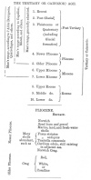
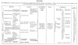

  
[Intangible Textual Heritage](../../index)  [Earth Mysteries](../index.md) 
[Index](index)  [Previous](mm05)  [Next](mm07.md) 

------------------------------------------------------------------------

[Buy this Book at
Amazon.com](https://www.amazon.com/exec/obidos/ASIN/1851709444/internetsacredte.md)

------------------------------------------------------------------------

*Mythical Monsters*, by Charles Gould, \[1886\], at Intangible Textual
Heritage

------------------------------------------------------------------------

p. 78

### CHAPTER III.

#### ANTIQUITY OF MAN.

I DO not propose to bestow any large amount of space upon the
enumeration of the palæontological evidence of the antiquity of man. The
works of the various eminent authors who have devoted themselves to the
special consideration of this subject exhaust all that can be said upon
it with our present data, and to these I must refer the reader who is
desirous of acquainting himself critically with its details, confining
myself to a few general statements based on these labours.

In the early days of geological science when observers were few, great
groups of strata were arranged under an artificial classification,
which, while it has lost to a certain extent the specific value which it
then assumed to possess, is still retained for purposes of convenient
reference. Masters of the science acquired, so to say, a possessive
interest in certain regions of it, and the names of Sedgwick, Murchison,
Jukes, Phillips, Lyell, and others became, and will remain, inseparably
associated with the history of those great divisions of the materials of
the earth's crust, which, under the names of the Cambrian, Silurian,
Devonian, Carboniferous, and Tertiary formations, have become familiar
to us.

In those days, when observations were limited to a comparatively small
area, the lines separating most of these formations were supposed to be
hard and definite; forms of life which characterized one, were presumed
to have become

p. 79

entirely extinct before the inauguration of those which succeeded them,
and breaks in the stratigraphical succession appeared to justify the
opinion, held by a large and influential section, that great cataclysms
or catastrophes had marked the time when one age or formation terminated
and another commenced to succeed it.

By degrees, and with the increase of observers, both in England and in
every portion of the world, modifications of these views obtained;
passage beds were discovered, connecting by insensible gradations
formations which had hitherto been supposed to present the most abrupt
separations; transitional forms of life connecting them were unearthed;
and an opinion was advanced, and steadily confirmed, which at the
present day it is probable no one would be found to dispute, that not
all in one place or country, but discoverable in some part or other of
the world, a perfect sequence exists, from the very earliest formations
of which we have any cognizance, up to the alluvial and marine deposits
in process of formation at the present day. [\*](#fn_70.md)

p. 80

Correlatively it was deduced that the same phenomena of nature have been
in action since the earliest period when organic existence can be
affirmed. The gradual degradation of pre-existing continents by normal
destructive agencies, the upheaval and subsidence of large areas, the
effusion from volcanic vents, into the air or sea, of ashes and lavas,
the action of frost and ice, of heat, rain, and sunshine—all these have
acted in the past as they are still acting before our eyes.

In earlier days, arguing from limited data, a progressive creation was
claimed which confined the appearance of the higher form of vertebrate
life to a successive and widely-stepped gradation.

Hugh Miller, and other able thinkers, noted with satisfaction the
appearance, first of fish, then of reptiles, next of birds and mammals,
and finally, as the crowning work of all, both geologically and
actually, quite recently of man.

This wonderful confirmation of the Biblical history of creation appealed
so gratefully to many, that it caused for a time a disposition to cramp
discovery, and even to warp the facts of science, in order to make them
harmonize with the statements of Revelation. The alleged proofs of the
existence of pre-historic man were for a long time jealously disputed,
and it was only by slow degrees that they were admitted, that the tenets
of the Darwinian school gained ground, and that the full meaning was
appreciated of such anomalies as the existence at the present day of
Ganoid fishes both in America and Europe, of true Palæozoic type, or of
Oolitic forms on the Australian continent and in the adjacent seas.

But step by step marvellous palæontological discoveries were made, and
the pillars which mark the advent of each great form of life have had to
be set back, until now no one would, I think, be entirely safe in
affirming that even in the Cambrian, the oldest of all fossiliferous
formations, vestiges of mammals, that is to say, of the highest forms of
life, may

p. 81

not at a future day be found, or that the records contained between the
Cambrian and the present day, may not in fact be but a few pages as
compared with the whole volume of the world's history. [\*](#fn_71.md)

p. 82

It is with the later of these records that we have to deal, in which
discoveries have been made sufficiently progressive to justify the
expectation that they have by no means reached their limit, and
sufficiently ample in themselves to open the widest fields for
philosophic speculation and deduction.

Before stating these, it may be premised that estimates have been
attempted by various geologists of the collective age of the different
groups of formations. These are based on reasonings which for the most
part it is unnecessary to give in detail, in so much as these can
scarcely yet be considered to have passed the bounds of speculation, and
very different results can be arrived at by theorists according to the
relative importance which they attach to the data employed in the
calculation.

Thus Mr. T. Mellard Reade, in a paper communicated to the Royal Society
in 1878 [\*](#fn_72.md), concludes that the
formation of the sedimentary strata must have occupied at least six
hundred million years: which he divides in round numbers as follows:—

<table data-border="0">
<colgroup>
<col style="width: 50%" />
<col style="width: 50%" />
</colgroup>
<tbody>
<tr class="odd">
<td data-valign="top">
 
</td>
<td data-valign="top">
Millions of Years.
</td>
</tr>
<tr class="even">
<td data-valign="top">
Laurentian, Cambrian, and Silurian
</td>
<td data-valign="bottom">
200
</td>
</tr>
<tr class="odd">
<td data-valign="top">
Old Red, Carboniferous, Permian, and New Red
</td>
<td data-valign="bottom">
200
</td>
</tr>
<tr class="even">
<td data-valign="top">
Jurassic, Wealden, Cretaceous, Eocene, 
   Miocene, Pliocene, and Post Pliocene
</td>
<td data-valign="bottom">
<u>200</u>
</td>
</tr>
<tr class="odd">
<td data-valign="top">
 
</td>
<td data-valign="bottom">
600
</td>
</tr>
</tbody>
</table>

He estimates the average thickness of the sedimentary crust of the earth
to be at least one mile, and from a computation

p. 83

of the proportion of carbonate and sulphate of lime to materials held in
suspension in various river-waters from a variety of formations, infers
that one-tenth of this crust is calcareous.

He estimates the annual flow of water in all the great river-basins, the
proportion of rain-water running off the granitic and trappean rocks,
the percentage of lime in solution which they carry down, and arrives at
the conclusion that the minimum time requisite for the elimination of
the calcareous matter contained in the sedimentary crust of the earth,
is at least six hundred millions of years.

A writer in the *Gentleman's Magazine* [\*](#fn_73) (Professor Huxley?.md), whose article I am
only able to quote at second-hand, makes an estimate which, though much
lower than the above, is still of enormous magnitude, as follows:—

|                               |        |     |                     |
|-------------------------------|--------|-----|---------------------|
|                               | Feet.  |     | Years.              |
| Laurentian                    | 30,000 |     | 30,000,000          |
| Cambrian                      | 25,000 |     | 25,000,000          |
| Silurian                      | 6,000  |     | 6,000,000           |
| Old Red and Devonian          | 10,000 |     | 10,000,000          |
| Carboniferous                 | 12,000 |     | 12,000,000          |
| Secondary                     | 10,000 |     | 10,000,000          |
| Tertiary and Post Tertiary    | 1,000  |     | 1,000,000           |
| Gaps and unrepresented strata | 6,000  |     | <u>   6,000,000</u> |
|                               | Total  |     | 100,000,000         |

Mr. Darwin, arguing upon Sir W. Thompson's estimate of a minimum of
ninety-eight and maximum of two hundred millions of years since the
consolidation of the crust, and on Mr. Croll's estimate of sixty
millions, as the time elapsed since the Cambrian period, considers that
the latter is quite insufficient to permit of the many and great
mutations of life which have certainly occurred since then. He judges

p. 84

from the small amount of organic change since the commencement of the
glacial epoch, and adds that the previous one hundred and forty million
years can hardly be considered as sufficient for the development of the
varied forms of life which certainly existed towards the close of the
Cambrian period.

On the other hand, Mr. Croll considers that it is utterly impossible
that the existing order of things, as regards our globe, can date so far
back as anything like five hundred millions of years, and, starting with
referring the commencement of the Glacial epoch to two hundred and fifty
thousand years ago, allows fifteen millions since the beginning of the
Eocene period, and sixty millions of years in all since the beginning of
the Cambrian period. He bases his arguments n the limit to the age of
the sun's heat as detailed by Sir William Thompson.

Sir Charles Lyell and Professor Haughton respectively estimated the
expiration of time from the commencement of the Cambrian at two hundred
and forty and two hundred millions of years, basing their calculations
on the rate of modification of the species of mollusca, in the one case,
and on the rate of formation of rocks and their maximum thickness, in
the other.

This, moreover, is irrespective of the vast periods during which life
must have existed, which on the development theory necessarily preceded
the Cambrian, and, according to Mr. Darwin, should not be less than in
the proportion of five to two.

In fine, one school of geologists and zoologists demand the maximum
periods quoted above, to account for the amount of sedimentary deposit,
and the specific developments which have occurred; the other considers
the periods claimed as requisite for these actions to be unnecessary,
and to be in excess of the limits which, according to their views, the
physical elements of the case permit.

p. 85

Mr. Wallace, in reviewing the question, dwells on the probability of the
rate of geological changes having been greater in very remote times than
it is at present, and thus opens a way to the reconciliation of the
opposing views so far as one half the question is concerned.

Having thus adverted to the principles upon which various theorists have
in part based their attacks on the problem of the estimation of the
duration of geological ages, I may now make a few more detailed
observations upon those later periods during which man is, now,
generally admitted to have existed, and refer lightly to the earlier
times which some, but not all, geologists consider to have furnished
evidences of his presence.

I omit discussing the doubtful assertions of the extreme antiquity of
man, which come to us from American observers, such as are based on
supposed footprints in rocks of secondary age, figured in a
semi-scientific and exceedingly valuable popular journal. There are
other theories which I omit, both because they need further confirmation
by scientific investigators, and because they deal with periods so
remote as to be totally devoid of significance for the argument of this
work.

Nor, up to the present time, are the evidences of the existence of man
during Miocene and Pliocene times admitted as conclusive. Professor
Capellini has discovered, in deposits recognised by Italian geologists
as of Pliocene age, cetacean bones, which are marked with incisions such
as only a sharp instrument could have produced, and which, in his
opinion, must be ascribed to human agency. To this view it is objected
that the incisions might have been made by the teeth of fishes, and
further evidence is waited for.

Not a few discoveries have been made, apparently extending the existence
of man to a much more remote antiquity, that of Miocene times. M. l’Abbé
Bourgeois has collected, from undoubted Miocene strata at Thenay,
supposed flint

p. 86

implements which he conceives to exhibit evidences of having been
fashioned by man, as well as stones showing in some cases traces of the
action of fire, and which he supposes to have been used as pot-boilers.
M. Carlos Ribeiro has made similar discoveries of worked flints and
quartzites in the Pliocene and Miocene of the Tagus; worked flint has
been found in the Miocene of Aurillac (Auvergne) by M. Tardy, and a cut
rib of *Halitherium fossile*, a Miocene species, by M. Delaunay at
Pouancé.

Very divided opinions are entertained as to the interpretation of the
supposed implements discovered by M. l’Abbé Bourgeois. M. Quatrefages,
after a period of doubt, has espoused the view of their being of human
origin, and of Miocene age. "Since then," he says, "fresh specimens
discovered have removed my last doubts. A small knife or scraper, among
others, which shows a fine regular finish, can, in my opinion, only have
been shaped by man. Nevertheless, I do not blame those of my colleagues
who deny or still doubt. In such a matter there is no very great
urgency, and, doubtless, the existence of Miocene man will be proved, as
that of Glacial and Pliocene has been, by facts." Mr. Geikie, from whose
work—*Prehistoric Europe*—I have summarized the above statements, says,
in reference to this question: "There is unquestionably much force in
what M. Quatrefages says; nevertheless, most geologists will agree with
him that the question of man's Miocene age still remains to be
demonstrated by unequivocal evidence. At present, all that we can safely
say is, that man was probably living in Europe near the close of the
Pliocene period, and that he was certainly an occupant of our continent
during glacial and interglacial times."

Professor Marsh considers that the evidence, as it stands to-day,
although not conclusive, "seems to place the first appearance of man
\[in America\] in the Pliocene, and that the best proofs of this are to
be found on the Pacific coast."

p. 87

\[paragraph continues\] He adds: During
several visits to that region many facts were brought to my knowledge
which render this more than probable. Man, at this time, was a savage,
and was doubtless forced by the great volcanic outbreaks to continue his
migration. This was at first to the south, since mountain chains were
barriers on the east," and "he doubtless first came across Behring's
Straits."

I have hitherto assumed a certain acquaintance, upon the part of the
general reader, with the terms Eocene, Miocene, and Pliocene, happily
invented by Sir Charles Lyell to designate three of the four great
divisions of the Tertiary age. These, from their universal acceptation
and constant use, have "become familiar in our mouths as household
words." But it will be well, before further elaborating points in the
history of these groups, bearing upon our argument, to take into
consideration their subdivisions, and the equivalent or contemporary
deposits composing them in various countries. This can be most
conveniently done by displaying these, in descending order, in a tabular
form, which I accordingly annex below. This is the more desirable as
there are few departments in geological science which have received more
attention than this; or in which greater returns, in the shape of
important and interesting discoveries relative to man's existence, have
been made.

Comparatively recent—comparatively, that is to say, with regard to the
vast æons that preceded them, but extending back over enormous spaces of
time when contrasted with the limited duration of written history,—they
embrace the period during which the mainly existing distribution of land
and ocean has obtained, and the present forms of life have appeared by
evolution from preceding species, or, as some few still maintain, by
separate and special creation.

p. 88

[  
Click to enlarge](img/08800.jpg.md)  
  

p. 89

[  
Click to enlarge](img/08900.jpg.md)  
  

p. 90

[  
Click to enlarge](img/09000.jpg.md)  
  

p. 91

We learn, both from the nature of these deposits and from their organic
contents, that climatic oscillations have been passing during the whole
period of their deposition over the surface of the globe, and inducing
corresponding fluctuations in the character of the vegetable and animal
life abounding on it. A complete collation of these varying conditions
at synchronous periods remains to be achieved, but the study of our own
country, and those adjacent to it, shows that alternations of tropical,
boreal, and temperate climate have occurred in it; a remarkable series
of conditions which has only lately been thoroughly and satisfactorily
accounted for.

Thus, during a portion of the Eocene period a tropical climate
prevailed, as is evidenced by deposits containing remains of palms of an
equatorial type, crocodiles, turtles, tropical shells, and other remains
attesting the existence of a high temperature. The converse is proved of
the Pleistocene by the existence of a boreal fauna, and the widespread
evidences of glacial action. The gradations of climate during the
Miocene and Pliocene, and the amelioration subsequent to the glacial
period, have resulted in the gradual development or appearance of
specific life as it exists at present.

Corresponding indications of secular variability of climate are derived
from all quarters: during the Miocene age, Greenland (in N. Lat. 70°)
developed an abundance of trees, such as the yew, the Redwood, a Sequoia
allied to the Californian species, beeches, planes, willows, oaks,
poplars, and walnuts, as well as a Magnolia and a Zamia. In Spitzbergen
(N. Lat. 78° 56´) flourished yews, hazels, poplars, alders, beeches, and
limes. At the present day, a dwarf willow and a few herbaceous plants
form the only vegetation, and the ground is covered with almost
perpetual ice and snow.

Many similar fluctuations of climate have been traced right back through
the geological record; but this fact, though interesting in relation to
the general solution of the causes, has little bearing on the present
purpose.

p. 92

Sir Charles Lyell conceived that all cosmical changes of climate in the
past might be accounted for by the varying preponderance of land in the
vicinity of the equator or near the poles, supplemented, of course, in a
subordinate degree by alteration of level and the influence of ocean
currents. When, for example, at any geological period the excess of land
was equatorial, the ascent and passage northwards of currents of heated
air would, according to his view, render the poles habitable; while,
*per contrâ*, the excessive massing of land around the pole, and absence
of it from the equator, would cause an arctic climate to spread far over
the now temperate latitudes.

The correctness of these inferences has been objected to by Mr. James
Geikie and Dr. Croll, who doubt whether the northward currents of air
would act as successful carriers of heat to the polar regions, or
whether they would not rather dissipate it into space upon the road. On
the other hand, Mr. Geikie, though admitting that the temperature of a
large unbroken arctic continent would be low, suggests that, as the
winds would be stripped of all moisture on its fringes, the interior
would therefore be without accumulations of snow and ice; and in the
more probable event of its being deeply indented by fjords and bays,
warm sea-currents (the representatives of our present Gulf and Japan
streams, but possessing a higher temperature than either, from the
greater extent of equatorial sea-surface originating them, and exposed
to the sun's influence) would flow northward, and, ramifying, carry with
them warm and heated atmospheres far into its interior, though even
these, he thinks, would be insufficient in their effects under any
circumstances to produce the sub-tropical climates which are known to
have existed in high latitudes.

Mr. John Evans [\*](#fn_74.md) has thrown out the
idea that possibly a

p. 93

complete translation of geographical position with respect to polar axes
may have been produced by a sliding of the whole surface crust of the
globe about a fluid nucleus. This, he considers, would be induced by
disturbances of equilibrium of the whole mass from geological causes. He
further points out that the difference between the polar and equatorial
diameters of the globe, which constitutes an important objection to his
theory, is materially reduced when we take into consideration the
enormous depth of the ocean over a large portion of the equator, and the
great tracts of land elevated considerably above the sea-level in higher
latitudes. He also speculates on the general average of the surface
having in bygone geological epochs approached much more nearly to that
of a sphere than it does at the present time.

Sir John Lubbock favoured the idea of a change in the position of the
axis of rotation, and this view has been supported by Sir H. James [\*](#fn_75.md) and many later geologists. [†](#fn_76.md) If I apprehend their arguments correctly,
this change could only have been produced by what may be termed
geological revolutions. These are great outbursts of volcanic matter,
elevations, subsidences, and the like. These having probably been almost
continuous throughout geological time, incessant changes, small or
great, would be demanded in the position of the axis, and the world must
be considered as a globe rolling over in space with every alteration of
its centre of gravity. The possibility of this view must be left for
mathematicians and astronomers to determine.

Sounder arguments sustain the theory propounded by Dr. Croll (though
this, again, is not universally accepted), that all these alterations of
climate can be accounted for by the effects of nutation, and the
precession of the equinoxes.

p. 94

\[paragraph continues\] From these
changes, combined with the eccentricity of the ecliptic from the first,
it results that at intervals of ten thousand five hundred years, the
northern and southern hemispheres are alternately in aphelion during the
winter, and in perihelion during the summer months, and *vice versâ*;
or, in other words, that if at any given period the inclination of the
earth's axis produces winter in the northern hemisphere, while the earth
is at a maximum distance from that focus of its orbit in which the sun
is situated, then, after an interval of ten thousand five hundred years,
and as a result of the sum of the backward motion of the equinoxes along
the ecliptic, at the rate of 50´ annually, the converse will obtain, and
it will be winter in the northern hemisphere while the earth is at a
minimum distance from the sun.

The amount of eccentricity of the ecliptic varies greatly during long
periods, and has been calculated for several million years back. Mr.
Croll [\*](#fn_77.md) has demonstrated a theory
explaining all great secular variations of climate as indirectly the
result of this, through the action of sundry physical agencies, such as
the accumulation of snow and ice, and especially the deflection of ocean
currents. From a consideration of the tables which he has computed of
the eccentricity and longitude of the earth's orbit, he refers the
glacial epoch to a period commencing about two hundred and forty
thousand years back, and extending down to about eighty thousand years
ago, and he describes it as "consisting of a long succession of cold and
warm periods; the warm periods of the one hemisphere corresponding in
time with the cold periods of the other, and *vice versâ*."

Having thus spoken of the processes adopted for estimating the duration
of geological ages, and the results which have been arrived at, with
great probability of accuracy, in regard

p. 95

to some of the more recent, it now only remains to briefly state the
facts from which the existence of man, during these latter periods, has
been demonstrated. The literature of this subject already extends to
volumes, and it is therefore obviously impossible, in the course of the
few pages which the limits of this work admit, to give anything but the
shortest abstract, or to assign the credit relatively due to the
numerous progressive workers in this rich field of research. I therefore
content myself with taking as my text-book Mr. James Geikie's
*Prehistoric Europe*, the latest and most exhaustive work upon the
subject, and summarizing from it the statements essential to my purpose.

From it we learn that, long prior to the ages when men were acquainted
with the uses of bronze and iron, there existed nations or tribes,
ignorant of the means by which these metals are utilized, whose weapons
and implements were formed of stone, horn, bone, and wood.

These, again, may be divided into au earlier and a later race, strongly
characterized by the marked differences in the nature of the stone
implements which they respectively manufactured, both in respect to the
material employed and the amount of finish bestowed upon it. To the two
periods in which these people lived the terms Palæolithic and Neolithic
have been respectively applied, and a vast era is supposed to have
intervened between the retiring from Europe of the one and the
appearance there of the other.

Palæolithic man was contemporaneous with the mammoth (*Elephas
primigenius*), the woolly rhinoceros (*Rhinoceros primigenius*), the
*Hippopotamus major*, and a variety of other species, now quite extinct,
as well as with many which, though still existing in other regions, are
no longer found in Europe; whereas the animals contemporaneous with
Neolithic man were essentially the same as those still occupying it.

The stone implements of Palæolithic man had but little variety of form,
were very rudely fashioned, being merely

p. 96

[  
Click to enlarge](img/fig19.jpg.md)  
FIG. 19.—ENGRAVING OF PALÆOLITHIC MAN ON REINDEER ANTLER  
(The two sides of the same piece of antler have been reproduced.)  

 [\*](#fn_78.md)

p. 97

chipped into shape, and never ground or polished; they were worked
nearly entirely out of flint and chert. Those of Neolithic man were made
of many varieties of hard stone, often beautifully finished, frequently
ground to a sharp point or edge, and polished all over.

Palæolithic men were unacquainted with pottery and the art of weaving,
and apparently had no domesticated animals or system of cultivation; but
the Neolithic lake dwellers of Switzerland had looms, pottery, cereals,
and domesticated animals, such as swine, sheep, horses, dogs, &c.

Implements of horn, bone, and wood were in common use among both races,
but those of the older are frequently distinguished by their being
sculptured with great ability or ornamented with life-like engravings of
the various animals living at the period; whereas there appears to have
been a marked absence of any similar artistic ability on the part of
Neolithic man.

[  
Click to enlarge](img/fig20.jpg.md)  
FIG. 20.—REINDEER ENGRAVED ON ANTLER BY PALÆOLITHIC MAN  
(*After Geikie*.)  

Again, it is noticeable that, while the passage from the Neolithic age
into the succeeding bronze age was gradual, and, indeed, that the use of
stone implements and, in some

p. 98

parts, weapons, was contemporaneous with that of bronze in other places,
no evidence exists of a transition from Palæolithic into Neolithic
times. On the contrary, the examination of bone deposits, such as those
of Kent's Cave and Victoria Cave in England, and numerous others in
Belgium and France, attest " beyond doubt that a considerable period
must have supervened after the departure of Palæolithic man and before
the arrival of his Neolithic successor." The discovery of remains of
Palæolithic man and animals in river deposits in England and on the
Continent, often at considerable elevations [\*](#fn_79.md) above the existing valley bottoms, and in
Löss, and the identification of the Pleistocene or Quaternary period
with Preglacial and Glacial times, offer a means of estimating what that
lapse of time must have been. [†](#fn_80.md)

p. 99

Skeletons or portions of the skeletons of human beings, of admitted
Palæolithic age, have been found in caverns in the vicinity of Liege in
Belgium, by Schmerling, and probably the same date may be assigned those
from the Neanderthal Cave near Düsseldorf. A complete skeleton, of tall
stature, of probable but not unquestioned Palæolithic age, has also been
discovered in the Cave of Mentone on the Riviera.

These positive remains yield us further inferences than can be drawn
from the mere discovery of implements or fragmentary bones associated
with remains of extinct animals.

The Mentone man, according to M. Rivière, had a rather long but large
head, a high and well-made forehead, and the very large facial angle of
85°. In the Liege man the cranium was high and short, and of good
Caucasian type; "a fair average human skull," according to Huxley.

Other remains, such as the jaw-bone from the cave of the Naulette in
Belgium, and the Neanderthal skeleton, show marks of inferiority; but
even in the latter, which was the lowest in grade, the cranial capacity
is seventy-five cubic inches or "nearly on a level with the mean between
the two human extremes."

We may, therefore, sum ins by saying that evidences have been
accumulated of the existence of man, and intelligent man, from a period
which even the most conservative among geologists are unable to place at
less than thirty thousand

p. 100

years; while most of them are convinced both of his existence from at
least later Pliocene times, and of the long duration of ages which has
necessarily elapsed since his appearance—a duration to be numbered, not
by tens, but by hundreds of thousands of years.

[  
Click to enlarge](img/fig21.jpg.md)  
FIG. 21.—ENGRAVING BY PALEOLITHIC MAN ON REINDEER ANTLER.  

------------------------------------------------------------------------

### Footnotes

[79:\*](mm06.htm#fr_70.md) "We shall, I think,
eventually more fully recognise that, as is the case with the periods of
the day, each of the larger geological divisions follows the other,
without any actual break or boundary; and that the minor subdivisions
are like the hours on the clock, useful and conventional rather than
absolutely fixed by any general cause in Nature."—Annual Address,
President of Geological Society, 1875.

"With regard to stratigraphical geology, the main foundations are
already laid, and a great part of the details filled in. The tendency of
modern discoveries has already been, and will probably still be, to fill
up those breaks, which, according to the view of many, though by no
means all geologists, are so frequently assumed to exist between
different geological periods and to bring about a more full recognition
of the continuity of geological time. As knowledge increases, it will, I
think, become more and more apparent that all existing divisions of time
are to a considerable extent local and arbitrary. But, even when this is
fully recognised, it will still be found desirable to retain them, if
only for the sake of convenience and approximate precision."—Annual
Address, President of Geological Society, 1876.

[81:\*](mm06.htm#fr_71.md) “It was not until
January 1832, that the second volume of the *Principles* was published,
when it was received with as much favour as the first had been. It
related more especially to the changes in the organic world, while the
former volume had treated mainly of the inorganic forces of nature.
Singularly enough, some of the points which were seized on by his great
fellow-labourer Murchison for his presidential address to this Society
in 1832, as subjects for felicitation, are precisely those which the
candid mind of Lyell, ever ready to attach the full value to discoveries
or arguments from time to time brought forward, even when in opposition
to his own views, ultimately found reason to modify. We can never, I
think, more highly appreciate Sir Charles Lyell's freshness of mind, his
candour and love of truth, than when we compare certain portions of the
first edition of the *Principles* with those which occupy the same place
in the last, and trace the manner in which his judicial intellect was
eventually led to conclusions diametrically opposed to those which he
originally held. To those acquainted only with the latest editions of
the *Principles*, and with his *Antiquity of Man*, it may sound almost
ironical in Murchison to have written, 'I cannot avoid noticing the
clear and impartial manner in which the untenable parts of the dogmas
concerning the alteration and transmutation of species and genera are
refuted, and how satisfactorily the author confirms the great truth of
the recent appearance of man upon our planet.'

"By the work (*Principles of Geology*, vol. iii.), as a whole, was dealt
the most telling blow that had ever fallen upon those to whom it appears
'more philosophical to speculate on the possibilities of the past than
patiently to explore the realities of the present,' while the earnest
and careful endeavour to reconcile the former indications of change with
the evidence of gradual mutation now in progress, or which may be in
progress, received its greatest encouragement. The doctrines which
Hutton and Playfair had held and taught assumed new and more vigorous
life as better principles were explained by their eminent successor, and
were supported by arguments which, as a whole, were
incontrovertible."—Annual Address, President of Geological Society,
1876.

"But, as Sir Roderick Murchison has long ago proved, there are parts of
the record which are singularly complete, and in those parts we have the
proof of creation without any indication of development. The Silurian
rocks, as regards oceanic life, are perfect and abundant in p. 82the forms they have preserved. *Yet there are
no fish*. The Devonian age followed tranquilly and without a break, and
in the Devonian sea, suddenly, fish appear, appear in shoals, and in
form of the highest and most perfect type."—The Duke of Argyll,
*Primeval Man*, p. 45, London, 1869.

[82:\*](mm06.htm#fr_72.md) T. Mellard Reade,
"Limestone as an Index of Geological Time," *Proceedings*, Royal
Society, London, vol. xxviii., p. 281.

[83:\*](mm06.htm#fr_73.md) *Scientific American*,
Supplement, February 1881.

[92:\*](mm06.htm#fr_74.md) *Proceedings*, Royal
Society, vol. xv. No. 82, 1866.

[93:\*](mm06.htm#fr_75.md) *Athenæum*, August 25,
1860, &c.

[93:†](mm06.htm#fr_76.md) The mass of astronomers,
however, deny that this is possible to any very great extent.

[94:\*](mm06.htm#fr_77.md) James Croll, F.R.S.,
&c., *Climate and Time in their Geological Relations*.

[96:\*](mm06.htm#fr_78) [Figs. 19](#img_fig19.md)
and [21](#img_fig21.md) are taken, by permission of Edmund Christy, Esq.,
from *Reliquiæ Aquitanicæ*, &c., London, 1875.

[98:\*](mm06.htm#fr_79.md) In some cases as much as
150 feet.

[98:†](mm06.htm#fr_80.md) “Starting from the
opinion generally accepted among geologists, that man was on the earth
at the close of the Glacial epoch, Professor B. F. Mudge adduces
evidence to prove that the antiquity of man cannot be less than 200,000
years.

“His argument, as given in the *Kansas City Review of Science*, is about
as follows:—

“After the Glacial epoch, geologists fix three distinct epochs, the
Champlain, the Terrace, and the Delta, all supposed to be of nearly
equal lengths.

“Now we have in the delta of the Mississippi a means of measuring the
duration of the third of these epochs.

“For a distance of about two hundred miles of this delta are seen forest
growths of large trees, one after the other, with interspaces of sand.
There are ten of these distinct forest growths, which have begun and
ended one after the other. The trees are the bald cypress (*Taxodium*)
of the Southern States, and some of them were over twenty-five feet in
diameter. One contained over five thousand seven hundred annual rings.
In some instances these huge trees have grown over the stumps of others
equally large, and such instances occur in all, or nearly all, of the
ten forest beds. This gives to each forest a period of 10,000 years.

“Ten such periods give 100,000 years, to say nothing of the time covered
by the interval between the ending of one forest and the begin. fling of
another, an interval which in most cases was considerable.

“‘Such evidence,’ writes Professor Mudge, ‘would be received in any
p. 99 court of law as sound and satisfactory.
We do not see how such proof is to be discarded when applied to the
antiquity of our race.

“‘There is satisfactory evidence that man lived in the Champlain epoch.
But the Terrace epoch, or the greater part of it, intervenes between the
Champlain and the Delta epochs, thus adding to my 100,000 years.

“‘If only as much time is given to both those epochs as to the Delta
period, 200,000 years is the total result.’”—*Popular Science Monthly*,
No. 91, vol. xvi. No. 1, p. 140, November 1878.

------------------------------------------------------------------------

[Next: Chapter IV. The Deluge Not A Myth](mm07.md)
