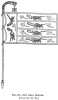
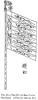
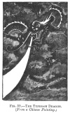

  
[Intangible Textual Heritage](../../index)  [Earth Mysteries](../index.md) 
[Index](index)  [Previous](mm09)  [Next](mm11.md) 

------------------------------------------------------------------------

[Buy this Book at
Amazon.com](https://www.amazon.com/exec/obidos/ASIN/1851709444/internetsacredte.md)

------------------------------------------------------------------------

*Mythical Monsters*, by Charles Gould, \[1886\], at Intangible Textual
Heritage

------------------------------------------------------------------------

p. 212

### CHAPTER VII.

#### THE CHINESE DRAGON.

WE now approach the consideration of a country in which the belief in
the existence of the dragon is thoroughly woven into the life of the
whole nation. Yet at the same time it has developed into such a medley
of mythology and superstition as to materially strengthen our conviction
of the reality of the basis upon which the belief has been founded,
though it involves us in a mass of intricate perplexities in connection
with the determination of its actual period of existence.

There is no country so conservative as China, no nation which can boast
of such high antiquity, as a collective people permanently occupying the
same regions, and preserving records of their polity, manners, and
surroundings from the earliest date of their occupation of the territory
which still remains the centre of their civilization; and there is none
in which dragon culture has been more persistently maintained down to
the present day.

Its mythologies, histories, religions, popular stories, and proverbs,
all teem with references to a mysterious being who has a physical nature
and spiritual attributes. Gifted with an accepted form, which he has the
supernatural power of casting off for the assumption of others, he has
the power of influencing the weather, producing droughts or fertilizing

p. 213

rains at pleasure, of raising tempests and allaying them. Volumes could
be compiled from the scattered legends which everywhere abound relating
to this subject; but as they are, for the most part, like our mediaeval
legends, echoes of each other, no useful purpose would be served by
doing so, and I therefore content myself with drawing, somewhat
copiously, from one or two of the chief sources of information.

As, however, Chinese literature is but little known or valued in
England, it is desirable that I should devote some space to the
consideration of the authority which may be fairly claimed for the
several works from which I shall make quotations, bearing on the Chinese
testimony of the past existence, and date of existence, of the dragon
and other so-called mythical animals.

Incidental comments on natural history form a usual part of every
Chinese geographical work, but collective descriptions of animals are
rare in the literature of the present, and almost unique in that of the
past. We are, therefore, forced to rely on the side-lights occasionally
afforded by the older classics, and on one or two works of more than
doubtful authenticity which claim, equally with them, to be of high
antiquity. The works to which I propose to refer more immediately are
the *Yih King*, the *Bamboo Books*, the *Shu King*, the *’Rh Ya*, the
*Shan Hai King*, the *Păn Ts’ao Kang Muh*, and the *Yuen Kien Léi Han*.

As it is well known that all the ancient books, with the exception of
those on medicine, divination, and husbandry, were ordered to be
destroyed in the year B.C. 212 by the Emperor Tsin Shi Hwang Ti, under
the threatened penalty for non-compliance of branding and labour on the
walls for four years, and that a persecution of the *literati* was
commenced by him in the succeeding year, which resulted in the burying
alive in pits of four hundred and sixty of their number, it may be
reasonably objected that the claims to high antiquity which some of the
Chinese classics put forth,

p. 214

are, to say the least, doubtful, and, in some instances, highly
improbable.

This question has been well considered by Mr. Legge in his valuable
translation of the Chinese Classics. He points out that the tyrant died
within three years after the burning of the books, and that the Han
dynasty was founded only eleven years after that date, in B.C. 201,
shortly after which attempts were commenced to recover the ancient
literature. He concludes that vigorous efforts to carry out the edict
would not be continued longer than the life of its author—that is, not
for more than three years—and that the materials from which the
classics, as they come down to us, were compiled and edited in the two
centuries preceding the Christian era, were genuine remains, going back
to a still more remote period.

#### THE "YIH KING" OR "YH KING."

The *Yih King* is one of those books specially excepted from the general
destruction of the books. References in it to the dragon are not
numerous, and will be found as quotations in the extracts from the large
encyclopædia *Yuen Kien Léi Han*, given hereafter. This work has
hitherto been very imperfectly understood even by the Chinese
themselves, but the recent researches of M. Terrien de la Couperie lead
us to suppose that our translations have been imperfect, from the fact
that many symbols have different significations in the present day to
those which they had in very ancient times, and that a special
dictionary of archaic meanings must be prepared before an accurate
translation can be arrived at, a consummation which may shortly be
expected from his labours. I find in my notes, taken from the manuscript
of a lecture given before the Ningpo Book Club in 1870, by the Rev. J.
Butler, of the Presbyterian Mission, that "the way in which the dragon
came to represent the Emperor and the Throne

p. 215

of China [\*](#fn_228.md) is accounted for in the
*Yih King* as follows:—The chief dragon has his abode in the sky, and
all clouds and vapours, winds and rains are under his control. He can
send rain or withhold it at his pleasure, and hence all vegetable life
is dependent on him. So the Emperor, from his exalted throne, watches
over the interests of his people, and confers on them those temporal and
spiritual blessings without which they would perish." I abstain from
dwelling on this or any other passages in the *Yih King*, pending the
translation promised by M. De la Couperie, the nature of whose views on
it are condensed in the note [†](#fn_229.md)
attached, being extracts from his papers on the subject.

p. 216

#### THE ANNALS OF THE BAMBOO BOOKS.

These are annals from which a great part of Chinese chronology is
derived. Mr. Legge gives the history of their

p. 217

discovery, as related in the history of the Emperor Woo, the first of
the sovereigns of Tsin, as follows:

"In the fifth year of his reign, under title of Hëen-ning [\*](#fn_230.md) \[=A.D. 279\], some lawless parties, in
the department of Keih, dug open the grave of King Sëang of Wei \[died
B.C. 295\] and found a number of bamboo tablets, written over, in the
small seal character, with more than one hundred thousand words, which
were deposited in the imperial library."

Mr. Legge adds, "The Emperor referred them to the principal scholars in
the service of the Government, to adjust the tables in order, having
first transcribed them in modern characters. Among them were a copy of
the *Yih King*, in two books, agreeing with that generally received, and
a book of annals, in twelve or thirteen chapters, beginning with the
reign of Hwang-te, and coming down to the sixteenth year of the last
emperor of the Chow dynasty, B.C. 298."

The reader will be conscious of a disposition to reject at once the
account of the discovery of the Bamboo Books. He has read so much of the
recovery of portions of the Shoo from the walls of houses that he must
be tired of this

p. 218

mode of finding lost treasures, and smiles when he is now called on to
believe that an old tomb opened and yielded its literary stores long
after the human remains that had been laid in it had mingled with the
dust. From the death of King Sang to A.D. 279 were 574 years."

Against this, however, which is not a very weighty objection, if we
consider the length of time that Egyptian papyri have been entombed
before their restoration to the light, Mr. Legge ranges preponderating
evidence in favour of their authenticity, and concludes that "they had,
no doubt, been lying for nearly six centuries in the tomb in which they
had been first deposited when they were then brought anew to light."

The annals consist of two portions, one forming what is undoubtedly the
original text, and consisting of short notices of occurrences, such as,
"In his fiftieth year, in the autumn, in the seventh month, on the day
Kang shin \[fifty-seventh of cycle\] phœnixes, male and female,
arrived," &c. &c. It also records earthquakes, obituaries, accessions,
and remarkable natural phenomena. The other portion is interspersed
between these, in the form of rather diffuse, though not very numerous,
notes, which by some are supposed to be a portion of the original text,
by others, to have been added by the commentator Shin Yo \[A.D.
502-567\].

In the latter, frequent references are made to the appearance of
phœnixes (the *fang wang*), *ki-lins* (unicorns), and dragons.

In the former we find only incidental references to either of these,
such as, "XIV. The Emperor K‘ung-kea. In his first year (B.C. 1611),
when he came to the throne, he dwelt on the west of the Ho. He displaced
the chief of Ch‘e-wei, [\*](#fn_231.md) and
appointed Lew-luy [†](#fn_232.md) to feed the
dragons."

p. 219

According to the latter, Hwang Ti (B.C. 2697) had a dragon-like
countenance; while the mother of Yaou (B.C. 2356) conceived him by a
dragon. The legend is: "After she was grown up, whenever she looked into
any of the three Ho, there was a dragon following her. One morning the
dragon came with a picture and writing. The substance of the writing
was—the Red one has received the favour of Heaven. . . . The red dragon
made K‘ing-teo pregnant."

Again, when Yaou had been on the throne seventy years, a dragon-horse
appeared bearing a scheme, which he laid on the table and went away.

The Emperor Shun (B.C. 2255) is said to have had a dragon countenance.

It is also said of Yu (the first emperor of the Hia dynasty) that when
the fortunes of Hia were about to rise, all vegetation was luxuriant,
and green dragons lay in the borders; and that "on his way to the south,
when crossing the Kiang, in the middle of the stream, two yellow dragons
took the boat on their backs. The people were all afraid; but Yu
laughed, and said, 'I received my appointment from Heaven, and labour
with all my strength to nourish men. To be born is the course of nature;
to die is by *Heaven's* decree. Why be troubled by the dragons?' On this
the dragons went away, dragging their tails."

From these extracts it will be seen that the dragon, although
universally believed in, was already mythical and legendary, so far as
the Chinese were concerned.

#### THE "SHU KING" [\*](#fn_233.md) OR "SHOO KING"

is, according to Dr. Legge, simply a collection of historic memorials,
extending over a space of one thousand seven hundred years, but on no
connected method, and with great gaps between them.

p. 220

It opens with the reign of Yaou (B.C. 2357), and contains interesting
details of the polity of those remote ages.

It contains a record of the great inundation occurring during his reign,
which Mr. Legge does not identify with the Deluge of Genesis, but which
Dr. Gutzlaff and other missionary Sinologues consider to be the same.

It is interesting to find in this work, claiming so high an antiquity,
references to an antiquity which had preceded it—a bygone civilization,
perhaps—as follows, in the book called *Yih* and *Ts‘ih*. [\*](#fn_234) The emperor (Shun, B.C. 2255 to 2205.md)
says, "I wish to see the emblematic figures of the ancients—the sun, the
moon, the stars, the mountain, the dragon, and the flowery fowl, which
are depicted *on the upper garment*; the temple cup, the aquatic grass,
the flames, the grains of rice, the hatchet, and the symbol of
distinction, which are embroidered *on the lower garment*. *I wish to
see* all these displayed with the five colours, so as to form the
official robes; it is yours to adjust them clearly." Here the dragon is
chosen as an emblematic figure, in association with eleven others, which
are objects of every-day knowledge, and this, I think, establishes a
presumption that it itself was not at that date considered an object of
doubtful credibility.

Similarly, we find the twelve symbolical animals, representing the
twelve branches of the Horary characters (dating, see Williams'
Dictionary, from B.C. 2637), to be the rat, the ox, tiger, hare, dragon,
serpent, horse, sheep, monkey, cock, dog, boar, where the dragon is the
only one about whose existence a question can be raised. *From this
latter we learn that there was no confusion of meaning then between
dragons and serpents*; the distinction of the two creatures was clearly
recognized, just as it was many centuries afterwards by Mencius (4th
century B.C.), who, in writing of these early periods, says, In the time
of Yaou, the waters,

p. 221

flowing out of their channels, inundated the Middle Kingdom. Snakes and
dragons occupied it, and the people had no place where they could settle
themselves"; and again, "Yu dug open their obstructed channels, and
conducted them to the sea. He drove away the snakes and dragons, [\*](#fn_235.md) and forced them into the grassy
marshes."

#### THE "’RH YA."

The *’Rh Ya* or *Urh Ya*, [†](#fn_236.md) also
transliterated *Eul Ya* and *Œl Ya*, a dictionary of terms used in the
Chinese classics, but more especially of those in the *Shi King*, or
"Book of Odes," a collection of ancient ballads compiled and arranged by
Confucius.

There is a tradition that it was commenced by the Duke of Chow 1100
B.C., and completed or enlarged by Tsz Hia, a disciple of Confucius.

Dr. Bretschneider suggests that each heading or phrase in the original
book merely represents the book names and the popular names of the
plants and animals.

The bulk of the work at present extant consists of the commentary by
Kwoh P‘oh (about A.D. 300) and, in some editions, of additional
commentaries by other authors.

The illustrations selected from it for the present volume are reduced
from those in a very fine folio copy, for the loan

p. 222

of which I am indebted to Mr. Thomas Kingsmill, of Shanghai.

These profess to date back so far as the Sung dynasty (A.D. 960 to A.D.
1127), and it is interesting to observe that

[  
Click to enlarge](img/fig41.jpg.md)  
FIG. 41.—THE BANNER CALLED TSING K’I. (*From the ’Rh Ya*.)  

the representations of tools of husbandry then in use ([Fig.
50](#img_fig50), [p. 232](#page_232).md), and of the methods of hawking (,
[p. 225](#page_225)), fishing ([Fig. 47](#img_fig47.md), [p.
227](#page_227).md), and the like, are such as might be taken without
alteration from those of the present day.

p. 223

The drawings made by Kwoh P‘oh appear to have been lost in the sixth
century A.D.

Notices of the dragon only appear incidentally in the *’Rh Ya* as
forming part of the decoration of banners, &c.; but

[  
Click to enlarge](img/fig42.jpg.md)  
FIG. 42.—THE K’I WITH BELLS. (*From the ’Rh Ya*.)  

descriptions and figures of the Chinese unicorn are given and of other
remarkable animals, of which I shall eventually take notice.

These figures of dragons in the drawings of banners (Figs.
[41](#img_fig41)-[44](#img_fig44).md) are especially interesting; as there
is fair reason to suppose that they at least have been reproduced

p. 224

time after time from pre-existing ones with tolerable accuracy; and that
they give us a good notion of the general character of the animal they
purport to represent.

I have appended a few *fac-similes* of wood engravings from the ’Rh Ya
on general subjects, in anticipation of others

<table data-border="0" width="100%">
<colgroup>
<col style="width: 50%" />
<col style="width: 50%" />
</colgroup>
<tbody>
<tr class="odd">
<td data-valign="top" width="50%">

<a href="img/fig43.jpg"> 
Click to enlarge</a> 
FIG. 43.—THE CHAO BANNER. 
(<em>From the ’Rh Ya</em>.) 

</td>
<td data-valign="top" width="50%">

<a href="img/fig44.jpg"> 
Click to enlarge</a> 
FIG. 44.—THE K’I OR KIAO LUNG 
STANDARD. (<em>From the San Li Tu</em>.) 

</td>
</tr>
</tbody>
</table>

dealing with specialities, which will be found in their appropriate
positions; they will serve to correct the notion that the Chinese are
entirely devoid of artistic power and imagination (Figs.
[46](#img_fig46)-[49](#img_fig49).md).

p. 225

#### THE "SHAN HAI KING" OR CLASSIC OF MOUNTAIN AND SEAS.

Short notices of this remarkable work are given by Mr. Alexander
Wylie [\*](#fn_237.md) and Dr.
Bretschneider, [†](#fn_238.md) and a more
exhaustive one by M. Bazin. [‡](#fn_239.md)

[  
Click to enlarge](img/fig45.jpg.md)  
FIG. 45.—ONE OF THE EAVE TILES FROM THE OLD IMPERIAL PALACE OF NANKIN,
showing the Five-clawed or Imperial Dragon, an emblem which cannot be
borne by any outside of the Imperial service, under the penalty of
death. Commoners have to be satisfied with a four-clawed dragon.  

[  
Click to enlarge](img/fig46.jpg.md)  
FIG. 46.—RETURN FROM THE CHASE. (*From the ’Rh Ya*.)  

p. 226

It is also largely quoted by Williams in his valuable Chinese
dictionary. Otherwise Sinologues appear to have entirely ignored it.

Mr. Wylie remarks that "it has long been looked upon with distrust; but
some scholars of great ability have recently investigated its contents,
and come to the conclusion that it is at least as old as the Chow
dynasty, and probably of a date even anterior to that period."

M. Bazin speaks of it as a fabulous description of the world, and
attributes it to Taouist writers in the fourth century of our era, who
forged the authority of the great Yü and Peh Yi. He thinks it would be
useless to attempt the identification of the localities given in it, and
offers a translation of a portion of the first chapter in support of his
views.

The value of his translation is impaired by his making no distinction
between the text and the commentary, and he appears to have possessed an
inferior and incomplete version.

In an editorial article in the *North China Herald* of May 9, 1884
(presumably by Mr. Balfour, an excellent Sinologue), it is referred to
the date of Ch'in Shih Huang, who connected the Heptarchy into a single
kingdom, and conquered Cochin China about B.C. 222.

Kwoh Po‘h [\*](#fn_240) (A.D. 276-324.md), who
prepared an edition which has descended to us, ascribes a date to it
3,000 years anterior to his time.

Liu Hsiu, [\*](#fn_240.md) of the Han dynasty
(B.C. 206 to A.D. 25), states that the Emperor Yü, the founder of the
Hia dynasty (B.C. 2205), employed Yih and Peh Yi as geographers and
natural historians, who produced the " Book of Wonders by Land and Sea."
While Yang Sun, [\*](#fn_240.md) of the Ming
dynasty

p. 227

[  
Click to enlarge](img/fig47.jpg.md)  
FIG. 47.—ONE MODE OF CAPTURING FISH. (*From the ’Rh Ya*.)  

p. 228

[  
Click to enlarge](img/fig48.jpg.md)  
FIG. 48.—SUMMER. (*From the ’Rh Ya*.)  

p. 229

\[paragraph continues\] (commencing A.D.
1368), states in his after-preface that the Emperor Yü had nine metal
vases cast, on which all wonderful or rare animals were engraved, the
commoner ones being recorded in the annals of Yü; and that K‘ung Kiah
(of the Hia dynasty, B.C. 1879), included this varied information in the
present work.

It is to be hoped that at no distant date some competent Sinologue will
be induced to furnish a full translation of this remarkable work, with
an adequate commentary.

There is no doubt that many would be deterred from doing so by an
impression that a collection of fabulous stories, treating of
supernatural beings and apparently impossible monsters, is unworthy the
consideration of mature intellect, and only fit to be relegated to the
domain of Jack the Giant Killer and other childish stories. After a
close examination of the book, I apprehend that this view of it can
hardly be maintained. That such stories or descriptions are interspersed
throughout the work is not to be disputed; but a large proportion of it
consists of apparently authentic geographical records, including, as is
customary with all works of a similar nature in China, descriptions of
the most remarkable objects of natural history occurring in the
different regions. I think it will be found possible to identify many of
these at the present day, some may be conjectured at, and the residue
are not more numerous in proportion than the similar fables or perverted
accounts which figure in the western classic volumes of Ctesias,
Aristotle, Pliny, and even much later writers. So far as the
supernatural portions are concerned, it must be remembered that, even so
late as the days of the childhood of Sir Humphrey Davy, pixies were
still supposed by the lower classes to trace the fairy rings in
Cornwall; that quite lately, and perhaps among certain classes to the
present day, the existence of the banshee in Ireland, of the kelpie in
Scotland, and of persons gifted with the mysterious and awe-inspiring
power of second sight,

p. 230

[  
Click to enlarge](img/fig49.jpg.md)  
FIG. 49.—MANTIS (A VERY CHARACTERISTIC FIGURE). (*From the ’Rh Ya*.)  

p. 231

was religiously believed in. There are few important houses in England
whose ancestral walls have not concealed an apparition connected with
the destinies of the family, appearing only on fatal or eventful
occasions; and in the days of the sapient James I. in England, and among
the Pilgrim Fathers in the American States, the existence of wizards and
witches was universally accepted as an undeniable fact, proved by
hundreds of instances of extorted or voluntary confession, and
supplemented by the concurrent testimony of a still greater number of
witnesses who genuinely believed themselves to have been the spectators
or victims of the supernatural powers of the accused.

An historian of these later times might well have described such things
as realities, and we should not be disposed, on account of his having
done so, to question the validity of his description of other objects or
creatures existing at the period, presuming them to be more consistent
with our present notions of possibility.

No one, now-a-days, would discredit the veracity of Marco Polo because
he speaks of enormous serpents in Carajan, possessing two feet, each
armed with a single claw. That there was a solid foundation for his
story is admitted, and commentators are only at variance as to whether
the basis was a large species of python, such as still exists in
Southern China, or a gigantic alligator, of which he might have seen a
mutilated specimen.

It must also be borne in mind that the existence of some gigantic
saurian, now extinct, possessing two limbs only, in place of four, is
not an impossibility; as the small lizard, Chirotes, is in that
condition, and also the North American genus *Siren*, belonging to the
Newts.

I notice that Retzoch, in his designs to illustrate Schiller's poem,
"The Fight with the Dragon," makes the monster have only two fore-legs,
and this appears to have been a common mediaeval conception of it.
Aldrovandus and Gesner

p. 232

[  
Click to enlarge](img/fig50.jpg.md)  
FIG. 50.—TOOLS OF HUSBANDRY. (*From the ’Rh Ya*.)  

p. 233

both give figures of biped dragons. There is also a curious drawing in
the *Gentleman's Magazine* for 1749—which is transferred into the pages
of the *Encyclopædia of Philadelphia*, apparently a piracy of an English
Cyclopædia, of what is styled a sea-dragon, four feet long, which stands
bolt upright on two legs, and, like Barnum's mermaid, was probably a
triumph of art.

Aldrovandus was probably imposed on by some waggish friend, in reference
to the biped dragon without wings, two cubits long, which was said to
have been killed by a countryman near Bonn in 1572 A.D., and which he
first figured and

[  
Click to enlarge](img/fig51.jpg.md)  
FIG. 51.—DRACO BIPES APTEROS CAPTUS IN AGRO BONONIENSI.
(*Aldrovandus*).  

then placed in his museum; and he evidently fully believed in the
Ethiopian winged biped dragon, of which he gives two figures, but
without quoting his authority.

[  
Click to enlarge](img/fig52.jpg.md)  
FIG. 52.—DRACO ÆTHIOPICUS. (*Aldrovandus*.)  

Gesner gives a similar figure, after Belon, of the winged dragon of
Mount Sinai; but Athanasius Kircher is more liberal, and gives his
dragon not only wings but four legs.

p. 234

[  
Click to enlarge](img/fig53.jpg.md)  
FIG. 53.—THE FOUR-FOOTED WINGED DRAGON. (*Kircher*.)  

In poetry we find Ashtaroth described as appearing to Faust in the form
of a serpent with two little feet.

As to the mysterious powers imputed throughout the *Shan Hai King* to
different creatures, of controlling drought, rain, and fire, or acting,
when partaken of, as remedies for sundry ills and ailments, it may be
asked whether we ourselves are free from analogous superstitious
beliefs? Will a sailor view without uneasiness the destruction of a
Mother Carey's chicken, or a Dutchman, of a stork? Or is the Chinese
pharmacopoeia of the present day much more trustworthy as to many of its
items?

As to the human-visaged creatures, both snakes and four-footed beasts,
may we not perhaps put them on a par with other fancied resemblances,
which hold to the present day, of (for example) the hippopotamus, to a
river-horse, of the pipe-fish, known as the hippocampus, to a sea-horse;
of the manatee to a merman, and the like?

And, lastly, are the composite creatures, partly bird and partly
reptilian, occasionally referred to, so entirely incredible? Is it not
barely possible that some of those intervening types which we know from
the teaching of Darwin, must have existed; which we know, from the
researches of palæontology have existed; types intermediate to the
*Struthionidæ*, the most reptilian of birds, and the *Chlamydæ*, the
most avian of reptiles—is it not possible that some of these may have
continued their existence down to a late date, and

p. 235

that the tradition of these existing as the descendants or the analogues
of the Archaeopteryx, and the toothed birds of America, may be embalmed
in the pages in question? Is it impossible? Do not the Trigonias, the
Terebratulas, the Marsupials, and, in part, the vegetation of Australia,
form the spare surviving descendants of the forms which characterised
the oolitic period on our own shores? Why, then, may not a few
cretaceous and early tertiary forms have struggled on, through a happy
combination of circumstances, to an aged and late existence in other
lands.

After long, repeated, and careful examination of the *Shan Hai King*, I
arrive at a very different conclusion from M. Bazin. I hold it to be an
authentic and precious memorial which has been handed down to us from
remote antiquity, the value of which has been unrecognised owing to the
book being unfortunately a fusion of two and perhaps three distinct
works.

[  
Click to enlarge](img/fig54.jpg.md)  
FIG. 54.—THE PA SNAKE. (*From the Shan Hai King*.)  

p. 236

The oldest was the *Shan King*, and consists of five volumes, devoted
respectively to the northern, southern, eastern, western, and central
mountain ranges. This is devoid of all reference to persons and habited
places. It is simply an abstract of the results of a topographical
survey which may not impossibly have been, as it claims, the one
conducted by Yü.

It contains lists of mountains and rivers, with valuable notes on their
mineral productions, fauna and flora. It also gives lists of the
divinities controlling or belonging to each mountain range, and the
sacrifices suitable to them. There are few extravagances in this portion
of the work.

The remainder is devoted to a history of the regions without and within
the four *hai* or seas bounding the empire, and those constituting what
is called the Great Desert. Here extravagant stories, myths, accounts of
wonderful people, references to states, cities, and tribes are mingled
with geographical notices which, from their repetition, show that this
portion is itself resolvable into two distinct works of more modern
date, whose origin was probably posterior to the wave of Taouist
superstition which swept over China in the first six centuries of our
era. I must add that the term, "within the four seas" does not imply the
arrogant belief, as is generally supposed, that this Empire extended to
the ocean on every side, the archaic meaning being the very different
one of frontier or boundary region; while the word "desert" has a
similar signification.

In that more credible portion of the work which I believe to have been
the original *Shan King*, references to dragons are infrequent. In some
instances the *kiao* (which I interpret as the gavial) is specifically
referred to; in others the word *lung* is used; thus, it speaks of
dragons and turtles abounding in the Ti River, flowing from one of the
northern mountains east of the Ho. From the context, however, an aquatic
creature, and probably an alligator, is indicated.

p. 237

[  
Click to enlarge](img/fig55.jpg.md)  
FIG. 55. FLYING SNAKES FROM THE SIEN MOUNTAINS CENTRAL MOUNTAINS).  
(*Shan Hai King*.)  

p. 238

\[paragraph continues\] From the entire
text I gather that the true terrestrial dragon was not an inmate of
China, at all events after the period of Yü. I further infer that it was
a feared and much respected denizen of the more or less arid highlands,
whence the early Chinese either migrated or were driven, and from which
point the dragon traditions flowed pretty evenly east and west, beat
against the Himalayan chain on the south, and only penetrated India in a
later and modified form.

There is a short reference to the Ying Lung or winged dragon; it is as
follows:—

“In the north-east corner of the Great Desert are mountains called
Hiung-li and T’u K’iu. The Ying Lung lives at the south extremity.

“\[Commentary.—The Ying Lung is a dragon with wings.\]

“He killed Tsz Yiu and Kwa Fu.

“\[Commentary.—Tsz Yiu was a soldier.\]

“He could not ascend to heaven.

“\[Commentary.—The Ying Lung dwells beneath the earth.\]

“So there is often drought.

“\[Commentary.—Because no rain was made above.\]

“When there is a drought, the form of the Ying dragon is made, and then
there is much rain.

“\[Commentary.—Now the false dragon is for this purpose, to influence
(the heaven); men are not able to do it.\]”

The better printed copies of this work are illustrated with a very
truculent-looking dragon with outspread wings. A stone delineation of a
dragon with wings forms the ornamentation of the bridge at Nincheang
Foo. In the interior of China, it was observed by Mr. Cooper, and is
given in his *Travels of a Pioneer of Commerce*. These are the only
cases in China in which I have come across illustrations of dragons with
genuine wings. As a rule, the dragon appears to be represented as having
the power of translating itself without mechanical agency, sailing among
the clouds, or rising from the sea at pleasure.

p. 239

[  
Click to enlarge](img/fig56.jpg.md)  
FIG. 56.—PING I (ICY EXTERMINATOR), A RIVER DEITY (?). From within the
Sea and North. (*Shan Hai King*.)  

p. 240

[  
Click to enlarge](img/fig57.jpg.md)  
FIG. 57.—THE EMPEROR K’I, OF THE HIA DYNASTY. From without the Sea and
West. (*Shan Hai King*.)  

p. 241

The *Shan Hai King* contains valuable notices of winged snakes and
gigantic serpents, as, for example, the so-called singing snakes.
Speaking of the Sien mountain (one of the Central Mountains), it says:
"Gold and jade abound. It is barren. The Sien river issues and flows
north into the I river. On it are many singing snakes. They look like
snakes, but have four wings. Their voice is like the beating of stones.
When they appear there will be great drought in the city."

[  
Click to enlarge](img/fig58.jpg.md)  
FIG. 58.—YÜ KIANG (A GOD). Without the Sea and North. (*Shan Hai
King*.)  

The Pa snake, already spoken of, is described as capable of gorging an
elephant. The Ta lien mountains were reputed uninhabitable on account of
the presence of gigantic serpents (pythons?), which were said to have
been of the colour of mugwort, to have possessed hairs like pig's
bristles projecting between the lines of their ribaud-like markings.
Rumour had magnified their length to one hundred fathoms, and they made
a noise like the beating of a drum or the striking of a watchman's
wooden clapper. The Siong Jan mountains were infested by serpents, also
gigantic, but of a different species.

The annexed wood-cuts (Figs. [56](#img_fig56), [57](#img_fig57).md) of Ping
I (Icy exterminator), and the Emperor K’i (B.C. 2197), each in cars,
driving two dragons, are interesting in connection

p. 242

with the later fable of Medea and Triptolemus. The two stories were
probably derived from a common source; the Chinese version, however,
being much the older of the two.

<table data-align="LEFT">
<colgroup>
<col style="width: 100%" />
</colgroup>
<tbody>
<tr class="odd">
<td data-valign="CENTER"><a href="img/fig59.jpg"> 
Click to enlarge</a> 
FIG. 59.—THE TYPHOON DRAGON. 
(From a Chinese Painting.) 
</td>
</tr>
</tbody>
</table>

The text as to K’i is:—"K’i of the Hia dynasty danced with Kiutai at the
Tayoh common. He drove two dragons. The clouds overhung in three layers.
In his left hand he grasped a screen; in his right hand he held ear
ornaments; at his girdle dangled jade crescents. It is north of Tayun
mount; one author calls it Tai common." The commentator says Kiutai is
the name of a horse, and "dance" means to dance in a circle. \[Probably
this is the earliest reference extant to a circus performance.\]

Ping I is supposed to dwell in Tsung Ki pool near the fairy region of
Kwa-Sun, to have a human face, and to drive two dragons.

Cursorily examined, the *Shan Hai King* is a farrago of falsehood; read
with intelligence, it is a mine of historical wealth.

#### THE PAN TSAO KANG MU. [\*](#fn_241.md)

Descending to late times, we have the great Chinese Materia Medica, in
fifty-two volumes, entitled *Păn Tsao Kang Mu*,

p. 243

made up of extracts from upwards of eight hundred preceding authors, and
including three volumes of illustrations by Li Shechin, of the Ming
dynasty (probably born early in the sixteenth century A.D.). It was
first printed in the Wăn-leih period (1573 to 1620). I give its article
upon the dragon *in extenso*.

“According to the dictionary of Hü Shăn, the character *lung* in the
antique form of writing represents the shape of the animal. According to
the *Shang Siao Lun*, the dragon is deaf, hence its name of *lung*
(deaf). In Western books the dragon is called *nake* (*naga*). Shi-Chăn
says that in the *’Rh Ya Yih* of Lo-Yuen the dragon is described as the
largest of scaled animals (literally, insects). Wang Fu says that the
dragon has nine (characteristics) resemblances. Its head is like a
camel's, its horns like a deer's, its eyes like a hare's, [\*](#fn_242.md) its ears like a bull's, its neck like a
snake's, its belly like an iguanodon's (?), its scales like a carp's,
its claws like an eagle's, and its paws like a tiger's. Its scales
number eighty-one, being nine by nine, the extreme (odd or) lucky
number. Its voice resembles the beating of a gong. On each side of its
mouth are whiskers, under its chin is a bright pearl, under its throat
the scales are reversed, on the top of its head is the *poh shan*, which
others call the wooden foot-rule. A dragon without a foot-rule cannot
ascend the skies. When its breath escapes it forms clouds, sometimes
changing into rain, at other times into fire. Luh Tien in the *P’i Ya*
remarks, when dragon-breath meets with damp it becomes bright, when it
gets wet it goes on fire. It is extinguished by ordinary fire.

“The dragon comes from an egg, it being desirable to keep it folded up.
When the male calls out there is a breeze above, when the female calls
out there is a breeze below, in

p. 244

consequence of which there is conception. The *Shih Tien* states, when
the dragons come together they are changed into two small serpents. In
the *Siao Shwoh* it is said that the disposition of the dragon is very
fierce, and it is fond of beautiful gems and jade (?). It is extremely
fond of swallow's flesh; it dreads iron, the *mong* plant, the
centipede, the leaves of the Pride of India, and silk dyed of different
(five) colours. A man, therefore, who eats swallow's flesh should fear
to cross the water. When rain is wanted a swallow should be offered
(used); when floods are to be restrained, then iron; to stir up the
dragon, the *mong* plant should be employed; to sacrifice to *Küh Yuen*,
the leaves of the Pride of India bound with coloured silk should be used
(see Mayers, p. 107, § 326) and thrown into the river. Physicians who
use dragons’ bones ought to know the likes and dislikes of dragons as
given above.”

“*Dragons’ Bones*. [\*](#fn_243.md)—In the *Pieh
luh* it is said that these are found in the watercourses in Tsin
(Southern Shansi) and in the earth-holes which exist along the banks of
the streams running in the caves of the T‘ai Shan (Great Hill),
Shantung. For seeking dead dragons’ graves there is no fixed time. Hung
King says that now they are largely found in Leung-yih (in Shansi?) and
Pa-chung (in Szchuen). Of all the bones, dragon's spine is the best; the
brains make the white earth strive, which when applied to the tongue is
of great virtue. The small teeth are hard, and of the usual appearance
of teeth. The horns are hard and solid. All the dragons cast off their
bodies without really dying. Han says the dragon-bones from Yea-cheu,
Ts’ang-cheu

p. 245

and T’ai-yuen (all in Shansi) are the best. The smaller bones marked
with wider lines are the female dragon's; the rougher bones with
narrower lines are those of the male dragon; those which are marked with
variegated colours are esteemed the best. Those that are either yellow
or white are of medium value; the black are inferior. If any of the
bones are impure, or are gathered by women, they should not be used.

“P’u says dragons’ bones of a light white colour possess great virtue.
Kung says the bones found in Tsin (South Shansi) that are hard are not
good; the variegated ones possess virtue. The light, the yellow, the
flesh-coloured, the white, and the black, are efficacious in curing
diseases in the internal organs having their respective colours, just as
the five varieties of the *chi* [\*](#fn_244.md)
plant, the five kinds of limestone, and the five kinds of mineral oil
(literally, fat), which remain still for discussion in this work.

“Su-chung states: 'In the prefecture of Cheu kiün, to the "East of the
River" (Shansi), dragons’ bones are still found in large quantities.'

“Li-chao, in the *Kwoh-shi-pu*, says: 'In the spring floods the fish
leap into the Dragon's Gate, and the number of castoff bones there is
very numerous. These men seek for medicinal purposes. They are of the
five colours. This Dragon's Gate is in Tsin (Shansi), where this work
(Kwoh-shi-pu) is published. Are not, then, these so-called dragons’
bones the bones of fish? '

"Again, quoting from Sun Kwang-hien in the *Poh-mung Legends*: 'In the
time of the five dynasties there was a contest between two dragons; when
one was slain, a village hero, Kw’an, got both its horns. In the front
of the horns was an object of a bluish colour, marked with confused
lines,

p. 246

which no one knew anything about, as the dragon was completely dead.'

“Tsung Shih says: 'All statements \[concerning dragons’ bones\]
disagree; they are merely speculations, for when a mountain cavern has
disclosed to view a skeleton head, horns and all, who is to know whether
they are *exuviæ* or that the dragon has been killed? Those who say they
are *exuviæ*, or that the dragon is dead, then have the form of the
animal, but have never seen it alive. Now, how can one see the thing (as
it really is) when it is dead? Some also say that it is a
transformation, but how is it only in its appearance that it cannot be
transformed?'

“Ki, in the present work, says that they are really dead dragons’ bones;
for one to say that they are *exuviæ* is a mere speculation.

“Shi Chăn says: 'The present work considers that these are really dead
dragons’ bones, but To Shi thinks they are *exuviæ*. Su and Kan doubt
both these statements. They submit that dragons are divine beings, and
resemble the principle of immortality (never-in-themselves-dying
principle); but there is the statement of the dragon fighting and
getting killed; and further, in the *Tso-chw‘en*, in which it is stated
that there was a certain rearer of dragons who pickled dragons for food
\[for the imperial table?\].'

“The *I-ki* says: 'In the time of the Emperor Hwo, of the Han dynasty,
during a heavy shower a dragon fell in the palace grounds, which the
Emperor ordered to be made into soup and given to his Ministers.'

“The *Poh-wuh-chi* states that a certain Chang Hwa 'got dragon's flesh
to dry, for it is said that when seasoning was applied the five colours
appeared, &c. These facts prove that the dragon does die, an opinion
which is considered correct by \[the writers of\] the present work.'”

p. 247

#### THE YUEN KIEN LEI HAN.

This is an encyclopædia in four hundred and fifty books or volumes,
completed in 1710. More than eighty pages are devoted to the dragon.
These, with all similar publications in China, consist entirely of
extracts from old works, many of which have perished, and of which
fragments alone remain preserved as above.

I have had the whole of this carefully translated, but think it
unnecessary to trouble the reader, in the present volume, with more than
the first chapter, which I give in the Appendix. There is also a
description of the Kiao, of which I give extracts in the Appendix,
together with others relating to the same creature, and to the T‘o lung,
from the *Păn Tsao Kang Mu*.

------------------------------------------------------------------------

### Footnotes

[215:\*](mm10.htm#fr_228.md) In China the dragon
is peculiarly the emblem of imperial power, as with us the lion is of
the kingly. The Emperor is said to be seated on the dragon throne. A
five-clawed dragon is embroidered on the Emperor's court-robes. It often
surrounds his edicts, and the title-pages of books published by his
authority, and dragons are inscribed on his banners. It is drawn
stretched out at full length or curled up with two legs pointing
forwards and two backwards; sometimes holding a pearl in one hand, and
surrounded by clouds and fire.

[215:†](mm10.htm#fr_229.md) The *Yih
King*—extracts from papers by Monsieur De la Couperie, in the *Journal*
of the Royal Asiatic Society.

"The *Yih King* is the oldest of the Chinese books, and is the
mysterious classic which requires '*a prolonged attention to make it
reveal its secrets*'; it has peculiarities of style, making it the most
difficult of all the Chinese classics to present in an intelligible
version."

“We have multifarious proofs that the writing, first known in China, was
already an old one, partially decayed, but also much improved since its
primitive hieroglyphic stage. We have convincing proofs (*vide* my
'Early History of Chinese Civilization,' pp. 21-23, and the last section
of the present paper) that it had been borrowed, by the early leaders of
the Chinese Bak families \[Poh Sing\] in Western Asia, from an
horizontal writing traced from left to right, the pre-cuneiform
character, which previously had itself undergone several important
modifications.

“At that time the Ku-wen was really the phonetic expression of speech.
(By au analysis of the old inscriptions and fragments, and by the help
of the native works on palæography, some most valuable, I have compiled
a dictionary of this period.)

“If the *kwas*, which were a survival of the arrows of divination p. 216 known to the ancestors of Chinese culture
before their emigration eastward," &c. &c.—Vol. xiv. part 4.

“This mysterious book is still avowedly not understood, and we assist,
now-a-days, at a most curious spectacle. There are not a few Chinese of
education among those who have picked up some knowledge in Europe or in
translations of European works of our modern sciences, who believe
openly that all these may be found in their *Yih*. Electricity, steam
power, astronomical laws, sphericity of the earth, &c., are all,
according to their views, to be found in the *Yih King*; they firmly
believe that these discoveries were not ignored by their sages, who have
embodied them in their mysterious classics, of which they will be able
to unveil the secrets when they themselves apply to its study a thorough
knowledge of the modern sciences. It is unnecessary for any European
mind to insist upon the childishness of such an opinion. Even in
admitting, what seems probable, that the early leaders of the Bak people
(Poh Sing) were not without some astronomical and mathematical
principles, which have been long since forgotten, there is no possible
comparison between their rude notions and our sciences.

“It is not a mysterious book of fate and prognostics. It contains a
valuable collection of documents of old antiquity, in which is embodied
much information on the ethnography, customs, language, and writing of
early China.

“Proofs of various kinds—similitude of institutions, traditions and
knowledge, affinities of words of culture; and, in what concerns the
writing, likenesses of shapes of characters, hieroglyphic and arbitrary,
with the same sounds (sometimes polyphons) and meanings attached to
them, the same morphology of written words, the same phonetic laws of
orthography—had led me, several years ago, to no other conclusion than
that (as the reverse is proved impossible by numerous reasons), at an
early period of their history, and before their emigration to the far
East, the Chinese Bak families had borrowed the pre-cuneiform writing
and elements of their knowledge and institutions from a region connected
with the old focus of culture of south-western Asia.

“Numerous affinities of traditions, institutions, and customs, connect
the borrowing of script and culture by the Chinese Bak families with the
region of Elam, the confederation of states of which Susa was the chief
town, and the Kussi the principal population.

“What are the historical facts of this connection we do not know. p. 217 Has the break-up which happened in those
states and resulted in the conquest of Babylonia by the Elamite king,
Kudur Nakhunta, at the date, which is certain, of 2285 B.C., been also
the cause of an eastern conquest and a settlement in Bactria? and would
this account for the old focus of culture coeval with the earlier period
of Assyrian monarchy said to have existed in Central Asia?

“The two ethnic names, which, as we have pointed out, were those of the
Chinese invaders, Bak and Kutti or Kutta, are not altogether foreign to
those regions. The Chinese Kutti and the Kussi, the Chinese Bak and
Bakh, the ethnic of Bakhdi (Bactria), will be, most likely, one day
proved to be the same ethnic names. Had not the Chinese, previous to my
researches, and quite on different reasons, been traced back westerly to
the regions of Yarkand and Khotan? This is not far distant from the old
focus of culture of Central Asia, and the connection cannot be objected
to by geographical reasons.”—Vol. xv. part 2.

[217:\*](mm10.htm#fr_230.md) Dr. Williams,
*Hien-ning*.

[218:\*](mm10.htm#fr_231.md) Williams, *Shi-Wéi*.

[218:†](mm10.htm#fr_232.md) Williams, *Liu-Léi*.

[219:\*](mm10.htm#fr_233.md) Williams, *Shu King*.

[220:\*](mm10.htm#fr_234.md) Williams, *Yih* and
*Ts‘ih*.

[221:\*](mm10.htm#fr_235.md) I am under the
impression that the dragons to which Mencius refers were probably
alligators, of which one small species still exists, though rare, in the
Yang-tsze-kiang. So also we may regard as alligators the dragons
referred to above in the annals of the Bamboo Books on the passage of
the Kiang by Yu. Mr. Griffis, in his work on Corea, says, "The creature
called *a-ke*, or alligator, capable of devouring a man, is sometimes
found in the largest rivers."

[221:†](mm10.htm#fr_236.md) For a full account of
this work, see au Article by E. C. Bridgman in *Chinese Repository*,
xviii. (1849), p. 169; and *Botanicon Sinicum*, by Dr. E. Bretschneider,
in the Journal of the North China Branch of the Royal Asiatic Society,
New Series, vol. xvi. 1881.

[225:\*](mm10.htm#fr_237.md) *Notes on Chinese
Literature*, A. Wylie, Shanghai and London, 1867.

[225:†](mm10.htm#fr_238.md) "Bot. Sin." in
*Journal* of N. China Branch R. A. S., 1881.

[225:‡](mm10.htm#fr_239.md) *Journal Asiatique*,
Extr. No. 17 (1839).

[226:\*](mm10.htm#fr_242.md) The three prefaces by
these authors are given *in extenso* in the Appendix to this Chapter.

[242:\*](mm10.htm#fr_243.md) The reader is
referred, for a careful *précis* of the contents of this valuable work,
to an exhaustive paper entitled "Botanicon Sinicum," in the *Journal* of
North China Branch Royal Asiatic Society, 1881, by B. Bretschneider,
M.D.

[243:\*](mm10.htm#fr_244.md) The character for a
hare is very like the character for a devil. The Japanese, in quoting
this passage, have fallen into this error.

[244:\*](mm10.htm#fr_245.md) The dragons’ bones
sold by apothecaries in China consist of the fossilized teeth and bones
of a variety of species, generally in a fragmentary condition. The white
earth striæ, or dragons’ brains, here referred to, are probably
asbestos. The asbestos sold in Chefoo market, under the name of Lung Ku
or dragons’ bones, is procured at O-tzu-kung.

[245:\*](mm10.htm#fr_246.md) The *boletus*,
supposed to possess mystic efficacy.

------------------------------------------------------------------------

[Next: Chapter VIII. The Japanese Dragon](mm11.md)
