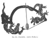
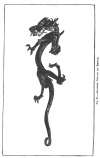
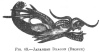
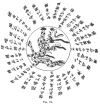
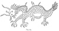
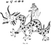

  
[Intangible Textual Heritage](../../index)  [Earth Mysteries](../index.md) 
[Index](index)  [Previous](mm10)  [Next](mm12.md) 

------------------------------------------------------------------------

[Buy this Book at
Amazon.com](https://www.amazon.com/exec/obidos/ASIN/1851709444/internetsacredte.md)

------------------------------------------------------------------------

*Mythical Monsters*, by Charles Gould, \[1886\], at Intangible Textual
Heritage

------------------------------------------------------------------------

p. 248

[  
Click to enlarge](img/fig60.jpg.md)  
FIG. 60—VIGNETTE. (After Hokŭsai.)  

### CHAPTER VIII.

#### THE JAPANESE DRAGON.

THERE is but little additional information as to the dragon to be gained
from Japan, the traditions relating to it in that country having been
obviously derived from China. In functions and qualities it is always
represented as identical with the Chinese dragon. In Japan, however, it
is invariably figured as possessing three claws, whereas in China it has
four or five, according as it is an ordinary or an imperial emblem. The
peasantry are still influenced by a belief in its supernatural powers,
or in those of some large or multiple-headed snake, supposed to be a
transformation of it, and to be the tenant of deep lakes or of springs
issuing from mountains.

I give, as examples of dragon stories, two selected from the narratives
of mythical history, [\*](#fn_245.md) and one
extracted from a native journal of the day.

p. 249

The first states that “Hi-koho-ho-da-mi no mikoto (a god) went out
hunting, and his eldest brother Hono-sa-su-ri no mikoto went out
fishing. They were very successful, and proposed to one another to
change occupations. They did so.

“Hono-sa-su-ri no mikoto went out to the mountain hunting, but got
nothing, therefore he gave back his bow and arrow; but Hi-ko-hoho-da-mi
no mikoto lost his hook in the sea; he therefore tried to return a new
one, but his brother would not receive it, and wanted the old one; and
the mikoto was greatly grieved, and, wandering on the shore, met with an
old man called Si-wo-tsu-chino-gi, and told him what had happened.

“The latter made a cage called mé-na-shi-kogo, enclosed him in it, and
sank it to the bottom of the sea. The mikoto proceeded to the temple of
the sea-god, who gave him a girl, Toyotama, in marriage. He remained
there three years, and recovered the hook which he had lost, as well as
receiving two pieces of precious jade called 'ebb' and 'flood.' He then
returned. After some years he died. His son,
Hi-ko-na-gi-sa-to-k‘e-ouga-ya-fu-ki-ayā-dzu no mikoto, succeeded to the
crown.

“When his father first proposed to return, his wife told him that she
was [*enceinte*](errata.htm#3.md), and that she would come out to the shore
during the rough weather and heavy sea, saying, 'I hope you will wait
until you have completed a house for my confinement.' After some time
Toyotama came there and begged him never to come to her bed when she was
sleeping. He, however, crept up and peeped at her. He saw a dragon
holding a child in the midst of its coils. It suddenly jumped up and
darted into the sea.”

p. 250

[  
Click to enlarge](img/fig61.jpg.md)  
FIG. 61.—JAPANESE DRAGON (IN BRONZE).  

p. 251

The second legend is: “When the So-sa-no-o no mikoto went to the sources
of the river Hi-no-ka-mi at Idzumo, he heard lamentations from a house;
he therefore approached it and inquired the cause. He saw an old man and
woman clasping a young girl. They told him that in that country there
was a very large serpent, which had eight [\*](#fn_246.md) heads and eight tails, and came
annually and swallowed one person. 'We had eight children, and we have
already lost seven, and now have only one left, who will be swallowed;
hence our grief.' The mikoto said, 'If you will give that girl to me, I
will save her.' The old man and woman were rejoiced. The mikoto changed
his form, and assumed that of the young girl. He divided the room into
eight partitions, and in each placed one saki tub and waited its
approach. The serpent arrived, drank the saki, got intoxicated, and fell
asleep.

“Then the mikoto drew his sword and cut the serpent into small pieces.
When he was cutting the tail his sword was a little broken; therefore he
split open the tail to find the reason, and found in it a valuable
sword, and offered it to the god O-mi-ka-mi, at Taka-maga-hara.

“He called the sword Ama no mourakoumo no tsurogi, [†](#fn_247.md) because there was a cloud up in the
heaven where the serpent lies. Finally he married the girl, and built a
house at Suga in Idzumo.”

The third story runs as follows:—

#### *The White Dragon*.

"There is a very large pond at the eastern part of Fu-si-mī-shi-ro-yama,
at Yama-shiro (near Kioto); it is called

p. 252

\[paragraph continues\] Ukisima. In the
fine weather little waves rise up on account of its size. There are many
turtles in it. In the summertime many boys go to the pond to swim, but
never go out into the middle or far from the shore. No one is aware how
deep the centre of the pond is, and it is said that a white dragon lives
in that pond, and can transform itself into a bird, which the people of
the district call O-gon-cho, *i.e.* golden bird, because, when it
becomes a bird, it has a yellow plumage. The bird flies once in fifty
years, and its voice is like the howling of a wolf. In that year there
is famine and pestilence, and many people die. Just one hundred years
ago, when this bird flew and uttered its cry, there was a famine and
drought and disease, and many people died. Again, at Tempo-go-nen
(*i.e.* in the fifth year of Tempo), fifty years back from the present
time, the bird flew as before, and there was once again disease and
famine. Hence the people in that district were much alarmed, as it is
now just fifty years again. They hoped, however, that the bird would not
fly and cry. But at 2 A.M. of the 19th April it is said that it was seen
to do so. The people, therefore, were surprised, and now are worshipping
God in order to avert the famine and disease. The old farmers say, in
the fine weather the white dragon may occasionally be seen floating on
the water, but that if it sees people it sinks down beneath the
surface." [\*](#fn_248.md)

As a pendant to this I now quote a memorial from the *Pekin Gazette* of
April 3rd, 1884, of which a translation is given in the *North China
Herald* for May 16th, 1884.

“A Postscript Memorial of P‘an Yü requests that an additional title of
rank, and a tablet written by His Majesty's

p. 253

own hand, may be conferred on a dragon spirit, who has manifested
himself and answered the prayers made to him.

“In the Ang-shan mountains, a hundred *li* from the town of Kuei-hai,
there are three wells, of which one is on the mountain top, in a spot
seldom visited. It has long been handed down that a dragon inhabits this
well. If pieces of metal are thrown into the well they float, but light
things, as silk or paper, will sink. If the offerings are accepted,
fruits come floating up in exchange. Anything not perfectly pure and
clean is rejected and sent whirling up again. The spirit dwells in the
blackest depths of the water, in form like a strange fish, with golden
scales and four paws, red eyes and long body. He ordinarily remains deep
in the water without stirring. But in times of great drought, if the
local authorities purify themselves, and sincerely worship him, he rises
to the top. He is then solemnly conveyed to the city, and prayers for
rain are offered to him, which are immediately answered. His temple is
in the district city, on the To‘ang-hai Ling. The provincial and local
histories record that tablets to him have been erected from the times of
the Mongol and the Ming dynasties. During the present dynasty, on
several occasions, as, for instance, in the years 1845 and 1863, he has
been carried into the city, and rain has fallen immediately. Last year a
dreadful drought occurred, in which the ponds and tanks dried up, to the
great terror of the people. On the 15th day of the eighth month, the
magistrate conducted the spirit into the city, and, with the assembled
multitude, prayed to him fervently; thereupon a gentle rain, falling
throughout the country, brought plenty in the place of scarcity, and
gladdened the hearts of all. At about the same time, the people of a
district in the vicinity, called Chin-yü, also had recourse to the
spirit, with equally favourable results. These are well-known events,
which have happened quite recently.

p. 254

“It is the desire of the people of the district that some mark of
distinction should be conferred on the spirit; and the memorialist finds
such a proceeding to be sanctioned both by law and precedent; he
therefore humbly lays the wishes of the people before His Majesty, who,
perhaps, will be pleased to confer a title and an autograph tablet as
above suggested. The Rescript has already been recorded.

“No. 6 of Memorial.”

The idea of the transformation of a sea-monster or dragon into a bird is
common both to China and Japan; for instance, in *The Works of Chuang
Tsze*, ch. i. p. 1, by F. H. Balfour, F.R.G.S., we read that—

"In the Northern Sea there was a fish, whose name was *kw‘ên*. It is not
known how many thousand *li* this fish was in length. It was afterwards
transformed into a bird called *p‘êng*, the size of whose back is
uncertain by some thousands of *li*. Suddenly it would dart upwards with
rapid flight, its

[  
Click to enlarge](img/fig62.jpg.md)  
FIG. 62.—THE HAI RIYO. (*Chi-on-in Monastery, Kioto*.)  

p. 255

wings overspreading the sky like clouds. When the waters were agitated
\[in the sixth moon\] the bird moved its abode to the Southern Sea, the
Pool of Heaven. In the book called Ts‘i Hieh, which treats of strange
and marvellous things, it is said that when the *p‘êng* flew south, it
first rushed over three thousand *li* of water, and then mounted to the
height of ninety thousand li, riding upon the wind that blows in the
sixth moon. The wild horses, *i.e.* the clouds and dust of heaven, were
driven along by the zephyrs. The colour of the sky was blue; yet, is
that the real colour of the sky, or only the appearance produced by
infinite, illimitable depths? For the bird, as it looked downwards, the
view was just the same as it is to us when we look upwards."

On the screens decorating the Chi-on-in monastery in Kioto, are depicted
several composite creatures, half-dragon, half-bird, which appear to
represent the Japanese rendering of the Chinese Ying Lung or winged
dragon. They have dragons’ heads, plumose wings, and birds' claws, and
have been variously designated to me by Japanese as the *Hai Riyo*
([Fig. 62](#img_fig62).md), the *Tobi Tatsu*, and the *Schachi Hoko*.

[  
Click to enlarge](img/fig63.jpg.md)  
FIG. 63.—JAPANESE DRAGON (BRONZE)  

p. 256

[  
Click to enlarge](img/fig64.jpg.md)  
FIG. 64.  

#### CONCLUSION OF DRAGON CHAPTERS.

The numerous quotations given in the above pages, or in the Appendix,
are merely a selection; and by no means profess to be so extensive as
they should be were this work a monograph on the dragon alone. Having a
special object in view, I have forborne to diverge into those
interesting speculations which relate to its religious significance;
these I leave to those who deal specially with this portion of its
history. I therefore pass over the many traditions and legends regarding
it contained in the pages of the *Memoirs of Hiouen-Thsang*, [\*](#fn_249.md) of *Foĕ Kouĕ Ki*, [†](#fn_250.md) and similar narratives, and

p. 257

omit quoting folk-lore from the pages of Dennys, Eitel, and others who
have written on the subject.

For my purpose it would be profitless to collate legends such as that
given in the Apocrypha, in the story of Bel and the Dragon, and
reappearing in the pages of El Edrisi as an Arab legend, with Alexander
the Great as the hero, and the Canaries as the scene, or to dwell on the
Corean and Japanese versions of dragon stories, which are merely
borrowed, and corrupted in borrowing, from the Chinese. Nor shall I do
more than allude to the fact that dragons are represented in the
Brahminical caves at Ellora, and among the sculptures of Ancoar Wat in
Cambodia.

[  
Click to enlarge](img/fig65.jpg.md)  
FIG. 65.  

The rude diagrams, Figs. [64](#img_fig64), [65](#img_fig65.md),
[66](#img_fig66.md), are facsimiles from a manuscript of folio size in the
possession of J. Haas, Esq., Imperial Austro-Hungarian Vice-Consul for
Shang-hai, which he kindly placed at my disposal. This unique volume is
at present, unfortunately, unintelligible. It comes from the western
confines of China, and is believed to be an example of the written Lolo
language, that is, of

p. 258

the language of the aboriginal tribes of China. They suffice to show
that the same respect for the dragon is shown among these people as in
China; but no opinion can be offered as to whether this belief and
respect is original or imported, until their literature has been
examined.

[  
Click to enlarge](img/fig66.jpg.md)  
FIG. 66.  

I regret that I am unable to give in this volume, as I had wished, an
account of the Persian dragon, which, I am informed, is contained in a
rare Persian work.

In conclusion, I must hope that the reader who has had the patience to
wade through the medley of extracts which I have selected, and to
analyse the suggestive reasoning of the introductory chapters, will
agree with me that there is nothing impossible in the ordinary notion of
the traditional dragon; that such being the case, it is more likely to
have once had a real existence than to be a mere offspring of fancy; and
that from the accident of direct transmission of delineations of it on
robes and standards, we have probably

p. 259

a not very incorrect notion of it in the depicted dragon of the Chinese.

We may infer that it was a long terrestrial lizard, hibernating, and
carnivorous, with the power of constricting with its snake-like body and
tail; possibly furnished with wing-like expansions of its integument,
after the fashion of *Draco volans*, and capable of occasional progress
on its hind legs alone, when excited in attack. It appears to have been
protected by armour and projecting spikes, like those found in *Moloch
horridus* and *Megalania prisca*, and was possibly more nearly allied to
this last form than to any other which has yet come to our knowledge.
Probably it preferred sandy, open country to forest land, its habitat
was the highlands of Central Asia, and the time of its disappearance
about that of the Biblical Deluge discussed in a previous chapter.

Although terrestrial, it probably, in common with most reptiles, enjoyed
frequent bathing, and when not so engaged, or basking in the sun,
secluded itself under some overhanging bank or cavern.

The idea of its fondness for swallows, and power of attracting them,
mentioned in some traditions, may not impossibly have been derived from
these birds hawking round and through its open jaws in the pursuit of
the flies attracted by the viscid humours of its mouth. We know that at
the present day a bird, the trochilus of the ancients, freely enters the
open mouth of the crocodile, and rids it of the parasites affecting its
teeth and jaws.

------------------------------------------------------------------------

### Footnotes

[248:\*](mm11.htm#fr_247.md) The first two stories
are from the *Ko Ku Shi Riyăh*, a recent history of Japan, from the
earliest periods down to the present time, by Matsunai, with a
continuation by a later author. They are contained in p. 249 the first chapter of the first volume. The
third is given as an ordinary item of news in the journal called the
*Chin jei-Nippo*, April 30th, 1884.

[251:\*](mm11.htm#fr_248.md) The idea of the eight
heads probably originated in China; thus, in the caves in Shantung, near
Chi-ning Chou, among carvings of mythological figures and divinities,
dating from A.D. 147, we find a tiger's body with eight heads, all
human.

[251:†](mm11.htm#fr_249.md) *Mourakoumo* means
"clouds of clouds"; *ama* means "heaven"; *tsurogi* means "sword."

[252:\*](mm11.htm#fr_250.md) White snakes are
occasionally, although rarely, seen in Japan. They are supposed to be
messengers from the gods, and are never killed by the people, but always
taken and carried to some temple. The white snake is worshipped in
Nagasaki at a temple called Miyo-ken, at Nishi-yama, which is the
northern part of the city of Nagasaki.

[256:\*](mm11.htm#fr_251.md) *Mémoires sur les
Contrées occidentales, traduits du Sanscrit en Chinois en l’an* 648; *et
du Chinois en Francais*, par M. Stanislas Julien. 2 vols., Paris, 1857.

[256:†](mm11.htm#fr_252.md) *Foĕ Kouĕ Ki, ou
Relation des Royaumes Bouddhiques*, par *Chĕ Fa Hien*. p. 257 Translated from the Chinese by M. Abel
Remusat; Paris, 1836. This volume contains a number of very interesting
dragon legends, and quaint conceits about them; but I find nothing in it
to supplement my materialistic argument.

------------------------------------------------------------------------

[Next: Chapter IX. The Sea-Serpent](mm12.md)
