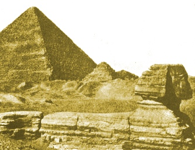

  
[Intangible Textual Heritage](../../index)  [Earth Mysteries](../index.md) 

------------------------------------------------------------------------

[Buy this Book at
Amazon.com](https://www.amazon.com/exec/obidos/ASIN/B0029U2WGY/internetsacredte.md)

------------------------------------------------------------------------

<table width="75%">
<colgroup>
<col style="width: 50%" />
<col style="width: 50%" />
</colgroup>
<tbody>
<tr class="odd">
<td width="50%" data-valign="TOP"></td>
<td width="50%" data-valign="CENTER"><h1 id="the-origin-and-significance-of-the-great-pyramid" data-align="CENTER">The Origin and Significance of the Great Pyramid</h1>
<h2 id="by-c.-staniland-wake" data-align="CENTER">by C. Staniland Wake</h2>
<h4 id="section" data-align="CENTER">[1882]</h4></td>
</tr>
</tbody>
</table>

------------------------------------------------------------------------

[Contents](#contents)    [Start Reading](osgp00.md)    [Page
Index](pageidx)    [Text \[Zipped\]](osgp.txt.gz.md)

------------------------------------------------------------------------

|                                                                                                                           |
|---------------------------------------------------------------------------------------------------------------------------|
|  |

In this classic of Pyramidology, C. Staniland Wake attempts to answer
the questions: who actually built the pyramids, and why? He rejects the
conventional theory that they were tombs, and explores astronomical and
religious motivations for their construction instead.

------------------------------------------------------------------------

 [Title Page](osgp00.md)  
[Preface](osgp01.md)  
[Table of Contents](osgp02.md)  
[Chapter I. The Astronomical Theory](osgp03.md)  
[Chapter II. Early Egyptian Civilization](osgp04.md)  
[Chapter III. The Tomb Theory](osgp05.md)  
[Chapter IV. The Religious Theory](osgp06.md)  
[Chapter V. Seth And Serpent Worship](osgp07.md)  
[Note](osgp08.md)  
[Appendix I](osgp09.md)  
[Appendix II](osgp10.md)  
