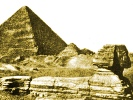

  
[Intangible Textual Heritage](../../index)  [Earth Mysteries](../index.md) 
[Index](index)  [Previous](osgp04)  [Next](osgp06.md) 

------------------------------------------------------------------------

[Buy this Book at
Amazon.com](https://www.amazon.com/exec/obidos/ASIN/B0029U2WGY/internetsacredte.md)

------------------------------------------------------------------------

  
*The Origin and Significance of the Great Pyramid*, by C. Staniland
Wake, \[1882\], at Intangible Textual Heritage

------------------------------------------------------------------------

p. 38

### CHAPTER III.

#### THE TOMB THEORY.

DURING how many centuries before the foundation of the monarchy by Menes
the Egyptian culture had been developing, we do not know, but we cannot
doubt that under Cheops it was well able to give origin to the Great
Pyramid, the construction of which must be regarded as the chief glory
of his reign. We have now to consider, from the testimony of ancient
writers, what was the object of that gigantic structure. From the
inscriptions, it would seem to have been called "the Great Temple of
Shofo," and with its precinct to have been dedicated at one time to the
worship of that king. We are, however, dependent entirely on the Greek
writers for any account of its construction. Herodotus, who lived in the
5th century before Christ, states that the founder of the Great Pyramid,
Cheops, was a prince whose crimes and tyranny rendered

p. 39

his name odious, even to posterity. He closed all the temples and
forbade the Egyptians to perform sacrifices; after which he made them
all work for him. Some were employed to cut stones in the quarries of
the so-called Arabian Hills, on the east side of the Nile, and to convey
them to the other side of the river, whence the stones were dragged to
the Libyan hills; 100,000 men were thus employed at a time, and they
were relieved by an equal number every three months. The construction of
the causeway for the transport of the stones occupied ten years, which
was exclusive of the time spent in levelling the hill on which the
Pyramids stand, and in making the subterranean chambers intended for the
tomb. The building of the pyramid itself occupied twenty years. After
describing the mode of construction, Herodotus states that on the
exterior was engraved in Egyptian characters the sum expended in
supplying the workmen with food, amounting to 1,600 talents, equal to
£200,000 sterling. After other statements, the historian continues,
"Cheops, having reigned 50 years, died, and was succeeded by his brother
Cephren, who followed the example of his predecessor. Among other
monuments he also

p. 40

built a pyramid, but much less in size than that of Cheops. . . . It has
neither underground chambers nor any canal flowing into it from the
Nile, like the other, where the tomb of its founder is placed in an
island surrounded by water." [\*](#fn_25.md) The
Greek writer adds that the priests informed him that Cephren reigned 56
years, so that "the Egyptians were overwhelmed for 106 years with every
kind of oppression, and the temples continued to be closed during the
whole time. Indeed, they have such an aversion for the memory of these
two princes that they will not even mention their names, and for this
reason they call the Pyramids after the shepherd Philitis, who at the
time of their erection used to feed his flocks near this spot."
Herodotus concludes by referring to the erection of the Third Pyramid,
which he ascribes to Mycerinus, the son of Cheops. This monarch,
disapproving of the conduct of his father, "ordered the temples to be
opened, and permitted the people, who had been oppressed by a long
series of cruelties, to

p. 41

return to their work and their religious duties; and administering
justice with great equity, he was looked upon by the Egyptians as
superior to all the kings who had ever ruled the country."

The next Greek writer whose description of the pyramids of Ghizeh is
preserved to us, is Diodorus, who lived about the beginning of the
Christian era. He gives the name Chemmis, or Chembis, as that of the
builder of the Great Pyramid, which had lasted to his time at least
1,000 years, or "as some say, upwards of 3,400 years," and the whole
structure was then uninjured. The building, he says, was by means of
mounds (inclined planes), machines not having yet been invented. In this
statement he differs from Herodotus, whose account is not otherwise
contradicted. After referring to the erection of the Second Pyramid by
Cephren, Diodorus says: "Of the two kings who raised these monuments for
themselves, neither one nor the other was destined to be buried therein.
The people who had endured so much fatigue in building them, and had
been oppressed by their cruelty and violence, threatened to drag their
bodies from their tombs and tear them to pieces, so that these princes
at their death ordered their friends

p. 42

to bury them privately in some other secret place." Strabo, writing at
about the same date, remarks that the pyramids were the sepulchres of
kings, and he adds, what is not mentioned by the earlier writers quoted,
that "near the centre of the sides is a stone which can be taken out,
from which a passage leads to the tomb." Finally, Pliny the Roman
historian, who lived about 100 years later, refers to the Egyptian
pyramids, which he describes as being an "idle and silly display of
royal wealth." The three largest pyramids he affirms were all built in
68 years and 4 months. He refers to the supposed use of mounds in their
erection, but as these had disappeared he mentions another suggestion,
that bridges were made of mud bricks, which, when the work was
completed, were used to build private houses. Pliny adds to the details
given by other writers, that within the Great Pyramid is a well 86
cubits (129 feet) deep.

It is evident from the agreement of the descriptions given by Herodotus
and other Greek writers with the facts, that they must have derived them
from well-informed sources. The entrance to the Great Pyramid mentioned
by Strabo, near the centre of the side, was discovered

p. 43

by Col. Vyse, and the well referred to by Pliny is a remarkable feature
of the building. No excavation or structure answering to the
subterranean chamber upon an island surrounded by water from the Nile
described by Herodotus, has yet been discovered, but Col. Vyse seemed to
think nevertheless that it actually exists. The outer casing of the
Great Pyramid having been removed, the inscription in the Egyptian
character seen by Herodotus must have disappeared, but those modern
writers who ascribe the erection of that structure to divine inspiration
suppose it to have been unique in being entirely without inscriptions.
The statement of Herodotus is, however, confirmed by various Arab
authors, who, according to Dr. Sprenger, "have given the same accounts
of the Pyramids, with little or no variation, for above 1000 years." It
appears from Masoudi, one of the earliest of these authors, that the
pyramids were covered with continuous inscriptions, and he relates the
Coptic tradition that the builder ordered the prophecies of the priests
to be inscribed on columns and upon the large stones of the pyramids,
and written accounts of their wisdom and acquirements in arts and
sciences to be depicted on

p. 44

them. [\*](#fn_26.md) It is impossible now to
ascertain how far this statement was correct, but Col. Vyse found the
cartouche of Cheops (Suphis) in the rubbish near the Great Pyramid, and
recently a piece of the casing has been discovered showing remains of a
Greek inscription, which is the more valuable as, says the discoverer,
"nothing besides a few fragments with single letters had been previously
discovered of the many inscriptions that existed on the casing." [†](#fn_27.md)

As the accounts given by the ancient Greek writers are true in so many
particulars, we cannot doubt that they have correctly reported what they
had heard as to the object with which the Pyramids were erected. They
all agree in declaring them to be the tombs of the kings by whom they
had been built, although, according to Diodorus, the Egyptian priests
asserted that neither Cheops nor Cephren were actually buried in the
pyramids which are ascribed to them. That this story was an invention,
however, may be assumed from its not being mentioned by

p. 45

\[paragraph continues\] Herodotus,
although he refers to the aversion which the Egyptians had for the
memory of those kings, and accounts for it by their oppressive conduct,
and the closing of the temples during the continuance of their reigns.
If the sacred places were actually closed, we should have a sufficient
reason for the hatred of the memory of Cheops and Cephren exhibited by
the Egyptian priests; a hatred which led them afterwards to declare that
the people would not allow their bodies to be deposited in the monuments
prepared for them.

It has been often pointed out that it is extremely improbable Cephren
would have been at the trouble and expense of erecting a gigantic
pyramid for his tomb if the body of his predecessor, Cheops, had not
been deposited in the pyramid tomb prepared for its reception. There is
some reason to believe, however, that these two monarchs, who were
brothers, reigned during the same period, a warrant for which belief is
found in the statement of Pliny that the three largest pyramids were all
erected in 63 years and 4 months. [\*](#fn_28.md)
It is possible, indeed, that the priests

p. 46

knew of the absence of any corpse, not only from the rock-cut chamber,
but also from the coffer in the so-called King's Chamber, and that they
invented the story of the people's hatred to account for such absence.
Some ground for the belief in the irreligion of Cheops and Cephren may
perhaps be found in the fact that their names were not preceded by that
of Osiris, as was the case with their successor Mycerinus. [\*](#fn_29.md) "Among the ancient Egyptians, the
departed soul," says Dr. Ebers, "if it were found pure and faithful,
became absolutely one with the universal soul whence it was derived, and
received the same name, Osiris." [†](#fn_30.md) It
is true that Dr. Ebers denies that Cheops and Cephren were wicked
contemners of the god, on the ground that "as long as Egypt was governed
by independent sovereigns, there were prophets or priests of the Osirian
or deceased Cheops, [‡](#fn_31.md) and of the other
principal pyramid builders, who conducted the worship in the fallen
temple of Isis, and who

p. 47

usually belonged to the oldest families of Memphis." This is consistent,
however, with the fact of the deceased monarchs having worshipped a
"strange" god and given him priority oar Osiris, which would be
sufficient to stamp them in the eyes of the orthodox priests as enemies
of the Gods of Egypt.

But is there any evidence besides the statements of Greek writers that
the Great Pyramid was really used as the tomb of Cheops or any other
person? That it was thus used, might perhaps be inferred from the fact,
sometimes forgotten, that it is situate in a vast necropolis. M. Perrot
in his "Histoire de l’Art," remarks that "the nobles of Egypt, all those
who had assisted in the work of the monarchy and received a reflection
of its glory, grouped themselves as near as possible around the prince
they had served. Distributed thus by reigns and quarters, the private
tombs lie close together, all furnished with steles which preserve the
name of the dead, most of them ornamented with bas-reliefs painted in
brilliant colours, some even decorated with statues placed before their
façade." [\*](#fn_32.md) We know that the smallest

p. 48

of the three Great Pyramids was the tomb of its builder Mycerinus or
Men-ke-ra, as Col. Vyse found in the burial chamber a basalt
sarcophagus, with the lid of its wooden coffin having on it in
[hieroglyphs](errata.htm#3.md) an address to the deceased monarch, as
identified with Osiris. [\*](#fn_33.md) Vyse states
that great precautions had been taken to conceal the position of the
sarcophagus, and he doubted whether the real tombs had been discovered
in the two larger pyramids. [†](#fn_34.md) He adds
that the three larger pyramids were all intended for the same purpose,
and their construction was carried on upon the same principles. The
sarcophagus of the Second Pyramid has no inscription, and is, according
to Belzoni, not larger than is necessary for the wooden case of an
embalmed human body. [‡](#fn_35.md) It is true that
a piece of bone, supposed to be that of an ox, was found in this
sarcophagus, but it may not have had anything to do with the original
burial, as the Arab writers say nothing apparently of the discovery

p. 49

in this pyramid of any human or other remains, when it was opened by
their countrymen. As to the Great Pyramid, if we are to believe those
writers, an embalmed human body was actually discovered in the so-called
King's Chamber when it was opened by the Caliph Mamoon. This is said to
have taken place in the year 820 A.D., and the Arab historian,
Abd-el-Hôkm, relates that "a statue resembling a man was found in the
sarcophagus, and in the statue (mummy case) was a body with a
breastplate of gold and jewels, bearing characters written with a pen
which no one understood." [\*](#fn_36.md) Alkaisi
gives much the same story, and he adds that the case stood at the door
of the king's palace at Cairo in the year 511—that is, 1133 A.D. [†](#fn_37.md) It may be doubted, however, whether this
had anything to do with the Great Pyramid. Dr. Ebers mentions that in
the middle of the 15th century, "an Emir caused the
[destruction](errata.htm#4.md) of the much admired 'green shrine,' which
was formed out of a single block of a stone as hard as iron, and
ornamented with figures and inscriptions. It was smashed to pieces." He
adds, "the golden statue, with

p. 50

eyes of precious stones, which had once been enshrined in this marvel of
art—dedicated probably to the Moon-god Chonsu—had long before
disappeared. [\*](#fn_38.md) In this shrine and
statue we have no doubt the case and body mentioned by Abd-el-Hôkm, as
Alkaisi when referring to these speaks of an image of a man in
green-stone, containing a body in golden armour with a large ruby
overhead.

It must be admitted, therefore, that there is no reliable evidence of
any human body having been found in the Great Pyramid. Nevertheless this
is not any proof that the building was not used as a tomb. The Arab
writer Abd Allatif refers to an early statement that when the Persians
conquered Egypt they took away great riches from the Pyramids, which
were the sepulchres of the kings, [†](#fn_39.md)
and, therefore, no doubt the receptacle of their treasures. Moreover,
according to Sir Gardner Wilkinson, the Egyptians themselves had in many
instances plundered the tombs of Thebes, [‡](#fn_40.md) and he seems to think that the Great
Pyramid met with the same fate at their hands.

p. 51

\[paragraph continues\] The Meydoom
Pyramid, which is said to be that of the last king of the Third Dynasty,
has been recently opened, and inscriptions have been found showing that
it had been opened before the Twentieth Dynasty. [\*](#fn_41.md) M. Lenormant states that the priestly
legend as to the popular hatred of the builders of the two Great
Pyramids, had at least a real historical foundation. He says: Everything
seems to indicate that the end of the Fourth Dynasty, immediately after
the princes constructors of the great pyramids, was a time of
revolutions and of troubles caused by the [preceding](errata.htm#5.md)
oppression. [†](#fn_42.md) The comparison of the
list of Manetho and of the monuments of the necropolis of Sakkarah
reveal during this period violent competitions. The splendid statues of
Kha-f-Râ (Cephren) in diorite, in rose granite, in alabaster, and in
basalt, which decorated the temple near the Great Sphinx, have been
found in pieces in a well where they had been precipitated in a
revolutionary movement, evidently but little posterior to his reign.
These statues,

p. 52

moreover, of which some represent him in the vigour of manhood, and the
others in a state of advanced age, confirm the tradition which
attributed to him a reign of 50 years." [\*](#fn_43.md) Remains of this character have not yet
been found in association with the Great Pyramid, notwithstanding the
tradition as to its being the tomb of Cheops, and the fact that it
became dedicated to his worship.

It is not at all improbable that the bodies of both Cephren and Cheops
were removed from their resting places during the commotions which
occurred at the end of the Fourth Dynasty. As to the latter monarch, at
least, it is not necessary to suppose that he was buried in the
so-called King's Chamber or in the cave below the base of the pyramid. A
more likely place for the purpose would be the niche in the cast wall of
the Queen's Chamber, where Maillet, [†](#fn_44.md)
who in 1692 described it as being three feet deep, eight feet high, and
three feet wide, supposed the mummy of the queen to have been placed
upright. The niche appears, however, to have an inner shelf, on which
the embalmed corpse may have been

p. 53

laid. The Queen's Chamber is stated, however, by Edrysy [\*](#fn_45.md) to have had an empty "vessel," such as
the sarcophagus of the King's Chamber, so that if the niche were used
for another purpose the body of Cheops may still have been there
deposited. It appears, indeed, that according to some ancient
inscriptions, the Pyramids were regarded as sepulchral temples, and
priests were appointed for the service of the princes who were buried
there, and had attained to the divine nature. A tomb found at Sakkarah
belonged to "a priest of Chufu and Chafra." [†](#fn_46.md)

------------------------------------------------------------------------

### Footnotes

[40:\*](osgp05.htm#fr_25.md) In connection with
this statement it may be remarked, that from ancient inscriptions it
appears that during the reign of Amenemha III. of the Twelfth Dynasty,
the average height of the inundations from the Nile was 24 feet greater
than at present. (See Dunckers's "History of Antiquity," Vol. i. p.
105.)

[44:\*](osgp05.htm#fr_26.md) Vyse, Vol. ii., 324-8.

[44:†](osgp05.htm#fr_27.md) Mr. Petrie's letter in
*The Academy*. M. de Sacy refers with approval to the statements of Abd
Allatif and other Arab writers, that the surfaces of the two great
pyramids were covered. with inscriptions. (*See* Vyse, Vol. ii. p. 342).

[45:\*](osgp05.htm#fr_28.md) Wilkinson says that
the Great Pyramid was built by Suphis I. (Cheops), and his brother
Suphis II. (Num Shufu), while Cephren (Shafra of the Fifth Dynasty), was
the founder of the Second Pyramid.—Rawlinson's "Herodotus," Vol. ii. p.
346.

[46:\*](osgp05.htm#fr_29.md) Vyse, Vol. ii. p. 95.
Dr. Birch says that the coffin of this monarch marks a new religious
development in the annals of Egypt.—"Egypt," p. 41.

[46:†](osgp05.htm#fr_30.md) "Egypt," Vol. ii., p.
132.

[46:‡](osgp05.htm#fr_31.md) A religious work,
called "The Sacred Book," was ascribed to him by the Greek writers.

[47:\*](osgp05.htm#fr_32.md) Tom. i. p. 244. Abd
Allatif mentions that there were formerly at Ghizeh a considerable
number of small pyramids, p. 48which were
destroyed by Karakousch, an Emir in the army of Salaheddin Youssef, to
supply materials for the building of the walls and citadel of Cairo.
(See Vyse, "Operations" etc., Vol. ii. p. 336.)

[48:\*](osgp05.htm#fr_33.md) Tom. i., Vol. ii. p.
94.

[48:†](osgp05.htm#fr_34.md) Ditto, p. 104.

[48:‡](osgp05.htm#fr_35.md) Ditto, p. 298.

[49:\*](osgp05.htm#fr_36.md) Wilkinson's "Hand-Book
(Egypt)," p. 168.

[49:†](osgp05.htm#fr_37.md) Vyse, Vol. ii. p. 333.

[50:\*](osgp05.htm#fr_38) "Egypt" (Eng. Ed..md),
Vol. i. p. 125.

[50:†](osgp05.htm#fr_39.md) Vyse, Vol. ii. p. 345.

[50:‡](osgp05.htm#fr_40) Hand-Book (Egypt.md)," p.
168.

[51:\*](osgp05.htm#fr_41.md) Miss Amelia B.
Edwards, *The Academy* for Jan. 7th, 1882.

[51:†](osgp05.htm#fr_42.md) May there not have been
a religious cause, connected with a difference of race, such as the
opposition, hereafter referred to, between Seth and Osiris?

[52:\*](osgp05.htm#fr_43.md) Tom ii. p. 73.

[52:†](osgp05.htm#fr_44.md) Vyse, "Operations,"
etc., Vol. ii. p. 226.

[53:\*](osgp05.htm#fr_45.md) Vyse, Vol. ii. p. 334.
May not the Eighth Pyramid, which tradition assigns as the tomb of the
daughter of Cheops, have been that of his wife? The masonry has much
resemblance to that of the Great Pyramid. Vol. ii. p. 70.

[53:†](osgp05.htm#fr_46.md) Duncker, "History of
Antiquity," Vol. i. p. 99.

------------------------------------------------------------------------

[Next: Chapter IV. The Religious Theory](osgp06.md)
