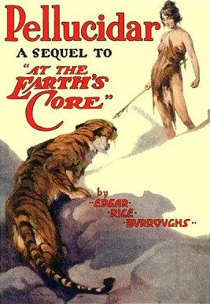

  
[Intangible Textual Heritage](../../index)  [Earth Mysteries](../index.md) 

------------------------------------------------------------------------

[Buy this Book at
Amazon.com](https://www.amazon.com/exec/obidos/ASIN/B0027P88C8/internetsacredte.md)

------------------------------------------------------------------------

<table width="75%">
<colgroup>
<col style="width: 50%" />
<col style="width: 50%" />
</colgroup>
<tbody>
<tr class="odd">
<td width="50%" data-valign="TOP"></td>
<td width="50%" data-valign="CENTER"><h1 id="pellucidar" data-align="CENTER">Pellucidar</h1>
<h2 id="by-edgar-rice-burroughs" data-align="CENTER">by Edgar Rice Burroughs</h2>
<h4 id="section" data-align="CENTER">[1915]</h4></td>
</tr>
</tbody>
</table>

------------------------------------------------------------------------

[Contents](#contents)    [Start Reading](pell00.md)    [Text
\[Zipped\]](pell.txt.gz.md)

------------------------------------------------------------------------

|                                                                                                                           |
|---------------------------------------------------------------------------------------------------------------------------|
|  |

In this, the first (of many) sequels to [At the Earth's
Core](../atec/index.md), David Innes returns to Pellucidar, the world
inside the Earth. Burroughs would revisit Pellucidar in later yarns with
his consumate hero, Tarzan. But for now, this wraps up the first two
Burroughs Hollow Earth novels nicely, as (spoiler alert) Innes saves the
*inner* world and reclaims his lost love, Dian, from his arch-enemy.

------------------------------------------------------------------------

 [Title Page](pell00.md)  
[Prologue](pell01.md)  
[Chapter I. Lost On Pellucidar](pell02.md)  
[Chapter II. Traveling With Terror](pell03.md)  
[Chapter III. Shooting the Chutes—and After](pell04.md)  
[Chapter IV. Friendship and Treachery](pell05.md)  
[Chapter V. Surprises](pell06.md)  
[Chapter VI. A Pendent World](pell07.md)  
[Chapter VII. From Plight to Plight](pell08.md)  
[Chapter VIII. Captive](pell09.md)  
[Chapter IX. Hooja's Cutthroats Appear](pell10.md)  
[Chapter X. The Raid on the Cave-Prison](pell11.md)  
[Chapter XI. Escape](pell12.md)  
[Chapter XII. Kidnapped!](pell13.md)  
[Chapter XIII. Racing For Life](pell14.md)  
[Chapter XIV. Gore and Dreams](pell15.md)  
[Chapter XV. Conquest and Peace](pell16.md)  
