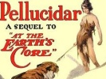

  
[Intangible Textual Heritage](../../index)  [Earth Mysteries](../index.md) 
[Index](index)  [Next](pell01.md) 

------------------------------------------------------------------------

[Buy this Book at
Amazon.com](https://www.amazon.com/exec/obidos/ASIN/B0027P88C8/internetsacredte.md)

------------------------------------------------------------------------

  
*Pellucidar*, by Edgar Rice Burroughs, \[1915\], at Intangible Textual
Heritage

------------------------------------------------------------------------

# PELLUCIDAR

## by Edgar Rice Burroughs

## Chicago: A.C. McClurg

#### \[1915\]

Formatted, with additional proofing, at Intangible Textual Heritage, May
2008. This text is in the public domain in the US because it was
published prior to 1923.

------------------------------------------------------------------------

[Next: Prologue](pell01.md)
