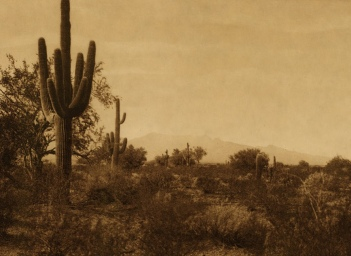

  
[Intangible Textual Heritage](../../index)  [Earth Mysteries](../index) 

------------------------------------------------------------------------

[Buy this Book at
Amazon.com](https://www.amazon.com/exec/obidos/ASIN/0804005990/internetsacredte)

------------------------------------------------------------------------

<table width="75%">
<colgroup>
<col style="width: 50%" />
<col style="width: 50%" />
</colgroup>
<tbody>
<tr class="odd">
<td width="50%" data-valign="TOP"> 
Pima Territory, by Edward Curtis [1912] (Public Domain Image)</td>
<td width="50%" data-valign="CENTER"><h1 id="pale-ink" data-align="CENTER">Pale Ink</h1>
<h2 id="by-henriette-mertz" data-align="CENTER">by Henriette Mertz</h2>
<h4 id="section" data-align="CENTER">[1953]</h4></td>
</tr>
</tbody>
</table>

------------------------------------------------------------------------

[Contents](#contents)    [Start Reading](pi00)

------------------------------------------------------------------------

|                                                                                                                           |
|---------------------------------------------------------------------------------------------------------------------------|
|  |

This is another attempt to investigate early Chinese trans-Pacific
contacts, written mid-20th century by a globe-trotting patent attorney,
Henriette Mertz. Like Charles Leland's [Fusang](../fu/index), written
three-quarters of a century before, Mertz depends heavily on ancient
Chinese geographical treatises to support her thesis that the Chinese
explored the western United States hundreds, maybe thousands of years
before Europeans. The strongest part of the book is her attempt to
explain the available Chinese historical descriptions, even the most
fanciful parts, in terms of specific locations, animals, and cultures,
for the most part plausibly. On the downside, she misidentifies parts of
the Hindu sacred texts as Buddhist, and indulges in the amateur
etymology game, with predictable results. But these factual lapses seem
to be peripheral to the book.

Mertz self-published this in 1953, and followed it up with a second
edition in 1972, which corrected many of the [endemic typos](errata) in
the first edition. The book was reissued in paperback by Ballentine in
1975 as Gods from the Far East: How The Chinese Discovered America ([see
cover](img/gfecov.jpg)), apparently in an effort to cash in on the Van
Daniken craze. However, Pale Ink is a much better effort than Van
Daniken, as Mertz is not obsessed with explaining every Native American
technological advance as a borrowing from unknown visitors.

The Chinese discovery of America continues to be a perennial theory.
Most recently we've seen [1421: The Year China Discovered
America](https://www.amazon.com/exec/obidos/ASIN/006054094X/internetsacredte),
by Gavin Menzies, and [Voyages of the Pyramid
Builders](https://www.amazon.com/exec/obidos/ASIN/1585423203/internetsacredte),
by Robert M. Schoch. Both of these books owe quite a lot to the work of
Henriette Mertz.

------------------------------------------------------------------------

 [Title Page](pi00)  
[Contents](pi01)  
[Preface](pi02)  
[Chapter I. Geographical Myths](pi03)  
[Chapter II. Fu-sang](pi04)  
[Chapter III. Chinese Whimsy?](pi05)  
[Chapter IV. Kuen 327 and the Liang-Sse-Kong Ki](pi06)  
[Chapter V. Mexican Legends](pi07)  
[Chapter VI. Yucatan](pi08)  
[Chapter VII. Related Items](pi09)  
[Chapter VIII. The Buddhists](pi10)  
[Chapter IX. A Matter of Words](pi11)  
[Chapter X. Hwui Shan, Traveller par Excellence](pi12)  
[Chapter XI. Early China](pi13)  
[Chapter XII. The Shan Hai King](pi14)  
[Chapter XIII. Across the Sea](pi15)  
[Chapter XIV. The Great American Desert](pi16)  
[Chapter XV. Conclusion](pi17)  
[Author Biography](pi18)  
