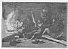

  
[Intangible Textual Heritage](../../index)  [Earth Mysteries](../index.md) 
[Index](index)  [Previous](potp05)  [Next](potp07.md) 

------------------------------------------------------------------------

p. 32

# CHAPTER II.

### LENGTH OF POLAR NIGHTS.

IF the earth be hollow--and I contend it is--that fact accounts for the
sun not being visible for so long a time near the pole. As the sun
strikes the earth obliquely near the poles in winter, only a slight
depression would be required to shut it out entirely during the winter
months; shut out until it got high enough to shine on that part of the
earth more directly, or, as would be termed in more southern latitudes,
higher in the skies. The farther one advanced into the interior, the
longer would be the night. Were the earth solid and round, I am of the
opinion that the sun could be seen nearly, if not quite, every day in
the year. When Nansen saw what he called the mirage of the sun, and took
it for the real sun--several days too soon for its appearance--he was
much disappointed, as the *Fram* must have drifted south considerably
since he took his last

p. 33

 

[  
Click to enlarge](img/03300.jpg.md)  
Home life in the Arctic Circle  

p. 34

p. 35

observation. If a few days' drifting could make such a difference in the
sun's arrival, would not the traversing of several thou-sands of miles
be a cause for shutting out the sun for several months? It has been
supposed, heretofore, that the farther north one got, the longer would
be the night. That is true, in one sense; for, in going into the
interior, travelers must go north until they reach the farthest point;
but long before they do they will have sunk a long way into the earth,
or from where they would have been had they traveled the same distance
if the earth were solid and round. For example: if you are living in a
valley, the sun rises later and sets earlier than on a mountain: the
entrance to the earth can be represented as a deep valley, and the
farther one advances the deeper it becomes.

Let us propound this problem in another shape. The supposed location of
the North Pole is from 450 to 500 miles in the air; not straight up, but
on the same angle as going straight north from 60 degs. latitude,
allowing for the natural curve of the

p. 36

earth. If one could be located there in a balloon, one would see the
sun, perhaps, each day in the year.

In Volume I, page 375, of Nansen's "Farthest North," Friday, January 19,
1894, he says: "Splendid wind, with velocity of thirteen to nineteen
feet per second; we are going north at a grand rate. The red, glowing
twilight is now so bright about midday that if we were in more southern
latitudes we should expect to see the sun rise bright and glorious above
the horizon in a few minutes; but we shall have to wait a month yet for
that." The fact is, Nansen was going into the interior of the earth,
while he was under the impression that he was going north.

------------------------------------------------------------------------

[Next: Chapter III. Working of the Compass](potp07.md)
