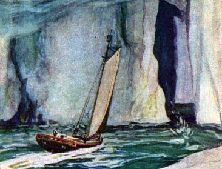

  
[Intangible Textual Heritage](../../index)  [Earth Mysteries](../index.md) 

------------------------------------------------------------------------

[Buy this Book at
Amazon.com](https://www.amazon.com/exec/obidos/ASIN/B0026P3SA6/internetsacredte.md)

------------------------------------------------------------------------

<table width="75%">
<colgroup>
<col style="width: 50%" />
<col style="width: 50%" />
</colgroup>
<tbody>
<tr class="odd">
<td width="50%" data-valign="TOP"></td>
<td width="50%" data-valign="CENTER"><h1 id="the-smoky-god" data-align="CENTER">The Smoky God</h1>
<h2 id="by-willis-george-emerson" data-align="CENTER">by Willis George Emerson</h2>
<h4 id="section" data-align="CENTER">[1908]</h4></td>
</tr>
</tbody>
</table>

------------------------------------------------------------------------

[Contents](#contents)    [Start Reading](smog00.md)    [Page
Index](pageidx)    [Text \[Zipped\]](smog.txt.gz.md)

------------------------------------------------------------------------

|                                                                                                                           |
|---------------------------------------------------------------------------------------------------------------------------|
|  |

This is another classic fictional hollow earth adventure. The narrator,
Olaf Jansen, is a Norwegian who sails with his father deep into the
northern ice. There they sail over the lip of the hollow earth, and into
the inner world, lit by a dim central sun (the 'smoky god' of the
title). The inhabitants are an advanced race of giants who have
electricity, monorails, and extremely long lifespans. The travelers
return to the surface through the Antarctic, and as is usual in this
genre, lose everything which could confirm their tale on the return
voyage. The author, Willis George Emerson (1856-1918), was an American
novelist; none of his other books appear to be on esoteric themes.

Production Notes: The text of this book has been
available through Project Gutenberg since 2002. This etext is a new scan
from a first edition, and includes all the illustrations, which were
omitted in the PG text.--J.B. Hare, December 19, 2008.

------------------------------------------------------------------------

 [Title Page](smog00.md)  
[Contents](smog01.md)  
[Part One: Author's Foreword](smog02.md)  
[Part Two: Olaf Jansen's Story](smog03.md)  
[Part Three: Beyond the North Wind](smog04.md)  
[Part Four: In the Under World](smog05.md)  
[Part Five: Among the Ice Packs](smog06.md)  
[Part Six: Conclusion](smog07.md)  
[Part Seven: Author's Afterword](smog08.md)  
[Advertisements](smog09.md)  
