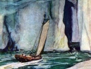

  
[Intangible Textual Heritage](../../index)  [Earth Mysteries](../index) 
[Index](index)  [Previous](smog00)  [Next](smog02) 

------------------------------------------------------------------------

[Buy this Book at
Amazon.com](https://www.amazon.com/exec/obidos/ASIN/B0026P3SA6/internetsacredte)

------------------------------------------------------------------------

  
*The Smoky God*, by Willis George Emerson, \[1908\], at Intangible
Textual Heritage

------------------------------------------------------------------------

p. 8 p. 9

### CONTENTS

|                                     |       |                                                      |                                     |
|-------------------------------------|-------|------------------------------------------------------|-------------------------------------|
|                                     |       |                                                      | Page |
| PART | I.    | Author's Foreword     | [11](smog02.htm#page_11)            |
| PART | II\.  | Olaf Jansen's Story   | [45](smog03.htm#page_45)            |
| PART | III\. | Beyond the North Wind | [81](smog04.htm#page_81)            |
| PART | IV\.  | In the Under World    | [127](smog05.htm#page_127)          |
| PART | V.    | Among the Ice Packs   | [155](smog06.htm#page_155)          |
| PART | VI\.  | Conclusion            | [173](smog07.htm#page_173)          |
| PART | VII\. | Author's Afterword    | [184](smog08.htm#page_184)          |

p. 10

### ILLUSTRATIONS

|                                                                                                     |                                      |
|-----------------------------------------------------------------------------------------------------|--------------------------------------|
|                                                                                                     | Page  |
| "I was left alone with the dead."                                                                   | [Frontispiece](smog00.htm#img_front) |
| "Twenty-eight years—long, tedious, frightful years of suffering."                                   | [49](smog03.htm#img_04900)           |
| "A vessel larger than our little fishing sloop could not have threaded its way among the icebergs." | [57](smog03.htm#img_05700)           |
| "By what miracle we escaped being dashed to destruction, I do not know."                            | [73](smog03.htm#img_07300)           |
| "It could hardly be said to resemble the sun except in its circular shape."                         | [89](smog04.htm#img_08900)           |
| "They spoke to us in a strange language."                                                           | [101](smog04.htm#img_10100)          |
| "We were brought before the Great High Priest."                                                     | [121](smog04.htm#img_12100)          |
| "There must have been five hundred of these thunder-throated monsters"                              | [135](smog05.htm#img_13500)          |
| "My father shouted: 'Breakers ahead!'"                                                              | [151](smog05.htm#img_15100)          |
| "Less than a half mile away was a whaling vessel."                                                  | [165](smog06.htm#img_16500)          |
| "Whereupon I was put in irons."                                                                     | [169](smog06.htm#img_16900)          |

------------------------------------------------------------------------

[Next: Part One: Author's Foreword](smog02)
