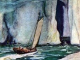

  
[Intangible Textual Heritage](../../index)  [Earth Mysteries](../index.md) 
[Index](index)  [Previous](smog06)  [Next](smog08.md) 

------------------------------------------------------------------------

[Buy this Book at
Amazon.com](https://www.amazon.com/exec/obidos/ASIN/B0026P3SA6/internetsacredte.md)

------------------------------------------------------------------------

  
*The Smoky God*, by Willis George Emerson, \[1908\], at Intangible
Textual Heritage

------------------------------------------------------------------------

p. 173

### PART SIX

### CONCLUSION

In concluding this history of my
adventures, I wish to state that I firmly believe science is yet in its
infancy concerning the cosmology of the earth. There is so much that is
unaccounted for by the world's accepted knowledge of to-day, and will
ever remain so until the land of "The Smoky God" is known and recognized
by our geographers.

It is the land from whence came the great logs of cedar that have been
found by explorers in open waters far over the northern edge of

p. 174

the earth's crust, and also the bodies of mammoths whose bones are found
in vast beds on the Siberian coast.

Northern explorers have done much. Sir John Franklin, De Haven Grinnell,
Sir John Murray, Kane, Melville, Hall, Nansen, Schwatka, Greely, Peary,
Ross, Gerlache, Bernacchi, Andree, Amsden, Amundson and others have all
been striving to storm the frozen citadel of mystery.

I firmly believe that Andree and his two brave companions, Strindberg
and Fraenckell, who sailed away in the balloon "Oreon" from the
northwest coast of Spitzbergen on that Sunday afternoon of July 11,
1897, are now in the "within" world, and doubtless are being
entertained,

p. 175

as my father and myself were entertained by the kind-hearted giant race
inhabiting the inner Atlantic Continent.

Having, in my humble way, devoted years to these problems, I am well
acquainted with the accepted definitions of gravity, as well as the
cause of the magnetic needle's attraction, and I am prepared to say that
it is my firm belief that the magnetic needle is influenced solely by
electric currents which completely envelop the earth like a garment, and
that these electric currents in an endless circuit pass out of the
southern end of the earth's cylindrical opening, diffusing and spreading
themselves over all the "outside" surface, and rushing madly on in their
course

p. 176

toward the North Pole. And while these currents seemingly dash off into
space at the earth's curve or edge, yet they drop again to the "inside"
surface and continue their way southward along the inside of the earth's
crust, toward the opening of the so-called South Pole. [1](#fn_23.md)

As to gravity, no one knows what it is, because it has not been
determined

p. 177

whether it is atmospheric pressure that causes the apple to fall, or
whether, 150 miles below the surface of the earth, supposedly one-half
way through the earth's crust, there exists some powerful loadstone
attraction that draws it. Therefore, whether the-apple, when it leaves
the limb of the tree, is drawn or impelled downward to the nearest point
of resistance, is unknown to the students of physics.

Sir James Ross claimed to have discovered the magnetic pole at about
seventy-four degrees latitude. This is wrong—the magnetic pole is
exactly one-half the distance through the earth's crust. Thus, if the
earth's crust is three hundred miles in thickness, which is the distance
I

p. 178

estimate it to be, then the magnetic pole is undoubtedly one hundred and
fifty miles below the surface of the earth, it matters not where the
test is made. And at this particular point one hundred and fifty miles
below the surface, gravity ceases, becomes neutralized; and when we pass
beyond that point on toward the "inside" surface of the earth, a reverse
attraction geometrically increases in power, until the other one hundred
and fifty miles of distance is traversed, which would bring us out on
the "inside" of the earth.

Thus, if a hole were bored down through the earth's crust at London,
Paris, New York, Chicago, or Los-Angeles, a distance of three hundred
miles, it would connect the two surfaces.

p. 179

\[paragraph continues\] While the inertia
and momentum of a weight dropped in from the "outside" surface would
carry it far past the magnetic center, yet, before reaching the "inside"
surface of the earth it would gradually diminish in speed, after passing
the halfway point, finally pause and immediately fall back toward the
"outside" surface, and continue thus to oscillate, like the swinging of
a pendulum with the power removed, until it would finally rest at the
magnetic center, or at that particular point exactly one-half the
distance between the "outside" surface and the "inside" surface of the
earth.

The gyration of the earth in its daily act of whirling around in its
spiral rotation—at a rate greater

p. 180

than one thousand miles every hour, or about seventeen miles per
second—makes of it a vast electro-generating body, a huge machine, a
mighty prototype of the puny-man-made dynamo, which, at best, is but a
feeble imitation of nature's original.

The valleys of this inner Atlantis Continent, bordering the upper waters
of the farthest north are in season covered with the most magnificent
and luxuriant flowers. Not hundreds and thousands, but millions, of
acres, from which the pollen or blossoms are carried far away in almost
every direction by the earth's spiral gyrations and the agitation of the
wind resulting therefrom, and it is these blossoms or pollen from the
vast floral meadows "within" that

p. 181

produce the colored snows of the Arctic regions that have so mystified
the northern explorers. [1](#fn_24.md)

Beyond question, this new land

p. 182

\[paragraph continues\] "within" is the
home, the cradle, of the human race, and viewed from the standpoint of
the discoveries made by us, must of necessity have a most important
bearing on all physical, paleontological, archæological, philological
and mythological theories of antiquity.

The same idea of going back to the land of mystery—to the very
beginning—to the origin of man—is found in Egyptian traditions of the
earlier terrestrial regions of the gods, heroes and men, from the
historical fragments of Manetho, fully verified by the historical
records taken from the more recent excavations of Pompeii as well as the
traditions of the North American Indians.

\_\_\_\_\_

p. 183

It is now one hour past midnight—the new year of 1908 is here, and this
is the third day thereof, and having at last finished the record of my
strange travels and adventures I wish given to the world, I am ready,
and even longing, for the peaceful rest which I am sure will follow
life's trials and vicissitudes. I am old in years, and ripe both with
adventures and sorrows, yet rich with the few friends I have cemented to
me in my struggles to lead a just and upright life. Like a story that is
well-nigh told, my life is ebbing away. The presentiment is strong
within me that I shall not live to see the rising of another sun. Thus
do I conclude my message.

Olaf Jansen.

------------------------------------------------------------------------

### Footnotes

[176:1](smog07.htm#fr_23.md) *"Mr. Lemstrom
concluded that an electric discharge which could only be seen by means
of the spectroscope was taking place on the surface of the ground all
around him, and that from a distance it would appear as a faint display
of Aurora, the phenomena of pale and flaming light which is some times
seen on the top of the Spitzbergen Mountains."—The Arctic Manual, page*
739.

[181:1](smog07.htm#fr_24.md) *Kane, vol. I, page*
44, *says: "We passed the 'crimson cliffs' of Sir John Ross in the
forenoon of August* 5*th. The patches of red snow from which they derive
their name could be seen clearly at the distance of ten miles from the
coast."*

*La Chambre, in an account of Andree's balloon expedition, on page* 144,
*says: "On the isle of Amsterdam the snow is tinted with red for a
considerable distance, and the savants are collecting it to examine it
microscopically. It presents, in fact, certain peculiarities; it is
thought that it contains very small plants. Scoreby, the famous whaler,
had already remarked this."*

------------------------------------------------------------------------

[Next: Part Seven: Author's Afterword](smog08.md)
