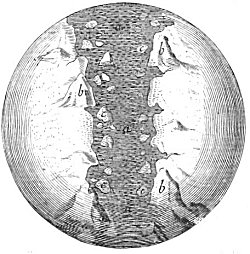

  
[Intangible Textual Heritage](../../index)  [Earth Mysteries](../index.md) 

------------------------------------------------------------------------

<table width="75%">
<colgroup>
<col style="width: 50%" />
<col style="width: 50%" />
</colgroup>
<tbody>
<tr class="odd">
<td width="50%" data-valign="CENTER"> 
</td>
<td width="50%" data-valign="CENTER"><h1 id="the-sacred-theory-of-the-earth" data-align="CENTER">The Sacred Theory of the Earth</h1>
<h2 id="by-thomas-burnet" data-align="CENTER">by Thomas Burnet</h2>
<h4 id="section" data-align="CENTER">[1691]</h4></td>
</tr>
</tbody>
</table>

------------------------------------------------------------------------

[Title Page](ste00.md)  
[Dedication: To the King's Most Excellent Majesty](ste01.md)  
[Preface to the Reader](ste02.md)  
[Contents of the Chapters](ste03.md)  

### Book I

[Chapter I. The Introduction](ste04.md)  
[Chapter II](ste05.md)  
[Chapter III](ste06.md)  
[Chapter IV](ste07.md)  
[Chapter V](ste08.md)  
[Chapter VI](ste09.md)  
[Chapter VII](ste10.md)  
[Chapter VIII.](ste11.md)  
[Chapter IX](ste12.md)  
[Chapter X](ste13.md)  
[Chapter XI](ste14.md)  
[Chapter XII](ste15.md)  

### Book II

[Title Page](ste16.md)  
[Chapter I](ste17.md)  
[Chapter II](ste18.md)  
[Chapter III](ste19.md)  
[Chapter IV](ste20.md)  
[Chapter V](ste21.md)  
[Chapter VI](ste22.md)  
[Chapter VII](ste23.md)  
[Chapter VIII](ste24.md)  
[Chapter IX](ste25.md)  
[Chapter X](ste26.md)  
[Chapter XI. Concerning NATURAL PROVIDENCE](ste27.md)  

### Book III

[Title Page (Book III and IV)](ste28.md)  
[Dedication (Books 3 and 4)](ste29.md)  
[Preface to the Reader](ste30.md)  
[Contents of the Chapters (Books 3 and 4)](ste31.md)  
[Chapter I. The Introduction](ste32.md)  
[Chapter II. The true state of the Question is propos’d](ste33.md)  
[Chapter III](ste34.md)  
[Chapter IV](ste35.md)  
[Chapter V](ste36.md)  
[Chapter VI. Concerning the Causes of the Conflagration](ste37.md)  
[Chapter VII](ste38.md)  
[Chapter VIII](ste39.md)  
[Chapter IX](ste40.md)  
[Chapter X](ste41.md)  
[Chapter XI](ste42.md)  
[Chapter XII](ste43.md)  
[The Conclusion](ste44.md)  

### Book IV

[Title Page](ste45.md)  
[Preface to the Reader](ste46.md)  
[Chapter I. The Introduction](ste47.md)  
[Chapter II](ste48.md)  
[Chapter III](ste49.md)  
[Chapter IV](ste50.md)  
[Chapter V](ste51.md)  
[Chapter VI](ste52.md)  
[Chapter VII](ste53.md)  
[Chapter VIII](ste54.md)  
[Chapter IX](ste55.md)  
[Chapter X](ste56.md)  

### A Review of the Theory of the Earth

[Title Page](ste57.md)  
[Chapter I](ste58.md)  
[Chapter II](ste59.md)  
[Chapter III](ste60.md)  
[Chapter IV](ste61.md)  
[Books printed for Walter Kettilby](ste62.md)  
