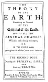

  
[Intangible Textual Heritage](../../index)  [Earth Mysteries](../index.md) 
[Index](index)  [Previous](ste15)  [Next](ste17.md) 

------------------------------------------------------------------------

p. 131

[  
Click to enlarge](img/title2.jpg.md)  
Title Page of Second Book  

##### THE

#### THEORY

###### OF THE

# EARTH:

##### Containing an Account

###### OF THE

### Original of the Earth

###### AND OF ALL THE

#### GENERAL CHANGES

##### Which it hath already undergone,

###### OR

###### IS TO UNDERGO

##### Throughout the whole Courƒe of its Duration.

## THE SECOND BOOK

#### *Concerning the* PRIMÆVAL EARTH,

###### AND

#### *Concerning* PARADISE.

#### LONDON,

#### Printed by R. Norton, for Walter Kettilby, at the Biƒhops-Head in S. Paul's Church-Yard, 1691.

------------------------------------------------------------------------

[Next: Chapter I](ste17.md)
