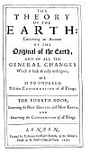

  
[Intangible Textual Heritage](../../index)  [Earth Mysteries](../index) 
[Index](index)  [Previous](ste44)  [Next](ste46) 

------------------------------------------------------------------------

p. 313

##### THE

#### THEORY

###### OF THE

# EARTH:

##### Containing an Account

###### OF THE

### Original of the Earth

###### AND OF ALL THE

#### GENERAL CHANGES

##### Which it hath already undergone,

###### OR

###### IS TO UNDERGO

##### Till the CONSUMMATION of all Things.

## THE FOURTH BOOK,

#### *Concerning the* NEW HEAVENS and NEW EARTH,

###### AND

#### *Concerning the* CONSUMMATION *of all Things*.

#### *LONDON*,

#### Printed by *R. Norton*, for *Walter Kettilby*, at the Biƒhops-Head in S. *Paul*'s Church-Yard, 1690.

[  
Click to enlarge](img/title4.jpg)  
Title Page, Book 4  

------------------------------------------------------------------------

[Next: Preface to the Reader](ste46)
