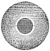

  
[Intangible Textual Heritage](../../index)  [Earth Mysteries](../index) 
[Index](index)  [Previous](ste47)  [Next](ste49) 

------------------------------------------------------------------------

### CHAPTER II

*The Birth of the new Heavens and the new Earth, from the second Chaos,
or the remains of the old World. The form, order, and qualities of the
new Earth, according to Reason and Scripture*.

HAVING prov’d from Scripture, that we are to expect *New Heavens*, and a
*New Earth*, after the Conflagration; it would be some pleasure and
satisfaction to see how this new Frame will arise: and what foundation
there is in Nature for the accomplishment of these promises. For, tho’
the Divine Power be not bound to all the Laws of Nature, but may
dispence with them when there is a necessity; yet it is an ease to us in
our belief, when we see them both conspire in the same effect. And in
order to this, we must consider in what posture we

p. 323

left the demolish’d World: what hopes there is of a Restauration. And we
are not to be discourag’d, because we see things at present wrapt up in
a confus’d Mass: for, according to the methods of Nature and Providence,
in that dark Womb usually are the seeds and rudiments of an
Embryo-World.

Neither is there, possibly, so great a confusion in this Mass, as we
imagine. The Heart and interiour Body of the Earth is still entire: and
that part of it that is consum’d by the fire, will be divided, of its
own accord, into two Regions.

[  
Click to enlarge](img/32300.jpg)  
Fig. 1  

\[paragraph continues\] What is dissolv’d and melted, being the
heaviest, will descend as low as it can: and cover and enclose the
kernel of the Earth round about, as a molten Sea or Abyss: according as
is explain’d and set down in the precedent Book. But what is more light
and volatile, will float in the Air: as fumes, Smoak, exhalations,
vapours of Water, and whatsoever terrestrial parts can be elevated and
supported

p. 324

by the strength of fire. These all mingled together, of different sizes,
figures, and motions, will constitute an opake Cloud, or thick region of
darkness round the Earth: So as the Globe of the Earth, with its
Atmosphere, after the Conflagration is finish’d, will stand in the form
represented in this Scheme.

Now as to the lower of these two regions, the region of melted matter,
A. A. we shall have little occasion to take notice of it: seeing it will
contribute nothing to the formation of the new World. But the upper
region, or all above that Orb of fire, is the true draught of a Chaos:
or a mixture and confusion of all the Elements, without order or
distinction. Here are particles of Earth, and of Air, and of Water, all
promiscuously jumbled together, by the force and agitation of the fire.
But when that force ceases, and every one is left to its own
inclination, they will, according to their different degrees of gravity,
separate and sort themselves after this manner. First, the heaviest and
grossest parts of the Earth will subside; then the watery parts will
follow; then a lighter sort of Earth; which will stop and rest upon the
Surface of the Water, and compose there a thin film or membrane; this
membrane or tender Orb is the first rudiment or foundation of a new
habitable Earth. For according as terrestrial parts fall upon it, from
all the regions and heighths of the Atmosphere, or of the Chaos, this
Orb will grow more firm, strong, and immoveable: able to support it self
and Inhabitants too. And having in it all the Principles of a fruitful
Soil, whether for the production of Plants or of Animals, it will want
no property or character of an habitable Earth. And particularly, will
become such an Earth, and of such a form, as the first Paradisiacal
Earth was. Which hath been fully describ’d in the first and second Books
of this Theory.

There is no occasion of examining more accurately the formation of this
Second Earth, seeing it is so much the same with that of the First;
which is set down fully and distinctly in the 5*th* Chapter of the first
Book of this Theory. Nature here repeats the same work, and in the same
method; onely the materials are now a little more refin’d and purg’d by
the fire. They both rise out of a Chaos, and That, in effect, the same
in both cases; For though in forming the first Earth, I suppos’d the
Chaos or confus’d Mass to reach down to the Center, I did that onely for
the ease of our imagination; that so the whole Mass might appear more
simple and uniform. But in reality, that Chaos had a solid kernel of
Earth within, as this hath; and that matter which fluctuated above in
the regions of the Air, was the true Chaos, whose parts, when they came
to a separation, made the several Elements, and the form of an habitable
Earth betwixt the Air and Water. This Chaos upon separation, will fall
into the same form and Elements: and so in like manner create or
constitute a second Paradisiacal World.

I say a *Paradisiacal* World: For it appears plainly, that this
new-form’d Earth must agree with that Primigenial Earth, in the two
principal and fundamental properties. First, It is of an even, entire,
uniform and regular Surface, without Mountains or Sea. Secondly, That it
hath a straight and regular situation to the Sun, and the *Axis* of the
*Ecliptick*. From the manner of its formation, it appears manifestly,
that it must be of an even and regular Surface. For the Orb of liquid
fire, upon which the first descent was made, being smooth and uniform
every

p. 325

where, the matter that fell upon it would take the same form and mould.
And so the second or third Region, that were superinduc’d, would still
imitate the fashion of the first: there being no cause or occasion of
any inequality. Then as to the situation of its *Axis*, this uniformity
of figure would determine the center of its gravity to be exactly in the
middle, and consequently there would be no inclination of one Pole more
than another to the general center of its motion; But, upon a free
libration in the liquid Air, its *Axis* would lie parallel with the
*Axis* of the Ecliptick where it moves. But these things having been
deduc’d more fully in the second Book about *Paradise* and *the
Primigenial Earth*, they need no further explication in this place.

If Scripture had left us several distinct Characters of the *New
Heavens*, and the *New Earth*, we might, by compare with those, have
made a full proof of our Hypothesis. One indeed St. *John* hath left us
in very express terms, *There was no Sea there*, He says. His words are
these: *And I saw a New Heaven, and a New Earth: for the first Heaven
and the first Earth were passed away; AND THERE WAS NO MORE SEA*. This
character is very particular, and you see it exactly answers to our
Hypothesis: for in the new-form’d Earth, the Sea is cover’d and
inconspicuous: being an Abyss, not a Sea, and wholly lodg’d in the Womb
of the Earth. And this one Character, being inexplicable upon any other
supposition, and very different from the present Earth, makes it a
strong presumption that we have hit upon the true model of the New
Heavens and New Earth which St. *John* saw.

To this sight of the New Heavens and New Earth, St. *John* immediately
subjoyns the sight of the *New Jerusalem*, *ver*. 2. as being
contemporary, and in some respects the same thing. ’Tis true, the
Characters of the New *Jerusalem* in these two last Chapters of the
*Apocalypse*, are very hard to be understood: some of them being
incompetible to a *Terrestrial* state, and some of them to a
*Celestial*; so as it seems to me very reasonable to suppose, that the
New *Jerusalem* spoken of by St. *John*, is twofold: That which he saw
himself, *ver*. 2. and that which the Angel shewed him afterwards,
*ver*. 9. For I do not see what need there was of an *Angel*, and of
*taking him up into a great and high mountain*, only to shew him that
which he had seen before, at the foot of the Mountain. However we are to
consider in this place the Terrestrial New *Jerusalem* only, or that
which is in the New Heavens and New Earth. And as St. *John* hath joyned
these two together, so the Prophet *Isaiah*ch.
65. 17, 18. had done the same thing before; when he had promised
*new Heavens and a new Earth*, he calls them, under another name,
*Jerusalem:* and they both use the same character in effect, in the
description of their *Jerusalem*. *Isaiah* says,ver. 19. *And I will rejoyce in Jerusalem, and
joy in my people: and the voice of weeping shall be no more heard in
her, nor the voice of crying*. St. *John**Apoc*.
21. 3, 4. says also in his Jerusalem, *God shall dwell with them,
and they shall be his people: And he shall wipe away all tears from
their eyes: and there shall be no more death, neither sorrow, nor
crying, neither shall there be any more pain*. Now in both these
Prophets, when they treat upon this subject, we find they make frequent
allusions to Paradise and a Paradisiacal state; so as that may be justly
taken as a Scripture-Character of the *New Heavens and the New Earth*.
The Prophet *Isaiah* seems

p. 326

plainly to point at a Paradisiacal state, throughout that Chapter, by an
universal innocency, and harmlessness of animals; and peace, plenty,
health, longævity or immortality of the inhabitants. St. *John**ch*. 21. & *ch*. 22. also hath several
allusions to Paradise, in those two Chapters where he describes the New
Jerusalem. And in his discourse to the seven Churches, in one place (ch.
2. 7.) *To him that overcometh is promised to eat of the tree of life,
which is in the midst of the Paradise of God*. And in another place (ch.
3. 12.) *to him that overcometh* is promised, *to have the name of the
New Jerusalem writ upon him*. These I take to be the same thing, and the
same reward of Christian Victors, The *New Jerusalem* or the New Heavens
and New Earth, and the *Paradise of God*. Now this being the general
Character of the New Earth, That it is *Paradisiacal*: and the
particular Character, That it *hath no Sea*: and both these agreeing
with our Hypothesis, as apparently deducible from those principles and
that manner of its formation which we have set down: We cannot but
allow, that the Holy Scriptures and the Natural Theory agree in their
Testimony, as to the conditions and properties of the *New Heavens and
New Earth*.

From what hath been said in this and the precedent Chapter, it will not
be hard to interpret what St. *Paul* meant by his *Habitable Earth to
come:* [1](#fn_16) which is to be subjected to
our Saviour and not to the Angels. In the second chapter to the
*Hebrews*, ver. 5. he says, *For unto the Angels hath he not put in
subjection the WORLD TO COME:* So we read it, but, according to the
strictest and plainest Translation, it should be *The habitable Earth to
come*. Now what Earth is this, where our Saviour is absolute Soveraign:
and where the Government is neither Humane, nor Angelical, but
peculiarly Theocratical? In the first place, this cannot be the present
World or the present Earth, because the Apostle calls it *Future*, or
the *Earth to come*. Nor can it be understood of the days of the Gospel:
seeing the Apostle acknowledges, ver. 8. that this subjection, whereof
he speaks, is not yet made. And seeing Antichrist will not finally be
destroy’d till the appearance of our Saviour, (2 *Thess*. 2. 8.) nor
Satan bound, while Antichrist is in power: during the reign of these
two, *Ephes*. 6. 12.(who are the Rulers of
the darkness of the World) our Saviour cannot properly be said to begin
his reign here. ’Tis true, He exercises his Providence over his Church,
and secures it from being destroy'd: He can, by a power paramount, stop
the rage either of Satan or Antichrist; *Hitherto shall you go and no
further*. As sometimes when he was upon Earth, he exerted a Divine
Power, which yet did not destroy his state of Humiliation; so he
interposes now when he thinks fit, but he does not finally take the
power out of the hands of his Enemies, nor out of the hands of the Kings
of the Earth. *The Kingdom is not deliver’d up to him*, and all
dominion, and power; that *all Tongues and Nations should serve him*.
For St. *Paul**ch*. 7. 13, 25, 26. *Hebr*. 2.
8. can mean no less in this place than that Kingdom in *Daniel:*
Seeing he calls it *putting all things in subjection under his feet*,
and says that it is not yet done. Upon this account also, as well as
others, our Saviour might truly say to *Pilate* (*Joh*. 18. 36.) *my
kingdom is not of this World*. And to his Disciples, *The Son of man
came not to be ministred unto, but to minister*, *Matt*. 20. 28. When he
comes to receive his Kingdom, he comes in the clouds of Heaven (*Dan*.
7. 13, 14.) not in the womb of a Virgin. He comes

p. 327

with the equipage of a King and Conqueror; with thousands and ten
thousands of Angels: not in the form of a Servant, or of a weak Infant;
as he did at his first coming.

Neither can this *World to com*e, or this *Earth to come*, be understood
of the Kingdom of Heaven. For the Greek word will not bear that sence,
nor is it ever us’d in Scripture for *Heaven*, Besides, the Kingdom of
Heaven, when spoken of as *future*, is not properly till the last
resurrection and final judgment. Whereas *This World to come*, which our
Saviour is to govern, must be before that time, and will then expire.
For all his Government, as to this World, expires at the day of
Judgment, and1 *Cor*. 15. 24, *&c*. *he
will then deliver up the kingdom into the hands of his father: that he
may be all in all*. Having reigned first himself, and *put down all rule
and all authority and power*. So that St. *Paul*, in these two places of
his Epistles, refers plainly to the same time and the same reign of
Christ: which must be in a *future World*, and before the *day of
Judgment*: and therefore according to our deductions, in the New Heavens
and the New Earth.

------------------------------------------------------------------------

### Footnotes

[326:1](ste48.htm#fr_16) Τὴν οἰκουμένην τ῎
μέλλουσαν πατὴρ τοῦ μέλλονος ἀιῶνος *Isa*. 9. 6.

------------------------------------------------------------------------

[Next: Chapter III](ste49)
