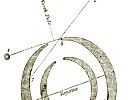

  
[Intangible Textual Heritage](../../index)  [Earth Mysteries](../index) 
[Utopia](../../utopia/index)  [Index](index)  [Next](sym01) 

------------------------------------------------------------------------

  
*Symzonia; Voyage of Discovery*, by Adam Seaborn (pseud. John Cleves
Symmes?), \[1820\], at Intangible Textual Heritage

------------------------------------------------------------------------

p. i

# SYMZONIA;

## VOYAGE OF DISCOVERY

### BY CAPTAIN ADAM SEABORN

###### PSEUDONYM OF JOHN CLEVES SYMMES?

#### NEW-YORK:

#### PRINTED BY J. SEYMOUR, 49 JOHN-STREET.

#### \[1820\]

Scanned, proofed and formatted by John Bruno Hare at Intangible Textual
Heritage, December 2008. This text is in the public domain in the US
because it was published prior to 1923.

  [  
Click to enlarge](img/title.jpg)  
Original Title Page  

p. ii

<table data-border="0" width="50%">
<colgroup>
<col style="width: 100%" />
</colgroup>
<tbody>
<tr class="odd">
<td data-valign="top" width="655"><em>Southern District of New-York, ss</em>.

<table data-align="LEFT">
<tbody>
<tr class="odd">
<td data-valign="CENTER"></td>
</tr>
</tbody>
</table>
E IT REMEMBERED, that on the second day of November, in the forty-fifth year of the Independence of the United States of America, Jonathan Seymour, of the said District, hath deposited in this office the title of a book, the right whereof he claims as proprietor, in the words following, to wit:

"Symzonia; a Voyage of Discovery. By Captain Adam Seaborn."

in conformity to the Act of the Congress of the United States, entitled "An Act for the encouragement of Learning, by securing the Copies of Maps, Charts, and Books, to the authors and proprietors of such copies, during the time therein mentioned" And also to an Act, entitled "an Act, supplementary to an Act, entitled an Act for the encouragement of Learning, by securing the copies of Maps, Charts, and Books, to the authors and proprietors of such copies, during the times therein mentioned, and extending the benefits thereof to the arts of designing, engraving, and etching historical and other prints."

GILBERT LIVINGSTON THOMPSON,         
<em>Clerk of the Southern District of New-York</em>
</td>
</tr>
</tbody>
</table>

------------------------------------------------------------------------

[Next: Sectional View of the Earth Showing the Openings at the
Poles](sym01)
