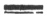

  
[Intangible Textual Heritage](../../index)  [Earth Mysteries](../index.md) 
[Utopia](../../utopia/index)  [Index](index)  [Previous](sym01.md) 
[Next](sym03.md) 

------------------------------------------------------------------------

  
*Symzonia; Voyage of Discovery*, by Adam Seaborn (pseud. John Cleves
Symmes?), \[1820\], at Intangible Textual Heritage

------------------------------------------------------------------------

p. vi

 

 

The Author of this work, and of the
discoveries which it relates, leaves it to his readers to decide whether
he excels most as a navigator or a writer, aid whether he amuses as much
as he instructs. If he has any professional vanity, arising from his
enterprises upon the sea, it does not tempt him to conceal that, in the
achievements here recorded, he availed himself of all the lights and
facilities afforded by the sublime theory of an internal world,
published by Captain John Cleve Symmes,
and by the application of steam to the navigation of vessels, for which
the world is indebted to Fulton. Far from
coveting what does not belong

p. vii

to himself, he feels, after having discovered and explored a world
before unknown, that he can well afford to bestow on others the praise
to which they are entitled. He has one consolation, in which he is
confident of the sympathy of those who wish him well; namely, that if
the book is not bought and read, it will not be because it is not an
American book. He gives notice that he has no intention to relinquish
his right to the invention of oblique paddles for steam ships, though
the circumstances narrated at the close of the volume hinder him from
taking out a patent at present.

------------------------------------------------------------------------

[Next: Contents](sym03.md)
