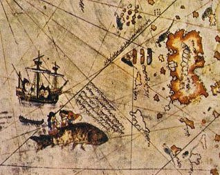

  
[Intangible Textual Heritage](../../index)  [Earth Mysteries](../index.md) 

------------------------------------------------------------------------

[Buy this Book at
Amazon.com](https://www.amazon.com/exec/obidos/ASIN/1589636589/internetsacredte.md)

------------------------------------------------------------------------

<table width="75%">
<colgroup>
<col style="width: 50%" />
<col style="width: 50%" />
</colgroup>
<tbody>
<tr class="odd">
<td width="50%" data-valign="TOP"> 
</td>
<td width="50%" data-valign="TOP"><h1 id="tales-of-the-enchanted-islands-of-the-atlantic" data-align="CENTER">Tales of the Enchanted Islands of the Atlantic</h1>
<h2 id="by-thomas-wentworth-higginson" data-align="CENTER">by Thomas Wentworth Higginson</h2>
<h4 id="section" data-align="CENTER">[1898]</h4></td>
</tr>
</tbody>
</table>

------------------------------------------------------------------------

|                                                                                                                           |
|---------------------------------------------------------------------------------------------------------------------------|
|  |

It is today considered possible that there was sporadic contact between
Europe and North America as early as the Ice Ages. Before the European
voyages to the New World of the ages of discovery there were tales of
islands far out in the 'world ocean.' Whether these reflected
pre-Columbian knowledge of the Americas or were just the human impulse
to fill in the blanks is still up for debate.

This book covers many of the best-known (and some lesser-known) legends,
from Atlantis, the Irish voyages of Bran, Maelduin and St. Brendan, the
elusive Antillia and the Fountain of Youth which the Spanish sought, and
the mysterious city of Norumbega. Rounding out the book is a mass of
scholarly notes which identify the sources of each tale.

The author, Thomas Wentworth Higginson, was a 19th century Massachusetts
author. A Harvard graduate, he distinguished himself during the civil
war period both as an early abolitionist and an officer in the Union
army who commanded a regiment of former slaves.

------------------------------------------------------------------------

[Title Page](teia00.md)  
[Preface](teia01.md)  
[Contents](teia02.md)  
[List of Illustrations](teia03.md)  
[I. The Story of Atlantis](teia04.md)  
[II. Taliessin of the Radiant Brow](teia05.md)  
[III. The Swan-Children of Lir](teia06.md)  
[IV. Usheen in the Island of Youth](teia07.md)  
[V. Bran the Blessed](teia08.md)  
[VI. The Castle of the Active Door](teia09.md)  
[VII. Merlin the Enchanter](teia10.md)  
[VIII. Sir Lancelot of the Lake](teia11.md)  
[IX. The Half-Man](teia12.md)  
[X. King Arthur at Avalon](teia13.md)  
[XI. Maelduin's Voyage](teia14.md)  
[XII. The Voyage of St. Brandan](teia15.md)  
[XIII. Kirwan's Search For Hy-Brasail](teia16.md)  
[XIV. The Isle of Satan's Hand](teia17.md)  
[XV. Antillia, the Island of the Seven Cities](teia18.md)  
[XVI. Harald The Viking](teia19.md)  
[XVII. The Search For Norumbega](teia20.md)  
[XVIII. The Guardians of the St. Lawrence](teia21.md)  
[XIX. The Island of Demons](teia22.md)  
[XX. Bimini and the Fountain of Youth](teia23.md)  
[Notes](teia24.md)  
