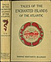
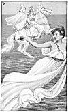
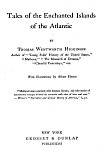
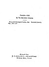

  
[Intangible Textual Heritage](../../index)  [Earth Mysteries](../index.md) 
[Index](index)  [Next](teia01.md) 

------------------------------------------------------------------------

[Buy this Book at
Amazon.com](https://www.amazon.com/exec/obidos/ASIN/1589636589/internetsacredte.md)

------------------------------------------------------------------------

# Tales of the Enchanted Islands of the Atlantic

###### BY

## THOMAS WENTWORTH HIGGINSON

### Author of "Young Folks' History of the United States," "Malbone," "The Monarch of Dreams," "Cheerful Yesterdays," etc.

#### With Illustrations by Albert Herter

"Mediæval maps swarmed with fabulous islands; and wild stories of
adventurous voyages divided the attention with tales of love and
war."--*Winsor's* "*Narrative and Critical History of America*," I, 31.

#### NEW YORK

#### GROSSET & DUNLAP

#### PUBLISHERS

#### \[1898\]

[  
Click to enlarge](img/cover.jpg.md)  
Cover and Spine  

[  
Click to enlarge](img/front.jpg.md)  
Frontispiece:  

[  
Click to enlarge](img/title.jpg.md)  
Title Page  

[  
Click to enlarge](img/verso.jpg.md)  
Verso  

Proofed and formatted at Intangible Textual Heritage, February 2006 by
John Bruno Hare, based on an etext prepared for Project Gutenberg
(pagination, illustrations and formatting added at Intangible Textual
Heritage). This text is in the public domain in the United States
because it was published prior to January 1st, 1923. These files may be
used for any non-commercial purpose provided this notice of attribution
is left intact in all copies.

p. v

TO

General Sir George Wentworth Higginson, K. C. B.

*Gyldernscroft, Marlow, England*

\_\_\_\_\_\_\_\_\_\_\_\_\_\_\_\_\_\_\_\_\_\_\_

THIS BOOK IS INSCRIBED, IN TOKEN OF KINDRED AND OF OLD FAMILY
FRIENDSHIPS, CORDIALLY PRESERVED INTO THE PRESENT GENERATION

\_\_\_\_\_\_\_\_\_\_\_\_\_\_\_\_\_\_\_\_\_\_\_

THESE LEGENDS UNITE THE TWO SIDES OF THE ATLANTIC AND FORM A PART OF THE
COMMON HERITAGE OF THE ENGLISH-SPEAKING RACE

------------------------------------------------------------------------

[Next: Preface](teia01.md)
