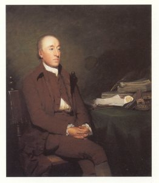

  
[Intangible Textual Heritage](../../index)  [Earth](../index) 

------------------------------------------------------------------------

<table width="75%">
<colgroup>
<col style="width: 50%" />
<col style="width: 50%" />
</colgroup>
<tbody>
<tr class="odd">
<td width="50%" data-valign="TOP"></td>
<td width="50%" data-valign="CENTER"><h1 id="theory-of-the-earth" data-align="CENTER">Theory of the Earth</h1>
<h2 id="by-james-hutton" data-align="CENTER">by James Hutton</h2>
<h4 id="and-1795" data-align="CENTER">[1788 and 1795]</h4></td>
</tr>
</tbody>
</table>

------------------------------------------------------------------------

[Contents](#contents)    [Start Reading](toe00)

James Hutton (1726-1797) is considered the father of modern geology.
Although less well known than [Darwin](../../aor/darwin/index), Hutton's
theory is one of the cornerstones of the modern rationalist view of the
world. Hutton was one of the first scientists to propose that the Earth
is extremely old, much older than the few thousand years that a literal
reading of Genesis would indicate. This caused a furour much like
Darwin's [Origin of Species](../../aor/darwin/origin/index) when it was
first released.

Leonardo Da Vinci had privately speculated about this two centuries
earlier in his [notebooks](../../aor/dv/index), noting the presence of
marine fossils on the top of mountains, and estimating the huge amount
of time it would take to carve out river valleys. But Hutton was the
first to reject the 'Neptunian' theory of his day which saw a universal
deluge (presumably, the Noachian flood) as the source of geological
formation. Instead he proposed a 'Vulcanian' theory, in which processes
of heat from the earth's interior had built up continents and mountains
over a long period of time.

In later times this became couched in terms of 'Catastrophism' versus
'Gradualism,' with the gradualists eventually winning out. This is why
conventional geologists reject ideas such as
[Atlantis](../../atl/index), Lemuria, or pole shifts out of hand,
working from first principles. However, 21st century geologists have
become less prickly about the occasional catastrophic event, such as the
Oregon Scablands, which were formed when a glacial dam broke at the end
of the ice ages.

The two texts provided here are his 1788 paper Theory of the Earth, read
before the Royal Society of Edinburgh, and the two extant volumes of his
1795 book of the same name in which he not only elaborated his views but
defended them against the bitter criticism that had been leveled against
him in the interim. Although his books, filled with long quotes in
French, make difficult reading, Hutton deserves to be better known as
one of the makers of the modern view of the Earth.

The third volume is available in [image format from Google
Books](https://books.google.com/books?vid=OCLC42663407&id=tMcQAAAAIAAJ).

------------------------------------------------------------------------

 

### Theory of the Earth \[1788\]

[Title Page](toe00)  
[Plates](toe01)  
[Part I. Prospect of the Subject to be treated of.](toe02)  
[Part II. An Investigation of the Natural Operations employed in
consolidating the Strata of the Globe](toe03)  
[Part III. Investigation of the Natural Operations employed in the
Production of Land above the Surface of the Sea](toe04)  
[Part IV. System of Decay and Renovation observed in the Earth](toe05)  

### Theory of the Earth \[1795\], Volume I

[Title Page](toe06)  
[Plates](toe07)  
[Contents](toe08)  

### Chapter I

[Section I Prospect of the Subject to be treated of](toe09)  
[Section II. An Investigation of the Natural Operations employed in
consolidating the Strata of the Globe](toe10)  
[Section III. Investigation of the Natural Operations employed in the
Production of Land above the Surface of the Sea](toe11)  
[Section IV. System of Decay and Renovation observed in the
Earth](toe12)  

 

[Chapter II. An Examination of Mr KIRWAN'S Objections to the Igneous
Origin of Stony Substances](toe13)  
[Chapter III. Of Physical Systems, and Geological Theories, in
general](toe14)  
[Chapter IV. The Supposition of Primitive Mountains refuted](toe15)  
[Chapter V. Concerning that which may be termed the Primary Part of the
Present Earth](toe16)  

### Chapter VI.

[Section I. A distinct View of the Primary and Secondary
Strata](toe17)  
[Section II. The Theory confirmed from Observations made on purpose to
elucidate the subject](toe18)  

 

[Chapter VII. Opinions examined with regard to Petrifaction, or Mineral
Concretion](toe19)  

### Chapter VIII

[Section I. Purpose of this Inquiry](toe20)  
[Section III. The Mineralogical Operations of the Earth illustrated from
the Theory of Fossil Coal](toe21)  

### Theory of the Earth \[1795\], Vol. II

[Title Page](toe22)  
[Contents](toe23)  
[Introduction](toe24)  
[Chapter I. Facts in confirmation of the Theory of Elevating Land above
the Surface of the Sea](toe25)  
[Chapter II. The same Subject continued, with examples from different
Countries](toe26)  
[Chapter III. Facts in confirmation of the Theory, respecting those
Operations which re-dissolve the Surface of the Earth](toe27)  
[Chapter IV. The same Subject continued, in giving still farther Views
of the Dissolution of the Earth](toe28)  
[Chapter V. Facts in confirmation of the Theory respecting the
Operations of the Earth employed in forming Soil for Plants](toe29)  
[Chapter VI. A View of the Economy of Nature, and necessity of Wasting
the Surface of the Earth, in serving the purposes of this
World](toe30)  
[Chapter VII. The Same Subject continued, in giving a View of the
Operations of Air and Water upon the Surface of the Land](toe31)  
[Chapter VIII. The present Form of the Surface of the Earth explained,
with a View of the Operation of Time upon our Land](toe32)  
[Chapter IX. The Theory Illustrated, with a View of the Summits of the
Alps](toe33)  
[Chapter X. The Theory illustrated with a view of the Valleys of the
Alps](toe34)  
[Chapter XI. Facts and Opinions concerning the Natural Construction of
Mountains and Valleys](toe35)  
[Chapter XII. The Theory illustrated, by adducing examples from the
different Quarters of the Globe](toe36)  
[Chapter XIII. The same Subject continued](toe37)  
[Chapter XIV. Summary of the Doctrine which has been now
Illustrated](toe38)  
