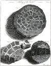
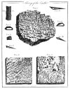

  
[Intangible Textual Heritage](../../index)  [Earth](../index) 
[Index](index)  [Previous](toe00)  [Next](toe02) 

------------------------------------------------------------------------

*Theory of the Earth*, by James Hutton, \[1788 and 1795\], at Intangible
Textual Heritage

------------------------------------------------------------------------

 

### THEORY OF THE EARTH: PLATES

 

[  
Click to enlarge](img/pl01.jpg)  
Plate I  

 

[  
Click to enlarge](img/pl02.jpg)  
Plate II  

 

 

------------------------------------------------------------------------

[Next: Part I. Prospect of the Subject to be treated of.](toe02)
