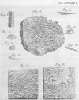
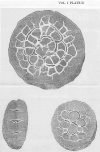
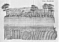
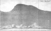

  
[Intangible Textual Heritage](../../index)  [Earth](../index) 
[Index](index)  [Previous](toe06)  [Next](toe08) 

------------------------------------------------------------------------

*Theory of the Earth*, by James Hutton, \[1788 and 1795\], at Intangible
Textual Heritage

------------------------------------------------------------------------

[  
Click to enlarge](img/v1pl01.jpg)  
Plate 1  

[  
Click to enlarge](img/v1pl02.jpg)  
Plate 2  

[  
Click to enlarge](img/v1pl03.jpg)  
Plate 3  

[  
Click to enlarge](img/v1pl04.jpg)  
Plate 4  

------------------------------------------------------------------------

[Next: Contents](toe08)
