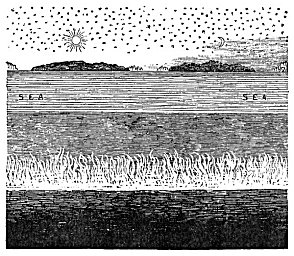

  
[Intangible Textual Heritage](../../index)  [Earth Mysteries](../index.md) 

------------------------------------------------------------------------

[Buy this Book at
Amazon.com](https://www.amazon.com/exec/obidos/ASIN/0766149455/internetsacredte.md)

------------------------------------------------------------------------

<table width="75%">
<colgroup>
<col style="width: 50%" />
<col style="width: 50%" />
</colgroup>
<tbody>
<tr class="odd">
<td width="50%" data-valign="TOP"> 
Flat Earth (Public Domain Image)</td>
<td width="50%" data-valign="CENTER"><h3 id="zetetic-astronomy" data-align="CENTER">Zetetic Astronomy</h3>
<h1 id="earth-not-a-globe" data-align="CENTER">Earth Not a Globe</h1>
<h3 id="by-parallax-samuel-birley-rowbotham" data-align="CENTER">by Parallax (Samuel Birley Rowbotham)</h3>
<h4 id="section" data-align="CENTER">[1881]</h4></td>
</tr>
</tbody>
</table>

------------------------------------------------------------------------

[Contents](#contents)    [Start Reading](za00.md)    [Page
Index](pageidx)    [Text \[Zipped\]](zatxt.zip.md)  

------------------------------------------------------------------------

|                                                                                                                           |
|---------------------------------------------------------------------------------------------------------------------------|
|  |

Samuel Birley Rowbotham, under the pseudonym 'Parallax', lectured for
two decades up and down Britain promoting his unique flat earth theory.
This book, in which he lays out his world system, went through three
editions, starting with a 16 page pamphlet published in 1849 and a
second edition of 221 pages published in 1865. The third edition of 1881
(which had inflated to 430 pages) was used as the basis of this etext.

Rowbotham was an accomplished debater who reputedly steamrollered all
opponents, and his followers, who included many well-educated people,
were equally tenacious. One of them, John Hampden, got involved in a bet
with the famous naturalist Alfred Russel Wallace about the flat earth.
An experiment which Hampden proposed didn't resolve the issue, and the
two ended up in court in 1876. The judge ruled against Hampton, who
started a long campaign of legal harassment of Wallace. Rowbotham hints
at the incident in this book.

Rowbotham believed that the earth is flat. The contients float on an
infinite ocean which somehow has a layer of fire underneath it. The
lands we know are surrounded by an infinite wilderness of ice and snow,
beyond the Antarctic ocean, bordered by an immense circular ice-cliff.
What we call the North Pole is in the center of the earth.

The polar projection of the flat earth creates obvious discrepancies
with known geography, particularly the farther south you go. [Figure
54](img/fig54.jpg.md) inadvertantly illustrates this problem. The Zetetic
map has a severly squashed South America and Africa, and Australia and
New Zealand in the middle of the Pacific. I think that by the 19th
century people would have noticed if Australia and Africa were thousands
of miles further apart than expected, let alone if Africa was wider than
it was long!

The Zetetic Sun, moon, planets and stars are all only a few hundred
miles above the surface of the earth. The sun orbits the north pole once
a day at a constant altitude. The moon is both self-illuminated and
semi-transparent. Eclipses can be explained by some unknown object
occulting the sun or moon. Zetetic cosmology is 'faith-based', based,
that is, on a literal interpretation of *selected* Biblical quotes. Hell
is exactly as advertised, directly below us. Heaven is not a state of
mind, it is a real place, somewhere above us. He uses Ussherian Biblical
chronology to mock the concept that stars could be millions of light
years away. He attacks the concept of a plurality of worlds because no
other world than this one is mentioned in the Bible.

Rowbotham never adequately explains his alternative astronomy. If the
Copernican theory so adequately explains planetary motions, why discard
it, and what would he use in its place? What is the sun orbiting around
once a day and how does it work like a spotlight, not a 'point source'?
If the moon is self-luminous, what creates its phases? If gravity
appears to work here on earth, why doesn't it apply to the celestial
objects just a few hundred miles up?

To make his system work he had to throw out a great deal of science,
including the scientific method itself, using instead what he calls a
'Zetetic' method. As far as I can see this is simply a license to employ
circular reasoning (*e.g.*, the earth is flat, hence we can see distant
lighthouses, hence the earth is flat).

Zetetic Astronomy is a key work of flat-earth thought, just as
Donnelly's [Atlantis, the Antediluvian World](../../atl/ataw/index.md) is
still considered required reading on the subject of Atlantis. If you
ever have to debate the flat earth *pro* or *con*, this book is a
complete agenda of each point that you'll have to argue.

*--John Bruno Hare, June 16th, 2005.*

------------------------------------------------------------------------

 [Title Page](za00.md)  
[Preface to the Second Edition](za01.md)  
[Contents](za02.md)  
[List of Diagrams](za03.md)  
[Chapter I. Zetetic and Theoretic Defined and Compared](za04.md)  

### Chapter II. Experiments Demonstrating the True Form of Standing Water, and Proving the Earth to be a Plane

[Introduction](za05.md)  
[Experiment 1](za06.md)  
[Experiment 2](za07.md)  
[Experiment 3](za08.md)  
[Experiment 4](za09.md)  
[Experiment 5](za10.md)  
[Experiment 6](za11.md)  
[Experiment 7](za12.md)  
[Experiment 8](za13.md)  
[Experiment 9](za14.md)  
[Experiment 10](za15.md)  
[Experiment 11](za16.md)  
[Experiment 12](za17.md)  
[Experiment 13](za18.md)  
[Experiment 14](za19.md)  
[Experiment 15](za20.md)  

 

[Chapter III. The Earth No Axial or Orbital Motion](za21.md)  
[Chapter IV. The True Form and Magnitude of the Earth](za22.md)  
[Chapter V. The True Distance of the Sun](za23.md)  
[Chapter VI. The Sun's Motion, Concentric With the Polar Centre](za24.md)  
[Chapter VII. The Sun's Path Expands and Contracts Daily for Six Months
Alternately](za25.md)  
[Chapter VIII. Cause of Day and Night, Winter and Summer; and the Long
Alternations of Light and Darkness at the Northern Centre](za26.md)  
[Chapter IX. Cause Of Sunrise And Sunset.](za27.md)  
[Chapter X. Cause of Sun Appearing Larger When Rising and Setting Than
at Noonday](za28.md)  
[Chapter XI. Cause of Solar and Lunar Eclipses](za29.md)  
[Chapter XII. The Cause of Tides](za30.md)  
[Chapter XIII. The Earth's True Position in the Universe; Comparatively
Recent Formation; Present Chemical Condition; and Approaching
Destruction by Fire](za31.md)  

### Chapter XIV. Examination of the So-Called ''Proofs'' of the Earth's Rotundity

[Why a Ship's Hull Disappears Before the Mast-Head](za32.md)  
[Perspective on the Sea](za33.md)  
[On the Dimensions of Ocean Waves](za34.md)  
[How The Earth Is Circumnavigated](za35.md)  
[Loss of Time on Sailing Westward](za36.md)  
[Declination of the Pole Star](za37.md)  
[The ''Dip Sector.''](za38.md)  
[Variability of Pendulum Vibrations](za39.md)  
[Arcs of the Meridian](za40.md)  
[Sphericity Inevitable From Semi-Fluidity](za41.md)  
[Degrees of Longitude](za42.md)  
[''Spherical Excess''](za43.md)  
[Theodolite Tangent](za44.md)  
[Tangential Horizon](za45.md)  
[Stations and Distances](za46.md)  
[Great Circle Sailing](za47.md)  
[Motion of Stars North and South](za48.md)  
[Continued Daylight in the Extreme South](za49.md)  
[Analogy in Favour of Rotundity](za50.md)  
[Lunar Eclipse a Proof of Rotundity](za51.md)  
[The Supposed Manifestation of the Rotation of the Earth](za52.md)  
[Railways, and ''Earth's Centrifugal Force''](za53.md)  
[Deflection of Falling Bodies](za54.md)  
[Goose Roasting by Revolving Fire](za55.md)  
[Difference in Solar and Sidereal Times](za56.md)  
[Stations and Retrogradation of Planets](za57.md)  
[Transmission of Light](za58.md)  
[Precession of the Equinoxes](za59.md)  
[The Planet Neptune](za60.md)  
[Moon's Phases](za61.md)  
[Moon's Appearance](za62.md)  
[Moon Transparent](za63.md)  
[Shadows on the Moon](za64.md)  
[Conclusion](za65.md)  

 

[Chapter XV. General Summary--Application--Cui Bono](za66.md)  
[''Parallax'' and his Teachings: Opinions of the Press](za67.md)  
[General Index](za68.md)  
[List of Works, Newspapers, Periodicals, Published Correspondence, and
Scripture Texts Referred to or Quoted From](za69.md)  
