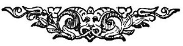

  
[Intangible Textual Heritage](../../index)  [Earth Mysteries](../index) 
[Index](index)  [Previous](za02)  [Next](za04) 

------------------------------------------------------------------------

[Buy this Book at
Amazon.com](https://www.amazon.com/exec/obidos/ASIN/0766149455/internetsacredte)

------------------------------------------------------------------------

  
*Zetetic Astronomy*, by 'Parallax' (pseud. Samuel Birley Rowbotham),
\[1881\], at Intangible Textual Heritage

------------------------------------------------------------------------

p. ix

# LIST OF DIAGRAMS.

|                                                                                                                                                                                                                        |                                 |
|------------------------------------------------------------------------------------------------------------------------------------------------------------------------------------------------------------------------|---------------------------------|
| FIG.                                                                                                                                                                                        | PAGE |
| 1.--Showing that if the earth is a globe every part of the surface of standing water must be an arc of a circle                                                                                                        | [9](za05.htm#page_9)            |
| 2.--Showing that if the earth is a globe the surface of six miles length of water would be six feet higher in the centre than at the two extremities                                                                   | [12](za06.htm#page_12)          |
| 3.--Showing that by an experiment made on the "Old Bedford," the surface of water for six miles was not convex but horizontal                                                                                          | [13](za06.htm#page_13)          |
| 4.--Showing by an experiment made with six flags placed one statute mile from each other, along the edge of the water, that the surface of the water was absolutely horizontal                                         | [13](za06.htm#page_13)          |
| 5.--Showing the form the six flags must represent if the earth is a globe                                                                                                                                              | [14](za07.htm#page_14)          |
| 6.--Explaining a strange phenomenon                                                                                                                                                                                    | [16](za07.htm#page_16)          |
| 7.--Representing an experiment with a theodolite between Welney Bridge and Old Bedford Bridge                                                                                                                          | [17](za07.htm#page_17)          |
| 8.--Ditto                                                                                                                                                                                                              | [17](za07.htm#page_17)          |
| 9.--Describing the "forward process of levelling"                                                                                                                                                                      | [18](za09.htm#page_18)          |
| 10.--Ditto                                                                                                                                                                                                             | [19](za09.htm#page_19)          |
| 11.--Ditto                                                                                                                                                                                                             | [20](za09.htm#page_20)          |
| 12.--Experiments with telescope at Old Bedford Sluice Bridge in 1870                                                                                                                                                   | [21](za09.htm#page_21)          |
| 13.--Ditto                                                                                                                                                                                                             | [22](za10.htm#page_22)          |
| 14.--Showing that the water between the Western Pier at Brighton and the Pier at Worthing is horizontal throughout the whole length of ten miles                                                                       | [23](za11.htm#page_23)          |
| 15.--Showing that if the earth is a globe it would be higher in the centre than at either extremity                                                                                                                    | [23](za11.htm#page_23)          |
| 16.--Appearance of the sea horizon                                                                                                                                                                                     | [24](za11.htm#page_24)          |
| 17.--How to prove the sea horizon to be straight                                                                                                                                                                       | [24](za11.htm#page_24)          |
| 18.--Showing how the sea horizon must gradually decline from the centre if the earth is a globe                                                                                                                        | [25](za12.htm#page_25)          |
| 19.--The true form of the sea horizon determined by the cross-hair of a theodolite                                                                                                                                     | [26](za13.htm#page_26)          |
| 20.--Ditto                                                                                                                                                                                                             | [26](za13.htm#page_26)          |
| 21.--The coast of North Wales as it appears to the naked eye                                                                                                                                                           | [27](za13.htm#page_27)          |
| 22.--How it must appear if the earth is a globe                                                                                                                                                                        | [27](za13.htm#page_27)          |
| p. x                                                                                                                                                                                          |                                 |
| FIG.                                                                                                                                                                                        | PAGE |
| 23.--Showing a vessel in the centre of St. George's Channel, between the Holyhead Light and the Poolbeg Light, each light being visible to the passengers at thirty miles distance                                     | [28](za13.htm#page_28)          |
| 24.--Showing that if the earth is a globe both lights must always be below the horizon                                                                                                                                 | [29](za14.htm#page_29)          |
| 25.--The sea horizon as defined on a plane mirror                                                                                                                                                                      | [36](za15.htm#page_36)          |
| 26.--Earth and sky as seen from a balloon                                                                                                                                                                              | [38](za15.htm#page_38)          |
| 27.--Experiments with a quadrant on the eastern pier at Brighton                                                                                                                                                       | [39](za15.htm#page_39)          |
| 28.--Ditto                                                                                                                                                                                                             | [39](za15.htm#page_39)          |
| 29.--The appearance the horizon must present from the car of a balloon at an altitude of two miles, if the earth is a globe                                                                                            | [40](za16.htm#page_40)          |
| 30.--The different degrees of horizontal depression below the cross-hair of different theodolites                                                                                                                      | [41](za16.htm#page_41)          |
| 31.--Ditto                                                                                                                                                                                                             | [41](za16.htm#page_41)          |
| 32\. Showing that right lines running parallel to each other appear to approach in the distance                                                                                                                        | [44](za16.htm#page_44)          |
| 33.--Showing an arc of a circle diverging from a straight line, and the impossibility of the two appearing to meet                                                                                                     | [45](za16.htm#page_45)          |
| 34.--Contracted section of the London and North Western Railway, showing an absolutely straight datum line of 180 miles, and thereby proving the earth to be a plane                                                   | [47](za18.htm#page_47)          |
| 35.--Ditto, showing that if the earth is a globe the datum line will be the chord of an arc                                                                                                                            | [47](za18.htm#page_47)          |
| 36.--The tunnel under Mont Fréjus, showing the datum line parallel with the sea level                                                                                                                                  | [51](za18.htm#page_51)          |
| 37.--Ditto, showing the datum line at a tangent to the sea, as it must be if the earth is a globe                                                                                                                      | [52](za18.htm#page_52)          |
| 38.--The Suez Canal, showing the surface of the water parallel with the horizontal datum line                                                                                                                          | [54](za18.htm#page_54)          |
| 39.--The Suez Canal, showing the water in the centre as the summit of an arc of a circle 1600 feet above the level of the Mediterranean and Red Seas                                                                   | [54](za18.htm#page_54)          |
| 40.--Section of the bed of the Atlantic Ocean from Valencia to Trinity Bay, as surveyed for the laying of the cable, showing that the surface of the great waters of the earth is horizontal                           | [55](za18.htm#page_55)          |
| 41.--Ditto, representing the arc of water which would be apparent if the earth is a globe                                                                                                                              | [55](za18.htm#page_55)          |
| 42.--The difference between the theory of rotundity and the results of actual survey                                                                                                                                   | [58](za19.htm#page_58)          |
| 43.--Ditto                                                                                                                                                                                                             | [58](za19.htm#page_58)          |
| 44.--Experiment with a clinometer at Brighton, proving the earth to be a plane, by the apparent ascent of the surface of the water until it intercepts the line of sight                                               | [60](za20.htm#page_60)          |
| 45.--Ditto, the appearance the water would present upon a globular surface                                                                                                                                             | [61](za20.htm#page_61)          |
| 46.--Showing that a ball dropped from the mast of a ship, if acted  upon by two forces, will take a diagonal course                                                                                                    | [62](za21.htm#page_62)          |
| 47.--Showing that a ball thrown upwards from the mast of a ship will fall hack to the masthead, and pass downwards to the foot of the mast                                                                             | [64](za21.htm#page_64)          |
| 48.--Showing the same results will follow on throwing a ball upwards from a railway carriage when in rapid motion                                                                                                      | [65](za21.htm#page_65)          |
| p. xi                                                                                                                                                                                        |                                 |
| FIG.                                                                                                                                                                                        | PAGE |
| 49.--Showing how a ball will fall back upon the mouth of a cannon if discharged upwards from a stationary gun, also the direction it would take if the gun moved with the supposed velocity of  the earth              | [66](za21.htm#page_66)          |
| 50.--Illustrating the path of a ball if fired from a cannon placed upon the earth at rest, also the distance the ball would fly from the conjoint action of the powder in the cannon and the earth's supposed rotation | [72](za21.htm#page_72)          |
| 51.--Section of a globe surrounded with an atmosphere                                                                                                                                                                  | [75](za21.htm#page_75)          |
| 52.--Apparatus for observing a fixed star, and obtaining proof that the earth has no orbital motion                                                                                                                    | [80](za21.htm#page_80)          |
| 53--The earth's elliptical path round the sun, according to the Copernican theory of terrestrial motions                                                                                                               | [81](za21.htm#page_81)          |
| 54.--The earth's surface                                                                                                                                                                                               | [90](za22.htm#page_90)          |
| 55.--Sectional view of the earth's surface                                                                                                                                                                             | [90](za22.htm#page_90)          |
| 56.--Simple process of ascertaining the true distance of the sun                                                                                                                                                       | [99](za23.htm#page_99)          |
| 57.--Measuring Nelson's Monument at Great Yarmouth                                                                                                                                                                     | [101](za23.htm#page_101)        |
| 58.--Method of measuring altitude by "construction"                                                                                                                                                                    | [103](za23.htm#page_103)        |
| 59.--The course of the sun                                                                                                                                                                                             | [106](za24.htm#page_106)        |
| 60.--The sun's peculiar path                                                                                                                                                                                           | [109](za25.htm#page_109)        |
| 61.--Illustrating the cause of day and night                                                                                                                                                                           | [112](za26.htm#page_112)        |
| 62.--Ditto                                                                                                                                                                                                             | [113](za26.htm#page_113)        |
| 63\. Illustrating the cause of sunrise and sunset by the law of perspective--a row of lamps                                                                                                                            | [125](za27.htm#page_125)        |
| 64.--The morning and evening horizon                                                                                                                                                                                   | [125](za27.htm#page_125)        |
| 65.--The phenomena of sunrise and sunset, illustrated by a lamp fixed near the top of a tunnel                                                                                                                         | [126](za27.htm#page_126)        |
| 66.--Morning, forenoon, noon, afternoon, and evening positions of the sun                                                                                                                                              | [129](za28.htm#page_129)        |
| 67.--The star Polaris with the line of sight above it                                                                                                                                                                  | [172](za30.htm#page_172)        |
| 68.--Ditto with the line of sight below it                                                                                                                                                                             | [173](za30.htm#page_173)        |
| 69.--Sectional view of the earth as a large and irregular floating mass, with volcanic craters or outlets of the great fiery gulphs below                                                                              | [189](za31.htm#page_189)        |
| 70.--The actual position of the earth in the universe, as evolved by the Zetetic process of investigation                                                                                                              | [195](za31.htm#page_195)        |
| 71\. Diagram illustrating the law of perspective                                                                                                                                                                       | [202](za32.htm#page_202)        |
| 72.--Ditto                                                                                                                                                                                                             | [202](za32.htm#page_202)        |
| 73.--Ditto                                                                                                                                                                                                             | [204](za32.htm#page_204)        |
| 74.--Ditto                                                                                                                                                                                                             | [204](za32.htm#page_204)        |
| 75.--Ditto                                                                                                                                                                                                             | [205](za32.htm#page_205)        |
| 76.--Ditto                                                                                                                                                                                                             | [206](za32.htm#page_206)        |
| 77.--Ditto                                                                                                                                                                                                             | [207](za32.htm#page_207)        |
| 78.--Ditto                                                                                                                                                                                                             | [208](za32.htm#page_208)        |
| 79.--Ditto                                                                                                                                                                                                             | [209](za32.htm#page_209)        |
| 80.--Ditto                                                                                                                                                                                                             | [209](za32.htm#page_209)        |
| 81.--Ditto                                                                                                                                                                                                             | [210](za32.htm#page_210)        |
| 82.--Ditto                                                                                                                                                                                                             | [210](za32.htm#page_210)        |
| 83.--Ditto                                                                                                                                                                                                             | [211](za32.htm#page_211)        |
| 84.--Ditto                                                                                                                                                                                                             | [212](za32.htm#page_212)        |
| 85.--Ditto                                                                                                                                                                                                             | [220](za33.htm#page_220)        |
| 86.--Showing how to circumnavigate the globe                                                                                                                                                                           | [224](za35.htm#page_224)        |
| 87.--A dipping needle on the equator                                                                                                                                                                                   | [227](za35.htm#page_227)        |
| p. xii                                                                                                                                                                                      |                                 |
| FIG.                                                                                                                                                                                        | PAGE |
| 88.--Showing loss of time in sailing westward                                                                                                                                                                          | [229](za36.htm#page_229)        |
| 89.--Sir John F. Herschel's diagram of the earth as a sphere, as observed by the Dip Sector"                                                                                                                           | [233](za38.htm#page_233)        |
| 90\. Showing the difference between theory and fact in regard to degrees of longitude                                                                                                                                  | [257](za42.htm#page_257)        |
| 91.--Ditto                                                                                                                                                                                                             | [257](za42.htm#page_257)        |
| 92.--The sea as observed from an eminence through a theodolite tube without lenses                                                                                                                                     | [266](za45.htm#page_266)        |
| 93.--Collimation explained by experiment with a magnifying glass                                                                                                                                                       | [267](za45.htm#page_267)        |
| 94.--Showing arrangements for the experiments made by the party of gentlemen at Old Bedford Bridge on 5th March, 1870                                                                                                  | [269](za45.htm#page_269)        |
| 95.--Old Bedford Bridge, and signal pole and signal flags, as seen through the Troughton level for three and six miles                                                                                                 | [272](za45.htm#page_272)        |
| 96.--Showing what is the cause of the apparent rise of a plane or horizontal surface towards the axis of the eye                                                                                                       | [273](za45.htm#page_273)        |
| 97.--Representing the horizontal surface of the sea, and the apparent ascent of the water                                                                                                                              | [275](za45.htm#page_275)        |
| 98.--The sun "skimming along to the eastward"                                                                                                                                                                          | [296](za49.htm#page_296)        |
| 99.--An elliptical or circular racecourse                                                                                                                                                                              | [323](za57.htm#page_323)        |

 

 

 

------------------------------------------------------------------------

[Next: Chapter I. Zetetic and Theoretic Defined and Compared](za04)
