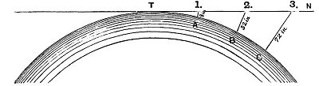

  
[Intangible Textual Heritage](../../index)  [Earth Mysteries](../index) 
[Index](index)  [Previous](za04)  [Next](za06) 

------------------------------------------------------------------------

[Buy this Book at
Amazon.com](https://www.amazon.com/exec/obidos/ASIN/0766149455/internetsacredte)

------------------------------------------------------------------------

  
*Zetetic Astronomy*, by 'Parallax' (pseud. Samuel Birley Rowbotham),
\[1881\], at Intangible Textual Heritage

------------------------------------------------------------------------

p. 9

# CHAPTER II.

### EXPERIMENTS DEMONSTRATING THE TRUE FORM OF STANDING WATER, AND PROVING THE EARTH TO BE A PLANE.

IF the earth is a globe, and is 25,000 English statute miles in
circumference, the surface of all standing water must have a certain
degree of convexity--every part must be an *arc of a circle*. From the
summit of any such arc there will exist a curvature or declination of 8
inches in the first statute mile. In the second mile the fall will be 32
inches; in the third mile, 72 inches, or 6 feet, as shown in the
following diagram:

   
FIG. 1.

Let the distance from T to figure 1 represent 1 mile, and the fall from
1 to A, 8 inches; then the fall from 2 to B will be 32 inches, and from
3 to C, 72 inches. In every

p. 10

mile after the first, the curvature downwards from the point T increases
as the square of the distance multiplied by 8 inches. The rule, however,
requires to be modified after the first thousand miles. [1](#fn_0) The following table will show at a glance
the amount of curvature, in round numbers, in different distances up to
100 miles.

|           |     |     |         |      |      |                                     |
|-----------|-----|-----|---------|------|------|-------------------------------------|
| Curvature | in  | 1   | statute | mile | 8    | inches.                             |
| "         | "   | 2   | "       | "    | 32   | "                                   |
| "         | "   | 3   | "       | "    | 6    | feet.                               |
| "         | "   | 4   | "       | "    | 10   | "                                   |
| "         | "   | 5   | "       | "    | 16   | "                                   |
| "         | "   | 6   | "       | "    | 24   | "                                   |
| "         | "   | 7   | "       | "    | 32   | "                                   |
| "         | "   | 8   | "       | "    | 42   | "                                   |
| "         | "   | 9   | "       | "    | 54   | "                                   |
| "         | "   | 10  | "       | "    | 66   | "                                   |
| "         | "   | 20  | "       | "    | 266  | "                                   |
| "         | "   | 30  | "       | "    | 600  | "                                   |
| "         | "   | 40  | "       | "    | 1066 | "                                   |
| "         | "   | 50  | "       | "    | 1666 | "                                   |
| "         | "   | 60  | "       | "    | 2400 | "                                   |
| "         | "   | 70  | "       | "    | 3266 | "                                   |
| "         | "   | 80  | "       | "    | 4266 | "                                   |
| "         | "   | 90  | "       | "    | 5400 | "                                   |
| "         | "   | 100 | "       | "    | 6666 |                                     |
| "         | "   | 120 | "       | "    | 9600 | " [2](#fn_1) |

 

p. 11

It will be seen by this table that after the first few miles the
curvature would be so great that no difficulty could exist in detecting
either its actual existence or its proportion. Experiments made on the
sea shore have been objected to on account of the constantly changing
altitude of the surface of the water, and of the existence of banks and
channels which produce a "crowding" of the waters, as well as currents
and other irregularities. Standing water has therefore been selected,
and many important experiments have been made, the most simple of which
are the following:--

In the county of Cambridge there is an artificial river or canal, called
the "Old Bedford." It is upwards of twenty miles in length, and (except
at the part referred to at page [16](za07.htm#page_16)) passes in a
straight line through that part of the Fens called the "Bedford Level."
The water is nearly stationary--often completely so, and throughout its
entire length has no interruption from locks or water-gates of any kind;
so that it is, in every respect, well adapted for ascertaining whether
any or what amount of convexity really exists.

------------------------------------------------------------------------

### Footnotes

[10:1](za05.htm#fr_0) Any work on geometry or
geodesy will furnish proofs of this declination.

[10:2](za05.htm#fr_1) To find the curvature in
any number of miles not given in the table, simply square the number,
multiply that by 8, and divide by 12. The quotient is the curvation
required.

------------------------------------------------------------------------

[Next: Experiment 1](za06)
