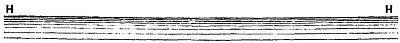
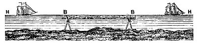
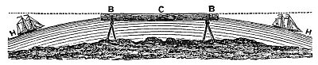

  
[Intangible Textual Heritage](../../index)  [Earth Mysteries](../index) 
[Index](index)  [Previous](za11)  [Next](za13) 

------------------------------------------------------------------------

[Buy this Book at
Amazon.com](https://www.amazon.com/exec/obidos/ASIN/0766149455/internetsacredte)

------------------------------------------------------------------------

  
*Zetetic Astronomy*, by 'Parallax' (pseud. Samuel Birley Rowbotham),
\[1881\], at Intangible Textual Heritage

------------------------------------------------------------------------

### EXPERIMENT 7.

The sea horizon, to whatever distance it extends to the right and left
of an observer on land, always appears as a perfectly straight line, as
represented by H, H, in fig. 16. Not only does

   
FIG. 16.

it *appear* to be straight as far as it extends, but it may be *proved*
to be so by the following simple experiment. At any altitude above the
sea-level, fix a long board--say from 6 to 12 or more feet in
length--edgewise upon tripods, as shown in fig. 17. Let

   
FIG. 17.

the upper edge be smooth, and perfectly levelled. On placing the eye
behind and about the centre of the board B, B, and looking over it
towards the sea, the distant horizon will be observed to run perfectly
parallel with its upper edge. If the eye be now directed in an angular
direction to the left and to the right,

p. 25

there will be no difficulty in observing a length of ten to twenty
miles, according to the altitude of the position; and this whole
distance of twenty miles of sea horizon will be seen as a perfectly
straight line. This would be impossible if the earth were a globe, and
the water of the sea convex. Ten miles on each side would give a
curvature of 66 feet (102 x 8 = 66 feet 8 inches), and
instead of the horizon touching the board along its whole length, it
would be seen to gradually decline from the centre C, and to be over 66
feet below the two extremities B, B, as shown in fig. 18. Any vessel
approaching from the left would be seen to

   
FIG. 18.

ascend the inclined plane H, B, C, and on passing the centre would
descend from C towards the curvating horizon at H. Such a phenomenon is
never observed, and it may be fairly concluded that such convexity or
curvature does not exist.

------------------------------------------------------------------------

[Next: Experiment 8](za13)
