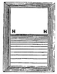

  
[Intangible Textual Heritage](../../index)  [Earth Mysteries](../index.md) 
[Index](index)  [Previous](za14)  [Next](za16.md) 

------------------------------------------------------------------------

[Buy this Book at
Amazon.com](https://www.amazon.com/exec/obidos/ASIN/0766149455/internetsacredte.md)

------------------------------------------------------------------------

  
*Zetetic Astronomy*, by 'Parallax' (pseud. Samuel Birley Rowbotham),
\[1881\], at Intangible Textual Heritage

------------------------------------------------------------------------

### EXPERIMENT 10.

If we stand upon the deck of a ship, or mount to the mast-lead, or
ascend above the earth in a balloon and look over the

p. 36

sea, the surface appears as a vast inclined plane rising up from beneath
us, until in the distance it reaches the level of the eye, and
intercepts the line-of-sight.

<table data-align="LEFT">
<colgroup>
<col style="width: 100%" />
</colgroup>
<tbody>
<tr class="odd">
<td data-valign="CENTER"> 
FIG. 25.</td>
</tr>
</tbody>
</table>

If a good plane mirror be held vertically in the opposite direction, the
horizon will be reflected as a well defined mark or line across the
centre, as represented in fig. 25, H, H, the sea horizon, which rises
and falls with the observer, and is always on a level with his eye. If
he takes a position where the water surrounds him--as, on the deck or
the mast-head of a ship out of sight of land, or on the summit of an
island far from the mainland--the surface of the sea appears to rise up
on all sides equally, and to surround him like the walls of an immense
amphitheatre. He seems to be in the centre of a large concavity--a vast
watery basin--the circular edge of which expands or contracts as he
takes a higher or lower position. This appearance is so. well known to
sea-going travellers that nothing more need be said in its support; but
the appearance from a balloon is only familiar to a very few observers,
and therefore it will be useful to quote the words of some of those who
have written upon the subject.

"THE APPARENT CONCAVITY OF THE EARTH AS SEEN FROM A BALLOON.--A
perfectly-formed circle encompassed the visibly; planisphere beneath, or
rather the concavo-sphere it might now be called, for I had attained a
height from which the earth assumed a regularly hollowed or concave
appearance--an optical illusion which increases as you recede from it.
At the greatest elevation I attained, which was about a mile-and-a-half,
the appearance of the world around me assumed a shape or form like that
which is made by placing two watch glasses together

p. 37

by their edges, the balloon apparently in the central cavity all the
time of its flight at that elevation."--*Wise's Aëronautics*.

"Another curious effect of the aërial ascent was that the earth, when we
were at our greatest altitude, positively appeared concave, looking like
a huge dark bowl, rather than the convex sphere such as we naturally
expect to see it. . . . The horizon always appears to be *on a level
with our eye*, and seems to *rise as we rise*, until at length the
elevation of the circular boundary line of the sight becomes so marked
that the earth assumes the anomalous appearance as we have said of a
*concave* rather than a convex body."--*Mayhew's Great World of London*.

"The chief peculiarity of a view from a balloon at a consider-able
elevation, was the altitude of the horizon, which remained practically
*on a level with the eye*, at an elevation of two miles, causing the
surface of the earth to appear *concave* instead of convex, and to
recede during the rapid ascent, whilst the horizon and the balloon
seemed to be stationary."--*London Journal*, *July* 18*th*, 1857.

Mr. Elliott, an American aëronaut, in a letter giving an account of his
ascension from Baltimore, thus speaks of the appearance of the earth
from a balloon:--

"I don't know that I ever hinted heretofore that the aëronaut may well
be the most sceptical man about the rotundity of the earth. Philosophy
imposes the truth upon us; but the view of the earth from the elevation
of a balloon is that of an immense terrestrial basin, the deeper part of
which is that directly under one's feet. As we ascend, the earth beneath
us seems to recede--actually to sink away--while the horizon gradually
and gracefully lifts a diversified slope, stretching away farther and
farther to a line that, at the highest elevation, seems to close with
the sky. Thus, upon a clear day, the

p. 38

aëronaut feels as if suspended at about an equal distance between the
vast blue oceanic concave above and the equally expanded terrestrial
basin below."

During the important balloon ascents, recently made for scientific
purposes by Mr. Coxwell and Mr. Glaisher, of the Royal Observatory,
Greenwich, the same phenomenon was observed.

"The horizon always appeared on a level with the car."--*See Mr.
Glaisher's Report, in* "*Leisure Hour*," *for* *October* 11, 1862.

"The plane of the earth offers another delusion to the traveller in air,
to whom it appears as a concave surface, and who surveys the line of the
horizon as an unbroken circle, rising up, in relation to the hollow of
the concave hemisphere, like the rim of a shallow inverted watch-glass,
to the height of the eye of the observer, how high soever he may be--the
blue atmosphere above closing over it like the corresponding hemisphere
reversed."--*Glaisher's Report, in* "*Leisure Hour*," *for May* 21,
1864.

The appearance referred to in the several foregoing extracts is
represented in the following diagram, fig. 26.

   
FIG. 26.

\[paragraph continues\] The surface of the
earth C, D, appears to rise up to the

p. 39

level of the observer in the car of the balloon; and at the same time,
the sky A, B, seems to descend and to meet the earth at the horizon H,
H.

------------------------------------------------------------------------

[Next: Experiment 11](za16.md)
