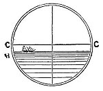
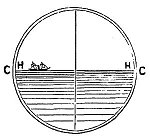

  
[Intangible Textual Heritage](../../index)  [Earth Mysteries](../index.md) 
[Index](index)  [Previous](za15)  [Next](za17.md) 

------------------------------------------------------------------------

[Buy this Book at
Amazon.com](https://www.amazon.com/exec/obidos/ASIN/0766149455/internetsacredte.md)

------------------------------------------------------------------------

  
*Zetetic Astronomy*, by 'Parallax' (pseud. Samuel Birley Rowbotham),
\[1881\], at Intangible Textual Heritage

------------------------------------------------------------------------

### EXPERIMENT 11.

On the eastern pier at Brighton (Sussex) a large wooden quadrant was
fixed on a stand, the upper surface placed square to a plumb line, and
directed towards the east, then to the south, and afterwards to the
west., On looking over this upper surface the line of sight in each case
seemed to meet the horizon, H, H, as shown in fig. 27. The altitude of
the quadrant was

   
FIG. 27.

\[paragraph continues\] 34 feet; hence, if
the earth is a globe, the water would have curvated downwards from the
pier, the horizon would have been more than seven miles away, and 34
feet below the surface immediately beneath the observer; which
depression, added to the elevation of the quadrant on the pier, would
give 68 feet as the amount the horizon H, H, would have been below the
line of sight A, B, as shown in the following diagram, fig. 28.

   
FIG. 28.

To touch the horizon on a convex surface the line of sight,

p. 40

\[paragraph continues\] A C, C B, would
have to "dip" in the direction C, H; as no such "dip" of the eye line is
required, *convexity cannot exist*.

In the case of the balloon at an altitude of two miles, the horizon
would have been 127 miles away, and more than 10,000. feet below the
summit of the arc of water underneath the balloon, and over 20,000 feet
below the line of sight A, B, as shown in fig. 29; and the "dip" C, H,
from C, B, to the horizon

   
FIG. 29.

\[paragraph continues\] H, would be so
great that the aëronaut could not fail to observe it; instead of which
he always sees it "on a level with his eye," "rising as he rises," and
"at the highest elevation, seeming to close with the sky."

The author has seen and tested this apparent rising of the water and the
sea horizon to the level of the eye, and to an eye-line at right angles
to a plumb-line, from many different places--the high ground near the
race-course, at Brighton, in Sussex, from several hills in the Isle of
Wight; various places near Plymouth, looking towards the Eddystone
Lighthouse; the "Steep Holm," in the Bristol Channel; the Hill of Howth,
and "Ireland's Eye," near Dublin; various parts of the Isle of Man,
"Arthur's Seat," near Edinburgh; the cliffs at Tynemouth; the rocks at
Cromer, in Norfolk; from the top of Nelson's Monument, at Great
Yarmouth; and from many other elevated

p. 41

positions. But in Ireland, in Scotland, and in several parts of England,
he has been challenged by surveyors to make use of the theodolite, or
ordinary "spirit level," to test this appearance of the horizon. It was
affirmed that, through this instrument, when "levelled," the horizon
always appeared below the cross-hair, as shown in fig. 30--C, C, the
cross-hair, and H, H, the horizon.

 

<table data-border="0">
<colgroup>
<col style="width: 50%" />
<col style="width: 50%" />
</colgroup>
<tbody>
<tr class="odd">
<td data-valign="top" width="327">
  
FIG. 30.
</td>
<td data-valign="top" width="327">
  
FIG. 31.
</td>
</tr>
</tbody>
</table>

 

In every instance when the experiment was tried, this appearance was
found to exist; but it was noticed that different instruments gave
*different degrees* of horizontal depression below the cross-hair. The
author saw at once that this peculiarity depended upon the construction
of the instruments. He ascertained that in those of the very best
construction, and of the most perfect adjustment, there existed a
certain degree of refraction, or, as it is called technically,
"collimation," or a slight divergence of the rays of light from the axis
of the eye, on passing through the several glasses of the theodolite. He
therefore obtained an iron tube, about 18 inches in length; one end was
closed, except a very small aperture in the centre; and at the other end
cross-hairs were fixed. A spirit level was then attached, and the whole
carefully adjusted. On directing it, from a considerable elevation,
towards the sea,

p. 42

and looking through the small aperture at one end, the cross-hair at the
opposite end was seen to cut or to fall *close to the horizon*, as shown
at [fig. 31](#img_fig31.md). This has been tried in various places, and at
different altitudes, and always with the same result; showing clearly
that the horizon visible below the cross-hair of an ordinary levelling
instrument is the result of *refraction*, from looking through the
various glasses of the telescope; for on looking through an instrument
in every respect the same in construction, except being free from
lenses, a different result is observed, and one precisely the same as
that seen from a balloon, from any promontory, and in the experiment at
Brighton, shown in [fig. 27](#img_fig27), [p. 39](za15.htm#page_39.md).

These comparative experiments cannot fail to satisfy any unbiassed
observer that in every levelling instrument where lenses are employed,
there is, of necessity, more or less divergence of the line of sight
from the true or normal axis; and that however small the amount--perhaps
inappreciable in short lengths of observation--it is considerable in
distances of several miles. Every scientific surveyor of experience is
fully aware of this and other peculiarities in all such instruments, and
is always ready to make allowances for them in important surveys. As a,
still further proof of this behaviour of the telescopic levelling
instruments, the following simple experiment may be tried. Select a
piece of ground--a terrace, promenade, line of railway, or embankment,
which shall be *perfectly horizontal* for, say, five hundred yards. Let
a signal staff, 5 feet high, be erected at one end, and a theodolite or
spirit level fixed and carefully adjusted to exactly the

p. 43

*same altitude* at the other end. The top of the signal will then be
seen a little *below the cross-hair*, although it has the *same actual
altitude*, and stands upon the same *horizontal foundation*. If the
positions of the signal staff and the spirit level be then reversed, the
same result will follow.

Another proof will be found in the following experiment. Select any
promontory, pier, lighthouse gallery, or small island, and, at a
considerable altitude, place a smooth block of wood or stone of any
magnitude; let this be "levelled." If, then, the observer will place his
eye close to the block, and look along its surface towards the sea, he
will find that the line of sight will *touch the distant horizon*. Now
let any number of spirit levels or theodolites be properly placed, and
accurately adjusted; and it will be found that, in every one of them,
the same sea horizon will appear in the field of view considerably
*below* the cross-hair; thus, proving that telescopic instrumental
readings are not the same as those of the naked eye.

In a work entitled "A Treatise on Mathematical Instruments," by J. F.
Heather, M.A., of the Royal Military College, Woolwich, published by
Weale, High Holborn, London, elaborate directions are given for
examining, correcting, and adjusting the collimation, &c.; and at page
103, these directions are concluded by the following words: "The
instrument will now be in complete practical adjustment for any distance
not exceeding ten chains (220 yards), the maximum error being only
1/1000 of a foot.

At this stage of the enquiry two distinct questions naturally arise:
First, if the earth is a plane, why does the sea at all

p. 44

times appear to rise to the axis of the eye? and secondly, would not the
same appearance exist if the earth were a globe? It is a simple fact,
that two lines running parallel for a considerable distance will, to an
observer placed between them at one end, appear to converge or come
together at the other end. The top and bottom and sides of a long room,
or an equally bored tunnel, will afford a good example of this
appearance; but perhaps a still better illustration is given by the two
metallic lines of a long portion of any railway. In fig. 32, let

   
FIG. 32.

\[paragraph continues\] A, B, and C, D,
represent the two lines of a straight portion of horizontal railway. If
an observer be placed at G, he will see the two lines apparently meeting
each other towards H, from the following cause:--Let G represent the eye
looking, first, as far only as figs. 1 and 2, the space between 1 and 2
will then be seen by the eye at G, under the angle 1, G, 2. On looking
as far as figs. 3 and 4, the space between 3 and 4 will be seen under
the diminished angle 3, G, 4. Again on looking forward to the points 5
and 6, the space between the rails would be represented by the angle 5,
G, 6; and, as will at once be seen, the greater the distance observed,
the more acute the angle at the eye, and therefore the nearer together
will the rails appear. Now if one of these rails should be an arc of a
circle and diverge from the other, as in the diagram fig. 33, it is
evident that the

p. 45

   
FIG. 33.

effect upon the eye at G, would be different to that shown by the
diagram fig. 32. The line G, 4, would become a tangent to the arc C, D,
and could never approach the line G, H, nearer than the point T. The
same may be said of lines drawn to 6, opposite 5, and to all greater
distances--none could rise higher than the tangent point T. Hence
allowing A, B, to represent the sky, and C, D, the surface of the water
of a globe, it is evident that A, B, could appear to decline or come
down to the point H, *practically* to a level with the eye at G; but
that C, D, could never, by the operation of any known law of optics,
rise to the line G, H, and therefore any observation made upon a
globular surface, could not possibly produce the effect observed from a
balloon, or in any experiment like that represented in .

From the foregoing details the following arguments may be constructed:--

Right lines, running parallel with each other, appear to approach in the
distance.

The eye-line, and the surface of the earth and sky, run parallel with
each other;

*Ergo*, the earth and sky appear to approach in the distance.

p. 46

Lines which appear to approach in the distance are parallel lines.

The surface of the earth appears to approach the eye-line;

*Ergo*, the surface of the earth is parallel with the eye-line.

The eye-line is a right line.

The surface of the earth is parallel or equi-distant;

*Ergo*, the surface of the earth is *a right line*--a plane.

------------------------------------------------------------------------

[Next: Experiment 12](za17.md)
