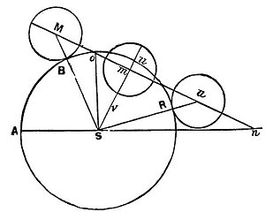
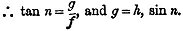
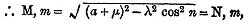
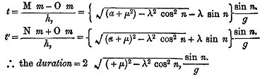
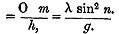
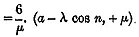
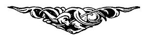

  
[Intangible Textual Heritage](../../index)  [Earth Mysteries](../index.md) 
[Index](index)  [Previous](za28)  [Next](za30.md) 

------------------------------------------------------------------------

[Buy this Book at
Amazon.com](https://www.amazon.com/exec/obidos/ASIN/0766149455/internetsacredte.md)

------------------------------------------------------------------------

  
*Zetetic Astronomy*, by 'Parallax' (pseud. Samuel Birley Rowbotham),
\[1881\], at Intangible Textual Heritage

------------------------------------------------------------------------

p. 130

# CHAPTER XI.

### CAUSE OF SOLAR AND LUNAR ECLIPSES.

A SOLAR eclipse is the result simply of the moon passing between the sun
and the observer on earth. But that an eclipse of the moon arises from a
shadow of the earth, is a statement in every respect, because unproved,
unsatisfactory. The earth has been proved to be without orbital or axial
motion; and, therefore, it could never come between the sun and the
moon. The earth is also proved to be a plane, always underneath the sun
and moon; and, therefore, to speak of its intercepting the light of the
sun, and thus casting its own shadow on the moon, is to say that which
is physically impossible.

Besides the above difficulties or incompatibilities, many cases are on
record of the sun and moon being eclipsed when both were above the
horizon. The sun, the earth, and the moon, *not in a straight line*, but
the earth *below* the sun and moon--out of the reach or direction of
both--and yet a lunar eclipse has occurred! Is it possible that a
"shadow" of the earth could be thrown upon the moon, when sun, earth,
and moon, were not in the same line? The difficulty has been met by
assuming the influence of refraction, as in the following quotations:--

"On some occasions the horizontal refraction amounts
to 36 or 37 minutes, and generally to about 33 minutes, which is

p. 131

equal to the diameter of the sun or moon; and, therefore, the whole disc
of the sun or moon will appear *above* the horizon, both at rising and
setting, although actually *below*. This is the reason that the full
moon has sometimes been seen above the horizon *before the sun was set*.
A remarkable instance of this kind was observed at Paris, on the 19th of
July, 1750, when the moon appeared visibly eclipsed, while the sun was
distinctly to be seen above the horizon." [1](#fn_20.md)

"On the 20th of April, 1837, the moon appeared to rise eclipsed before
the sun had set. The same phenomenon was observed on the 20th of
September, 1717." [2](#fn_21.md)

"In the lunar eclipses of July 17th, 1590; November 3rd, 1648; June
16th, 1666; and May 26th, 1668; the moon rose eclipsed whilst the sun
was still apparently above the horizon. Those horizontal eclipses were
noticed as early as the time of Pliny." [3](#fn_22.md)

On the 17th of January, 1870, a similar phenomenon occurred; .and again
in July of the same year. [4](#fn_23.md)

The only explanation which has been given of this phenomenon is the
refraction caused by the earth's atmosphere. This, at first sight, is a
plausible and fairly satisfactory solution; but on carefully examining
the subject, it is found to be utterly inadequate; and those who have
recourse to it cannot be aware that the refraction of an object and that
of a shadow are in opposite directions. An object by refraction is bent
upwards; but the *shadow* of

p. 132

any object is bent downwards, as will be seen by the following very
simple experiment. Take a plain white shallow basin, and place it ten or
twelve inches from a light in such a position that the *shadow* of the
*edge* of the basin touches the centre of the bottom. Hold a rod
vertically over and on the edge of the shadow, to denote its true
position. Now let water be gradually poured into the basin, and the
shadow will be seen to recede or *shorten inwards* and *downwards*; but
if a rod or a spoon is allowed to rest, with its upper end towards the
light, and the lower end in the bottom of the vessel, it will be seen,
as the water is poured in, to bend *upwards*--thus proving that if
refraction operated at all, it would do so by elevating the moon above
its true position, and throwing the earth's shadow downwards, or
directly away from the moon's surface. Hence it is clear that a lunar
eclipse by a shadow of the earth is an utter impossibility.

The moon's entire surface, or that portion of it which is presented to
the earth, has also been distinctly seen during the whole time of a
total lunar eclipse. This also is entirely incompatible with the
doctrine that an eclipse of the moon is the result of a shadow of the
earth passing over its surface.

Mr. Walker, who observed the lunar eclipse of March 19th, 1848, near
Collumpton, says:--

"The appearances were as usual till twenty minutes
past nine; at that period, and for the space of the next hour, instead
of an eclipse, or the shadow (umbra) of the earth being the cause of the
total obscurity of the moon, the whole phase of that body became very
quickly and most beautifully *illuminated*, and

p. 133

assumed the appearance of the glowing heat of fire
from the furnace, rather tinged with a deep red. . . . The *whole disc*
of the moon being as *perfect with light* as if there had been *no
eclipse whatever!* . . . . The moon positively gave good light from its
disc during the total eclipse." [1](#fn_24.md)

The following case, although not exactly similar to the last, is worth
recording here, as showing that some other cause existed than the
earth's shadow to produce a lunar eclipse:--

"EXTRAORDINARY PHENOMENA ATTENDING THE ECLIPSE.--On Saturday evening,
February 27th, 1858, at Brussels, the eclipse was seen by several
English philosophers who happened to be present. It was attended by a
very remarkable appearance, which Dr. Forster said was wholly
inexplicable on any laws of natural philosophy with which he was
acquainted. The moment before contact a small dusky spot appeared on the
moon's surface, and during the whole of the eclipse, a reddish-brown
fringe, or penumbra, projected above the shadow of the earth. Another
thing still more remarkable was the apparent irregularity of the edge of
the shadow. Three persons, one of them an astronomer, were witnesses of
these curious phenomena, which no law of refraction can in any way
explain." [2](#fn_25.md)

"LUNAR ECLIPSE OF FEBRUARY 6TH, 1860.--The only remarkable feature in
this eclipse was the visibility--it might almost be termed the
brilliancy of *Aristarchus*. *Kepler*, and other spots, were
comparatively lost, or at most, barely discernible, as soon as they
became enveloped in the shadow; but not so *Aristarchus*, which
evidently *shone* either by *intrinsic* or *retained
illumination*." [3](#fn_26.md)

p. 134

"The moon has sometimes shone during a total eclipse with an almost
unaccountable distinctness. On December 22nd, 1703, the moon, when
totally immersed in the earth's shadow, was visible at Avignon by a
ruddy light of such brilliancy that one might have imagined her body to
be transparent, and to be enlightened from behind; and on March 19th,
1848, it is stated that so bright was the moon's surface during its
total immersion,, that many persons could not be persuaded that it was
eclipsed. Mr. Forster, of Bruges, states, in an account of that eclipse,
that the light and dark places on the moon's [surface](errata.htm#2.md)
could be almost as well made out as in an ordinary dull moonlight night.

"Sometimes, in a total lunar eclipse, the moon will appear quite obscure
in some parts of its surface, and in other parts will exhibit a high
degree of illumination. . . . To a certain extent I witnessed some of
these phenomena, during the merely partial eclipse of February 7th,
1860. . . . I prepared, during the afternoon of February 6th, for
witnessing the. eclipse, without any distinct expectation of seeing much
worthy of note. I knew, however, that upwards of eight-tenths of the.
disc would be covered, and I was anxious to observe with what degree of
distinctness the eclipsed portion could be viewed, partly as an
interesting fact, and partly with a view of verifying or discovering the
weak points of an engraving (in which I am concerned) of a lunar
eclipse. After seeing the increasing darkness of the penumbra softly
merging into the true shadow, at the commencement of the eclipse (about
1 o'clock a.m., Greenwich time), I proceeded with pencil and paper,
dimly lighted by a distant lamp, to note by name the different lunar
mountains and plains (the so-called seas), over which the shadow passed.
. . . During the first hour and ten minutes I had seen nothing
unexpected. . . . I had repeatedly written down my observations of the
remarkable clearness with which the

p. 135

moon's eclipsed outline could be seen, both with the naked eye and with
the telescope. At 1 hour 58 minutes, however, I suddenly noted the ruddy
colour of a portion of the moon. I may as well give my notes in the
original words, as copied next day in a more connected form:

"'1 hour 58 minutes, Greenwich time.--I am suddenly struck by the fact
that the whole of the western seas of the moon are showing through the
shadow with singular sharpness, and that the whole region where they lie
has assumed a decidedly reddish tinge, attaining its greatest brightness
at a sort of temporary polar region, having 'Endymion' about the
position of its imaginary pole. I particularly notice that the 'Lake of
Sleep' has disappeared in this brightness, instead of standing out in a
darker shade. And I notice that this so-called polar region is not
parallel with the rim of the shadow, but rather west of it.

"'2 hours 15 minutes.--Some clouds, though very thin and transparent,
now intervene.

"'2 hours 20 minutes.--The sky is now clear. How extra-ordinary is the
appearance of the moon! Reddish is not the word to express it; it is
red--*red hot!* I endeavour to think of various red objects with which
to compare it, and nothing seems so like as a *red-hot penny*--a red-hot
penny, with a little *white-hot* piece at its lower edge, standing out
against a dark blue background; only it is evidently not a mere disc,
but beautifully rounded by shading. Such is its appearance with the
naked eye; with the telescope, its surface varies more in tint than with
the naked eye, and is not of quite so bright a red as when thus viewed.
The redness continues to be most perceptible at a distance from the
shadow's southern edge, and to be greatest about the region of
'Endymion.' The 'Hercynian Mountains' (north of 'Grimaldus') are,
however, of rather a bright red, and 'Grimaldus' shows well. 'Mare

p. 136

\[paragraph continues\] Crisium' and the
western seas, are wonderfully distinct. Not a trace to be seen of
'Aristarchus' or 'Plato.'

"'2 hours 27 minutes.--It is now nearly the middle of the eclipse. The
red colour is very brilliant to the naked eye. . . . After this, I
noticed a progressive change of tint in the moon.

"'2 hours 50 minutes.--The moon does not seem to the naked eye of so
bright a red as before; and again I am reminded by its tint, of red-hot
copper, which has begun to cool. The whole of 'Grimaldi' is now
uncovered. Through the telescope I notice a decided grey shade, at the
lower part of the eclipsed portion, and the various small craters give
it a stippled effect, like the old aqua-tint engravings. The upper part
is reddish; but two graceful blueish curves, like horns, mark the form
of the 'Hercynian Mountains,' and the bright region on the other limb of
the moon. These are visible also to the naked eye.

"'At 3 hours 5 minutes the redness had almost disappeared; a very few
minutes afterwards no trace of it remained; and ere long clouds came on.
I watched the moon, however, occasionally gaining a glimpse of its disc,
till a quarter to 4 o'clock, when, for the last time on that occasion, I
saw it faintly appearing through the clouds, nearly a full moon again;
and then I took leave of it, feeling amply repaid for my vigil by the
beautiful spectacle which I had seen.'" [1](#fn_27.md)

At the time of totality (the lunar eclipse of June 1st, 1863), the moon
presented a soft, woolly appearance, apparently more globular in form
than when fully illuminated. Traces of the larger and brighter mountains
were visible at the time of totality, and particularly the bright rays
proceeding from 'Tycho,' 'Kepler,' and 'Aristarchus.' . . . . At first,
when the obscured part was of small dimensions, it was of an iron grey

p. 137

tint, but as it approached totality, the reddish light became so
apparent that it was remarked that the moon 'seemed to be on fire;' and
when the totality had commenced, it certainly looked like a fire
smouldering in its ashes, and almost going out." [1](#fn_28.md)

In ordinary cases the disc appears, during a total eclipse, of a reddish
hue, the colour being, indeed, of the most various degrees of intensity,
passing, even when the moon is far removed from the earth into a fiery
glowing red. Whilst I was lying at anchor (29th of March, 1801), off the
Island of Baru, not far from Cartagena de Indias, and observing a total
lunar eclipse, I was exceedingly struck by seeing how much brighter the
reddened disc of the moon appears in the sky of the tropics than in my
northern native land." [2](#fn_29.md)

"The fiery, coal-glowing colour of the darkened (eclipsed) moon. . . .
The change is from black to red, and blueish." [3](#fn_30.md)

"Great was the confusion created in the camp of Vitellius by the eclipse
which took place that night; yet it was not so much the eclipse
itself--although to minds already disturbed this might appear ominous of
misfortune--as it was the circumstance of the moon's varying
colours--blood-red, black, and other mournful hues--which filled their
souls with uneasy apprehensions." [4](#fn_31.md)

The several cases above advanced are logically destructive of the notion
that an eclipse of the moon arises from a shadow of the earth. As before
stated, the earth is proved to be a plane, without motion, and always
several

p. 138

hundred miles below the sun and moon, and cannot, by any known
possibility come between them. It cannot therefore intercept the light
of the sun, and throw its own shadow upon the moon. If such a thing were
a natural possibility, how could the moon continue to shine during the
whole or any considerable part of the period of its passage through the
dark shadow of the earth? Refraction, or what has been called "Earth
light," will not aid in the explanation; because the light of the moon
is at such times "like the glowing heat of firer tinged with deep red."
"*Reddish* is not the word to express it, it was red--*red hot*." "The
reddish light made it, seem to be on fire." "It looked like a fire
smouldering in its ashes." "Its tint was that of red-hot copper." The
sun light is of an entirely different colour to that of the eclipsed
moon; and it is contrary to known optical principles to say that light
when refracted or reflected, or both simultaneously, is thereby changed
in colour. If a light of a given colour is seen through a great depth of
a comparatively dense medium, as the sun is often seen in winter through
the fog and vapour of the atmosphere, it appears of a different colour,
and generally of such as that which the moon so often gives during a
total eclipse; but a shadow cannot produce any such effect, as it is, in
fact, not an entity at all, but simply the absence of light.

From the facts and phenomena already advanced, we cannot draw any other
conclusion than that the moon is obscured by some kind of
semi-transparent body passing before it; and through which the luminous
surface is visible: the luminosity changed in colour by the density

p. 139

of the intervening object. This conclusion is *forced* upon, us by the
evidence; but it involves the admission that the moon shines with light
of its own--that it is not a reflector of the sun's light, but
absolutely *self-luminous*. Although this admission is logically
compulsory, it will be useful and strictly Zetetic to collect all the
evidence possible which bears upon it.

1st. A reflector is a plane or concave surface, which gives off or
returns what it receives:--

If a piece of red hot metal or any other heated object is placed before
a plane or concave surface, *heat* is reflected.

If snow or ice, or any artificial freezing mixture is similarly placed,
*cold* will be reflected.

If light of any given colour is placed in the same way, the *same
colour* of light will be reflected.

If a given sound is produced, the same tone or pitch will be reflected.

A reflector will not throw off cold when heat is placed before it; nor
heat when cold is presented. If a red light is received, red light will
be returned, not blue or yellow. If the note C is sounded upon any
musical instrument, a reflector will not return the note D or G, but
precisely the *same note*, altered only in degree or intensity.

If the moon is a reflector of the sun's light, she could not radiate or
throw down upon the earth any other light than such as she first
receives from the sun. No difference could exist in the quality or
character of the light; and it

p. 140

could not possibly differ in any other respect than that of intensity or
quantity. It has been asserted in opposition to the above, that the moon
might absorb *some* of the rays of light from the sun and reflect only
the remaining rays. To this it is replied that absorption means speedy
saturation: a piece of blotting paper, or a lump of hard sugar, or a
sponge when brought into contact with any fluid or gaseous substance,
would only absorb for a short time; it would quickly become saturated,
filled to repletion, and from that moment would cease to absorb, and
ever afterwards could only reflect or throw back whatever was projected
upon it. So the moon, if an object without light of her own, might at
the beginning of her existence absorb the sun's ray's, and, fixing some,
might return the others; but as already shown, she could only absorb to
saturation, which would occur in a very short time; and from this point
of saturation to the present moment she could not have been other than a
*reflector*--a reflector, too, of all which she receives.

We have then, in order to know whether the moon is a reflector, merely
to ascertain whether the light which we receive from her is, or is not
the same, in .character as that received from the sun.

 

1st. The sun's light is generally, and in an ordinary state of the
atmosphere, of an oppressive, fierce, semi-golden, pyro-phosphorescent
character; while that of the moon is pale, silvery and gentle; and when
shining most brightly is mild and non-pyrotic.

2nd. The sun's light is warm, drying, and preservative, or

p. 141

antiseptic; animal and vegetable substances exposed to it soon dry,
coagulate, shrink, and lose their tendency to decompose and become
putrid. Hence grapes and other fruits by long exposure to sunlight
become solid, and partially candied and preserved; as instanced in
raisins, prunes, dates, and ordinary grocers' currants. Hence, too, fish
and flesh by similar exposure lose their gaseous and other volatile
constituents and by coagulation of their albuminous and other compounds
become firm and dry, and less liable to decay; in this way various kinds
of fish and flesh well known to travellers are preserved for use.

The light of the moon is damp, cold, and powerfully septic; and animal
and nitrogenous vegetable substances. exposed to it soon show symptoms
of putrefaction. Even living creatures by long exposure to the moon's
rays, become morbidly affected. It is a common thing on board vessels
going through tropical regions, for written or printed notices to be
issued, prohibiting persons from sleeping on deck exposed to full
moonlight, experience having proved that such exposure is often followed
by injurious consequences.

"It is said that the moon has a pernicious effect upon those who, in the
East, sleep in its beams; and that fish having been exposed to them for
only one night, becomes most injurious to those who eat it." [1](#fn_32.md)

"At Peckham Rye, a boy named Lowry has entirely lost his sight by
sleeping in a field in the bright moonlight." [2](#fn_33.md)

"If we place in an exposed position two pieces of meat, and one of them
be subjected to the moon's rays, while the other is

p. 142

protected from them by a screen or a cover, the former will be tainted
with putrefaction much sooner than the other." [1](#fn_34.md)

Professor Tyndall describing his journey to the summit of the Alpine
Mountain, Weisshorn, August 21st, 1861, says:--

"I lay with my face towards the moon (which was
nearly full), and gazed until my face and eyes became so *chilled* that
I was fain to protect them with a handkerchief." [2](#fn_35.md)

3rd. It is a well known fact, that if the sun is allowed to shine
strongly upon a common coal, coke, wood, or charcoal fire, the
combustion is greatly diminished; and often the fire is extinguished. It
is not an uncommon thing for cooks, housewives, and others to draw down
the blinds in summer time to prevent their fires being put out by the
continued stream of sun-light pouring through the windows. Many
philosophers have recently attempted to deny and ridicule this fact, but
they are met, not only by the common sense and every-day experience of
very practical people, but by the results of specially instituted
experiments.

It is not so well known perhaps, but it is an equally decided fact, that
when the light of the moon is allowed to play upon a common carbonaceous
fire, the action is increased, the fire burns more vividly, and the fuel
is more rapidly consumed.

4th. In sun-light a thermometer stands *higher* than a similar
thermometer placed in the shade. In the full

p. 143

moon-light, a thermometer stands *lower* than a similar instrument in
the shade.

5th. In winter when ice and snow are on the ground, it is patent to
every boy seeking amusement by skating or snow-balling, that in the sun
light both ice and snow are softer and sooner thaw than that behind a
wall, or in the shade. It is equally well known that when, in frosty
weather, the night is far advanced, and the full moon has been shining
for some hours, the snow and ice exposed to the moon-light are hard and
crisp, while in the shade, or behind any object which intercepts the
moon's rays it is warmer, and the ice and snow are softer and less
compact. Snow will melt sooner in sun-light than in the shade; but
sooner in the shade than when exposed to the light of the moon.

6th. The light of the sun reflected from the surface of a pool of water,
or from the surface of ice, may be collected in a large lens, and thrown
to a point or focus, when the heat will be found to be considerable; but
neither from the light of the moon reflected in a similar way, nor
direct from the moon itself, can a heat-giving focus be obtained.

7th. The sun's light, when concentrated by a number of plane or concave
mirrors throwing the light to the same point; or by a large burning
lens, produces a black or non-luminous focus, in which the heat is so
intense that metallic and alkaline substances are quickly fused; earthy
and mineral compounds almost immediately vitrified; and all animal and
vegetable structures in a few seconds decomposed, burned up and
destroyed.

The moon's light concentrated in the above manner

p. 144

produces a focus so brilliant and luminous that it is difficult to look
upon it; yet there is no increase of temperature. In the focus of
sun-light there is *great heat* but no *light*. In that of the moon's
light there is *great light* but *no heat*. That the light of the moon
is without heat, is fully verified by the following quotations:---

"If the most delicate thermometer be exposed to the full light of the
moon, shining with its greatest lustre, the mercury is not elevated a
hair's breadth; neither would it be if exposed to the focus of her rays
concentrated by the most powerful lenses. This has been proved by actual
experiment." [1](#fn_36.md)

"This question has been submitted to the test of direct experiment. . .
. The bulb of a thermometer sufficiently sensitive to render apparent a
change of temperature amounting to the thousandth part of a degree, was
placed in the focus of a concave reflector of vast dimensions, which,
being directed to the moon, the lunar rays were collected with great
power upon it. Not the slightest change, however, was produced in the
thermometric column; proving that a concentration of rays sufficient to
fuse gold if they proceeded from the sun, does not produce a change of
temperature so great as the thousandth part of a degree when they
proceed from the moon." [2](#fn_37.md)

"The most delicate experiments have failed in detecting in the light of
the moon either calorific or chemical properties. Though concentrated in
the focus of the largest mirrors, it produces no sensible heating
effect. To make this experiment, recourse has been had to a bent tube,
the extremities of which terminate in two hollow globes filled with air,
the one trans-parent, the other blackened, the middle space being
occupied

p. 145

by a coloured fluid. In this instrument, when caloric is absorbed by it,
the black ball takes up more than the other, and the air it encloses
increasing in elasticity, the liquid is driven out. This instrument is
so delicate that it indicates even the millionth part of a degree; and
yet, in the experiment alluded to, it *gave no result*." [1](#fn_38.md)

"The light of the moon, though concentrated by the most powerful
burning-glass, is incapable of raising the temperature of the most
delicate thermometer. M. De la Hire collected the rays of the full moon
when on the meridian, by means of a burning-glass 35 inches in diameter,
and made them fall on the bulb of a delicate air-thermometer. *No effect
was produced* though the lunar rays by this glass were concentrated 300
times. Professor Forbes concentrated the moon's light by a lens 30
inches in diameter, its focal distance being about 41 inches, and having
a power of concentration exceeding 6000 times. The image of the moon,
which was only 18 hours past full, and less than two hours from the
meridian, was brilliantly thrown by this lens on the extremity of a
commodious thermopile. Although the observations were made in the most
unexceptional manner, and (supposing that half the rays were reflected,
dispersed and absorbed), though the light of the moon was concentrated
3000 times, *not the slightest thermo effect was produced*." [2](#fn_39.md)

In the "Lancet" (Medical Journal), for March 14th, 1856, particulars are
given of several experiments which proved that the moon's rays when
concentrated, actually *reduced* the temperature upon a thermometer more
than eight degrees.

p. 146

It is the common experience of the world that the light of the sun heats
and invigorates all things, and that moon light is cold and depressive.
Among the Hindoos, the sun is called "Nidâghakara," which means in
Sanscrit "Creator of Heat;" and the moon is called "Sitala Hima," "The
Cold," and "Himân’su," "Cold-darting," or "Cold-radiating."

Poets, who but utter in measured words the universal knowledge of
mankind, always speak of the "Pale cold moon," and the expression is not
only poetically beautiful, but also true philosophically.

"The cold chaste moon, the queen of Heaven's bright
Isles;  
Who makes all beautiful on which she smiles:  
That wandering shrine of soft yet *icy flame*  
Which ever is transformed, yet still the same;  
               And *warms* not but illumes."

The facts now placed in contrast make it impossible to conclude
otherwise than that the moon does not shine by reflection, but by a
light peculiar to herself--that she is in short *self-luminous*. This
conclusion is confirmed by the following consideration. The moon is said
by the Newtonian philosophers to be a sphere. If so, its surface could
not possibly *reflect*; a reflector must be concave or plane, so that
the rays of light may have an "angle of incidence." If the surface is
convex, every ray of light falls upon it in a line direct with radius,
or perpendicular to the surface. Hence there cannot be an angle of
*incidence* and therefore none of *reflection*. If the moon's surface
were a mass of highly polished silver, it could not reflect

p. 147

from more than a mere point. Let a silvered glass ball of considerable
size be held before a lamp or fire of any magnitude, and it will be seen
that instead of the whole surface reflecting light there will only be a
very small portion illuminated. But during full moon the *whole disc*
shines intensely, an effect which from a spherical surface is
impossible. If the surface of the moon were opaque and earthy instead of
polished like a mirror, it might be seen simply illuminated like a dead
wall, or the face of a distant sandstone rock, or chalky cliff, but it
could not shine intensely from every part, radiating brilliant light and
brightly illuminating the objects around it, as the moon does so
beautifully when full and in a clear firmament. If the earth were
admitted to be globular, and to move, and to be capable of throwing a
shadow by intercepting the sun's light, it would be impossible for a
lunar eclipse to occur thereby, unless, at the same time, the moon is
proved to be non-luminous, and to shine only by reflection. But this is
not proved; it is only assumed as an essential part of a theory. The
*contrary* is capable of proof. That the moon is self-luminous, or
shines with her own light, independently. The very name and the nature
of a reflector demand certain well-defined conditions. The moon does not
manifest these necessary conditions, and therefore it must be concluded,
of necessity, that she is not a reflector, but a self-luminous body.
That she shines with her own light independently of the sun, thus admits
of direct demonstration.

As the moon is self-luminous, her surface could not be darkened or
"eclipsed" by a shadow of the earth--supposing

p. 148

such a shadow could be thrown upon it. In such a case, the luminosity
instead of being diminished, would increase, and would be greater in
proportion to the greater density or darkness of the shadow. As the
light in a bull's-eye lantern looks brightest in the darkest places, so
would the self-shining surface of the moon be most intense in the
*umbra* or deepest part of the earth's shadow.

The moon shining brightly during the whole time of eclipse, and with a
light of different hue to that of the sun; and the light of the moon
having, as previously shown, a different character to that of the sun;
the earth not a globe, and not in motion round the sun, but sun and moon
always over the earth's plane surface, render the proposition
unavoidable as it is clearly undeniable that a lunar eclipse *does not*
and *could not* in the nature of things arise from a shadow of the
earth, but must of sheer logical necessity be referred to some other
cause.

We have seen that, during a lunar eclipse, the moon's self-luminous
surface is covered by a semi-transparent something; that this
"something" is a definite mass, because it has a distinct and circular
outline, as seen during its first and last contact with the moon. As a
solar eclipse occurs from the moon passing before the sun, so, from the
evidence above collected, it is evident that a lunar eclipse arises from
a similar cause--a body semi-transparent and well-defined passing before
the moon; or between the moon's surface and the observer on the surface
of the earth.

That many such bodies exist in the firmament is almost a matter of
certainty; and that one such as that which

p. 149

eclipses the moon exists at no great distance above the earth's surface,
is a matter admitted by many of the leading astronomers of the day. In
the report of the council of the Royal Astronomical Society, for June
1850, it is said:--

"We may well doubt whether that body which we call
the moon is the *only satellite* of the earth."

In the report of the Academy of Sciences for October 12th, 1846, and
again for August, 1847, the director of one of the French observatories
gives a number of observations and calculations which have led him to
conclude that,--

"There is at least *one non-luminous body* of
considerable magnitude which is attached as a *satellite* to this
earth."

Sir John Herschel admits that:--

"Invisible moons exist in the firmament." [1](#fn_40.md)

Sir John Lubbock is of the same opinion, and gives rules and formulæ for
calculating their distances, periods, &c. [2](#fn_41.md)

At the meeting of the British Association for the Advancement of
Science, in 1850, the president stated that,---

"The opinion was gaining ground, that many of the fixed stars were
accompanied by companions emitting no light."

"The 'changeable stars' which disappear for a time, or are eclipsed,
have been supposed to have very large opaque bodies revolving about or
near to them, so as to obscure them when they come in conjunction with
us." [3](#fn_42.md)

p. 150

"Bessel, the greatest astronomer of our time, in a letter to myself, in
July 1844, said, 'I do indeed continue in the belief that Procyon and
Sirius are both true double stars, each consisting of one *visible*, and
one *invisible* star.' . . A laborious inquiry just completed by Peters
at Königsberg; and a similar one by Schubert, the calculator employed on
the North American Nautical Almanack, support Bessel." [1](#fn_43.md)

"The belief in the existence of non-luminous stars was prevalent in
Grecian antiquity, and especially in the early times of Christianity. It
was assumed that 'among the fiery stars which are nourished by vapours,
there move other earthy bodies, which remain invisible to us!'
*Origenes*." [2](#fn_44.md)

"Stars that are invisible and consequently have no name move in space
together with those that are visible." *Diogenes of Appollonica*. [3](#fn_45.md)

Lambert in his cosmological letters admits the existence of "dark
cosmical bodies of great size." [4](#fn_46.md)

We have now seen that the existence of dark bodies revolving about the
luminous objects in the firmament has been admitted by practical
observers from the earliest ages; and that in our own day such a mass of
evidence has accumulated on the subject, that astronomers are compelled
to admit that not only dark bodies which occasionally obscure the
luminous stars when in conjunction, but that cosmical bodies of large
size exist, and that "one at least is attached as a satellite to this
earth." It is this dark or "non-luminous satellite," which when in
conjunction,

p. 151

or in a line with the moon and an observer on earth, IS THE IMMEDIATE
CAUSE OF A LUNAR ECLIPSE.

Those who are unacquainted with the methods of calculating eclipses and
other phenomena, are prone to look upon the correctness of such
calculations as powerful arguments in favour of the doctrine of the
earth's rotundity and the Newtonian philosophy, generally. One of the
most pitiful manifestations of ignorance of the true nature of
theoretical astronomy is the ardent inquiry so often made, "How is it
possible for that system to be false, which enables its professors to
calculate to a second of time both solar and lunar eclipses for hundreds
of years to come?" The supposition that such calculations are an
essential part of the Newtonian or any other theory is entirely
gratuitous, and exceedingly fallacious and misleading. Whatever theory
is adopted, or if all theories are discarded, the same calculations can
be made. The tables of the moon's relative positions for any fraction of
time are purely practical--the result of long-continued observations,
and may or may not be connected with hypothesis. The necessary data
being tabulated, may be mixed up with any, even the most opposite
doctrines, or kept distinct from every theory or system, just as the
operator may determine.

"The considered defects of the system of Ptolemy
(who lived in the second century of the Christian era), did not prevent
him from calculating all the eclipses that were to happen for 600 years
to come." [1](#fn_47.md)

p. 152

"The most ancient observations of which we are in possession, that are
sufficiently accurate to be employed in astronomical calculations, are
those made at Babylon about 719 years before the Christian era, of three
eclipses of the moon. Ptolemy, who has transmitted them to us, employed
them for determining the period of the moon's mean motion; and therefore
had probably none more ancient on which he could depend. The Chaldeans,
however, must have made a long series of observations before they could
discover their 'Saros,' or lunar period of 6585⅓ days, or about 18
years; at which time, as they had learnt, the place of the moon, her
*node* and *apogee* return nearly to the same situation with respect to
the earth and the sun, and, of course, a series of nearly similar
eclipses occur." [1](#fn_48.md)

"Thales (B.C. 600) predicted the eclipse which terminated the war
between the Medes and the Lydians. Anaxagoras (B.C. 530) predicted an
eclipse which happened in the fifth year of the Peloponnesian
War." [2](#fn_49.md)

"Hipparchus (140 B.C.) constructed tables of the motions of the sun and
moon; collected accounts of such eclipses as had been made by the
Egyptians and Chaldeans, and calculated all that were to happen for 600
years to come." [3](#fn_50.md)

"The precision of astronomy arises, not from theories, but from
prolonged observations, and the regularity of the motions, or the
ascertained uniformity of their irregularities." [4](#fn_51.md)

"No particular theory is required to calculate eclipses; and the
calculations may be made with equal accuracy *independent of every
theory*." [5](#fn_52.md)

p. 153

"It is not difficult to form some general notion of
the process of calculating eclipses. It may be readily conceived that by
long-continued observations on the sun and moon, the laws of their
revolution may be so well understood that the exact places which they
will occupy in the heavens at any future times may be foreseen, and laid
down in tables of the sun and moon's motions; that we may thus ascertain
by inspecting the tables the instant when these bodies will be together
in the heavens, or be in conjunction." [1](#fn_53.md)

The simplest method of ascertaining any future eclipse is to take the
tables which have been formed during hundreds of years of careful
observation; or each observer may form his own tables by collecting a
number of old almanacks one for each of the last forty years: separate
the times of the eclipses in each year, and arrange them in a tabular
form. On looking over the various items he will soon discover parallel
cases, or "cycles" of eclipses; that is, taking the eclipses in the
first year of his table, and examining those of each succeeding year, he
will notice peculiarities in each year's phenomena; but on arriving to
the items of the nineteenth and twentieth years, he will perceive that
some of the eclipses in the earlier part of the table will have been now
repeated--that is to say, the times and characters will be alike. If the
time which has elapsed between these two parallel or similar eclipses be
carefully noted, and called a "cycle," it will then be a very simple and
easy matter to predict any future *similar* eclipse, because, at the end
of the "cycle," such similar

p. 154

eclipse will be certain to occur; or, at least, because such repetitions
of similar phenomena have occurred in every cycle of between eighteen
and nineteen years during the last several thousand years, it may be
reasonably expected that if the natural world continues to have the same
general structure and character, such repetitions may be predicted for
all future time. The whole process is neither more nor less--except a
little more complicated--than that because an express train had been
observed for many years to pass a given point at a given second--say of
every eighteenth day, so at a similar moment of every cycle or
eighteenth day, for a hundred or more years to. come, the same might be
predicted and expected. To tell the actual day and second, it is only
necessary to ascertain on what day of the week the eighteenth or "cycle
day" falls.

Tables of the places of the sun and moon, of eclipses, and of kindred
phenomena, have existed for thousands of years, and w ere formed
independently of each other, by the Chaldean, Babylonian, Egyptian,
Hindoo, Chinese, and other ancient astronomers. Modern science has had
nothing to do with these; farther than rendering them a little more
exact, by averaging and reducing the fractional errors which a longer
period of observation has detected.

As an instance of the complicated process into which modern theorists
have allowed themselves to "drift," the following formula is here
introduced:--

"RULES TO FIND ALL PARTICULARS OF A LUNAR ECLIPSE.

"1st.--Find the moon's true hourly motion at the full moon by means.

p. 155

"TO FIND THE TIME, MAGNITUDE, AND DURATION OF A LUNAR ECLIPSE.

"Let A, B, R, (in the following diagram) be a section of the

 

earth's shadow at the distance of the moon; S, *n*, the path described
by its centre, S, on the ecliptic; M, *n*, the relative orbit of the
moon; M, *n*, S, *n*, being considered straight lines. Draw S, *o*,
perpendicular to S, *n*, and S, *m*, to M, *n*; then *o*, and *m*, are
in the places, with respect to S, of the moon in opposition, and at the
middle of the eclipse.

"Let α = S, B = *h* + π - σ, the radius of the section of the shadow.

λ = S, *o*, the moon's latitude in opposition.

*f* = the relative horary motion in longitude of the moon in the
relative orbit, M, *n*.

*h* = the moon's horary motion in the relative orbit.

*g* = the moon's horary motion in latitude.

μ = the moon's semi-diameter;

 

p. 156

"Let M, and N, be the place of the moon's centre at the time of the
first and last contact; therefore

SM = SN = a + μ.

"Now S *m* = λ cos *n*;

 

and *m*, *o* = λ sin *n*.

"If, therefore, *t*, and *t*´, be the times from opposition of the first
and last contact,

 

"The time from opposition, of the middle of the eclipse

 

"The *magnitude* of the eclipse, or the part of the moon immersed,

<table data-border="0" width="29%">
<colgroup>
<col style="width: 100%" />
</colgroup>
<tbody>
<tr class="odd">
<td data-valign="top" width="239">
= S <em>u</em> - S <em>v</em>.

= S <em>u</em>--S <em>m</em> + <em>m</em>, <em>v</em>.

=<em>a</em> - λ cos <em>n</em> + μ.
</td>
</tr>
</tbody>
</table>

"The moon's diameter is generally divided into twelve equal parts,
called digits;

therefore the digits eclipsed = 12 :: α - λ, *n* +μ : 2 μ

 

"COR. 1.--If λ cos *n*, be greater than α + μ, *t* and *t*´ are
impossible, and no eclipse can take place, as is also evident from the
figure.

"COR. 2.--In exactly the same manner it may be proved, if *t* and *t*´
be the times from opposition, of the centres of the shadow and moon
being at any given distance c,

p. 157

 

"COR. 3.--If *c* = *h* + μ + σ + μ = the radius of the penumbra, + the
radius of the moon, the times of the moon entering and emerging from the
penumbra are obtained.

"The horary motion of the moon is about 32½´, and that of the sun 2½´;
therefore the relative horary motion of the moon is 30´; and as the
greatest diameter of the section at the distance of the moon is 1° 31´
44″, a lunar eclipse may last more than three hours." [1](#fn_54.md)

 

The formulæ above quoted are entirely superfluous, because they add
nothing to our knowledge of the causes of eclipses, and would not enable
us to predict anything which has not hundreds of times already occurred.
Hence all the labour of calculation is truly effort thrown away, and may
be altogether dispensed with by adopting the simple process referred to
at page [153](#page_153.md), and calling that which eclipses the moon the
"lunar eclipsor," or the moon's satellite, instead of the "earth's
shadow," just as the moon is the sun's eclipsor.

 

 

------------------------------------------------------------------------

### Footnotes

[131:1](za29.htm#fr_20.md) "Astronomy and
Astronomical Instruments," p. 105. By George G. Carey.

[131:2](za29.htm#fr_21.md) McCulloch's Geography,
p. 85.

[131:3](za29.htm#fr_22.md) "Illustrated London
Almanack for 1864," the astronomical articles in which are by James
Glaisher, Esq., of the Greenwich Royal Observatory.

[131:4](za29.htm#fr_23.md) See "Daily Telegraph,"
July 16th, 1870.

[133:1](za29.htm#fr_24.md) "Philosophical
Magazine," No. 220, for August, 1848.

[133:2](za29.htm#fr_25.md) "Morning Star," of
Wednesday, March 3rd, 1858.

[133:3](za29.htm#fr_26.md) Norman Pogson, Esq.,
Director of the Hartwell Observatory, in "Monthly Notices of the Royal
Astronomical Society," March 9th, 1860.

[136:1](za29.htm#fr_27.md) The Hon. Mrs. Ward,
Trimleston House, near Dublin, in "Recreative Science," p. 281.

[137:1](za29.htm#fr_28.md) "Illustrated London
Almanack for 1864," by Mr. Glaisher, of Royal Observatory, Greenwich. A
beautiful tinted engraving is given, representing the moon, with all the
light and dark places, the so-called mountains, seas, &c., plainly
visible, during the totality of the eclipse.

[137:2](za29.htm#fr_29.md) "Physical Description of
the Heavens," p. 356. By Humboldt.

[137:3](za29.htm#fr_30.md) Plutarch ("De Facia in
Orbe Luna"), T. iv., pp. 780-783.

[137:4](za29.htm#fr_31.md) Dion Cassius (lxv., 11;
T., iv.; p. 185. Sturz.)

[141:1](za29.htm#fr_32.md) "Wanderings in the
East," p. 367. (Edit. 1854). By Rev. J. Gadsby.

[141:2](za29.htm#fr_33.md) Newspaper Paragraph.

[142:1](za29.htm#fr_34.md) "Lectures on Astronomy,"
p. 67. By M. Arago.

[142:2](za29.htm#fr_35.md) "Illustrated London
News," of September, 7th, 1861.

[144:1](za29.htm#fr_36.md) "All the Year Round," by
Dickens.

[144:2](za29.htm#fr_37.md) "Museum of Science," p.
115. By Dr. Lardner.

[145:1](za29.htm#fr_38.md) "Lectures on Astronomy,"
p. 66. By M. Arago.

[145:2](za29.htm#fr_39.md) "Lectures on Chemistry,"
p. 334. By Dr. Noad.

[149:1](za29.htm#fr_40.md) "Herschel's Astronomy,"
pp. 521 and 616.

[149:2](za29.htm#fr_41.md) "Philosophical Magazine"
for 1848, p. 80.

[149:3](za29.htm#fr_42.md) "Encyclopædia
Londinensis." Art., "Fixed Stars."

[150:1](za29.htm#fr_43.md) "Physical Description of
the Heavens." By Humboldt, p. 183, 1867.

[150:2](za29.htm#fr_44.md) *Ibid.*, p. 184.

[150:3](za29.htm#fr_45.md) "Comos," p. 122. By
Humboldt.

[150:4](za29.htm#fr_46.md) *Ibid.* Notes, p. 71.

[151:1](za29.htm#fr_47.md) Smith's "Rise and
Progress of Astronomy.

[152:1](za29.htm#fr_48.md) "Lectures on Natural
Philosophy," p. 370. By Professor Partington.

[152:2](za29.htm#fr_49.md) Professor Barlow, in
"Encyclopædia Metropolitana," p. 486.

[152:3](za29.htm#fr_50.md) "Encyclopædia
Londinensis," vol. if., p. 402.

[152:4](za29.htm#fr_51.md) "Million of Facts." By
Sir Richard Phillips. Page 358.

[152:5](za29.htm#fr_52.md) Somerville's "Physical
Sciences," p. 46.

[153:1](za29.htm#fr_53.md) "Mechanism of the
Heavens," p. 191. By Professor Olmstead, U.S. Observatory.

[157:1](za29.htm#fr_54.md) "Elements of Astronomy,"
p. 309, by W. Maddy, M.A., Fellow of St. John's College, Cambridge.

------------------------------------------------------------------------

[Next: Chapter XII. The Cause of Tides](za30.md)
