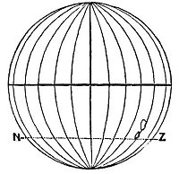
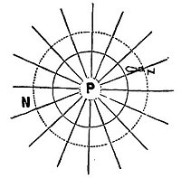

  
[Intangible Textual Heritage](../../index)  [Earth Mysteries](../index.md) 
[Index](index)  [Previous](za41)  [Next](za43.md) 

------------------------------------------------------------------------

[Buy this Book at
Amazon.com](https://www.amazon.com/exec/obidos/ASIN/0766149455/internetsacredte.md)

------------------------------------------------------------------------

  
*Zetetic Astronomy*, by 'Parallax' (pseud. Samuel Birley Rowbotham),
\[1881\], at Intangible Textual Heritage

------------------------------------------------------------------------

### DEGREES OF LONGITUDE.

Another argument for the globular form of the earth is the
following:--The degrees of longitude, radiating from the north,
gradually increase in extent as they approach the equator; beyond which
they again converge, and gradually diminish in extent towards the south.
To this it is replied, that no actual, direct, or trigonometrical
measurement of a degree of longitude has ever been made south of the
equator: therefore, no geodetic evidence exists that the degrees are
either less or more. The following is the true state of the
question:--If the earth is a globe, it is certain that the degrees of
longitude are less on both sides of the equator than upon it. If the
degrees of longitude are less *beyond*, or to the south of the equator,
than upon it, then it is equally certain that the earth is. globular;
and the only way to decide the matter, and place it beyond all doubt, is
to actually *measure* a distance, to the south of the equator, at right
angles to a given meridian, with non-expanding rods or chains, such as
are used by the English Ordnance surveyors, and between two points where
the sun is vertical at an interval of four minutes of solar time. Or, in
other words, as one degree is a 360th part of the sun's whole path over
the earth, so is the period of four minutes a 360th part of the whole
twenty-four hours which the sun requires to complete

p. 254

its course: therefore, whatever space on the earth is contained between
any two points, where the sun is on the meridian at twelve o'clock and
at four minutes past twelve, will be one degree of longitude. If we know
the proximate distance between any two places, in the south, on or about
the same latitude, and have the difference of solar time at these two
places, we can calculate, accordingly, the length of a degree of
longitude at that latitude. Such elements we have from the map, recently
published, of New Zealand, in the "Australian Handbook, Almanack, and
Shippers' and Importers' Directory, for the Year 1872." [1](#fn_111.md) It is there stated that the distance
(mail route) between Sydney and Nelson is 1400 miles (sea measure),
equal to 1633 statute miles. From this distance it is proper to deduct
fully 50 miles for the distance in rounding Cape Farewell and sailing up
Tasman Bay, at the head of which Nelson is situated. But if we allow 83
miles, which is more than sufficient, we have the straight-line
distance, from the meridian of Sydney to the meridian of Nelson, as 1550
statute miles. The two places are nearly on the same latitude, and the
difference in longitude is 22° 2´ 14″. [2](#fn_112.md) The whole matter now becomes a mere
arithmetical question: if 22° 2´ 14″ give 1550 statute miles, what will
360° give? The answer is 25,182 miles. Hence, a 360th part of this
distance is *one degree*; and the length of such degree is nearly 20
miles. But upon a globe, such as modern astronomers affirm the earth

p. 255

to be, the length of a degree at the latitude of Sydney would be 49.74
nautical miles, or 58 statute miles. Hence we find that the actual
length of a degree of longitude at the latitude of Sydney is nearly 12
*miles longer* than it could possibly be if the earth is a globe of
25,000 miles' equatorial or maximum circumference; and the distance
round the earth, at that latitude, is 25,182 statute miles, instead of
20,920, the difference between theory and fact being 4262 miles.

If, now, we take, from the same map, the distance between Melbourne and
Bluff Harbour, South New Zealand--1400 nautical, or 1633 statute
miles--and take the difference of longitude between the two places,
allowing 50 statute miles for the angular or diagonal direction of the
route to Bluff Harbour, we find the degrees of longitude fully 70
statute miles; whereas, at the average latitude of the two places, viz.,
42° S., the degrees, if the earth is a globe, would be less than 54
statute miles; thus showing that in the south, where the length of a
degree of longitude should be 54 miles, it is really 70 miles, or 16
miles longer than would be possible according to the theory of the
earth's rotundity.

From the above two cases we also find that the degrees of longitude at
the latitude of Bluff Harbour, on the southern point of New Zealand, are
somewhat longer than the degrees between Sydney and Nelson, where they
ought to be--if the earth is globular--several miles less; and also
that, according to the same doctrine, there is an excess of 7466 statute
miles in the whole circumference.

The following table of longitudes at different latitudes

p. 256

will be useful, to enable the reader to make calculation; for himself:--

|             |                                     |           |     |                                            |
|-------------|-------------------------------------|-----------|-----|--------------------------------------------|
|             | Degrees. |           |     | Nautical Miles. |
| Latitude    | 0                                   | Longitude | =   | 60.00                                      |
|     "       | 1                                   |      "    | =   | 59.99                                      |
|     "       | 10                                  |      "    | =   | 59.09                                      |
|     "       | 20                                  |      "    | =   | 56.38                                      |
|     "       | 30                                  |      "    | =   | 51.96                                      |
| (Cape Town) | 34                                  |      "    | =   | 49.74                                      |
| Latitude    | 40                                  |      "    | =   | 45 9G                                      |
|     "       | 45                                  |      "    | =   | 42.45                                      |
|     "       | 50                                  |      "    | =   | 38.57                                      |
| (Cape Horn) | 56                                  |      "    | =   | 33.55                                      |
| Latitude    | 60                                  |      "    | =   | 33.00                                      |
|     "       | 65                                  |      "    | =   | 25.36                                      |
|     "       | 70                                  |      "    | =   | 20.52                                      |
|     "       | 75                                  |      "    | =   | 15.53                                      |
|     "       | 80                                  |      "    | =   | 10.42                                      |
|     "       | 85                                  |      "    | =   | 5.53                                       |
|     "       | 86                                  |      "    | =   | 4.19                                       |
|     "       | 87                                  |      "    | =   | 3.14                                       |
|     "       | 88                                  |      "    | =   | 2.09                                       |
|     "       | 89                                  |      "    | =   | 1.05                                       |
|     "       | 90                                  |      "    | =   | 0.00                                       |

That the above calculations are proximately correct, is corroborated by
the results obtained from the datum furnished by the Atlantic Cable
between Valencia and Newfoundland. In Chapter IV. of this work it is
shown that the earth being a plane, the circumference at the latitude of
Cape Town, South Africa, must be 23,400 statute miles. Now, the latitude
of Cape Town is 34 °,

p. 257

of Sydney 33½°, and of the entrance to Tasman Bay, going to Nelson,
about 40°. If we take the average latitude of the mail steamer route
between Sydney and Nelson, we find the distance round the earth at such
latitude to be 24,776 miles; and, at the average or medium latitude
between Melbourne and Bluff Harbour, still farther south, 25,200. The
proximate agreement between these results of calculation, from given
base-lines north and south of the equator, is perfectly consistent with
the fact that the earth is a plane. The following diagrams, figs. 90 and
91, will show the difference, in regard to degrees of longitude, between
theory and fact

According to fig. 90, the circumference at the
latitude of Bluff Harbour, south end of New Zealand, shown by the line
N, Z,

<table data-border="0">
<colgroup>
<col style="width: 50%" />
<col style="width: 50%" />
</colgroup>
<tbody>
<tr class="odd">
<td data-valign="top" width="327">
  
FIG. 90.
</td>
<td data-valign="top" width="327">
  
FIG. 91.
</td>
</tr>
</tbody>
</table>

should be about 17,600 statute miles; but it is
practically ascertained that the distance round, as shown by the dotted
line N, Z, in fig. 91, P being the polar centre, is 25,200 statute
miles--a difference between fact and theory of 7600 statute
miles.

The above calculations are, as already stated, only proximate;

p. 258

but as liberal allowances have been made for irregularities of route,
etc., they are sufficiently accurate to prove that the degrees of
longitude, as we proceed south-wards, do not diminish, as they would
upon a globe, but expand or increase, as they must if the earth is a
plane; or, in other words, the farthest point, or greatest latitude
south, must have the greatest circumference and degrees of longitude.
But actual measurement--in Australia, or other southern lands, of the
space contained between two points east and west of each other, where
the difference in the solar time amounts to four minutes, can alone
place this matter beyond dispute. The day is surely not far distant when
the scientific world will undertake to settle this question by proper
geodetic operations; and this not altogether for the sake of determining
the magnitude of the southern region, but also for the purpose of
ascertaining the cause of the many anomalies observed in its navigation,
and which have led to the loss of many vessels and a fearful sacrifice
of life and property.

"In the southern hemisphere, navigators to India have often fancied
themselves east of the Cape when still west, and have been driven ashore
on the African coast, which, according to their reckoning, lay behind
them. This misfortune happened to a fine frigate, the *Challenger*, in
1845." [1](#fn_113.md)

"How came Her Majesty's Ship *Conqueror*, to be lost? How have so many
other noble vessels, perfectly sound, perfectly manned, *perfectly
navigated*, been wrecked in calm weather, not only in a dark night, or
in a fog, but in broad daylight and sunshine--in the former case upon
the coasts, in the latter,

p. 259

upon sunken rocks--from being 'out of reckoning,' under circumstances
which until now, have baffled every satisfactory explanation." [1](#fn_114.md)

"Assuredly there are many shipwrecks from alleged errors in reckoning
which *may* arise from a somewhat false idea of the general form and
measurement of the earth's surface; such a subject, therefore, ought to
be candidly and boldly discussed." [2](#fn_115.md)

Surprise at the frequency and the sadness of such losses will naturally
subside when it is seen that the degrees of longitude beyond the
equatorial region gradually increase with the southern latitude. A false
hypothesis, a merely *supposed* sphericity of the earth and of gradually
diminishing lines of longitude on each side of the equator is the true
cause of the greater number of these sad catastrophes which have so
often startled and appalled the public mind. To this fallacious doctrine
of rotundity may be traced not only the source of these terrible losses
and .sufferings, but also of the fact that mariners are unable to see
the true cause of the disasters, and are therefore unable to benefit by
experience, and to guard against them in future voyages. They have been
led to attribute all the fearful dangers of southern waters to imaginary
causes, the chief of which is the prevalence of direct and counter
currents. One of the most common peculiarities in these regions is the
almost constant confusion in the "reckoning;" as will be seen by the
following quotations:--

"We found ourselves every day from 12 to 16 miles by
observation in advance of our reckoning." [3](#fn_116.md)

p. 260

"By our observations at noon we found ourselves 58 miles to the eastward
of our reckoning in two days. " [1](#fn_117.md)

"February 11th, 1822, at noon, in latitude 65.53. S. our chronometers
gave 44 miles more westing than the log in three days. On 22nd of April
(1822), in latitude 54.16. S. our longitude by chronometers was 46.49,
and by D.R. (dead reckoning) 47° 11´: On 2nd May (1822), at noon, in
latitude 53.46. S., our longitude by chronometers was 59° 27´, and by
D.R. 61° 6´. October 14th, in latitude 58.6, longitude by chronometers
62° 46´, by account 65° 24´. In latitude 59.7. S., longitude by
chronometers was 63° 28´, by account 66° 42´. In latitude 61.49. S.,
longitude by chronometers was 61° 53´, by account 66° 38´." [2](#fn_118.md)

The commander of the United States exploring expedition, Lieutenant
Wilkes, in his narrative, says that in less than 18 hours he was 20
miles to the east of his reckoning in latitude 54° 20´ S. He gives other
instances of the same phenomenon, and, in common with almost all other
navigators and writers on the subject, attributes the differences
between actual observation and theory to currents, the velocity of
which, at latitude 57° 15´ S., amounted to 20 miles a day. [3](#fn_119.md) The commanders of these various
expeditions were, of course, with their education and belief in the
earth's rotundity, unable to conceive of any other cause for the
differences between log and chronometer results than the existence of
currents. But one simple fact is entirely fatal to such an explanation,
viz., that when the route taken is east or west the same results are
experienced. The water of the southern region cannot be
[running](errata.htm#9.md)

p. 261

in two opposite directions at the same time; and hence, although various
local and variable currents have been noticed, they cannot be shown to
be the cause of the discrepancies so generally observed in high southern
latitudes between time and log results. The conclusion is one of
necessity--is forced upon us by the sum of the evidence collected that
the degrees of longitude in any given southern latitude are larger than
the degrees in any latitude nearer to the northern centre; thus proving
the already more than sufficiently demonstrated fact that the earth is a
plane, having a northern centre, in relation to which degrees of
latitude are concentric, and from which degrees of longitude are
diverging lines, continually increasing in their distance from each
other as they are prolonged towards the great glacial southern
circumference.

------------------------------------------------------------------------

### Footnotes

[254:1](za42.htm#fr_111.md) Published by Gordon &
Gotch, 85, Collins Street West, Melbourne, and 121, Holborn Hill,
London.

[254:2](za42.htm#fr_112.md) Communicated by
Captain Stokes, of H.M.S. Albion, to the "Australian Almanack for 1859,"
p. 118.

[258:1](za42.htm#fr_113.md) "Tour through
Creation," by Rev. Thomas Milner, M.A.

[259:1](za42.htm#fr_114.md) Von Gumpach. "Figure
of the Earth," p. 256.

[259:2](za42.htm#fr_115.md) "The Builder." Sept.
20th, 1862.

[259:3](za42.htm#fr_116.md) "South Sea Voyages."
By Sir J. C. Ross, p. 96, vol. i.

[260:1](za42.htm#fr_117.md) "South Sea Voyages,"
by Sir J. C. Ross, p. 27.

[260:2](za42.htm#fr_118.md) "Voyages towards the
South Pole," by Captain James Weddell.

[260:3](za42.htm#fr_119.md) "Condensed
Navigation," p. 130. Whittaker and Co., London.

------------------------------------------------------------------------

[Next: ''Spherical Excess''](za43.md)
