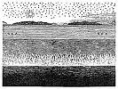

  
[Intangible Textual Heritage](../../index)  [Earth Mysteries](../index) 
[Index](index)  [Previous](za43)  [Next](za45) 

------------------------------------------------------------------------

[Buy this Book at
Amazon.com](https://www.amazon.com/exec/obidos/ASIN/0766149455/internetsacredte)

------------------------------------------------------------------------

  
*Zetetic Astronomy*, by 'Parallax' (pseud. Samuel Birley Rowbotham),
\[1881\], at Intangible Textual Heritage

------------------------------------------------------------------------

### THEODOLITE TANGENT.

IF a spirit-level or a theodolite is "levelled," and a given point be
read on a graduated staff at the distance of say 100 chains, this point
will have an altitude slightly in excess of the altitude of the
cross-hair of the theodolite; and if the theodolite be removed to the
position of the graduated staff, again levelled, and a back sight taken
of 100 chains, another excess of altitude will be observed; and this
excess will go on increasing as often as the back and fore sight
observations are repeated. From this

p. 265

it is argued that the line of sight from the theodolite is a tangent,
and, therefore, the surface of the earth is spherical. The author has
made experiments similar to the above, and found it to be as stated; but
the cause is not that the line of sight is a tangent, but the same
"collimation" as that referred to in the section on "Spherical Excess."

------------------------------------------------------------------------

### Footnotes

[264:1](za43.htm#fr_122) "Marine Advertiser,"
Sept. 19th 1871.

------------------------------------------------------------------------

[Next: Tangential Horizon](za45)
