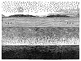

  
[Intangible Textual Heritage](../../index)  [Earth Mysteries](../index) 
[Index](index)  [Previous](za67)  [Next](za69) 

------------------------------------------------------------------------

[Buy this Book at
Amazon.com](https://www.amazon.com/exec/obidos/ASIN/0766149455/internetsacredte)

------------------------------------------------------------------------

  
*Zetetic Astronomy*, by 'Parallax' (pseud. Samuel Birley Rowbotham),
\[1881\], at Intangible Textual Heritage

------------------------------------------------------------------------

p. 417

# GENERAL INDEX.

Account of the Experiment on Old Bedford Bridge, on March 5th, 1870 268

Actual position of the earth in the universe [195](za31.htm#page_195)

Admiral [Coupvent](errata.htm#14) de Bois on the height of ocean waves
[222](za34.htm#page_222)

A great astronomical blunder [330](za60.htm#page_330)-332

Alternations of light and darkness at the Northern centre
[111](za26.htm#page_111)

Altitude, how to measure [100](za23.htm#page_100)

Altitude of the lights at Poolbeg, Holyhead, Dunkerque, Cordonan, the
Egerö, Madras, the Nicholson in New Zealand, and on Cape Bonavista
[28](za13.htm#page_28)-30

Analogy in favour of rotundity [300](za50.htm#page_300)

American aëronaut's account of his ascension from Baltimore
[37](za15.htm#page_37)

Ancient philosopher's attempt to discover the source of the tides
[165](za30.htm#page_165)

Apparent concavity of the earth as seen from a balloon
[36](za15.htm#page_36)

Apparent rising of the water and the sea horizon to the level of the eye
[40](za16.htm#page_40)

Approaching destruction of the earth by fire [177](za31.htm#page_177),
[199](za31.htm#page_199), [392](za66.htm#page_392)

Arago, M., on the supposed movement of the earth
[320](za55.htm#page_320)

Arcs of the meridian [241](za39.htm#page_241)

Arctic winter and summer described [116](za26.htm#page_116)

Arguments against the earth's rotundity deduced from the apparent
enlargement of the sun when rising and setting [129](za28.htm#page_129)

Atlantic Ocean, survey of the bed of, proof that the surface of the
great waters of the earth is horizontal [54](za18.htm#page_54)

Atlantic Ocean, table of distances across by the various routes
[92](za22.htm#page_92)

Atmospheric motion [74](za21.htm#page_74)

 

Balloon ascents by Mr. Coxwell and Mr. Glashier [38](za15.htm#page_38)

Balls fired vertically return in the same direction
[72](za21.htm#page_72)

Basil Hall, Captain, on the motion of the higher strata of clouds
[76](za21.htm#page_76)

Battlefields of Alma, Inkerman, and Magenta [384](za66.htm#page_384)

Bedford Level, experiments on [11](za05.htm#page_11)

Bedford Old Bridge, account, of experiment on March 5th, 1870
[268](za45.htm#page_268)

Bessel on invisible stars [150](za29.htm#page_150)

Bishop Wilkins' suggestion of a new and easy way of travelling
[77](za21.htm#page_77)

Bodies projected from other bodies in motion do not exhibit the same
behaviour as when projected from bodies at rest
[65](za21.htm#page_65)-69

Brighton, experiment with clinometer at [60](za20.htm#page_60)

 

Calculating eclipses and other phenomena [151](za29.htm#page_151)

Captain Basil Hall's observations from the summit of Peak Teneriffe
[76](za21.htm#page_76)

Captain Beechy's description of the sun describing a circle upon the
Southern horizon [106](za24.htm#page_106)

Cause of apparent rise of a plane towards the axis of the eye
[273](za45.htm#page_273)

Cause of day and night and summer and winter [111](za26.htm#page_111)

Cause of solar and lunar eclipses [130](za29.htm#page_130)

Cause of sunrise and sunset [124](za27.htm#page_124)

Cause of sun appearing larger when rising and setting than at noon-day
[128](za28.htm#page_128)

p. 418

Cause of ship's hull disappearing before the masthead
[201](za32.htm#page_201)

Cause of tides [158](za30.htm#page_158)

Cause of the long alternations of light and darkness at the Northern
centre [111](za26.htm#page_111)

Centre of the earth 88

Chemical condition of the earth [180](za31.htm#page_180)

Chinese remark concerning the earth going round the sun
[368](za66.htm#page_368)

Circumference of the earth, how to ascertain the
[89](za22.htm#page_89)-98

Circumnavigation of a plane [225](za35.htm#page_225)

Circumnavigation of the globe [224](za35.htm#page_224)

Clark, Dr. Adam, on reconciling Scriptures with the Newtonian astronomy
[370](za66.htm#page_370)

Clinometer experiment at Brighton 60 Clouds and bubbles in the moon
[336](za62.htm#page_336)

"Collimation," "divergence," and "refraction,"--experiments to show the
meaning of [266](za45.htm#page_266)

Commander Wilkes, U.S.N., on the extreme cold in the Southern region
[179](za31.htm#page_179)

Comparatively recent formation of the earth [77](za21.htm#page_77),
[377](za66.htm#page_377)

Continued daylight in the extreme South [290](za48.htm#page_290)

Copernican system admitted by its author to be an assumption
[2](za04.htm#page_2)

Copernicus and his theory of terrestrial motions [81](za21.htm#page_81)

Count Strzelechi's experience of the atmosphere at 6000 feet elevation
above that of the trade wind [77](za21.htm#page_77)

Cui Bono? [395](za66.htm#page_395)

Curvature in statute miles, table of the [10](za05.htm#page_10)

 

Datum line, standing order respecting the [56](za18.htm#page_56)

Day and night, cause of [111](za26.htm#page_111)

Declination of the Pole star [230](za36.htm#page_230)

Definition of the word "Tide" [161](za30.htm#page_161)

Deflection of falling bodies [313](za53.htm#page_313)

Degree of latitude, measurement of a, by Eratosthenes, 230 B.C.
[246](za40.htm#page_246)

Degree of latitude, measurement of a, by modern nations
[246](za40.htm#page_246)

Degrees of longitude [253](za41.htm#page_253)

Depth at which calm water is found in great storms
[161](za30.htm#page_161)

Derivation of the term "Zetetic" [1](za04.htm#page_1)

Description of the sun, as seen at midnight in Norway
[107](za24.htm#page_107)

Desierto las Palmas, light on the [59](za19.htm#page_59)

Desolation of the low Southern latitudes 2117

Destruction of the earth by fire [177](za31.htm#page_177),
[199](za31.htm#page_199), [392](za66.htm#page_392)

Diagrams, list of, see commencement of work.

Diameter of the field of vision [202](za32.htm#page_202)

Diameter of the earth [98](za22.htm#page_98)

Difference between the theory of rotundity and the results of actual
survey [57](za18.htm#page_57)

Difference in solar and sidereal times [321](za55.htm#page_321)

Difficulties raised by scientific objectors to Scriptural authority
[393](za66.htm#page_393)

Difficulties which render the theory of the earth's rotundity
contradictory [158](za30.htm#page_158)

Dimensions of ocean waves [222](za34.htm#page_222)

Dipping needle, the [227](za35.htm#page_227)

"Dip Sector," the [232](za37.htm#page_232)

Distance from London Bridge to the sea coast at Brighton
[102](za23.htm#page_102)

Distance of the sun, processes of ascertaining the
[99](za23.htm#page_99)-103

Distances across the Atlantic by the various routes
[92](za22.htm#page_92)

Distances which various volcanoes project lava, ashes, and flames
[188](za31.htm#page_188)

Doctrine of earth's rotundity entirely ignored in all extensive surveys
[57](za18.htm#page_57)

Doctrine of earth's rotundity interferes with Scripture teachings
[358](za66.htm#page_358)

Downward extent of the "great deep" [190](za31.htm#page_190)

Dublin Bay, experiment made across [33](za14.htm#page_33)

 

Earth a crust, inclosing a mass of fire [186](za31.htm#page_186)

Earth a floating island [179](za31.htm#page_179)

Earth a plane, consistent with the plans of the great surveyors and
engineers of the day [57](za18.htm#page_57)

p. 419

Earth a plane, proved by experiments [9](za05.htm#page_9), 243-46

Earth a plane, proved by the hull of a receding ship disappearing before
the masthead [212](za32.htm#page_212)

Earth an immense non-moving circular plane [88](za22.htm#page_88)

Earth-light [338](za63.htm#page_338)

Earth no axial or orbital motion [62](za21.htm#page_62)

Earth's centrifugal force [312](za52.htm#page_312)

Earth's rotation, an oft-repeated plausible statement in favour of,
refuted [78](za21.htm#page_78)

Earth's rotundity, examination of the so-called "Proofs" of the
[201](za32.htm#page_201)

Earth's supposed orbital motion logically void and non-available
[79](za21.htm#page_79)

Earth's surface, description of the [89](za22.htm#page_89)

Earth's true form and magnitude [88](za22.htm#page_88)

Earth's true position in the universe [177](za31.htm#page_177)

Ebb and flood tides not regularly exact [165](za30.htm#page_165)

Eclipse (Lunar) of February 27th, 1858, and February 6th, 1860
[133](za29.htm#page_133)

Eclipse (Lunar) a proof of rotundity 300 Eclipse (Lunar), rules to find
out all particulars of [154](za29.htm#page_154)

Eclipse (Lunar), to find the time, duration, and magnitude of
[155](za29.htm#page_155)

Eclipses (Solar and Lunar), cause of [130](za29.htm#page_130)

Eclipses predicted [152](za29.htm#page_152)

Eddystone light visible for 14 miles [218](za33.htm#page_218)

"Edinburgh Review" on the measurement of fixed stars
[84](za21.htm#page_84)

England to Adelaide, distance from [96](za22.htm#page_96)

Enlargement of the sun's path [326](za59.htm#page_326)

Equal radiation of light and heat [111](za26.htm#page_111)

Equinoxes, precession of the [324](za58.htm#page_324)

Eratosthenes' table of measurement of a degree of latitude
[246](za40.htm#page_246)

Eruptions of various volcanoes [187](za31.htm#page_187)-188

Erroneous application of perspective [205](za32.htm#page_205)

Evidence of the Plutonic action and origin of the earth
[177](za31.htm#page_177)

Evidence that the moon is not a reflector of the sun's light
[139](za29.htm#page_139)

Examples of lights being visible at sea which would be impossible upon a
globular surface [28](za13.htm#page_28)-30

Examination of the so-called "Proofs" of the earth's rotundity
[201](za32.htm#page_201)

Examples of the "Zetetic" process [4](za04.htm#page_4)-5

Expansion and contraction of the sun's path [108](za25.htm#page_108)

Experiment from the summit of Shooter's Hill to Hampstead Hill showing
the difference between the theory of rotundity and the results of actual
survey [57](za18.htm#page_57)

Experiment showing the apparent concavity of the earth
[36](za15.htm#page_36)-38

Experiment suggested by Copernicus for obtaining proof of orbital motion
[81](za21.htm#page_81)

Experiment to illustrate the phenomenon of the rising and setting of the
sun [126](za27.htm#page_126)

Experiment to show manner of the sea's suspension over a region of
elemental fire [192](za31.htm#page_192)

Experiment to test the supposed attraction of the moon upon the waters
of the earth [160](za30.htm#page_160)

Experiment with a grinding-stone, showing that if the earth revolves the
atmosphere would revolve in the same direction [73](za21.htm#page_73)-75

Experiment with metallic tubes showing that the earth has not the
slightest degree of orbital motion [79](za21.htm#page_79)

Experiment with pendulum, by General Sabine [240](za39.htm#page_240)

Experimental fix [16](za07.htm#page_16)

Experiments demonstrating the true form of standing water
[9](za05.htm#page_9)-62

Experiments showing that different theodolites give different degrees of
horizontal depression below the cross-hair [41](za16.htm#page_41)-48

Experiments showing that refraction does not account for the elevation
of objects seen at a distance of several miles [31](za14.htm#page_31)-36

Experiments showing that the earth has no motion of rotation
[62](za21.htm#page_62)-87

Experiments with pendulum by M. Foucault [302](za51.htm#page_302)

Experiments with pendulum in the open air [238](za39.htm#page_238)

p. 420

Extraordinary phenomenon attending the eclipse of February 27th, 1858
[133](za29.htm#page_133)

Extraordinary voyage [95](za22.htm#page_95)

Extremities of the earth bounded by ice and water
[177](za31.htm#page_177)

Faces of the dead [384](za66.htm#page_384)

Facts and their proofs concerning the real cause of tides
[161](za30.htm#page_161)

Falling bodies, deflection of [313](za53.htm#page_313)

Figure and dimensions of the earth, General Von Schubert on the
[250](za40.htm#page_250)

Figure of the earth, Von Gumpach on the [241](za39.htm#page_241),
[243](za40.htm#page_243), [250](za40.htm#page_250)

Fire in the internal parts of the earth [182](za31.htm#page_182),
[189](za31.htm#page_189)

Fixed stars, errors in measuring the distance of [84](za21.htm#page_84)

Formation of the earth, comparatively recent [177](za31.htm#page_177)

General summary and application [347](za66.htm#page_347)

General Von Schubert on the dimensions and figure of the earth
[250](za40.htm#page_250)

God's two voices [383](za66.htm#page_383)

Goose roasting by revolving fire [319](za54.htm#page_319)

Great circle sailing [279](za46.htm#page_279)

Great Ship Canal at Suez furnishes an instance of entire discrepancy
between the theory of the earth's rotundity and the results of practical
engineering [53](za18.htm#page_53)

Great surveys made on the principle of a horizontal datum line
[56](za18.htm#page_56)

Gunnery experiments showing that motion in the earth does not exist
[66](za21.htm#page_66)-72

Heaven and Hell [386](za66.htm#page_386)-389

Height of tides in various parts of Great Britain and Ireland
[168](za30.htm#page_168)

Heliostat, Lieut-Colonel Portlock and the [59](za19.htm#page_59)

Herschel, Sir J. W. F., Bart., on invisible moons in the firmament
[149](za29.htm#page_149)

Herschel, Sir J. W. F., Bart., on the parallax of certain stars
[83](za21.htm#page_83)

Horizontal eclipses [131](za29.htm#page_131)

Hot springs [183](za31.htm#page_183)

Hounslow Heath, measurement of [248](za40.htm#page_248)

How the earth is circumnavigated [223](za34.htm#page_223)

How the sun appears to ascend from the morning horizon to the noon-day
position, and thence to descend to the evening horizon
[125](za27.htm#page_125)

How to ascertain the earth's circumference [89](za22.htm#page_89)-98

How to measure altitude [100](za23.htm#page_100)

How to prove that a Lunar eclipse by a shadow of the earth is an utter
impossibility [132](za29.htm#page_132)

How to reach New York in a few hours [78](za21.htm#page_78)

Humboldt on different coloured stars [194](za31.htm#page_194)

Hydrographic records of high and low tides in different countries
[166](za30.htm#page_166)-168

 

Icy boundary wall at the earth's circumference [89](za22.htm#page_89)

Illustration of the law of natural perspective
[205](za32.htm#page_205)-212

Incompressible nature of water [162](za30.htm#page_162)

Injurious consequences of sleeping in full moonlight
[141](za29.htm#page_141)

Inquiry into the probable duration of the earth [196](za31.htm#page_196)

Instances that the lowest parts of receding bodies disappear before the
highest [214](za33.htm#page_214)-215

Internal convulsions, the cause of earth's irregular formations
[180](za31.htm#page_180)

Internal parts of the earth still on fire [182](za31.htm#page_182)

Invisible moons [149](za29.htm#page_149)

Invisible stars [150](za29.htm#page_150)

Irregularity of the time of ebb and flood tides [165](za30.htm#page_165)

Isle of Wight as seen through a theodolite [26](za13.htm#page_26)

 

Jugglers' performances prove that motion in the earth does not exist
[65](za21.htm#page_65)

 

Kepler rejects the Copernican theory [82](za21.htm#page_82)

Kossuth's, M. Francis, report of the survey of Mont Cenis Tunnel
[263](za43.htm#page_263)

p. 421

La Place on "Primitive Impulse" [350](za66.htm#page_350)

Law of natural perspective, illustrations of the
[205](za32.htm#page_205)-212

Length of degrees in various parallels [244](za40.htm#page_244)

Letter by Lord Palmerston on gunnery in connection with the earth's
rotation [70](za21.htm#page_70)

Letter from a correspondent in New Zealand relative to the sudden
darkness in that region [119](za26.htm#page_119)

Letter from Mr. Elliott, an American aëronaut, as to the appearance of
the earth from the car of a balloon [37](za15.htm#page_37)

Levelling, quotation from the Encyclopædia Britannica
[34](za14.htm#page_34)

Lieutenant Maury's table of distances across the Atlantic by the various
routes (circle sailing) [92](za22.htm#page_92)

Light and darkness at the northern centre [111](za26.htm#page_111)

Light of the moon devoid of heat [144](za29.htm#page_144)

Light, transmission of [223](za34.htm#page_223)

Lighthouses, altitudes of, at Poolbeg and Holyhead Pier
[28](za13.htm#page_28)

Lighthouses, altitudes of, at Egerö, Dunkerque, Cordonan, Madras, New
Zealand and Newfoundland [30](za14.htm#page_30)

Literal teachings of Old and New Testament concerning the world's
destruction plain and unmistakeable [393](za66.htm#page_393)

"Literary Gazette" on M. [Foucault's](errata.htm#15) experiments with
the pendulum [302](za51.htm#page_302)

"Liverpool Mercury" on the supposed manifestation of the rotation of the
earth [304](za51.htm#page_304)

"London Journal," extract from the, showing that the surface of the
earth as seen from a balloon, appeared concave instead of convex
[37](za15.htm#page_37)

Longitude between Adelaide and Sydney, difference of
[96](za22.htm#page_96)

Longitude, degrees of [253](za41.htm#page_253)

Longitudes at different latitudes, table of [256](za42.htm#page_256)

Long "sights" [59](za19.htm#page_59)

Long twilight in northern latitudes [119](za26.htm#page_119)

Loss of time on sailing westward [228](za35.htm#page_228)

Lunar eclipse a proof of rotundity [300](za50.htm#page_300)

Lunar eclipses [130](za29.htm#page_130)

 

Magnitude of the earth [88](za22.htm#page_88)

Magnitude of the sun, moon, and stars comparatively smaller than that of
the earth [104](za23.htm#page_104)

Mayhew's "Great World of London," extract from, showing that the earth
appeared concave when seen from the car of a balloon
[37](za15.htm#page_37)

Mean annual temperature of the whole earth at the level of the sea
[237](za39.htm#page_237)

Measurement of a degree of latitude by Eratosthenes, 230 B.C.
[246](za40.htm#page_246)

Measurement of a degree of latitude by modern nations
[246](za40.htm#page_246)

Measurement of the meridional arc by modern nations
[247](za40.htm#page_247)

Measurements of Hounslow Heath and Salisbury Plain
[248](za40.htm#page_248)

Measuring the distance of fixed stars [84](za21.htm#page_84)

Measuring the altitude of the Nelson Monument at Great Yarmouth
[100](za23.htm#page_100)

Mont Fréjus, details of the survey of the tunnel under
[48](za18.htm#page_48)

Moonlight devoid of heat [144](za29.htm#page_144)

Moonlight injurious to the eyesight of those who sleep in its beams
[141](za29.htm#page_141)

Moon, mass of the, according to Lindenau [158](za30.htm#page_158)

Moon self-luminous [139](za29.htm#page_139), [146](za29.htm#page_146),
[147](za29.htm#page_147)

Moon, shadows on the [341](za63.htm#page_341)

Moon transparent [337](za63.htm#page_337)

Moon's appearance [334](za61.htm#page_334)

Moon's phases [333](za60.htm#page_333)

Motion in the earth does not exist [66](za21.htm#page_66)

Motion of stars north and south [284](za47.htm#page_284)

Motion of the atmosphere [74](za21.htm#page_74)

Motion of the surface of the sea [162](za30.htm#page_162)

Motion of the sun a visible reality [105](za24.htm#page_105)

 

Natural law of perspective [206](za32.htm#page_206)

Neptune, the planet [328](za59.htm#page_328)

New and easy way of travelling, as suggested by Bishop Wilkins
[77](za21.htm#page_77)

p. 422

Newtonian theory a prolific source of atheism and irreligion
[355](za66.htm#page_355)

Newtonian theory false in its foundation; irregular, unfair, and
illogical in its details [354](za66.htm#page_354)

New Zealand, the length of the day in [120](za26.htm#page_120)

Noad, Dr., on the vibrations of pendulums [237](za39.htm#page_237)

Non-luminous stars [150](za29.htm#page_150)

Norway, description of the sun at midnight in [107](za24.htm#page_107)

 

Observations of Arctic navigators on the sun's motion 106

Observations with the Dip Sector, by Sir J. W. F. Herschel, Bart.
[232](za37.htm#page_232)

Observations with the telescope on the "Nab" light-ship from Victoria
Pier, Portsmouth [217](za33.htm#page_217)

Occultation of Jupiter by the moon [339](za63.htm#page_339)

Occultation of the Pleiades by the moon [340](za63.htm#page_340)

Ocean tides less or greater, according to pressure of atmosphere
[164](za30.htm#page_164)

Ocean waves, on the dimensions of [222](za34.htm#page_222)

Old Bedford Bridge, account of the experiment on March 5th, 1870
[268](za45.htm#page_268)

Only one material world mentioned in Scripture [374](za66.htm#page_374)

Orbital motion, experiments showing that the earth is without
[62](za21.htm#page_62)-87

 

Palmerston (Lord) on gunnery in connection with the earth's rotation
[70](za21.htm#page_70)

"Parallax" and his Teachings [402](za67.htm#page_402)

Parallax assigned to α [Centauri](errata.htm#16) [83](za21.htm#page_83)

Peculiarity of the climate of New Zealand [121](za26.htm#page_121)

Peculiar path of the sun, as demonstrated by actual observation
[110](za25.htm#page_110)

Pendulum experiment by M. Foucault, of Paris [302](za51.htm#page_302)

Pendulum experiments by General Sabine [240](za39.htm#page_240)

Pendulum vibrations, variability of [235](za38.htm#page_235)

Perspective, a simple and visible law of, operating to cause sunrise and
sunset [124](za27.htm#page_124)

Perspective, erroneous application of [205](za32.htm#page_205)

Perspective on the sea [213](za32.htm#page_213)

Perspective, the law of [203](za32.htm#page_203)

Phenomena of sunrise and sunset illustrated by placing a light in a
tunnel [126](za27.htm#page_126)

Philosophical teachings of Scripture consistent with those of Zetetic
Astronomy. See "Scripture Proofs" in List of Works, &c.

Pilot Balloons [75](za21.htm#page_75)

Pitch darkness in the Southern whaling grounds [123](za26.htm#page_123)

Planet Neptune, the [328](za59.htm#page_328)

Planets, stations and retrogradations of [322](za57.htm#page_322)

Plausible statement in favour of the earth's rotation, refuted
[78](za21.htm#page_78)

Plurality of worlds an impossibility [358](za66.htm#page_358),
[361](za66.htm#page_361), [382](za66.htm#page_382)

Polar exploration [177](za31.htm#page_177)

Pole Star, declination of the [230](za36.htm#page_230)

Position of the earth in relation to the rest of the universe
[189](za31.htm#page_189)

Position of the earth in the universe [177](za31.htm#page_177)

Precession of the equinoxes [324](za58.htm#page_324)

Predicted eclipses [152](za29.htm#page_152)

Present chemical condition of the earth [177](za31.htm#page_177)

"Primitive impulse" [350](za66.htm#page_350)

Probable duration of the earth [196](za31.htm#page_196)

Professor Airey on Newton's assumption that the earth is fluid, and in
shape a spheroid [239](za39.htm#page_239)

Professor Bessel and the parallax of a star in the constellation of
Cygnus [83](za21.htm#page_83).

Professor De Morgan on the rotundity of the earth [7](za04.htm#page_7)

Professor Hunt on God's two voices [383](za66.htm#page_383)

Professor Oerstead on the deviation of falling bodies from the
perpendicular [315](za54.htm#page_315)

Professor Silliman on the temperature of Artesian wells in Paris
[184](za31.htm#page_184)

Professor Tyndall's experience of lying with his face towards the moon
[142](za29.htm#page_142)

Proof of the constant pressure of the atmosphere on the earth
[161](za30.htm#page_161)

p. 423

Proof of the fluctuating motion of all floating masses
[163](za30.htm#page_163)-164

Proofs of the irregularity of the times of ebb and flood tides
[166](za30.htm#page_166)

Proof of the peculiar motion of the star "Polaris"
[172](za30.htm#page_172)

Proof that atmospheric air is very elastic [163](za30.htm#page_163)

Proof that floating masses have a tremulous motion
[169](za30.htm#page_169)

Proof that large lakes are without tide [172](za30.htm#page_172)

Proof that the earth has a tremulous motion at all times
[169](za30.htm#page_169)

Proof that the tide generally turns a little earlier below than it does
above [171](za30.htm#page_171)

Proof that tides in the extreme South are very small
[170](za30.htm#page_170)

Proof that the velocity of a flood tide increases as it approaches land
[164](za30.htm#page_164)

Proof that the velocity of an ebb tide decreases as it leaves shore
[165](za30.htm#page_165)

Proof that water is incompressible [162](za30.htm#page_162)

"Punch" on the earth's rotary motion [309](za52.htm#page_309)

 

Question of "Parallax," Dr. Lardner, Sir J. W. F. Herschel, Bart., and
the "Edinburgh Review," on the [84](za21.htm#page_84)-85

 

Radiation of light and heat [111](za26.htm#page_111)

Railways and earth's centrifugal force [312](za52.htm#page_312)

Range of the eye [202](za32.htm#page_202)

Refraction can only exist where the line of sight passes from one medium
into another of different density [34](za14.htm#page_34)

Refraction caused by the earth's atmosphere an inadequate solution to
the phenomena of horizontal eclipses [131](za29.htm#page_131)

Results of experiments made upon sea-going steamers always incompatible
with the theory that the earth is a globe [46](za16.htm#page_46)

Rhumb-line sailing [282](za47.htm#page_282)

Rise and fall of tide in the South Seas [170](za30.htm#page_170)

Rising and setting of the sun [129](za28.htm#page_129)

Rotundity of the earth, examination of the so-called "proofs" of the
[201](za32.htm#page_201)

Rotundity of the earth, Lord Palmerston on gunnery in connection with
the [70](za21.htm#page_70)

Rotundity of the earth, Professor De Morgan on the [7](za04.htm#page_7)

Rotundity, the doctrine of, entirely ignored in all extensive surveys
[57](za18.htm#page_57)

 

Sailor's story, a [122](za26.htm#page_122)

Salisbury Plain, measurement of [248](za40.htm#page_248)

Scripture teachings respecting the material world literally true (see
Scripture proofs in List of Works, &c.) [360](za66.htm#page_360)-401

Sections of railways give proof that the earth is in reality a plane
[47](za18.htm#page_47)

Shadows on the moon [341](za63.htm#page_341)

Ship's hull disappearing before the masthead explained
[201](za32.htm#page_201)-221

Shipwreck on the western shores of Scotland [385](za66.htm#page_385)

Shipwrecks from a false idea of the form and measurement of the earth's
surface [259](za42.htm#page_259)

Simplest method of ascertaining any future eclipse
[153](za29.htm#page_153)

Sir Charles Lyell's remarks on hot springs [183](za31.htm#page_183)

Sir James Clarke Ross's description of the central regions
[178](za31.htm#page_178)

Sir James Clarke Ross on sailing westward [228](za35.htm#page_228)

Sir J. F. W. Herschel, Bart., on the parallax of a star in the
constellation Cygnus [83](za21.htm#page_83)

Sir J. F. W. Herschel's observations with the Dip Sector
[232](za37.htm#page_232)

Solar and sidereal times, difference in [321](za55.htm#page_321)

Solar and lunar eclipses, cause of [130](za29.htm#page_130)

South Seas, rise and fall of tide in the [170](za30.htm#page_170)

Southern Cross [287](za48.htm#page_287)

Sphericity inevitable from semi-fluidity [251](za41.htm#page_251)

Spherical excess [261](za42.htm#page_261)

p. 424

Standing order of the Houses of Lords and Commons on railway operations
[56](za18.htm#page_56)

Standing water, experiments demonstrating the true form of
[9](za05.htm#page_9)

Star "Polaris," how to observe its peculiar motion
[172](za30.htm#page_172)

Stars, non-luminous [150](za29.htm#page_150)

Stars of varied colours near the Southern Cross [194](za31.htm#page_194)

Stars, north and south, motion of [284](za47.htm#page_284)

Stations and distances [276](za46.htm#page_276)

Stations and retrogradation of planets [322](za57.htm#page_322)

Strzelechi, Count, on the motion of the higher strata of clouds
[76](za21.htm#page_76)

Subaqueous world of fire below the "foundations of the earth"
[192](za31.htm#page_192)

Sudden disappearance of a vessel on the "Old Bedford" Canal
[15](za07.htm#page_15)

Suez Canal, furnishes an instance of entire discrepancy between the
earth's rotundity and the result of practical engineering
[53](za18.htm#page_53)

Summer and winter, cause of [111](za26.htm#page_111)

Sun appearing larger when rising and setting than at noon day, cause of
[128](za28.htm#page_128)

Sun seen at midnight in Norway, the [107](za24.htm#page_107)

Sun, simple process of ascertaining the true distance of the
[99](za23.htm#page_99)

Sun, moon, stars, and comets, of comparatively smaller magnitude than
the earth [104](za23.htm#page_104)

Sun and moon two great lights [373](za66.htm#page_373)

Sun's motion, a visible reality [105](za24.htm#page_105)

Sun's motion concentric with the polar centre, the
[105](za24.htm#page_105)

Sun's path, expansion and contraction of the [108](za25.htm#page_108)

Sun's progressive and concentric motion over the earth practically
demonstrable [367](za66.htm#page_367)

Sun's motion recognised in religious and mythological poems of all ages
[369](za66.htm#page_369)

Sun's path, enlargement of the [326](za59.htm#page_326)

Sunlight and moonlight compared [140](za29.htm#page_140)

Sunrise and sunset, cause of [124](za27.htm#page_124)

Supposed manifestation of the rotation of the earth
[304](za51.htm#page_304)

Surface of the earth a plane, logically deduced
[45](za16.htm#page_45)-46

Survey of the tunnel under Mont Fréjus, confirmatory of the earth being
a plane [48](za18.htm#page_48)

Survey of the bed of the Atlantic Ocean, an illustration that the
surface of the great waters of the earth is horizontal
[54](za18.htm#page_54)

 

Table of curvature in statute miles [10](za05.htm#page_10)

Table of height of tides in various parts of Great Britain and Ireland
[168](za30.htm#page_168)

Table of longitudes at different latitudes [256](za42.htm#page_256)

Table of measurement of a degree of latitude by Eratosthenes
[246](za40.htm#page_246)

Table of measurement of a degree of latitude by modern nations
[246](za40.htm#page_246), [247](za40.htm#page_247)

Table of the length of degrees in various parallels
[244](za40.htm#page_244)

Table of the mean annual temperature of the earth at different latitudes
[238](za39.htm#page_238)

Tangential horizon [265](za44.htm#page_265)

Temperature at the bottom of the deepest coal mine in England
[183](za31.htm#page_183)

Terrestrial motions and the theory of Copernicus [81](za21.htm#page_81)

Theodolite, experiments with the [17](za07.htm#page_17)-58

Theodolite tangent [264](za43.htm#page_264)

Theory defined [1](za04.htm#page_1)

Theory of the earth's rotundity contradictory [158](za30.htm#page_158)

Thermometer lower in moonlight than in the shade
[143](za29.htm#page_143)

Tides in the South Seas [170](za30.htm#page_170)

Tides, the cause of [158](za30.htm#page_158)

Total lunar eclipses [134](za29.htm#page_134)-136

Transmission of light [323](za57.htm#page_323)

True distance of the sun [99](za23.htm#page_99)

True form and magnitude of the earth [88](za22.htm#page_88)

True form of standing water, experiments demonstrating the
[9](za05.htm#page_9)-62

True position of the earth in the universe [177](za31.htm#page_177)

Tunnel experiment to illustrate the phenomenon of the rising and setting
of the sun [126](za27.htm#page_126)

p. 425

Tunnel under Mont Fréjus [48](za18.htm#page_48)

Twilight [119](za26.htm#page_119)

United States Minister's description of the sun at midnight in Norway
[107](za24.htm#page_107)

"Universal solvent," the [361](za66.htm#page_361)

"Up" and "down," and "above" and "below" [388](za66.htm#page_388)

Uranus, discovery of [329](za60.htm#page_329)

 

Valencia, in Ireland, distance of from the polar centre
[96](za22.htm#page_96)

Valencia, in Ireland, direct distance from, to Cape Town
[96](za22.htm#page_96)

"Vanishing point," the [124](za27.htm#page_124),
[206](za32.htm#page_206)

Variability of pendulum vibrations [235](za38.htm#page_235)

Vasco de Gama's voyage to the South [177](za31.htm#page_177)

Verrier's, M., great astronomical blunder [330](za60.htm#page_330)-332

Volcanic action constantly increasing and extending
[197](za31.htm#page_197), [198](za31.htm#page_198)

Volcanoes the safety-valves of the earth [185](za31.htm#page_185),
[186](za31.htm#page_186), [187](za31.htm#page_187)

Von Gumpach on the figure of the earth [241](za39.htm#page_241)-243,
[250](za40.htm#page_250)

Von Schubert on the figure and dimensions of the earth
[250](za40.htm#page_250)

Voyage extraordinary [95](za22.htm#page_95)

Ward, the Hon. Mrs., on lunar eclipses [134](za29.htm#page_134),
[136](za29.htm#page_136)

"Warrior," H.M.S., regularity of fluctuation in Plymouth Bay
[164](za30.htm#page_164)

Water incompressible [162](za30.htm#page_162)

Waves, on the dimensions of [222](za34.htm#page_222)

Welney Bridge and Welche's Dam, experiments between
[11](za05.htm#page_11)

Wesley, Rev. John, on all systems of astronomy [371](za66.htm#page_371)

What supports the waters? [190](za31.htm#page_190)

Why a ship's hull disappears before the masthead
[201](za32.htm#page_201)-221

Why Kepler and others reject the Copernican theory
[83](za21.htm#page_83)

Why the earth is not at all times illuminated all over its surface
[123](za26.htm#page_123)

Winter and summer, cause of [111](za26.htm#page_111)

Works, Newspapers, Periodicals, &c., referred to or quoted from
[412](za67.htm#page_412)

 

Zetetic and theoretic defined and compared [1](za04.htm#page_1)

Zetetic, derivation of the term [1](za04.htm#page_1)

Zetetic evidence that the moon is self-luminous [139](za29.htm#page_139)

Zetetic inquiry into the downward extent of the "great deep"
[190](za31.htm#page_190)

Zetetic process, examples of [4](za04.htm#page_4)-5

 

 

------------------------------------------------------------------------

[Next: List of Works, Newspapers, Periodicals, Published Correspondence,
and Scripture Texts Referred to or Quoted From](za69)
