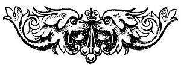

  
[Intangible Textual Heritage](../../index)  [Earth Mysteries](../index.md) 
[Index](index)  [Previous](za68.md) 

------------------------------------------------------------------------

[Buy this Book at
Amazon.com](https://www.amazon.com/exec/obidos/ASIN/0766149455/internetsacredte.md)

------------------------------------------------------------------------

  
*Zetetic Astronomy*, by 'Parallax' (pseud. Samuel Birley Rowbotham),
\[1881\], at Intangible Textual Heritage

------------------------------------------------------------------------

p. 426

### LIST OF WORKS, NEWSPAPERS, PERIODICALS, PUBLISHED CORRESPONDENCE, AND SCRIPTURE TEXTS REFERRED TO OR QUOTED FROM.

A Christian Philosopher of the last Century [356](za66.htm#page_356.md)

All the Year Round [144](za29.htm#page_144.md)

Analysis of Newton's Principia. By Henry Lord Brougham, F.R.S.
[183](za31.htm#page_183.md)

Antarctic Voyages. By Sir James Clarke Ross, R.N. 178,
[288](za48.htm#page_288.md)

Arago, M., on the supposed Movement of the Earth
[320](za55.htm#page_320.md)

Arctic Explorations (W. & It. Chambers) [116](za26.htm#page_116.md)

Astronomy and Astronomical Instruments. By G. G. Carey
[131](za29.htm#page_131.md)

Athenæum, March 25, 1865 [7](za04.htm#page_7.md)

Australian Almanack, 1859. Communication by Captain Stokes, H.M.S.
"Albion" [254](za42.htm#page_254.md)

Ditto, 1871 [93](za22.htm#page_93.md)

Australian Handbook, Almanack and Shippers' and Importers' Directory,
1872 (Gordon & Gotch) [254](za42.htm#page_254.md)

Australian and New Zealand Gazette, 1857 [278](za46.htm#page_278.md)

Ditto, April 9, 1853 [95](za22.htm#page_95.md)

 

Boston Post, October 30, 1856 [92](za22.htm#page_92.md)

Brighton Examiner, July 1, 1870 [107](za24.htm#page_107.md)

Builder, September 20, 1862 [259](za42.htm#page_259.md)

 

Captain Basil Hall, R.N., F.R.S., on Twilight in New Zealand
[119](za26.htm#page_119.md)

Captain Beechy's description of the sun at midnight
[106](za24.htm#page_106.md)

Castle's Treatise on Levelling [262](za43.htm#page_262.md)

Chambers' Journal, No. 100 [161](za30.htm#page_161.md)

Cheltenham Examiner, November 29, 1865 [95](za22.htm#page_95.md)

Condensed Navigation (Whittaker, London) [260](za42.htm#page_260.md)

Cook's Strait Almanack, 1848 [120](za26.htm#page_120.md)

Cosmos. By Alex. von Humboldt [150](za29.htm#page_150.md),
[184](za31.htm#page_184), [194](za31.htm#page_194.md),
[198](za31.htm#page_198), [287](za48.htm#page_287.md),
[332](za60.htm#page_332.md)

 

Daily News, April 5, 1865 [396](za66.htm#page_396.md)

Ditto, September 18, 1871. M. Kossuth's account of the survey of Mont
Fréjus Tunnel [48](za18.htm#page_48.md)

Daily Telegraph, July 16, 1870 [131](za29.htm#page_131.md)

De Facia in Orbe Luna. By Plutarch [137](za29.htm#page_137.md)

Description of the Battlefields of Inkerman, Alma, and Magenta
[384](za66.htm#page_384.md)

Dion Cassius, Tome iv. Sturtz [137](za29.htm#page_137.md)

Discoveries in the South Sea. By Captain James Burney
[337](za63.htm#page_337.md)

Dr. Rees' Cyclopædia. Article "Degrees" [262](za43.htm#page_262.md).

p. 427

Edinburgh Review, June, 1850 [84](za21.htm#page_84.md)

Electrical Theory of the Universe. By T. S. Mackintosh
[350](za66.htm#page_350.md)

Elements of Astronomy. By W. Maddy, M.A. [157](za29.htm#page_157.md)

Elliott's Balloon Ascent from Baltimore [37](za15.htm#page_37.md)

Encyclopedia Britannica. Article on "Levelling" [34](za14.htm#page_34.md)

Encyclopædia of Geography. By Hugh Murray and several Professors of the
University of Edinburgh [244](za40.htm#page_244.md),
[245](za40.htm#page_245.md)

Encyclopædia Londinensis [149](za29.htm#page_149.md),
[152](za29.htm#page_152), [358](za66.htm#page_358.md)

Encyclopedia Metropolitana. Article by Professor Barlow
[152](za29.htm#page_152.md)

English Mechanic, January 4, 1867 [198](za31.htm#page_198.md)

Extract from the Life of Dr. Adam Clark [370](za66.htm#page_370.md)

Extracts from the Works of the Rev. J. Wesley, 3rd edition, 1849
[371](za66.htm#page_371), [372](za66.htm#page_372.md)

Field Newspaper, March 26, 1870 [268](za45.htm#page_268.md)

 

Figure of the Earth. By Johannes von Gumpach, 2nd edition, 1862.
(Hardwicke.) [241](za39.htm#page_241), [243](za40.htm#page_243.md),
[259](za42.htm#page_259.md)

 

Good Words. Article by Sir John F. W. Herschel, Bart.
[83](za21.htm#page_83.md)

Gutch's Southampton Almanack and Time Tables [167](za30.htm#page_167.md)

 

Handbook to the Official Catalogue of the Great Exhibition of 1851
[59](za19.htm#page_59.md)

Household Words, October 18, 1856 [172](za30.htm#page_172.md)

How to Observe the Heavens. By Dr. Lardner [332](za60.htm#page_332.md)

Illustrated Almanack, 1864 [131](za29.htm#page_131.md),
[137](za29.htm#page_137.md)

Illustrated London Almanack, 1847 [329](za60.htm#page_329.md),
[330](za60.htm#page_330.md)

Illustrated London News, September 7, 1861 [142](za29.htm#page_142.md)

 

Is the World Flat or Round? By Captain George Peabody, F.R.G.S., 1871.
(Bellows, Gloucester) [166](za30.htm#page_166), [168](za30.htm#page_168.md)

 

Journal of the Society of Arts, May, 1850. A Paper on the Principles of
Great Circle Sailing, by Mr. J. T. Towson, of Devonport
[282](za47.htm#page_282.md)

 

Lectures on Astronomy. By M. Arago [142](za29.htm#page_142.md),
[145](za29.htm#page_145), [324](za58.htm#page_324.md),
[325](za59.htm#page_325.md)

Lectures on Chemistry. By Dr. Noad [145](za29.htm#page_145.md),
[237](za39.htm#page_237.md)

Lectures on Natural Philosophy. By Professor Partington
[152](za29.htm#page_152.md)

Leeds Mercury, April 20, 1867 [96](za22.htm#page_96.md)

Leisure Hour, October 11, 1862 [38](za15.htm#page_38.md)

Ditto, May 21, 1864 [38](za15.htm#page_38.md)

Lessons in Elementary Astronomy. By R. A. Proctor, B.A., F.R.A.S., 1871
[276](za46.htm#page_276.md)

Letter from a Correspondent in New Zealand, 1857
[119](za26.htm#page_119.md)

Letter from Lord Palmerston on gunnery in connection with the earth's
rotation [70](za21.htm#page_70.md)

Lighthouses of the World, 1862 (Lawrie) [29](za14.htm#page_29.md),
[219](za33.htm#page_219.md)

Life of Christ Zetetically considered. By Parallax. (In the Press.)
[196](za31.htm#page_196.md)

Literary Gazette, 1851 [302](za51.htm#page_302.md)

Liverpool Almanack [169](za30.htm#page_169.md)

Liverpool Mercury, January 8 and June 3, 1867 [92](za22.htm#page_92.md),
[93](za22.htm#page_93.md)

Ditto, May 23 and May 17, 1851 [304](za51.htm#page_304.md),
[305](za52.htm#page_305.md)

London Journal, February 4, 1857 [326](za59.htm#page_326.md)

Ditto, July 18, 1857 [37](za15.htm#page_37.md)

London Saturday Journal, August 8, 1840 [162](za30.htm#page_162.md)

p. 428

Manchester Examiner, May 24, 1851 (Supplement) [305](za52.htm#page_305.md),
[306](za52.htm#page_306.md)

Marine Advertiser, September 19, 1871 [264](za43.htm#page_264.md)

Mayhew's Great World of London [37](za15.htm#page_37.md)

Mayhew's Wonders of Science [203](za32.htm#page_203.md)

McCulloch's Geography [131](za29.htm#page_131.md)

Mechanic's Magazine, 1843 [314](za54.htm#page_314.md)

Ditto, May 20 and July 1, 1848 [316](za54.htm#page_316.md),
[318](za54.htm#page_318.md)

Mechanism of the Heavens. By Dr. Olmstead, Professor of Natural
Philosophy and Astronomy in Yale College, United States
[153](za29.htm#page_153), [334](za61.htm#page_334.md)

Memoirs of the Imperial Academy of Sciences of St. Petersburg, 1859. By
General von Schubert [250](za40.htm#page_250.md)

Million of Facts. By Sir Richard Phillips [152](za29.htm#page_152.md),
[165](za30.htm#page_165), [183](za31.htm#page_183.md),
[238](za39.htm#page_238.md)

Monthly Notices of the Royal Astronomical Society, March 9, 1860.
Article by Norman Pogson, Esq. [133](za29.htm#page_133.md)

Ditto, June 8, 1860 [339](za63.htm#page_339.md)

Ditto, December 9, 1859, and May 11, 1860 [340](za63.htm#page_340.md)

Morning Advertiser, September 16, 1871 [127](za27.htm#page_127.md)

Morning Star, March 3, 1858 [133](za29.htm#page_133.md)

Museum of Science. By Dr. Lardner [85](za21.htm#page_85.md),
[144](za29.htm#page_144.md)

Narrative of the United States Exploring Expedition. By Lieutenant
Charles Wilkes, U.S.N. [171](za30.htm#page_171.md),
[179](za31.htm#page_179), [290](za48.htm#page_290.md),
[291](za49.htm#page_291), [295](za49.htm#page_295.md)

New Zealand. By Arthur S. Thompson, Esq., M.D. [120](za26.htm#page_120.md)

 

Orbs of Heaven. By Mitchell [335](za62.htm#page_335.md)

Ovid's Metamorphoses [366](za66.htm#page_366.md)

 

Pamphlet by W. Swainson, Esq., Attorney-General for New Zealand, 1856
(Smith, Elder) [119](za26.htm#page_119.md)

Paper by M. Babinet, read before the French Academy of Sciences,
September 15, 1848 [330](za60.htm#page_330.md)

Paper on Polar Explorations, read before the Royal Dublin Society
[118](za26.htm#page_118.md)

Penny Cyclopædia. Article "Sea" [162](za30.htm#page_162.md)

Philosophical Magazine, 1848 [133](za29.htm#page_133.md),
[149](za29.htm#page_149.md)

Philosophical Transactions for 1800 [376](za66.htm#page_376.md)

Physical Description of the Heavens. By Alex. von Humboldt
[137](za29.htm#page_137), [150](za29.htm#page_150.md),
[158](za30.htm#page_158), [194](za31.htm#page_194.md),
[338](za63.htm#page_338), [382](za66.htm#page_382.md)

Physical Geography of the Sea. By Lieutenant Maury, U.S.
[162](za30.htm#page_162.md)

Physical Sciences. By Somerville [152](za29.htm#page_152.md)

Polar Exploration. By W. Locke, of the Royal Dublin Society
[177](za31.htm#page_177.md)

Proceedings of the Royal Artillery Institution, 1867
[71](za21.htm#page_71.md)

Professional Papers of the Corps of Royal Engineers. By Major Colby
[247](za40.htm#page_247), [248](za40.htm#page_248.md)

Professor Hunt [383](za66.htm#page_383.md)

Punch, May 10, 1851 [309](za52.htm#page_309.md)

 

Quiver, October 5, 1861 [187](za31.htm#page_187.md),
[200](za31.htm#page_200.md)

 

Rambles of a Naturalist. By M. de Quatrefages [185](za31.htm#page_185.md)

Recreative Science [136](za29.htm#page_136), [186](za31.htm#page_186.md),
[187](za31.htm#page_187), [188](za31.htm#page_188.md)

Report of the British Association for the Advancement of Science, 1846.
Letter from Professor Oerstead [315](za54.htm#page_315.md)

p. 429

Scientific Review, April, 1866 [223](za34.htm#page_223.md).

Scientific Travels in Brazil. By MM. von Spix and Karl von Martius
[287](za48.htm#page_287.md)

Scotsman. Article by Mr. Charles Maclaren [308](za52.htm#page_308.md)

Scripture Proofs.

That earth and seas are two distinct and independent regions, and not
one great globe.--Psalms xxiv., 12, xxxvi., 6; 2 Peter, iii., 5.
[364](za66.htm#page_364.md)

That Heaven is above and Hell below the earth.--Deuteronomy xxvi., 15;
Exodus xix., 20; Psalm cii., 19; Isaiah lxiii., 15; Psalm ciii., 2; 2
Kings ii., 11; Mark xvi., 10; Isaiah xiv., 13, 14; Acts i., 9-11, vii.,
55; Luke xxiv., 51; Deuteronomy xxxii., 22; Job xi., 8; Psalms Iv., 15,
cxxxix., 8; Proverbs vii., 27; Isaiah xiv., 15; Proverbs ix., 18, xv.,
24; Isaiah xiv., 9; Ezekiel xxxi., 16, 17, xxxii., 27; Matthew xi., 23;
2 Peter ii., 4; Jude i., 6, 7, 13; Revelations xx., 10, 13, 14; Job
xxviii., 5 [386](za66.htm#page_386), [387](za66.htm#page_387.md),
[388](za66.htm#page_388.md).

That the earth is a floating structure standing in and out of the
waters.--Job xxv., 7 [365](za66.htm#page_365.md)

That the earth will be ultimately burnt up and destroyed.--Isaiah
xxxiv., 4, lxvi., 15-22; 2 Thessalonians, i., 7, 8; Revelations xx., 11;
2 Peter iii., 10-13; Deuteronomy xxxii., 22; Revelations xxi., 1
[392](za66.htm#page_392), [393](za66.htm#page_393.md).

That the "great deep," is fathomless.--Jeremiah xxxi., 37
[367](za66.htm#page_367.md)

That the stars are placed in the heavens to give light upon the
earth.--Genesis i., 16, 17; Isaiah xiii., 10; Ezekiel xxxii., 7; Joel
ii., 10; Psalm cxlviii., 3; Jeremiah xxxi., 35; Daniel xii., 3
[380](za66.htm#page_380), [381](za66.htm#page_381.md)

That the sun and moon are distinct lights.--Revelations vi., 12
[380](za66.htm#page_380.md)

That the sun and moon are lights to rule the day and night alternately,
and to be "for signs and for seasons and for days and years."--Genesis
i., 14-16; Psalm cxxxvi., 7-9; Jeremiah xxxi., 35; Ezekiel xxxii., 7, 8;
Psalm cxlviii., 3; Isaiah xii., 10; Matthew xxiv., 29; Isaiah lx., 19,
20; Ecclesiastes xii., 2; Isaiah xxx., 26; Deuteronomy xxxiii., 14
[378](za66.htm#page_378.md).

That the sun moves and is not a fixed body.--Psalm xix., 4-6;
Ecclesiastes i., 5; Joshua x., 13; Judges v., 31; 2 Esdras iv., 34
[369](za66.htm#page_369.md)

That the supposition of the heavenly bodies being suns and systems of
inhabited worlds is false.--Genesis 1.,1,16,17; Hebrews i., 2, xi., 3
[372](za66.htm#page_372), [373](za66.htm#page_373.md)

That the waters of the "great deep" sustain the land, and that there are
waters below the earth.--Genesis xliv., 25; Exodus ix., 4; Deuteronomy
iv., 18, xxxiii., 13 [366](za66.htm#page_366.md)

That where the word "world" is used in the plural number in Scripture,
it means the material and spiritual world.--Hebrews ii., 5; Ephesians
i., 21; Luke xviii., 29-30; Matthew xii., 32 [374](za66.htm#page_374.md)

The deluge consistent with the earth being a plane "founded on the
seas."--Psalm civ., 6-8 [395](za66.htm#page_395.md)

Sir James South's Letter to the "Times" [339](za63.htm#page_339.md).

Six Lectures on Astronomy. By Professor Airey. 4th edition
[240](za39.htm#page_240.md)

p. 430

Smith's Rise and Progress of Astronomy [150](za29.htm#page_150.md)

South Sea Voyages. By Sir James Clarke Ross, RN. [77](za21.htm#page_77.md),
[170](za30.htm#page_170), [171](za30.htm#page_171.md),
[259](za42.htm#page_259), [260](za42.htm#page_260.md),
[278](za46.htm#page_278), [287](za48.htm#page_287.md),
[292](za49.htm#page_292), [293](za49.htm#page_293.md)

Spherical Form of the Earth. By J. Dyer [341](za63.htm#page_341.md)

Standing Orders of the Houses of Lords and Commons on Railway
Operations, 1862 [56](za18.htm#page_56.md)

 

The Dimensions of Ocean Waves. Paper read by Admiral Coupvent de Bois
before the Academy of Sciences [222](za34.htm#page_222.md)

The Earth. By Captain A. W. Drayson, Royal Artillery
[248](za40.htm#page_248.md)

The Moon. By W. R. Birt, F.R.A.S., in "Leisure Hour," July, 1871
[336](za62.htm#page_336.md)

Times Newspaper, September 18, 1848 [332](za60.htm#page_332.md)

Ditto, 1851 [304](za51.htm#page_304.md)

Ditto, June 10, 1863 [188](za31.htm#page_188.md)

Ditto, August 20, 1872 [368](za66.htm#page_368.md)

Tour through Creation. By Rev. Thomas Milner, M.A.
[258](za42.htm#page_258.md)

Treatise on Astronomy. By Sir J. W. F. Herschel [85](za21.htm#page_85.md),
[149](za29.htm#page_149), [232](za37.htm#page_232.md),
[246](za40.htm#page_246.md)

Treatise on Mathematical Instruments. By J. F. Heather, M.A. (Weale &
Co.) [43](za16.htm#page_43.md)

Treatise on Navigation. By J. Greenwood, Esq. (Weale & Co.)
[165](za30.htm#page_165), [282](za47.htm#page_282.md)

 

Voyage towards the South Pole. By Captain James Weddell, F.R.S.E. 2nd
edition, 1827 (Longman, Rees, & Co.) [170](za30.htm#page_170.md),
[260](za42.htm#page_260), [297](za49.htm#page_297.md),
[327](za59.htm#page_327.md)

Voyage to the South. By Vasco de Gama [177](za31.htm#page_177.md)

 

Wanderings in the East. By Rev. J. Gadsby, 1854 [141](za29.htm#page_141.md)

Webb, Rev. T., in Monthly Notices of the Royal Astronomical Society, May
11, 1860 [340](za63.htm#page_340.md)

Western Daily Mercury, October 25, 1864 [218](za33.htm#page_218.md)

Wise's Aeronautics [36](za15.htm#page_36.md)

World's Birthday. By Professor L. Gaussen, Geneva
[185](za31.htm#page_185), [326](za59.htm#page_326.md)

 

\_\_\_\_\_\_\_\_\_\_\_\_\_\_\_\_\_\_\_\_\_\_\_\_\_\_\_\_\_\_\_\_\_\_\_\_\_\_\_\_\_\_\_\_\_\_\_  
Printed by JOHN B. DAY, "Savoy Steam Press," Savoy Street,
Strand.

 
