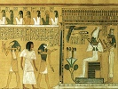

  
[Intangible Textual Heritage](../../index)  [Ancient Egypt](../index.md) 
[Index](index)  [Previous](ael01)  [Next](ael03.md) 

------------------------------------------------------------------------

  
*Ancient Egyptian Legends*, by M. A. Murray, \[1920\], at Intangible
Textual Heritage

------------------------------------------------------------------------

p. 9

### CONTENTS

|        |                                                                        |                           |
|--------|------------------------------------------------------------------------|---------------------------|
| I.     | The Princess and the Demon              | [11](ael04.htm#page_11.md)   |
|        | Notes                                                                  | [107](ael14.htm#page_107.md) |
| II\.   | The King's Dream                        | [20](ael05.htm#page_20.md)   |
|        | Notes                                                                  | [107](ael14.htm#page_107.md) |
| III\.  | The Coming of the Great Queen           | [24](ael06.htm#page_24.md)   |
|        | Notes                                                                  | [108](ael15.htm#page_108.md) |
| IV\.   | The Book Of Thoth                       | [29](ael07.htm#page_29.md)   |
|        | Notes                                                                  | [109](ael15.htm#page_109.md) |
| V.     | Osiris                                  | [41](ael08.htm#page_41.md)   |
|        | Notes                                                                  | [109](ael15.htm#page_109.md) |
| VI\.   | The Scorpions Of Isis                   | [52](ael09.htm#page_52.md)   |
|        | Notes                                                                  | [110](ael15.htm#page_110.md) |
| VII\.  | The Black Pig                           | [56](ael10.htm#page_56.md)   |
|        | Notes                                                                  | [111](ael15.htm#page_111.md) |
| VIII\. | The Battles of Horus                    | [59](ael11.htm#page_59.md)   |
|        | Notes                                                                  | [112](ael15.htm#page_112.md) |
| IX\.   | The Beer of Heliopolis                  | [74](ael12.htm#page_74.md)   |
|        | Notes                                                                  | [113](ael15.htm#page_113.md) |
| X.     | The Name of Ra                          | [80](ael13.htm#page_80.md)   |
|        | Notes                                                                  | [114](ael15.htm#page_114.md) |
| XI\.   | The Regions of Night and Thick Darkness | [86](ael14.htm#page_86.md)   |
|        | Notes                                                                  | [114](ael15.htm#page_114.md) |

------------------------------------------------------------------------

[Next: Editorial Note](ael03.md)
