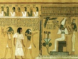

  
[Intangible Textual Heritage](../../index)  [Ancient Egypt](../index.md) 
[Index](index)  [Previous](ael13)  [Next](ael15.md) 

------------------------------------------------------------------------

  
*Ancient Egyptian Legends*, by M. A. Murray, \[1920\], at Intangible
Textual Heritage

------------------------------------------------------------------------

p. 86

### XI

### THE REGIONS OF NIGHT AND THICK DARKNESS

When the world came into being, there
were two rivers, the river of Egypt and the river of the sky. Great is
the Nile, the river of Egypt, rising in his two caverns in the South
beyond the cataract, flooding the land of Egypt and bringing joy and
good harvests to Ta-mery. Great and mighty is the river of the sky,
flowing across the heavens and through the Duat, the world of night and
of thick darkness, and on that river floats the Boat of Ra. Boat of
Millions of Years is its name, but men call it the Manzet Boat in the
dawn, when Ra rises in splendour on the eastern horizon of heaven; the
Mesektet Boat is it called in the evening, when Ra enters in glory
within the portals of the Duat, where the mountain of Manu lifts its
peaks to the western sky. On the western horizon is the mountain of
Manu. and on the eastern horizon the mountain of Bakhu; vast and huge
are they, raising their crests above the earth, and the sky rests upon

p. 87

their summits. And on the topmost peak of the mountain of Bakhu dwells a
serpent; thirty cubits in length is he, and his scales are of flint and
of glittering metal. He guards the mountain and the Great Green Waters,
and none can pass by him save Ra in his Boat.

In the evening Ra descends in majesty to the Western horizon of heaven,
to the portals of the Duat at the Gap of Abydos. Splendid is the
Mesektet Boat, glorious its trappings, and its colours are of amethyst
and emerald, jasper and turquoise, lazuli and the lustre of gold. At the
Gap of Abydos waits a company of gods to prepare the Boat for the
journey through the Duat, the land of night and of thick darkness.
Stripped is the Boat of its splendour, bare and without glory is it when
it passes through the portals of the Duat, and in it is the body of Ra,
lifeless and dead.

Then the gods take the great towing-ropes; slowly the Boat moves along
the river. The portals of the Duat are flung wide, and the twelve
goddesses of the night take their place upon the Boat to guide it
through the gloom and perils of the Duat; pilots of the river are they,
and without them not Ra himself could pass through unscathed.

"Watercourse of Ra" is the name of the first country of the Duat. Sombre
is this land, yet not wholly dark; for on either side the river are six
serpents, coiled and with heads erect, and the

p. 88

breath of their mouths is a flame of fire. In the cabin of the Boat is
Ra, dead and lifeless; in the prow are Up-uaut, the Opener of the Ways,
and Sa, and the goddess of the hour. Round about the cabin are a company
of gods; these are they who guard Ra from all perils and dangers, and
from the attack of the abominable Apep.

Slowly goes the Boat of Ra, passing through the Duat, to regions of
thick darkness, of horror and dismay, where the dead have their
habitations, and Apep lies in wait for the coming of Ra. Thus passes the
first hour of the night, and the second hour is at hand.

At the entrance of every country of the Duat is a gate; tall are the
walls, and narrow is the passage; upon the walls are spearheads, sharp
and pointed, that no man may climb over. The door of the gate is of
wood, turning on a pivot, and a monstrous snake guards the door. None
may pass by him save those only to whom his name is known. At the turn
of the passage are two great hooded snakes, the one above, the other
below. The breath of their mouths is fire and poison mingled; through
the narrow portal on every side they send forth streams of flame and
venom. At either end of the passage stands a warder, keeping watch.

Then the goddess of the first hour makes way for the goddess of the
second hour, and she calls aloud the name of the Guardian of the gate.

p. 89

\[paragraph continues\] Flung wide are the
portals, the fire and poison cease, and the Boat of Ra passes through.

"Ur-nes" do we name this second country of the Duat, but the Hanebu and
those who inhabit the isles of the Great Green Waters call it Ouranos.
The river is wide and bears on its dark waters four shallops; no oars
have they, neither masts nor rudders, but float upon the stream and are
carried by the current. Mysterious and strange are they, and the shadowy
shapes which fill them have forms like the forms of men. In this country
Ra is Lord and King, and those who live here are in peace, for none can
pass the great hooded snakes who guard the gates, whose breath is
mingled flame and venom. Happy are those who inhabit this land, for here
dwell the spirits of the corn, Besa and Nepra and Tepu-yn. These are
they who make the wheat and barley to flourish and cause the fruits of
the earth to increase.

Slowly goes the Boat of Ra, passing through the Duat, through regions of
thick darkness, of horror and dismay, where the dead have their
habitation, and Apep lies in wait for the coming of Ra. Thus passes the
second hour of the night, and the third hour is at hand. Then the
goddess of the second hour makes way for the goddess of the third hour,
and she calls aloud the name of the Guardian of the gate. Flung wide are
the portals, and the Boat of Ra passes through.

"Watercourse of the only God" is the name of

p. 90

the third country of the Duat, and here in the beautiful Amentet is the
Kingdom of Osiris. On either side the river are the great shapes of the
gods surrounding the form of Osiris himself. Enthroned is he, appearing
in splendour as king, with the White Crown of the South Land and the Red
Crown of the North Land upon his head.

Great is Osiris, god of the dead, for all who die come before him for
judgment, and their hearts are weighed in the balance against the
feather of Truth. His throne is set upon a running stream, clear and
deep, and from the waters rises a single lotus-blossom, the colour of
the sky at morning. Upon the blossom stand the four Children of Horus,
they who assist Osiris at the Judgment, who protect the bodies of the
dead. To them belong the South and the North, the West and the East, and
the four great goddesses are their protectors. They stand upon the
lotus-blossom and their faces are towards Osiris; the first has the face
of a man, the second the face of an ape, the third the face of a jackal,
and the fourth the face of a bird of prey. This is the hour which
evil-doers fear; by their own actions are they judged, and naught can
avail them. Heavy is the heart of the evil-doer and drags down the
scale; lower and lower it sinks till it reaches the jaws of Amemt, the
Devourer of Hearts. Then is the evil-doer driven forth into the thick
darkness of the Duat, to dwell with the abominable

p. 91

\[paragraph continues\] Apep and to fall
at last into the Pits of Fire.

But some there are who have wrought righteousness upon earth; who have
hurt no man by fraud or violence; who have succoured the widow, the
orphan, and the shipwrecked mariner; who have given food to the hungry
and clothes to the naked; who have not stirred up strife, nor caused the
shedding of tears. When these come to the Judgment of Osiris, and their
hearts are put in the balance, then is the feather of Truth the heavier.
The scale with the feather sinks down, and the scale with the heart
rises up. Then does Thoth, the twice-great, take the heart and place it
again in the breast of the man, and Horus takes him by the hand and
leads him to the foot of the throne of Osiris that he may dwell in the
kingdom of Osiris for ever and for evermore. And now only can he see the
most pure and truly holy Osiris, for "the souls of men are not able to
participate of the divine nature whilst they are encompassed about with
bodies and passions…When they are freed from these impediments and
remove into those purer and unseen regions…’tis then that this God
becomes their Leader and King; upon him they wholly depend, still
beholding without satiety, and still ardently longing after that beauty,
which ’tis not possible for man to express or think." [\*](#fn_0.md)

p. 92

Slowly goes the Boat of Ra, passing through the Duat, to regions of
thick darkness, of horror and dismay, where the abominable Apep lies in
wait for the coming of Ra, and where the Pits of Fire are prepared for
the wicked. Thus passes the third hour of the night, and the fourth hour
is at hand. Then the goddess of the third hour makes way for the goddess
of the fourth hour, and she calls aloud the name of the Guardian of the
gate. Flung wide are the portals, and the Boat of Ra passes through.

"Living one of forms" is the name of the fourth country of the Duat, and
Sokar has dominion in this land. Dreary is the waste of sand, limitless
the desert, gloomy and sombre the landscape. No blade of grass is seen,
no tree, no herbage; naught grows, naught lives, save monstrous
many-headed serpents, gliding along the ground or creeping upon legs.
Terrible are they of aspect as they writhe and turn and hiss and roar;
they raise their hideous crests on high and hold their dusky wings
outspread. But their anger is not towards Ra, and he passes safely
through their midst.

Engulfed is the great river and lost beneath the shifting sands, and
where it ran is now a deep ravine. The walls of rock rise high and
steep, and ever the way winds and turns between the rocks. Men call this
place Re-stau, the Mouth of the Tomb. Even in this gloomy desert Osiris
has dominion; Lord of Re-stau is he called, therefore

p. 93

none need fear when traversing the narrow path. And now the Boat of Ra
can no longer float upon the water, but is changed into a great and
mighty serpent with glittering scales. At the prow is a serpent's head
with eyes watchful and fierce, at the stern is a serpent's head with
poison-fangs prepared. Over the sand it glides as a boat glides over the
water.

Slowly goes the Boat of Ra, passing through the Duat, through regions of
thick darkness, of horror and dismay, to the place where Apep lies in
wait for the coming of Ra. Thus passes the fourth hour of the night, and
the fifth hour is at hand. Then the goddess of the fourth hour makes way
for the goddess of the fifth hour, and she calls aloud the name of the
Guardian of the gate. Flung wide are the portals, and the Boat of Ra
passes through.

"Hidden" is the name of the fifth country of the Duat, and in this dark
and gloomy region dwells Sokar, its Lord and King, god of those who are
buried. Beside a turn of the winding way is his dwelling deep below the
ground; above it rises a high mountain of sand. Guarding it on either
side are two sphinxes; lions are they in their bodies, with the faces of
men; and their claws are outstretched like the talons of a beast of
prey. In the midst lies a serpent with three heads, and between his
wings stands Sokar in the form of a man with the head of a hawk. Savage
and fierce as a hawk is Sokar, and terrible

p. 94

is the punishment he metes out to those who rebel against him. Hard by
his dwelling is a lake where the water boils and bubbles with heat as
water boils in a pot. Into the boiling lake are cast the rebels, and
they cry to Ra for help, but Ra lies cold and lifeless, waiting for the
coming of Khepera, and their cries are unheeded while the Boat passes on
its way.

On the farther wall of the ravine is a high and vaulted building, the
home of Night and Darkness. Two birds cling on either side, and round
about it glides a two-headed serpent. He lifts his savage heads, and his
poison is ever ready to strike the rash intruder who should dare to try
to pass. Faithful is his watch, for in the home of Night and Darkness
lives Khepera, the great Soul of the universe, he whose emblem is the
beetle, the god of resurrection. In the form of a scarab he watches the
coming of Ra, and he flies upon the Boat and awaits there the time when
he shall bring Life back to the god. And now through the thick darkness
along the narrow passage falls a gleam of light; the Morning Star stands
by the gate to lead the Boat onwards; for in the darkest of the night is
a promise of the coming day.

Slowly goes the Boat of Ra, passing through the Duat, through regions of
thick darkness, of terror and dismay, to the place where the abominable
Apep lies in wait for the coming of Ra.

p. 95

\[paragraph continues\] Thus passes the
fifth hour of the night, and the sixth hour is at hand. Then the goddess
of the fifth hour makes way for the goddess of the sixth hour, and she
calls aloud the name of the Guardian of the gate. Flung wide are the
portals, and the Boat of Ra passes through.

"Abyss of waters" is the name of the sixth country of the Duat, and
Osiris has dominion over it, Osiris, the great god, Lord of the city of
Daddu, the living King, Creator of men, of cattle, and of the green
things which grow upon the earth, Osiris, to whom all men bow in praise
and adoration.

The river rises out of the sand again, and the Boat floats upon its
waters, and those who are in it rejoice, for the hours of the night are
passing away. On the banks of the river are the great shapes of the
gods, mysterious and wonderful; nine sceptres of sovereignty stand there
also, and a monstrous lion looms through the darkness, faintly seen in
the light which comes from the Boat of Ra. Three shrines stand beside
the river, and a serpent whose breath is flame guards each one. Mystic
and strange are the forms within the shrines, and to man it is not given
to know the meaning of them; in one is a human head, in another the wing
of a bird, in the third the hind part of a lion. Here also lives the
great coiled serpent with five heads, and within his coils lies Khepera,
god of resurrection. On his

p. 96

head he places the scarab, beneath his feet is the sign of flesh; thus
does he send Life into the dead, and thus will he re-vivify Ra. For this
is the farthest point of the Duat, and beyond the gate lies the way to
the sunrise.

Slowly goes the Boat of Ra, passing through the Duat, through regions of
thick darkness, of horror and dismay, where the abominable Apep lies in
wait for the coming of Ra. Thus passes the sixth hour of the night, and
the seventh hour is at hand. Then the goddess of the sixth hour makes
way for the goddess of the seventh hour, and she calls aloud the name of
the Guardian of the gate. Flung wide are the portals, and the Boat of Ra
passes through.

"Secret cavern" is the name of the seventh country of the Duat. Full of
danger and peril is it, for the abominable Apep dwells in this land. As
a great and monstrous serpent does he appear and with wide-open mouth he
swallows the waters of the river, that the Boat may be wrecked and that
Ra may perish. Then would the earth belong to the powers of darkness,
and evil and wickedness would overcome the gods.

But in the prow of the Boat stands Isis, the great enchantress, whose
magic none can withstand; Isis, the greatest of the goddesses, she who
can raise the dead, and to whom all mankind pay love and reverence. With
arms outstretched, she recites the Words of Power; calling aloud

p. 97

across the dark river. Over the body of Ra, the serpent Mehen casts his
protecting coils, for now is the time of danger.

On a sandbank in the midst of the river lies the abominable Apep. Four
hundred and fifty cubits long is the sandbank; the coils of Apep cover
it so that naught can be seen but the river around him. Loud does he
hiss and roar, and the Duat is filled with the thunder of his voice, yet
Isis flinches not, nor does she cease her incantations and the magical
movements of her hands. Her spells prevail and the abominable Apep lies
helpless on the sand. Then Selk and Her-desuf leap from the Boat of Ra
and bind him with cords, and with sharp knives they pierce his flesh,
hoping to destroy him. But Apep is immortal, and every night will he
await and attack the Boat of Ra. Yet Selk and Her-desuf hold him fast
while the Boat continues on its way, past the great sandbanks, where he
writhes and twists and struggles to get free, but the cords are strong
and the knives are sharp and his efforts are in vain.

Onward goes the Boat to the burial-places of the gods. These stand
beside the river; high mounds of sand are they, over each mound is a
building, and at each end the head of a man watches the passing of Ra.

Softly goes the Boat of Ra, passing through the Duat, moving through the
darkness to the

p. 98

sunrise and the day. Thus passes the seventh hour of the night, and the
eighth hour is at hand. Then the goddess of the seventh hour makes way
for the goddess of the eighth hour, and she calls aloud the name of the
Guardian of the gate. Flung wide are the portals, and the Boat of Ra
passes through.

"Sarcophagus of the gods" is the name of the eighth country of the Duat,
for here dwell the dead gods. Dead and buried are they, embalmed and
bandaged as men embalm and bandage the dead upon earth. They cry aloud
salutations to Ra as he passes, calling to him across the vast expanse,
but so far away are they that the sound of their voices is as the
roaring of savage bulls, as the cry of birds of prey, as the wail of
mourners, as the murmur of bees. Before the Boat go nine Followers of
the Gods; strange are their forms, mysterious and wonderful, like naught
that is upon the earth. In front of them march the four souls of Tatanen
in the likeness of rams, great and fierce, with horns wide-spreading and
sharp-pointed. The first is crowned with high upstanding plumes, the
second with the Red crown of the North Land, the third with the White
crown of the South Land, the fourth with the glittering disk of the sun.
Ancient is Tatanen, dweller in Memphis, where the abode of Ptah is on
the south of the wall.

Softly goes the Boat of Ra, passing through

p. 99

the Duat, moving through the darkness to the sunrise and the day. Thus
passes the eighth hour of the night, and the ninth hour is at hand. Then
the goddess of the eighth hour makes way for the goddess of the ninth
hour, and she calls aloud the name of the Guardian of the gate. Flung
wide are the portals, and the Boat of Ra passes through.

"Procession of images" is the name of the ninth country of the Duat.
Full and strong runs the river, and the Boat is borne forward upon the
rushing stream. Twelve star-gods guard the Boat, with paddles in their
hands, ready to help the Boat in case of need. Thick darkness broods not
upon this land, for twelve great hooded snakes lie coiled upon the bank,
and the breath of their mouths is a flame of fire, gleaming upon the
dark water and upon those who dwell in the Duat. Three shallops float
upon the sombre river; strange is the shape of these shallops, not like
the boats of men; and the shadowy forms within them are in the likeness
of a cow, of a ram, and of the soul of a man. From them the dwellers in
this land receive the offerings which are made to them upon the earth.
Then the star-gods break into singing; and the twelve goddesses and the
weaving gods and the dwellers in this land chant the glory and honour of
Ra, praising the Lord of the Boat, the Maker of earth and of heaven.
With joy and singing they follow the appointed path.

p. 100

Onward goes the Boat of Ra, passing through the Duat, travelling to the
sunrise and the light of open day. Thus passes the ninth hour of the
night, and the tenth hour is at hand. Then the goddess of the ninth hour
makes way for the goddess of the tenth hour, and she calls aloud the
name of the Guardian of the gate. Flung wide are the portals, and the
Boat of Ra passes through.

"Abyss of waters, lofty of banks" is the name of the tenth country of
the Duat, and the ruler is Ra. The dwellers in this land come to meet
their king as he passes by upon the swelling river. Deep and full and
strong runs the stream, and the Boat is borne forward upon the rushing
current. Divine warriors armed with glittering weapons of war are a
guard for their king; light is on their faces like the light of the sun.
By the side of the river are four goddesses; upon the darkness they cast
beams of light, making bright the way of Ra upon the gloomy river.
Before the Boat of Ra moves the Star of Morning in the form of a
double-headed serpent walking upon legs, and upon his heads are the
crowns of the South Land and the North Land; between his coils is the
great hawk of the sky; Leader of Heaven is his name, for the stars of
heaven follow him, but men call him Hesper and Lucifer also. In a
shallop on the stream is a snake, Life of the Earth is he called, and he
watches in the Duat against the enemies of Ra.

p. 101

The greatest of all the countries of the Duat is this, for in this realm
of wonder and mystery Khepera joins himself to Ra, and Ra himself is
created anew. Yet the dead body of Ra remains in the Boat; but his soul
is united to the soul of Khepera.

Onward goes the Boat of Ra, passing through the Duat, travelling to the
sunrise and the light of open day. Thus passes the tenth hour of the
night and the eleventh hour is at hand. Then the goddess of the tenth
hour makes way for the goddess of the eleventh hour, and she calls aloud
the name of the Guardian of the gate. Flung wide are the portals, and
the Boat of Ra passes through.

"Mouth of the cavern" is the name of the eleventh country of the Duat,
and Ra is its ruler. Low has the river fallen and sluggishly it runs,
and the Boat is drawn onwards by the gods; not with cords do they tow
it, but with the body of the great serpent Mehen, the protector of Ra.
On the prow of the Boat is a fiery star, but its light is not redder
than the strange and lurid glow which fills this land; terrible and red
is it and the sight of it is full of horror. This is the region feared
by evil-doers, for their punishment awaits them here. Far and near are
pits of fire; goddesses, whose breath is flame, guard the pits, holding
in their hands gleaming swords of fire. With their knives do they
torment the wicked and

p. 102

cast them into the pits of flame till they perish utterly. Horus stands
by and beholds their torments, for these are the enemies of Osiris and
of Ra, doers of evil upon the earth and blasphemers of the gods. No help
can come to them, no escape is possible; doomed are they by their own
actions to the sword and fire. And the smoke and flame of their torment
rise up in the Duat.

On the far side of the river are the stars; Shedu is there in the
fashion of a snake; scarlet and crimson is he, and the stars which form
his body are ten in number. There also a shape is seen, mysterious and
wonderful; like a winged snake with legs does he appear, and between the
wings is the shadowy likeness of a man. Men call him Atmu, dweller in
Heliopolis; ancient is Atmu, more ancient than Ra himself; and he sends
the sweet breezes of the North Wind upon the land of Egypt. On either
side of him the Eyes of Horus show dimly in the faint and lurid light.
And now springs up the breeze of morning; gentle is it and slight, but
with it comes the promise of the day.

Onward goes the Boat of Ra, passing through the Duat, travelling to the
sunrise and the light of open day. Thus passes the eleventh hour, and
the twelfth hour and the dawn are at hand Then the goddess of the
eleventh hour makes way for the goddess of the twelfth hour, and she

p. 103

calls aloud the name of the Guardian of the gate. Flung wide are the
portals, and the Boat of Ra passes through.

"Darkness has fallen, and births shine forth" is the name of the twelfth
country of the Duat. On the prow of the Boat is the great scarab of
Khepera, ready to make the transformations of Ra ere he reaches the end
of the Duat. Not like other lands is this twelfth region of the Duat,
for it is enclosed in the body of a vast and monstrous serpent. "Life of
the Gods" is his name, and through this great and huge frame travels the
Boat of Millions of Years. Twelve of the worshippers of Ra seize the
towing-ropes and drag the Boat onward, and here in the body of the
serpent is Ra transformed into Khepera and is alive again, for now the
journey through the Duat is near the end. Standing by the mouth of the
serpent are twelve goddesses; to these the Worshippers of Ra yield the
towing-ropes, and they draw the Boat to the eastern horizon of heaven.
And now the dead corpse of Ra is cast out of the Boat, as the husk is
cast away when the grain is winnowed out, for the soul and the life of
Ra are in the scarab of Khepera, and the transformations of Ra are
completed. With shouting and singing, with joy and with gladness, the
Boat of Ra passes out of the Duat.

Glorious is the Manzet Boat, speeding to the

p. 104

sunrise! Wide, swing wide the portals, and usher in the day. Between the
sycomores of turquoise comes the Boat of Ra, and the mountain of Bakhu
is flushed with light. The serpent, guardian of the Great Green Waters,
beholds Ra in glory in the eastern horizon of heaven, and the rays
glitter on his scales.

Glorious is the Manzet Boat, borne upon the river, flashing in the
splendour and the light of open day. In the foam at the prow of the Boat
sports the Abtu-fish, darting through the gleaming spray, and the
Ant-fish is seen in the whirlpool of turquoise. From the earth rises up
the sound of rejoicing, for all created things praise Ra at his rising.

Hail to thee, Ra, at thy rising; the night and the darkness are past. At
the dawn of the day thou shinest, the heavens are filled with thy light.
King of the Gods art thou, all glory and triumph are thine. The Gods
come as dogs to thy feet, rejoicing to greet thee at dawn. Hail to thee
Ra, at thy rising; at thy coming all men are glad. In joy dost thou come
in the morning, with glory thou rulest the world. The stars of the
heavens adore thee, the Gods of the earth exalt thee, Lord of the
Heavens art thou. Hail to thee, Ra, at thy rising! None can express thy
glory, Lord of all Wisdom and Truth. The souls of the East attend thee,
the souls of the West are thy servants, the North and the South

p. 105

adore thee. Worshipped art thou, our Ruler, by those whom thou hast
created, Thou risest in heaven's horizon, thou causest mankind to
rejoice. Hail to thee, Ra, at thy rising; at thy rising in beauty, O Ra.

p. 106 p. 107

------------------------------------------------------------------------

### Footnotes

[91:\*](ael14.htm#fr_0.md) Plutarch, *De Iside et
Osiride* (Squire's translation).

------------------------------------------------------------------------

[Next: Notes](ael15.md)
