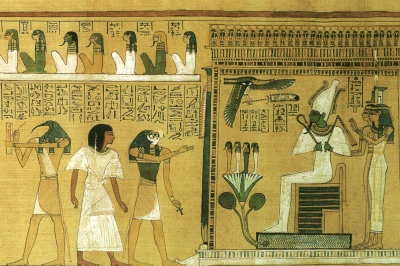

  
[Intangible Textual Heritage](../../index)  [Ancient Egypt](../index) 

------------------------------------------------------------------------

<table width="75%">
<colgroup>
<col style="width: 50%" />
<col style="width: 50%" />
</colgroup>
<tbody>
<tr class="odd">
<td width="50%" data-valign="TOP"></td>
<td width="50%" data-valign="CENTER"><h1 id="ancient-egyptian-legends" data-align="CENTER">Ancient Egyptian Legends</h1>
<h2 id="by-m.-a.-murray" data-align="CENTER">by M. A. Murray</h2>
<h4 id="section" data-align="CENTER">[1920]</h4></td>
</tr>
</tbody>
</table>

------------------------------------------------------------------------

[Contents](#contents)    [Start Reading](ael00)    [Page
Index](pageidx)    [Text \[Zipped\]](ael.txt.gz)

------------------------------------------------------------------------

This entry in the [Wisdom of the East](../../woe/index) series covers
the mythology of the Egyptian gods and godesses. The author, Margaret
Alice Murray, wrote other books about Ancient Egypt, as well as [The
Witch Cult in Western Europe](../../pag/wcwe/index), an early study of
whether the witch trials had any underlying reality.

------------------------------------------------------------------------

 [Title Page](ael00)  
[Preface](ael01)  
[Table of Contents](ael02)  
[Editorial Note](ael03)  
[I: The Princess and the Demon](ael04)  
[II: The King's Dream](ael05)  
[III: The Coming of the Great Queen](ael06)  
[IV: The Book of Thoth](ael07)  
[V: Osiris](ael08)  
[VI: The Scorpions of Isis](ael09)  
[VII: The Black Pig](ael10)  
[VIII: The Battles of Horus](ael11)  
[IX: The Beer of Heliopolis](ael12)  
[X: The Name of Ra](ael13)  
[XI: The Regions of Night and Thick Darkness](ael14)  
[Notes](ael15)  
[Index of Names of Gods](ael16)  
[Advertisements](ael17)  
