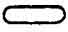

  
[Intangible Textual Heritage](../../index)  [Egypt](../index.md)  [EHH
Index](../ehh)  [Index](index)  [Previous](bat07)  [Next](bat09.md) 

------------------------------------------------------------------------

p. 85

# CHAPTER V.

### THE FIFTH DIVISION OF THE TUAT, WHICH IS CALLED AMENT.

IN the scene that illustrates the FIFTH Division of the Tuat, which is
passed through by the Sun-god during the FIFTH HOUR Of the night, we see
the boat of the sun being drawn along by seven gods and seven goddesses
(see pp. [91](#page_91), [95](#page_95), [99](#page_99.md),
[103](#page_103), [107](#page_107).md). The legend over the seven gods is
partly broken away, but what remains of it proves that it must have been
similar in meaning to that which is over the heads of the goddesses,
which reads, "These are the goddesses which tow RA along in the Tuat
over this Circle, and they make this great god to advance so that he may
rest in NU in the Tuat."

In front of the seven goddesses march four gods, who appear to be under
the guidance of "Isis of Amentet," and who are described as the "great
sovereign chiefs who provide food in this Circle,"

p. 86

The first god is called HER-KHU, and holds a staff in his hand; the
second is AN-HETEP, and holds the sceptre in his hand; the third is
HERU-HEQUI, is hawk-headed, and holds the crook in his hand; the fourth
is UT-METU, and holds a tree in his left hand.

The text containing the address of the Sun-god to the seven gods is
broken away, and all that remains of it reads, "This great god maketh
his journey by means of those who tow him over this Circle in \[his\]
boat." A portion of the answer of the seven gods to him is also broken
away, but what remains of it reads, "Is opened to thee the earth to such
an extent that thou hast passed over the Beautiful Land, and the roads
concerning which Ra hath spoken to thee, O Osiris. Thou criest out, O
Ra, to the Land of Seker, and Horus hath life upon his sands. Come to
Khepera, O Ra! Come to Khepera! Work ye with the cord, O ye who make
Khepera to advance, so that it may give the hand (i.e., help) to Ra
whilst he passeth over the hidden ways of Ra, in the horizon. \[Come\]
in peace, in peace, O Ra of the Beautiful

p. 87

 [  
Click to view](img/08700.jpg.md)  
The Kingdom of Seker.

p. 88

p. 89

\[paragraph continues\] Ament". In the middle of the scene we see that
the ground rises (see [p. 103](#page_103).md) and forms a kind of hollow
mound, the highest point of which terminates in the head of a woman,
which faces to the right; immediately above her head is a scarab which
is in the act of descending, but only one half of its body is visible.
Concerning the beetle it is said, "Behold Khepera who, immediately the
\[boat of Ra\] is towed to the top of this Circle, unites himself to the
roads of the Tuat; when this god standeth on the head of the goddess he
speaketh words to Seker every day." The short lines of text just above
the mound read, "The majesty of this great god journeyeth on by being
towed along, and these goddesses receive him,

p. 90

words which are addressed to the god by the goddesses are, "Come, O Ra,
in the peace of the Tuat! Let Ra advance on the road in the boat which
is in the earth, in his own body, and let his enemies be destroyed.
\[The goddess\] Ament crieth (?) to thee, O Ra, so that thou mayest join
her, and mayest go forwards in the sky as the GREAT ONE who is in the
horizon, and mayest be towed along by those who tow thee, and, verily,
mayest destroy all thine enemies," this address Ra replies, saying, "O
ye who have received your weapons, O ye who have grasped your sceptres,
O ye who shake your spears, O ye who stand by your *tchefau* food, who
sit down to your offerings, who are the warders of food and bread and
are the lords of the provisions in Ament, Isis giveth herself unto you,
and Ament joineth herself unto you, so that I may

p. 91

 

 [  
Click to view](img/09100.jpg.md)  
The Kingdom of Seker.

 

p. 93

stand up by you for your protection when I pass by you in peace," The
"Land of Sekri," which is mentioned by the seven gods who are towing the
boat of Ra, lies immediately below the mound of earth, and forms, as it
were, an oval island in the river of the Tuat; its shape is, as M.
Maspero has said, an elongated ellipse, 
, and it is formed wholly of sand. The "Land of Sekri"
is described in the legend which is written at each end of the oval as
"The horizon (?) of the hidden country of Sekri, which guardeth the
hidden body (or, flesh)," This mysterious oval is supposed to rest upon
the bodies of two man-headed lion sphinxes set tail to tail; of these,
however, only the heads and fore quarters

p. 94

appear, one at each end of the oval. Each sphinx is called AF, and he is
said "to have his existence from the voice of the great god," and "his
work is to keep ward over his image."

Within the oval already described is stretched out at almost full length
on the ground a monster serpent (see pp. [99](#page_99.md),
[103](#page_103).md), which has two snakes' heads at one end of his body,
and a bearded human head at the other (see [99](#page_99).md); the text
above his snakes' heads is mutilated, and all that can be made out
satisfactorily are the words *neter aa*, "great god." From the middle of
his body springs a pair of wings, and between them, immediately under
the female head at the top of the mound, stands the god SEKRI, in the
form of a hawk-headed man. Of him it is said, "His work is to protect
his own form," and of the serpent, "he liveth upon the magical
protection which issueth from his mouth every day."

The text which refers to the oval reads:--

p. 95

 

 [  
Click to view](img/09500.jpg.md)  
The Kingdom of Seker.

 

p. 97

"The Image which is in this picture is in thick darkness. The dawn in
the horizon which belongs to this god \[cometh\] from the eyes of the
heads of the great god, whose flesh sendeth forth light, and whose legs
are bent round, the great god who keepeth ward over the flesh of SEKRI,
who is on his sand, his own image. The voice of this horizon is heard in
this hour after this great god hath passed them by, like unto the sound
of the roarings which are in the heights of heaven when they are
disturbed by a storm."

On the left of the horizon (see [p. 95](#page_95).md) of SEKRI is the
serpent TEPAN, who liveth by the voice of the primeval gods of the
earth. He cometh forth and he goeth in, and he presenteth the offerings
made to this great god every day unseeing \[and unseen\]." On

p. 98

the right (see [p. 107](#page_107).md) of the horizon is the serpent
ANKHAA-PAU, "who liveth upon the flames which issue from his mouth. His
work is to protect the horizon, and he never entereth into any house of
the Tuat."

Immediately in front of this serpent are four seated gods (see [p.
111](#page_111).md), of whom the heads of two are turned behind them; they
are described as the "gods who hold the secret forms of SEKRI, who is on
his sand." The first holds on his knees the White Crown, the second the
Red Crown, the third the head of the ram of HERU-SHEFSHEFIT, and the
fourth the plumes of Shu, or some other god of light and dryness. The
legend above them reads, "Their forms are in the place among them in
their own bodies. They follow after this great god unseeing and unseen."

Behind the serpent TEPAN (see pp. [87](#page_87), [91](#page_91).md) are
four human bearded heads, each with a mass of fire upon

p. 99

 

 [  
Click to view](img/09900.jpg.md)  
The Kingdom of Seker.

 

p. 101

the top of it, which project from the long, narrow lake called NETU,
these are called the "Blazing heads," Along the lake are written, in two
methods of writing, "The gods who are in the Ammahet weep when the boat
hath passed them by on its way to the . . . . . Tuat . . . . . and the
waters which are here are like unto fire to those who are in them."

In the upper register are:--

1\. The goddess AMENTIT, standing with her arms stretched out in front
of her at right angles to her body, and wearing the feather of Maat on
her head (see [p. 87](#page_87).md).

2\. A group of nine large axes (four are broken away), the foremost
surmounted by the Crown of the North, and the hindmost by the Crown of
the South (see pp. [87](#page_87), [91](#page_91).md). The mutilated speech
of the god written above them reads, "Give me thy hand (i.e., help me)
Amentet! Good is this water which leadeth to the tomb \[where\] rest the
gods. Hail, exist ye, O nine gods who have come into being from my
flesh, and have not come

p. 102

into being from your own forms, and who are firm in respect of your
food, I avenge you, do ye avenge me."

3\. The god who is the "guardian of those who are submerged," (see pp.
[91](#page_91), [95](#page_95).md).

4\. The god SATIU (?), (see [p. 95](#page_95).md).

5\. The god ANKH-AB hawk-headed (see [p. 95](#page_95).md).

6\. The god BATH-RESTH (?) crocodile-headed, (see [p. 95](#page_95).md).

7\. The god ANP-HENI, jackal-headed (see [p. 99](#page_99).md). Of these
five gods it is said, "They act as guardians of Tuat, and of those who
are submerged in the Tuat, and they \[protect\] and make to pass on the
boat." To these the Sun-god makes an address, which reads,

p. 103

 

 [  
Click to view](img/10300.jpg.md)  
The Kingdom of Seker.

 

p. 105

\[paragraph continues\] "This great god saith, O ye who stand by your
waters, who keep ward over your lands, who go round about in the pool of
those who are submerged in Nu, pilot ye these to the lands of the sea of
the Tuat, unto your waters which never dry up, and rise ye up in your
lands and let me travel over you in peace. This great god saith, O ye,
lift ye up your weapons to your . . . . . image, and protect ye the
foreheads of your *maat*, and perform ye your work, in order that I may
be able to pass by you in peace,"

8\. Immediately in front of the god ANP-HENI is an object which looks
like a chamber with a rounded roof; but whatever it may be, it is filled
with sand, and from the fact that the sign of "night" or "darkness,"
appears at the top, we may conclude that it represents

p. 106

some form of the dark underworld of Seker. To each side of it a hawk
clings by his claws, and from the lower part of it emerges the scarab,
which has already been mentioned (see [p. 103](#page_103).md).

9\. A huge serpent, the two heads facing the object described under No.
8. Of him it is said, "He liveth by Ra every day, he travelleth over
every place of *maat* in the Tuat, and it is he who setteth himself in
opposition to the scarab." To this serpent Ra saith, "Hail, thou serpent
TER, whom I myself have fashioned, open thou to me thy folds, open thou
thy folds wherewith thou hast doubly sealed the earth to protect me, and
march thou against those who are in my following, in order that I may
pass by thee in peace."

10\. The god BAFERKHEFTIU, ram-headed (see [p. 111](#page_111).md).

11\. The god IU-HER-APTESU, who holds a lasso in each hand (see [p.
111](#page_111).md).

p. 107

 

 [  
Click to view](img/10700.jpg.md)  
The Kingdom of Seker.

 

p. 109

12\. The god AN-AT, wearing a feather of Maat (see [p. 111](#page_111).md).

13\. The god ABUI, with his head turned behind him; he is provided with
a shade, (see [p. 111](#page_111).md).

14\. The god AMU, bull-headed (see [p. 107](#page_107).md).

15\. The god SET, bull-headed (see [p. 107](#page_107).md).

16\. The god SENT-NEF-AMENTIU, (see [p. 107](#page_107).md).

17\. The god HETEP-NETERU, (see [p. 107](#page_107).md).

Of these eight gods it is said, "They stand by at the annihilation of
the dead in the Tuat, and their work is to burn up with fire the bodies
of the dead by the flames from their mouths in the course of every day."

18\. A goddess, standing upright, with her hands stretched out to the
top of the head of a man who is kneeling before her, and is cutting open
his head with a hatchet; the goddess is called and lives upon the blood
of the dead, and upon that which the gods give," (see [p.
113](#page_113).md).

p. 110

The text of the speech which the god makes to the eight gods reads:--

"The Majesty of this great god saith unto them, Hail, ye who stand at
the blocks of torture, and who keep ward at the destruction of the dead,
ye whose voices have come into being for you, who have received your
words of power, who are endowed with your souls, who sing hymns to the
accompaniment of your sistra, who take vengeance on the enemies, who
annihilate the dead, who hack in pieces shades \[of men and women\], who
destroy and cut in pieces the

p. 111

 

 [  
Click to view](img/11100.jpg.md)  
The Kingdom of Seker.

 

p. 113

 

 [  
Click to view](img/11300.jpg.md)  
The Kingdom of Seker.

 

p. 115

dead, who avenge Osiris and hearken unto words near Unnefer, provide ye
yourselves with your slaughtering knives, fetter and bind with your
hands \[this\] figure which is with you, so that I may journey past you
in peace. Whosoever knoweth this shall pass by the goddess in peace."

The entrance into the Sixth Division of the Tuat is made through a door
in the lower register, which is guarded by a serpent "who openeth it
himself," here, too, appears the large five-rayed star which is the
symbol of the planet VENUS, and is described as the "living god which
journeyeth, and journeyeth, and travelleth."

------------------------------------------------------------------------

[Next: Chapter VI. The Sixth Division of the Tuat, Which Is Called
Metchet-Mu-Nebt-Tuat.](bat09.md)
