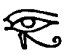
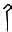
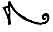

  
[Intangible Textual Heritage](../../index)  [Egypt](../index.md)  [EHH
Index](../ehh)  [Index](index)  [Previous](bat08)  [Next](bat10.md) 

------------------------------------------------------------------------

p. 116

# CHAPTER VI.

### THE SIXTH DIVISION OF THE TUAT, WHICH IS CALLED METCHET-MU-NEBT-TUAT.

IN the scene which illustrates the SIXTH DIVISION Of the Tuat, which is
passed through by the Sun-god during the SIXTH HOUR of the night, we
see, in the middle register, the dead Sun-god AFU-RA.

 

 [  
Click to view](img/11600.jpg.md)  
The Boat of Af, the dead Sun-god, in the Sixth Hour.

 

once again standing in his boat, under the canopy, accompanied by his
usual company of gods. He is no longer in the serpent boat wherein he
passed through the domain of Sekri, and he is no longer being towed
along. In front of the boat are:--

1\. The god Thoth, in the form of a man with the head of a cynocephalus
ape, seated on a throne, and

p. 117

bearing the name TEHUTI-KHENTI-NEB-TUAT.

2\. A female figure, with her hands turned behind her, holding in each
the pupil of an eye of Horus or Ra; she is called AMENT-SEMU-SET. The
text above the boat reads:

 

 [  
Click to view](img/11700.jpg.md)  
(*Left*) The goddess Ament-semu-set. (*Right*) Thoth of the Tuat.

 

\[paragraph continues\] "This great god travelleth through this city,
being provided with \[his\] boat, on the water; be worketh the paddle in
this country towards the place of the body of Osiris." . . . "The
Majesty of this great god \[speaketh to\] the gods who are in this
country when he arriveth at these houses which are hidden, and which
contain the image of Osiris. This god crieth \[to the hidden forms which

p. 118

are in them, and they hearken to the voice of this god, and then he
passeth them by."

 

 [  
Click to view](img/11800.jpg.md)  
The Four Kings of the South.

 

In the abode of Osiris are sixteen gods in mummied forms. The first four
are bearded, and wear the *menat* and the White Crown, and each is
described by the title *suten*, i.e., "King of the South." The second
four are bearded, and are described as HETEPTIU, the third four are
bearded, and wear the *menat* and the Red Crown, and each is described
by the title bat, and the fourth four are bearded, and are called

p. 119

 

 [  
Click to view](img/11900.jpg.md)  
The Four Heteptiu gods.

 [  
Click to view](img/11901.jpg.md)  
The Four Kings of the North.

 [  
Click to view](img/11902.jpg.md)  
The Four "Spirits."

 

p. 120

KHU, i.e., "Spirits." Immediately in front of these gods is an enormous
serpent with five heads, which is called ASH-HRAU, i.e., the
"Many-faced." The body of this serpent is bent round to form an oval,
and within it lies on his back the god AFU, who is holding upon his head
a beetle, which is the symbol of the god KHEPERA. The text written above
reads:--

 

 [  
Click to view](img/12000.jpg.md)  
The Serpent Ash-hrau.

 

p. 121

"Saith the Majesty of this great god to the kings of the South, to the
HETEPTIU, to the kings of the North, and to the Spirits who are in this
City:--May your royal state and condition be with you, may ye receive

p. 122

your White Crowns, and ye HETEPTIU \[may ye receive\] your offerings,
and ye kings of the North may ye receive your Red Crowns, and ye SPIRITS
may ye receive your appointed rites; may your offerings be unto you, and
may ye be in peace. May ye have power over your souls, may ye be
adored(?), may ye have sovereignty over your city, may ye have peace in
your fields, may ye join yourselves to (i.e., attain to) your secret
things with your crowns (?), may your appointed rites be paid to you,
may your sacrifices of propitiation be made to you, and give to the gods
their mouth. Avenge ye me in \[this\] land, and hack in pieces the
serpent Apep, O ye kings of the South, ye Heteptiu, ye kings of the
North, and ye Spirits, who dwell in \[this\] land."

"Those who are in this picture stand up in their places, and they hear
the voice of the great god, the lord of the dead body, that is to say,
KHEPERA in his own flesh . . . . . . in the act of guarding."

Of the Serpent of Many Faces it is said, "Of him who is in this picture,
with his tail in his mouth, his work is to rise up with this image, to
journey to the West in his form, and to travel to every place of the
Tuat. Through the voice of Ra it is that the figures who are in him
advance."

The text which runs in the border above the upper register reads:--

p. 123

"\[This is\] the hidden path of Amentet, on the water of which is
transported this great god in his boat to arrange the lots (or, plans)
of those who are in the Tuat. If their names be uttered, if their bodies
be known, if their true forms and the knowledge of their hours be known,
and the qualities of this secret figure of the Tuat (which are
unknowable), by any man whatsoever: or if an exact representation in
drawing be made of what is in the Hidden Place (Ament) of the Tuat,
which is to the south of the Ât of Amentet: whosoever knoweth this thing
shall be one who is fully provided with food in the Tuat, and he shall
partake in the offerings which are made to the gods who are in the
following of Osiris, and he shall have (i.e., receive) the offerings
which all his kinsfolk are in duty bound to make to him upon earth."

p. 124

In the upper register are:--

A company of nine gods and goddesses, all of whom are represented as
seated, but their seats of state or thrones are invisible; they may be
thus enumerated:--

1\. The god HETEP-KHENTI-TUAT, in the form of a mummy; his hands project
from his bandages, and on his head he has symbols of meat and drink.

 

 [  
Click to view](img/12400.jpg.md)  
(*Left*) Asar-am-ab-neteru. (*Center*) Asth-mehit. (Left)
Hetep-khenti-Tuat.

 

2\. The goddess ASTH-MEHIT, Or AST-AMHIT, with the Crown of the North on
her head. The name means "Isis in the North."

3\. The god ASAR-AM-AB-NETERU, i.e., "Osiris in the heart of the gods."

p. 125

4\. The god HERU-KHENTI-AHET-F, i.e., "Horus at the head of his field,"
hawk-headed, with his hands projecting from his bandages.

5\. The god BENTI-AR-AHET-F, or ape-headed, with his hands projecting
from his bandages.

6\. The god MAA-AB-KHENTI-AHET-F,

 

 [  
Click to view](img/12500.jpg.md)  
Henbethem.     Maa
ab-khenti-ahet-f.     Benti-ar-ahet-f.     Heru-khenti-ahet-f.

 

wearing the White Crown and menat, and with his hands projecting from
his bandages.

7-9. Three goddesses, the first two of whom are called HENBETHEM and
THEHBITH. The text which refers to this company of the gods reads:

p. 126

"Saith the Majesty of this great god to the gods who are over this
Field:--O ye gods who dwell in the Tuat, ye Heteptiu who keep ward over
your masters, ye unto whom offerings are made from the offerings of your
fields of offerings, whereon ye take your rest each day, unite ye
yourselves to the provisions which are mine. Ye are the lords of
\[your\] hands, ye have right \[to direct\] \[your\] feet, ye are
exalted in your forms, ye are great in your transformations, ye have
power over what ye produce, ye have power over what ye have possession
of, ye have possession of that over which ye have power, ye

p. 127

have power over that over which ye have possession, ye have possession
of that over which ye have dominion, protect ye Osiris from those who
would act with violence and wrong against him. The work of these gods in
the Tuat is to give offerings to the gods of the Tuat, who are masters
of their offerings and of the food which proceedeth forth from the mouth
of this great god."

10\. Three sceptres of the form 
, each surmounted

 

 [  
Click to view](img/12701.jpg.md)  
(*Left*) Three Sceptres of the White Crown. (*Center*) . . . . . . .
(*Right*) Thehbith.

 

by the WHITE CROWN; from the base of each projects a knife.

11\. Three sceptres of similar form, each surmounted by the RED CROWN;
from the base of each projects a knife.

12\. Three sceptres, of similar form, each surmounted by a uraeus; from
the base of each projects a knife. The text which refers to these reads:

p. 128

"Saith the Majesty of this great god to the Majesties of the

 

 [  
Click to view](img/12800.jpg.md)  
(*Left*) Three Sceptres of the uraei. (*Right*)Three Sceptres of the Red
Crown.

 

kings of the South and North who dwell in the Tuat:--Reap ye, O ye who
wear the White Crowns, and ye who wear the Red Crowns like Souls \[who
are in\] their lands. Ye who belong to the Tuat produce your own
offerings therein. Make ye to be Maat your sceptres (?), let your souls
live, and let your throats have food to swallow, and ye shall come into
being upon the land . . . . . . Their souls shall rise up in the Tuat on
their sceptres (?), they are provided

p. 129

with knives, and no violence shall be done to them . . . . . goddess . .
. . ."

13\. The lion KA-HEMHEMET, couchant, and facing the two companies of the
gods described above. Above his back are the two Utchats, between which
is the sign  .

14\. A form of the goddess Isis, in a sitting position, but without a
throne.

 

 [  
Click to view](img/12901.jpg.md)  
Thath-neteru.     Hetchefu.     Isis-Thaith.     Ka-hemhemet.

 

15\. The god HETCHEFU.

16\. The god THATH-NETERU, in mummied form, holding a sceptre in one
hand and a knife in the other.

17\. A chamber, with an opening under the roof, through which a snake,
which stands on its tail outside it, belches fire; under a vaulted
covering is an "image," of Ra, in the form of the hind-quarters of a
lion. The chamber is called HET-TUAU-RA.

p. 130

18\. A similar chamber, with an "image" of RA in the form of a hawk's
wing; the name of the chamber is HET-STAU-KHER-AHA.

19\. A similar chamber, with an "image" of RA in the form of a human
head; the name of the chamber is HET-TEMTET-RA. The texts read:

 

 [  
Click to view](img/13000.jpg.md)  
(*Left*) Het-temtet-Ra. (*Center*) Het-stau-kher-aha. (*Right*)
Het-tuau-Ra.

 

p. 131

In the lower register are:--

1\. The god HENTI (?), crocodile-headed, and in a seated position, but
without a throne.

 

 [  
Click to view](img/13100.jpg.md)  
Hem.     Ahi.     \[Em-nu-ur.\]     Henti.

 

2\. The god EM-NU-UR, crocodile-headed, or ape-headed.

3\. The god AHI.

4\. The god HEM.

5\. The god NETCH-ATEF.

6\. The god ANKH-HRA.

p. 132

7\. The god MET-HRA.

8\. The god NETCHTI.

 

 [  
Click to view](img/13200.jpg.md)  
Netchti.     Met-hra.     Ankh-hra.     Netch-atef.

 

9-12. Four goddesses, each in a seated position, but without a throne;
the first is called ANTHETH,

 

 [  
Click to view](img/13201.jpg.md)  
Sehith.     Hemt.     Henhenith.     Antheth.

 

the second HENHENITH, the third HEMT, and the fourth SEHITH.

p. 133

The text which refers to these reads:

"The Majesty of this great god saith unto these gods:--O ye gods who
dwell in the Tuat, and who are in the following of the lord of the
beings who are in the Tuat, who stand up and sit down in Nu, who dwell
in your Field, O ye gods who

p. 134

send forth light, and who make to stand up your bodies, and O ye
goddesses who sit down in the following of the SCARAB in the place where
are his bodies in the Tuat, O ye who live on your . . . . . ., whose
hearts live on their food, who send forth light in the darkness which
surroundeth you, who have the mastery over your Red Crowns, who partake
in content of the offerings made to you, let them travel in my
following, let my soul be with me, let me rest (or, unite myself) to my
bodies, and let me pass by you in peace. These gods hear the voice of Ra
every day, and they have their life through his voice. The work which
they have to do in the Tuat is to convey along souls, and to accompany
the shades of the dead

 

 [  
Click to view](img/13400.jpg.md)  
"The Serpent Am-khu and the heads of the Four Children of Horus."

 

p. 135

and to make provisions for spirits, \[and to find for them\] water."

13\. The monster serpent AM-KHU, with his head raised from the ground,
and the symbol of "life" under his head. Out of the crest of each of the
four undulations of his body springs a bearded head, and the four heads
are those of the children of Horus--MESTHA, HAPI, TUAMUTEF, and
QEBH-SENNU-F, The text which refers to the serpent reads: "This serpent
is himself invisible to this great god, but these forms (i.e., the heads
of the four children of Horus) have their being in his folds, and they
hear the voice of this great god every day. The work which he doeth in
the Tuat is to devour the shades of the dead, and to eat up the spirits
of the enemies \[of Ra\], and to overthrow \[those who are hostile to
him\] in the Tuat."

14\. The god KAI.

p. 136

15\. The god MENI.

16\. The god ANN-RET.

17\. The god URT. Each of these four gods is

 

 [  
Click to view](img/13600.jpg.md)  
Urt.     Ann-ret.     Meni.     Kai.

 

in a sitting position, but has no throne whereon to sit.

18\. A company of nine serpents, each of which belches fire from its
mouth and is armed with a huge

 

 [  
Click to view](img/13601.jpg.md)  
The serpents of a company of gods.

 

knife; only the heads and upper parts of the bodies of these serpents
are visible. Their names are TA-THENEN, TEM, KHEPERA, SHU, SEB,

p. 137

\[paragraph continues\] ASAR, HERU, APU, and HETEPIU. The text which
refers to the four gods and the nine serpents reads:--

"Saith the Majesty of this great god to these gods:--O ye who make
yourselves to be standing up although

p. 138

ye are seated, ye who are in motion although ye are at rest, ye whose
souls come into being, ye who are united to your shades, who lift up
your feet and who move onwards by your thighs, unite ye yourselves to
your flesh, and let not your members be fettered. They have their life
through the voice of this great god every day, and the work which they
do is to watch the two comings of the god Khuti."

Concerning the nine serpents it is said:--

"The Majesty of this great god speaketh words to these male gods who are
at the head of this city:--"Hail, O nine forms of the divine spirits,
whose faces are of flames, who are provided with your knives, burn ye up
the enemies of Khepera, hack in pieces their shades, for ye are the
warders of the Hidden Flesh, which is made of Nu, your habitation, for
it is ye who dwell in the Water of TA-THENEN, and it is for you that the
magical powers of Khepera come into being. They have their means of
living from the word of Ra every day. The work which they do in the Tuat
is to hack asunder the dead, and to cause the spirits to be destroyed."

------------------------------------------------------------------------

[Next: Chapter VII. The Seventh Division of the Tuat, Which Is Called
Thephet-Asar](bat10.md)
