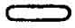

  
[Intangible Textual Heritage](../../index)  [Egypt](../index.md)  [EHH
Index](../ehh)  [Index](index)  [Previous](bat12)  [Next](bat14.md) 

------------------------------------------------------------------------

p. 207

# CHAPTER X.

### THE TENTH DIVISION OF THE TUAT, WHICH IS CALLED METET-QA-UTCHEBU.

HAVING passed through the NINTH DIVISION of the Tuat, the boat of the
sun arrives at the TENTH DIVISION, which is passed through by the sun
during the TENTH HOUR of the night. The opening text reads:--

"This great god taketh up his place in this Circle, and he uttereth
words to the gods who dwell therein.

p. 208

The name of the door of this City through which this great god entereth
is AA-KHERPU-MES-ARU. The name Of this City is METET-QA-UTCHEBU. The
name of the hour of the night which guideth this great god to the hidden
paths of this City is TENTENIT-UHESET-KHAK-ABU."

In the middle register are:--

1\. The boat of the sun, in which the god stands under a canopy formed
by the serpent Mehen; he

 

 [  
Click to view](img/20800.jpg.md)  
The Boat of Af, the dead Sun-god, in the Tenth Hour.

 

holds the symbol of life in his right hand, and a serpent, which serves
as a sceptre, in his left.

2\. A large two-headed serpent called THES-HRAU, which is depicted in
the form of a pair of horns deeply curved towards the ends where they
meet. The head which faces to the right has on it a White Crown, and is
directly opposite to the face of a goddess, who also wears a White
Crown, and is called

p. 209

\[paragraph continues\] HERT-ERMENT, and the head which faces the left
has on it a Red Crown, and is directly opposite to the face of a
goddess, who also wears a Red Crown and is called SHEMERTI, i.e., "She
of the two bows."

The Serpent is provided with two pairs of legs; one pair is turned to
the right and the other to the left

 

 [  
Click to view](img/20900.jpg.md)  
(*Left*) Shemerti.     (*Center*) The serpent Thes-hrau.     (*Right*)
Hert-erment.

 

Within the curve is a large hawk, which bears the, name of
HERU-KHENTI. [1](#fn_3.md)

3\. A boat, wherein lies at full length the serpent ANKH-TA.

p. 210

 

 [  
Click to view](img/21000.jpg.md)  
The serpent Ankh-ta.

 

4\. Four male figures, each of which has a disk in place of a head; each
grasps in his right hand an arrow, with a spear-shaped head, which rests
on his shoulder, and is pointed downwards; their names are:--

1\. TEPTHRA.

2\. SHESERA.

3\. TE-MAU.

4\. UTU.

5\. Four bearded, human-headed figures, each of which has in his right
hand a short spear, which rests

p. 211

on his shoulder, and is pointed upwards; their names are:--

1\. SETU.

2\. ERTAU.

3\. KHESEFU.

4\. SEKENNU.

 

 [  
Click to view](img/21100.jpg.md)  
Setu.     Ertau.     Khesefu.     Sekennu.

 [  
Click to view](img/21101.jpg.md)  
Petthi.     Shemerthi.     Thesu.     Kha-a.

 

6\. Four bearded, human-headed figures, each grasping with both hands a
bow, which he holds above his knees; their names are:--

1\. PETTHI,

2\. SHEMERTHI.

3\. THESU.

4\. KHA-A.

p. 212

The texts which refer to the above read:--1. "This great god maketh his
journey through this City, in this picture, in his boat, and his
sailors, who are the gods, convey him along; this \[great\] god taketh
up his place in this City in the water, whereupon those who live in the
water make use of their weapons, and they spring into life at the sound
of the working of the sailors, who are gods, \[in the boat of Ra\]."

2\. "Those who are in this picture are they who are on the two sides of
THES-HRAU, who is the Soil of SEKRI, the governor of the TUAT. This
figure (i.e., the serpent) even in the form in which it is, travelleth
after this great god into its horizon,

p. 213

and it entereth in with him in the earth every day."

3\. "He who is in this picture in his boat standeth up in the thick
darkness in the Hall of the Eastern Horizon, and he taketh up his
position in his place every day; he formeth the serpent watcher of the
Tuat in the holy place of KHENTI-AMENTI."

p. 214

4\. "To those who are in this picture with their arrows, and to those
with javelins, and to those with their bows, who are in the presence of
this great god, and who make their appearance with him in the Eastern
Horizon of the sky, this great god saith:--Speed ye your arrows, make
ready your javelins, bend your bows, and destroy ye for me my enemies
who are in darkness; be ye at the portal of your horizon, and follow ye
in my train when I unite myself to those who make adoration to my flesh
in the MANTIT BOAT. It is, they who drive back the SEBI serpent of
NEHA-HRA in the thick darkness, and when this great. god passeth on into
the Eastern Hall of the horizon, they also travel on in the train of
this god." Over the upper register runs a line of text, which reads:

p. 215

\[paragraph continues\] "\[This is\] the hidden Circle of Amentet, where
KHEPER uniteth himself to the form of Ra, and where the gods, and the
spirits, and the dead hasten (?) in the hidden forms of AKERT. If a copy
of these things be made according to the figures which are depicted on
the east of the hidden chamber of the Tuat, and if \[a man\] knoweth it,
together with the names \[of the gods\], he shall journey round about
and shall pass through the Tuat, and he shall not be turned back from
making himself a companion of Ra."

In the upper register are:--

1\. The god PANKHI, who holds an ankh in his right hand, and a sceptre
in his left.

2\. A beetle, called KHEPER-ANKH, apparently pushing along a zone of
sand,   or perhaps
entering the horizon. The text which refers to these scenes reads:
"Those who are in this picture in the Tuat are in the forms of (i.e.,
they represent) the births of the god KHEPER, who is carrying his
horizon to this

p. 216

\[paragraph continues\] City, so that he may come forth into the Eastern
Horizon of the sky."

Two serpents, standing on their tails, which cross each other near their
tips. Their heads and necks are bent at right angles to their bodies,
and in the space between them rests a disk; the serpents are called

 

 [  
Click to view](img/21600.jpg.md)  
(*Left*) P-ankhi.     (*Right*) Kheper-ankh.

 

\[paragraph continues\] MENENUI. To the, right is a youthful goddess
wearing a White Crown, and to the left is a similar goddess wearing a
Red Crown each holds the index finger of one hand to her mouth, after
the manner of children, and each is depicted in the act of sitting, but
lacks a seat or throne.

p. 217

 

 [  
Click to view](img/21700.jpg.md)  
The Menenui serpents and the goddesses of the South and North.

 [  
Click to view](img/21701.jpg.md)  
The axe of god and the solar disk.

 

p. 219

4\. An axe, symbol of "god," standing on the handle end, with a disk
resting on the side edge of the head. On the left is a goddess who is
steadying the axe with her left hand, and on the right is a goddess who
is steadying the disk with her right hand; the names of the goddesses
are NETHETH, and KENAT, respectively. Each goddess is depicted in the
act of sitting, but lacks a seat or throne. The text which refers to
these scenes reads: "Of those who are in this picture \[the two
goddesses on\] the left come forth from the double serpent MANENUI, and
\[the two\] on the right come forth from the axe SETFIT. They gather
together the souls on earth, and they make pure the mighty spirits in
the Tuat by the hidden figures which are therein, and \[afterwards\]
they swallow their own spirits (or, souls) after this great god hath
passed them by."

5\. Eight goddesses, who stand upright, and hold an ankh

p. 219

in their right hands, and a sceptre in their left; they face the ape
god, whose tail is stiffened out under him in such a manner as to form a
seat for him, and who holds the utchat, or eye of the sun, on his two
hands. The first four of the goddesses have each the head of a lioness
and are called:--

1 . SEKHET.

2\. MENKERT.

 

 [  
Click to view](img/21900.jpg.md)  
Sekhet.     Menkert.     Huntheth.     Usrit.

 

3\. HUNTHETH,.

4\. USRIT.

The remaining four have the heads of women, and have the names of

1\. AMT-NETERU-S.

2\. ARIT-TATHETH.

p. 220

3\. AHAT.

4\. THEMATH-ERMEN.

The name of the ape-god is AF (?)-ERMEN-MAAT-F. Concerning the goddesses
the text says:

 

 [  
Click to view](img/22000.jpg.md)  
Abet-neteru-s.     Arit-Tatheth.     Ahat.     Themath-ermen (?).

 

\[paragraph continues\] "To these goddesses who make the

p. 221

reckoning of his Eye for Horus in the Tuat, Ra saith:--'Make ye strong
your spirits by means of \[your\] strength, and make the reckoning of
his Eye for Horus, stablish ye his Eye for Horus, and make ye Horus to
unite himself to his emanation (or, to that which floweth from his
eyes), praise ye Horus by reason of his Eye, and stablish ye his first
Eye which is in the hands of the god AF-ERMEN-MAAT-F, and utter ye your
words on behalf of Horus, O ye who cause to come

 

 [  
Click to view](img/22100.jpg.md)  
(*Left*) Af-ermen-maat-f. (*Center*) Ermenui. (*Right*) Neb-aqet.

 

into being the becomings of created things.' The work which they do in
the Tuat is to utter words on behalf of his Eye for Horus, and to cause
radiant splendour to proceed from it each day."

6\. Eight gods, each of the first seven of whom holds an ankh in his
right hand, and (*sceptre*) in his left; their names are:--

1\. ERMENUI, who has the double object in the place of a head.

p. 222

2\. NEB-AQET, jackal-headed.

3\. AMEN-KHU, hawk-headed.

4\. HER-SHETA-TAUI, man-headed.

5\. SEM-HERU, man-headed.

6\. AMEN (?)-HERU, man-headed.

7\. KHENT-AST-F, man-headed.

8\. KHENT-MENT-F, a god in mummied form, like Osiris, who wears a White
Crown, and grasps a sceptre, with both hands, which project from his
bandages.

The text which refers to these gods reads: "Those who are in this
picture in the forms which Horus made-when this great god crieth out to
them

p. 223

 

 [  
Click to view](img/22300.jpg.md)  
(*Left*) Amen-khu. (*Center*) Her-sheta-taui. (*Right*) Sem-Heru.

 [  
Click to view](img/22301.jpg.md)  
(*Left*) Amen Heru. (*Center*) Khent-ast-f. (*Right*) Khent-ment-f.

 

p. 224

by their names, they unite themselves and come into life in the shades
which are in the mouth of the great god, and their souls journey onwards
in his train to the horizon. They strip the bodies of the dead of their
swathings and break in pieces the bodies of the enemies \[of Ra\], and
they give the order for their destruction in the Tuat."

In the lower register are:--

1\. The god Horus, hawk-headed and wearing a disk, leaning on a staff.

 

 [  
Click to view](img/22400.jpg.md)  
Horus.

 

2\. Five [1](#fn_4.md) lakes of water, in each of
which is submerged a male form; these figures are called the
"submerged."

3\. Three [2](#fn_5.md) lakes of water, in each of
which is a male form swimming, turned over on his breast; these are
called the "swimmers."

4\. Four lakes of water, in each of which is a male form floating on his
back; these are called the floaters," The text reads: \#\#\#.

p. 225

\[paragraph continues\] The above text is full of lacunae, and whole
passages, consisting of several lines, are wanting; the following
version from Lanzone's edition (*Le Domicile des Esprits*, pl. ii.) will
be found useful in obtaining an idea of the contents of the legends
which accompanied the lakes of water:

p. 226

 

 [  
Click to view](img/22600.jpg.md)

 

p. 227

 

 [  
Click to view](img/22700.jpg.md)

 

p. 228

"Horus saith unto those who have plunged themselves beneath the waters,
and unto those who swim, and unto those who float in NU of the Tuat, 'O
ye who have plunged yourselves beneath the waters, who shine in Nu, O ye
whose hands cover your faces, who swim with your faces turned towards
the water in the Tuat, whose cheeks are filled with water, O ye who
paddle in the waters of Nu, whose faces are turned up into

p. 229

the air in the following of your souls, whose souls have been deprived
of their heavenly air, and who beat the air with your hands in order to
obtain it, O make ye your way in Nu by means of your legs, and your
thighs shall not be in any way impeded. Come ye forth in this stream,
descend ye on these waves, fill ye HAP-UR, and arrive ye at its furrows,

 

 [  
Click to view](img/22900.jpg.md)  
Hetemit.     Bekhkhit.     Tchetmit.     Senthes.

 

for your members shall not perish, and your flesh shall not decay, and
ye shall have dominion over your water, and ye shall have abundance
according to my command, O ye whose duty it is to dwell in Nu, together
with those who have plunged themselves beneath the waters, and are in
\[his\] following, and whose souls have life."

5\. A lake of water.

p. 230

6\. Four female figures, each bearing a serpent on her head and
shoulders; the head of each reptile is raised above the head of its
bearer, and its tail hangs down her back; their names are:--

1\. HETEMIT.

2\. BEKHKHIT.

 

 [  
Click to view](img/23000.jpg.md)  
Set-nehes.

 

3\. TCHETMIT.

4\. SENTHES.

The text reads:

p. 231

\[paragraph continues\] "Those who are in this picture are they whose
forms (or, figures) live by their heads. It is they who shed light upon
the road of Ra in the thick darkness, and when he cometh forth into the
Hall of the East, SET waketh up and travelleth on with him."

7\. A sceptre, surmounted by the head of Set; its name is SET-NEHES,
i.e., "Set who wakens."

------------------------------------------------------------------------

### Footnotes

[209:1](bat13.htm#fr_3.md) Or, KHENT-HERU, which
became one of the Dekans among the Greeks, i.e., χοντάρ see Maspero,
*op. cit.*, p. 127.

[224:1](bat13.htm#fr_4.md) These should be four in
number.

[224:2](bat13.htm#fr_5.md) These should be four in
number.

------------------------------------------------------------------------

[Next: Chapter XI. The Eleventh Division of the Tuat, Which Is Called
Re-En-Qerert-Apt-Khatu](bat14.md)
