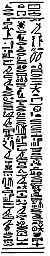

  
[Intangible Textual Heritage](../../index)  [Egypt](../index.md)  [EHH
Index](../ehh)  [Index](index)  [Previous](bat14.md) 

------------------------------------------------------------------------

p. 256

# CHAPTER XII.

### THE TWELFTH DIVISION OF THE TUAT, WHICH IS CALLED THEN-NETERU.

THE TWELFTH DIVISION [1](#fn_6.md) of the Tuat,
which is passed through by the Sun-god during the TWELFTH HOUR of the
night, is introduced by three lines of text, which read:--

p. 257

 "The Majesty of this
great god taketh up his position in this Circle, which is the uttermost
limit of thick darkness, and this great god is born in his form of
Khepera in this Circle, and Nut and Nu are in this Circle for the birth
of this great god when he cometh forth from the Tuat and taketh up his
position in the Matet Boat, and when he riseth up from the thighs of
Nut. The name of the Gate of this City is THEN-NETERU. The name of this
City is KHEPER-KEKIU-KHAU-MESTU. The name of the hour of the night
wherein this god cometh into being is MAA-NEFERT-RA."

Above the whole scene is a line of hieroglyphics, which describes it
as:--

p. 258

"The hidden Circle in the Tuat wherein this great god is born; he cometh
forth into the pool of Nu, and he taketh up his place in the body of
Nut. Whosoever shall make a copy thereof according to the copies which
exist in writing upon the east \[wall

 

 [  
Click to view](img/25800.jpg.md)  
The Boat of the Sun in the last hour of the Night.

 

of\] the palace, and shall know it upon earth, it shall act as a magical
protector for him both in heaven and upon earth."

In the middle register are:--

1\. The boat of the sun, in which stands the god under a canopy formed
by the body of the serpent Mehen; on his head are horns and a disk. In
the fore part of the, boat is the beetle of KHEP\[R\]A,

p. 259

i.e., Khepera, which takes the place of the solar disk that rested on
the prow of the boat in the Eleventh Hour.

The text reads: "This great god in this picture journeyeth along through
this City by means of the faithful servants (*amkhiu*) of this hidden
image ANKH-NETERU. His gods draw him along by a cord, and he entereth
into his tail and cometh forth from his mouth, and cometh to the birth
under the form of Khepera, and the gods who are in his boat \[do\]
likewise. He taketh up his place on the face of the hidden image of the
horn (or, forehead) of the sky at the end of the thick darkness, and his
hands seal lip the Tuat. Then this great god taketh up his position in
the Eastern Horizon of heaven, and Shu receiveth him, and he cometh into
being in the East."

p. 260

2\. Twelve gods, who are occupied in towing along the boat of the Sun,
each with his head turned behind him and looking at the boat; their
names are:--

1\. HERU.

2\. SHEMSU.

3\. THENA.

4\. BEQ.

5\. AU-ANKHIU-F.

6\. SEBEHU-F.

7\. AHA-RER.

8\. AMKHUI.

9\. NEB-AMAKH.

10\. SEKI (?).

11\. HEQ-NEK-MU,

12\. AU.

The text which refers to these reads:

p. 261

\[paragraph continues\] "Those who are in this picture draw this great
god through the tail (or, bowels) of the serpent Ankh-neteru. The loyal
servants of Ra who are in his following are the product of his hands,
and they are born on the earth each day after the birth of this great
god in the eastern portion of the sky. They enter into this hidden image
of Ankh-neteru in the form of loyal servants, and they come forth in the
renewed forms of Ra every day. When they tarry upon the earth it is an
abomination to them to utter the name of the god."

3\. The monster serpent KA-EM-ANKH-NETERU.

4\. Twelve goddesses, who are occupied in towing the boat of the sun
through the body of the serpent KA-EM-ANKH-NETERU; each has her head
turned behind her, and is looking at the boat. Their names are:--

1\. STAT.

2\. KHERU-UTCHAT.

p. 262

3\. KHET.

4\. SPERT-NETER-S.

5\. NEBTAMT.

6\. NEB-TCHETTA.

7\. HETIT.

8\. ANKHET-ERMEN.

9\. KHERUT-TEP (?).

10\. HETEP-EM-KHUT-S.

11\. BET-NETER-S.

12\. TESER-ABT.

The text relating to the serpent reads:

p. 263

 

 [  
Click to view](img/26300.jpg.md)  
Twelve gods of the last hour of the night.

 [  
Click to view](img/26301.jpg.md)  
Twelve goddesses of the last hour of the night.

 

p. 264

\[paragraph continues\] "Those who are here are they who have their
bodies, and they come forth in the following of this great god into
heaven. This is the hidden image of the serpent Ankh-neteru, which is by
his den in the Tuat, and he resteth in \[his\] place every day. This
great god speaketh to him in \[his\] name of NA, \[and the space covered
by\] his forepaws and legs is one thousand three hundred cubits long . .
. . . . .; he liveth upon the sound of the rumblings of the earth. The
servants who are loyal to his service come forth from \[his\] mouth
every day."

The text relating to the twelve goddesses reads: "Those who are in this
picture take the towing rope of the boat of Ra when it cometh forth

p. 265

from the serpent ANKH-NETERU, and they tow this great god into the sky,
and lead him along the ways of the upper sky. It is they who make to
arise in the sky gentle winds and humid breezes, and it is they who
order those who live \[upon earth\] to place themselves in the great
boat in the sky."

In the upper register are:--

1\. Twelve goddesses, each of whom stands upright, and bears on her
shoulders a serpent which belches, forth fire from its mouth; their
names are:--

 

 [  
Click to view](img/26500.jpg.md)  
Six goddesses with fiery serpents.

 

1\. NEFERT-KHAU.

2\. KHET(?)-UAT-EN-RA.

3\. NEBT-SESHESH-TA.

4\. NEFERT-HER-TEPT.

5\. SEUATCHET-ATEBUI-PET.

p. 266

6\. HAT-EM-TAUI-S.

7\. QAT-EM-SEPU-S.

8\. SEKHET-EM-KHU-S.

9\. HAAT-EM-SEPU-S.

10\. KHET-ANKH (?)-F.

 

 [  
Click to view](img/26600.jpg.md)  
Six goddesses with fiery serpents.

 

11\. PERT-EM-AP.

12\. NEBT-AR-EM-UAA-ABT.

The text reads:

p. 267

\[paragraph continues\] "Those who are in this picture with their own
bodies, and from whom their uraei emerge, are in the following of this
great god when he setteth out for this City. They follow after this god,
and the flames which issue from their mouths drive away Apep on behalf
of Ra into the Hall of the East of the Horizon. They journey round about
the upper heavens in his following \[remaining\] in their places, and
they restore these gods after this great god hath passed by the hidden
chamber of the sky, and then they take up their positions \[again\] in
their own abodes. They give pleasure to the hearts of the gods of
Amentet through Ra-Heru-khut, and their work upon the earth is to drive
away those who

p. 268

are in the darkness by the flames of their uraei which are behind them,
and they guide Ra along, and they smite Apep for him in the sky."

2\. Twelve gods, each of whom stands upright, and has both hands raised
in adoration before him; their names are:--

1\. NEB-ANKH.

2\. HI.

 

 [  
Click to view](img/26800.jpg.md)  
Six gods who praise Ra at dawn.

 

3\. NEB-AA.

4\. NEB-TUAT.

5\. NETCHEM-AB,

6\. HAM.

7\. UA-AB.

8\. HUNNU.

p. 269

9\. SENSABT.

10\. MA-TEPU-NETERU.

11\. THES-TEPU-NETERU.

12\. HEKENU.

The text reads:

 

 [  
Click to view](img/26900.jpg.md)  
Six gods who praise Ra at dawn.

 

p. 270

\[paragraph continues\] "Those who are in this picture sing praises unto
this great god from dawn, when he taketh up his position in the Hall of
the east of the sky. They say unto Ra, 'O thou who art the producer of
\[thine own\] birth, who dost bring into being \[thine own\] being,
\[lord of\] homage of every soul . . . . .. Heaven belongeth to thy
soul, which taketh up its place therein, and the earth belongeth to thy
body, thou lord of homage. Thou sailest over the Horizon, thou takest up
thy place in thy shrine, the gods in their bodies praise thee; descend
thou into the sky and take thou thy two souls through thy magical
protectors.' The work of these gods in the Tuat is to praise this great
god, and they stand in this City and they count up (or, verify) the gods
of the country of Mafket (i.e., Sinai). They descend (?) to earth
\[before\] Ra after he hath taken up his position in the sky and doth
rise upon the eyes of mankind in their circles."

In the lower register are:--

1\. The god Nu, holding the sceptre and ankh in his left and right hand
respectively.

p. 271

2\. The goddess NUT, holding the sceptre and ankh.

3\. The god HEHU, holding the sceptre and ankh.

4\. The goddess HEHUT, holding the sceptre and ankh.

5\. The god TEBAI, man-headed, and holding an oar, or paddle.

 

 [  
Click to view](img/27100.jpg.md)  
(*Left*) The gods who receive Ra. (*Right*) A god of a paddle.

 

6\. The god QASHEFSHEF, man-headed and holding a paddle.

7\. The god NEHUI, crocodile-headed, and holding a paddle.

8\. The god NI, with the heads of two birds, and holding a paddle.

9\. The deity NESMEKHEF, in the

p. 272

form of a serpent, which pours forth fire from its mouth.

10\. The god NEBA-KHU, man-headed, and holding a paddle.

11\. The god KHENTI-THETH-F, man-headed, and holding a paddle.

12\. The god AHA-AB, man-headed, and holding a paddle.

13\. The god TUATI, man-headed, and holding a paddle.

14-23. Ten gods, each with his hands raised in adoration; their names
are:--

TES-KHU.

THEMA-RE.

AAKHEBU,

SEKHENNU,

ERMENU,

KHENNU-ERMEN.

BUN-A.

KHU-RE.

p. 273

 

 [  
Click to view](img/27300.jpg.md)  
Gods of paddles.

 [  
Click to view](img/27301.jpg.md)  
(*Left*) Gods of paddles. (*Right*) Gods who praise Ra at sunrise.

 [  
Click to view](img/27302.jpg.md)  
Gods who praise Ra at sunrise.

 

p. 274

ATHEP.

AM-NETER.

The texts relating to these gods read:--

 

 [  
Click to view](img/27400.jpg.md)  
Gods who praise Ra at sunrise.

 

\[paragraph continues\] 1. "Those who are in this picture in their own
bodies join themselves unto Ra in the sky to receive this great god at
his coming forth among them in the east of the sky each day. They
themselves belong to their Halls of the Horizon, but the forms which

p. 275

they have in the Tuat \[belong to\] this Circle."

2\. "Those who are in this picture with their paddles drive Apep to the
back of the sky, after the birth of the god. Their work is to hold up
the Great Disk in the Eastern Horizon of the sky every day. Behold the
serpent SENMEKHEF which burneth up the enemies of Ra at the dawn! These
gods go round about the heights of heaven in the following of this great
god every day, and they receive their protection for this Circle."

p. 276

3\. "Those who are in this picture are behind the image of Osiris, who
is over the thick darkness. These are the words which this god saith
unto them after this great god hath journeyed by it:--'Life \[to thee\],
O thou who art over the darkness! Life \[to thee\] in all thy majesty!
Life \[to thee\], O governor of Amentet, Osiris, who art over the beings
of Amentet! Life to thee! Life to thee! O thou who art over the Tuat,
the winds of Ra are to thy nostrils, and the nourishment of Kheper is
with thee. Thou livest, and ye live. Hail to Osiris, the lord of the
living, that is to say, of the gods who are with Osiris, and who came
into being with him the first time.' Those who are behind this hidden
Image in this Circle wherein he liveth have their nourishment from the
words of this god in their own Tuat."

p. 277

 

 [  
Click to view](img/27700.jpg.md)  
The exit of Ra from the Tuat, i.e., Sunrise.

 

p. 278

4\. He who is in this picture in the invisible form of Horus in the
thick darkness, is the hidden image which Shu lifteth up beneath the
sky, and KEB-UR cometh forth in the earth in this image."

24\. The end of the Tuat, which is represented by a semi-circular wall
or border formed of earth and stones, or perhaps granite. At the middle
point of this border is the disk of the sun which is about to rise on
this world, and joined to it is the head of the "image of Shu," with his
arms stretched out along the rounded border of the Tuat. Above his head
is the beetle, symbol of Khep\[er\], who has emerged from the boat of
the Sun-god, and below is the "image of Af," that is to say, the body of
the night Sun-god, which has been cast away.

END OF VOL. I.

------------------------------------------------------------------------

### Footnotes

[256:1](bat15.htm#fr_6.md) See Lanzone, *Domicile*,
pl. v.
