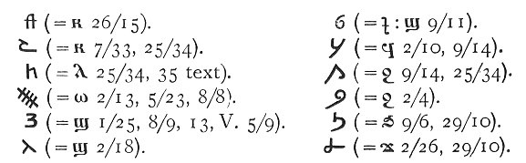
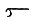
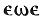
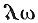
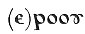
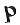
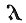
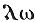
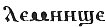

  
[Intangible Textual Heritage](../../index)  [Egyptian](../index.md) 
[Index](index)  [Previous](dmp02)  [Next](dmp04.md) 

------------------------------------------------------------------------

p. 1

# INTRODUCTION

### I. HISTORY OF THE MS.

THE demotic magical papyrus of London and Leiden was discovered at
Thebes with other papyri, principally Greek but dealing with subjects of
a like nature, in the early part of the last century, and was bought by
Anastasi, who was at that time Swedish consul at Alexandria, and made a
large collection of Egyptian MSS. When Anastasi obtained the MS. it must
already have been torn into two parts, and it is even probable that he
obtained the two parts at different times, since he sold his Egyptian
collections, including the Leiden MS., to the Dutch government in 1828,
while the London portion was bought at the sale of his later collections
at Paris in 1857 for the British Museum (No. 1072 in Lenormant's
Catalogue).

The Leiden fragment was made known to the world much earlier than that
in the British Museum. Its importance for the deciphering of the demotic
script by the help of the numerous glosses in Graeco-Coptic characters
was at once perceived by the distinguished scholar Reuvens, at that time
Director of the Leiden Museum of Antiquities, who proceeded to study it
carefully, and in 1830 published an admirable essay [1](#fn_0.md) in which he sketched the principal contents
of the MS. and indicated its value for the progress of demotic

p. 2

studies. He then took in hand its reproduction, and the MS. was
lithographed in facsimile under his direction, and he had corrected the
proofs of the first plate when he was cut off by a premature death in
1835; his work was carried to completion and published by his successor
in the Directorship of the Museum, Leemans, in 1839 [1](#fn_1.md). Heinrich Brugsch studied it closely, and
drew from it most of the examples quoted in his Demotic Grammar
published in 1855; but, although later scholars have frequently quoted
from it and translated fragments of it, the MS. has hitherto remained
without complete translation, commentary, or glossary.

The London MS., however, lay from 1857 onwards almost unnoticed in the
British Museum. To the late Dr. Pleyte, Leemans' successor at Leiden,
belongs the credit of discovering that the two MSS. originally formed
one. He had studied the Leiden portion, and at once recognized the
handwriting of its fellow in London. Without publishing the fact, he
communicated it to Professor Hess of Freiburg, when the latter was
working in Leiden on the MS. there. Professor Hess went on to London,
and, having fully confirmed Dr. Pleyte's statement, published in 1892 a
reproduction of the British Museum MS. with an introduction, including
the translation of one column, and a glossary [2](#fn_2.md).

Reuvens in his essay dwelt at some length on the 'gnostic' character of
the MS. He devoted his attention mainly to the parts which contain the
glosses, and those are almost exclusively magical invocations, among
which occur the names of gods, spirits, and demons, Egyptian, Syrian,
Jewish, &c., strung together in a manner similar

p. 3

to those found in gnostic writings and on gnostic gems. He even went so
far as to associate them with the name of a particular gnostic leader,
Marcus, of the second century, chiefly on the ground of his recorded use
of Hebrew and Syriac names in his invocations and the combinations of
vowels. In consequence the MS. has acquired the name of the 'Leiden
Gnostic,' and the term 'Gnostic' has been passed on to the London MS.
But as will be seen from the complete translation here published, there
is nothing in the work relating to the gnostic systems--it deals with
magic and medicine, and it seems a misnomer to call the MS. gnostic
merely because part of the stock-in-trade of the magician and
medicine-man were a number of invocation names which he either picked up
from the gnostics or derived from sources common to him and them. Hence
it has been thought desirable to abandon the epithet 'gnostic,' and to
call the work the 'Magical papyrus of London and Leiden' (Pap. mag.
LL.).

### II. CONDITION OF THE MS.

The London portion is in far better condition than the Leiden portion.
The papyrus is pale in colour and the ink very black; consequently where
the MS. has not suffered material damage it is easy to read, as the
scribe wrote a beautiful and regular hand.

The Leiden papyrus, on the other hand, has unfortunately suffered much,
as Leemans, with a view to protecting the surface, covered both recto
and verso with 'vegetable' paper, which probably could not be removed
now without serious injury to the MS.; but either the paper or the
adhesive matter employed with it has darkened and decayed, rendering the
writing illegible in places.

p. 4

In 1829, while the MS. was still in charge of Reuvens and before it had
been subjected to the operation above described, he took a tracing of it
which has been preserved, and which, though of little assistance in
points of minute detail, may be relied on for filling up with certainty
many groups which are now wholly lost in the original.

The main body of the writing is on the recto (horizontal fibres) of the
papyrus, while on the verso are written memoranda, medical
prescriptions, and short invocations.

The London MS. is Pap. No. 10070 of the British Museum (formerly Anast.
1072).

The Leiden MS. is known as I. 383 (reckoned among the Anastasi MSS. as
A. 65).

The London portion forms the initial part of the MS. and joins on to the
Leiden portion without a break, the tenth and last column of the London
MS. and the first of the Leiden forming one column.

The first London column is imperfect, and it is not possible to say with
certainty whether the MS. began with it or whether there was an anterior
part now lost. It is quite possible that it began here. On the other
hand, it is certain that the MS. is imperfect at the end, since the
broken edge of the papyrus at Leiden shows traces of a column of writing
succeeding the present final column.

It is impossible to estimate how much is lost, as the MS. is not an
original composition on a definite plan, but a compilation of
heterogeneous material collected together without any logical order.

The two portions, if joined together, would measure, roughly speaking,
some 5 M. (about 16½ feet) in length. In height it averages nearly 25
cm. (10 in.). The writing is in columns, of which there are twenty-nine
on the

p. 5

recto, while on the verso are thirty-three small columns or portions of
columns; but these are not marked off, as are the recto columns, by
vertical and horizontal framing lines [1](#fn_3.md),
nor are they written continuously, but they seem to have been jotted
down there on account of their brevity and discontinuous character.

The recto columns vary somewhat in size, but average 20 x 20 cm. (8 in.
square). The writing is frequently carried beyond the framing lines.

In each column of the recto the number of lines is on the average about
thirty to thirty-three; but the number is very irregular, ranging from
forty-three in one column to five in another.

### III. CONTENTS.

As has been stated above, the MS. is a compilation. An analysis of the
contents will be found on page 14. From this it will be seen to consist
mainly of directions for divination processes involving numerous
invocations, together with erotica and medical prescriptions, in which,
however, magic plays as large a part as medicine.

The MS. is far from being unique in regard to its contents. Fragments of
similar works in demotic exist at Paris (Louvre, No. 3229, published by
Maspero, Quelques papyrus du Louvre, 1875), and at Leiden (I. 384 verso,
Anast. 75, published by Leemans, Mons. du musée de Leide, 1842, pl.
ccxxvi--vii) a MS. partly demotic and partly Greek, the latter portion
being published by Leemans in Pap. graeci mus. lugd. bat. 1885, ii. Pap.
V, and re-edited by Dieterich, Pap. Mag. Mus. Lugd. Bat. The Greek
papyri containing similar texts are numerous, many examples having been
published

p. 6

from the museums of Berlin, Leiden, London, and Paris by Goodwin,
Parthey, Leemans, Wessely, and Kenyon.

The well-known codex of the Bibliothèque Nationale published by Wessely,
Denkschr. Kais. Ak. Wiss. Wien, xxxvi. 1888, contains a few invocations
in Old Coptic along with the Greek (cf. Griffith, A. Z. 1901, p. 85, and
bibliography, ibid. p. 72).

Magic was from the earliest times largely developed by the Egyptians in
relation both to the dead and the living. Under the former head fall
both the pyramid texts and other texts found in the tombs, including
most of the Book of the Dead, which consists mainly of magical
invocations intended to make smooth the path of the deceased in the next
world.

Magical texts for the use of the living are found in the Harris magical
papyrus (ed. Chabas, 1860), the Metternich stela (ed. Golenischeff,
1877) and kindred stones, the Berlin papyrus edited by Erman
(Zaubersprüche für Mutter u. Kind, 1901), &c. Reference may be made to
the volume on Egyptian magic by Dr. Wallis Budge, 1899, and to a special
study on vessel-divination by E. Lefébure, 'Le vase divinatoire,' in
Sphinx, 1902, VI. 61 seq. Cf. also Dieterich, 'Abraxas'; Kenyon in Cat.
Greek Pap. in B. M., I. 62 seq.; Miss Macdonald in P. S. B. A., xiii.
160 seq.; Wünsch, Sethianische Verfluchungstafeln aus Rom, &c.

In the closely allied department of medicine, it is sufficient to refer
to the Ebers papyrus, the Kahun papyri, and the Berlin medical papyrus
(ed. Brugsch, Rec. Mon. pl. 87-107), which offer many parallels. Among
the Greek medical writers it is noticeable that Alexander of Tralles
seems much more closely allied to the Egyptian school, if that be
represented by our MS., than Galen.

p. 7

But though the subject-matter of the MS. is not without its interest for
the history of magic and medicine, its chief claim to publication lies
in its philological interest. From the first its numerous glosses have
attracted the attention of scholars, and have been the means of fixing
the value of a large number of demotic groups. Further it is in date
probably the latest known papyrus written in the demotic script; most of
the glosses are really Coptic transcriptions, and under this head may
likewise be included all the Egyptian words written in cipher; so that
the MS. in these furnishes us with a series of very early Coptic words,
including several grammatical forms of great interest. Possibly too the
text may be of importance in relation to the question of dialects in
pagan Egypt; but that is a subject too little worked out at present to
allow of definite statements. The vocabulary is very extensive, and
includes a number of Greek words, the names of over 100 plants, besides
numerous animals and minerals.

### IV. PREVIOUS WORK ON THE MS.

It may be useful to record here the names of those who have dealt with
the MS. at greater length than a mere passing reference or quotation,
and to whom we are indebted for many suggestions:

REUVENS. Supra, p. 1.

LEEMANS. Mons. &c., texte; Aegyptische Papyrus in demotischer Schrift,
&c. 1839.

MASPERO. Rec. tray., i. 18--40 (1870).

REVILLOUT. Setna, introd. pp. 3--48 (1877); Rev. Égypt., i. 163-172
(1880), ii. 10-15, 270-2 (1881); Poème satyrique (1885).

PLEYTE. P. S. B. A., 1883, 149.

BRUGSCH. Wtb. pass., A. Z., 1884, 18 seq.

MAX MÜLLER. Rec. tr., viii. 172 (1886), xiii. 149 (1890).

p. 8

HESS. Setna pass. (1888), Zur Aussprache des Griechischen, in the
*Indo-germanische Forschungen*, vi. 123; Der gnostische Papyrus von
London, Einleitung, Text u. Demotisch-deutsches Glossar, 1892.

GROFF. Mém. de l’Institut Égypt. iii. 337 seq. (1897), and Bulletin du
même, 1897, 1898.

As the London portion of the MS., which in the order of contents is the
first part, was published fifty years later than the second part at
Leiden, it follows that each publication has an independent numbering of
the columns, starting from I. In view of the fact that there are many
references in demotic literature already to the columns by their numbers
as established by the publications of Leemans and Hess, it would have
been desirable to retain the existing numbering if possible. But, as
will be seen by comparison of the hand copy of the whole MS. which
accompanies this edition with the former publications, the changes in
the way of consolidation of the columns, and in some cases necessary
re-numbering of the lines, have made it compulsory to introduce a new
and continuous numbering of the columns. For instance, Hess col. X and
Leemans col. I form a single column, and the same is the case with
Leemans cols. II and III and cols. IV and V, and with verso, cols. XVI
and XVII, XXII and XXIII. A comparative table of the old and new numbers
will be found at the end.

### V. THE GLOSSES.

There are about 640 words with transcriptions in Coptic characters in
addition to a few inserted in the text.

Besides all the letters of the Greek alphabet we find the following
used:--

p. 9

 

The glosses were undoubtedly written by the same scribe who wrote the
demotic text. And it seems that he wrote the glosses before he filled in
the rubrics. For the handwriting of the demotic text and of the rubrics
is unquestionably the same; and in filling up in red the empty spaces he
had left for rubrication, the scribe took occasion to fill in with his
red ink occasional lapses in the black writing. In the text this can be
observed in e.g. 24/1, the omitted 
 of the second *str* (?) has been filled up in red,
and also the omitted determinative in the last word of 28/8, an omitted
letter in pḫr 29/11, an omitted word *šn* interlineated in 29/12, and a
plural sign in 25/26; and so too the gloss 
 in 28/8, overlooked when the glosses were originally
inserted in black ink.

It is a fact that there is often a considerable difference between the
Greek letters in the passages written in Greek and in the glosses (e. g.
παπιπετου in 15/25 and 15/29), but this may be accounted for by the fact
that the former are written in a cursive hand with ligatures, while the
glosses are carefully written with separately formed letters without
ligatures for distinctness' sake in the narrow space between the lines.

The above considerations, however, only show that the text and glosses
were written by the same hand in our existing MS. It does not follow
that they were written by the original compiler. Max Müller has argued
(Rec. tr., viii. 175) that they must be due to another individual since
they are mostly in the Fayumic

p. 10

dialect, while the dialect of the demotic text is Untersahidisch' (i. e.
Achmimic, so called by Stern). In Rec. tr., xiii. 152 n., he replaces
the latter term by a more precise definition: 'Die Mundart steht
zwischen Fayumisch u. dem Mittel-ägyptischen von Akhmîm, letzterem
näher.' But it is very doubtful whether this distinction between the
text and the glosses can be maintained. The only example quoted by Max
Müller that distinctly suggests Fayumic is the gloss   and over a group in 16/5 and
25/34, which he reads as = 
, regarding the interchange of   and   as evidence of Fayumic
dialect. But the demotic group in question does not read *er-w*, but
*mr* as in *mr-’ḥ* (1/17, 2/7, 14/6, 28), and the gloss   represents the absolute form
of the late Egyptian word which we see in its construct form in Sahidic
  and in λεσωνις. From the
detailed examination of the dialect (in vol. ii) it appears probable
that the dialect of the text does not show any distinction from that of
the glosses, and it is not necessary to go behind the scribe of the
present MS. and place the compiler earlier. He may well have been one
and the same.

### VI. DATE.

Reuvens (u. s. p. 151) placed the date of the MS. in the first half of
the third century A. D., and this was repeated by Leemans.

Groff and Hess attributed it on palaeographical grounds to the second
century; but in the light of recent additions to the knowledge of Greek
palaeography, and the opinions based on them of Kenyon, Grenfell, and
Hunt (see A. Z., xxxix. (1901) p. 78), the third century must be
accepted as the date of the MS. But this, of course,

p. 11

is the date at which the papyrus was written, and merely furnishes a
*terminus ad quem* for deciding as to the date of the contents.

That the whole of the papyrus, in its present state, was written by one
and the same scribe--with the possible exception of verso XXVIII--can
scarcely be a matter of doubt to any one who has studied closely the
handwriting of the original MSS. It must be stated, however, that
Reuvens and Leemans were of opinion that the glosses were written by a
later hand than that of the body of the text: but this question has been
discussed above ([p. 9](#page_9).md), and apart from the identity of ink,
and the material proof given there, it may be added that the hieratic
glosses in 27/8 are certainly written by the same hand as the numerous
hieratic passages scattered through the text.

The date of the contents is a much more complicated question. Written
partly in hieratic, partly in demotic, and partly in Greek, they wear
the aspect of a compilation, which is borne out by the varied and
disconnected nature of the subject-matter.

It has been suggested that the work is a translation into demotic of a
Greek original, and perhaps this is the first question demanding
discussion. Prima facie it may be said to be likely, as so many similar
works exist in Greek. The introduction of three invocations of
considerable length written in Greek characters almost compels us to
accept that origin for those particular sections, viz. 4/1-19, 15/24-31,
23/7-20. It seems probable that the translator felt he could transfer to
Egyptian the prescriptions and preparations, while the formula of
incantation had to be left in the original language. Had these sections
been written in Egyptian originally, it is not likely that an
incantation in a foreign tongue would be inserted in the place
presumably of an Egyptian one.

p. 12

\[paragraph continues\] And in the first named instance there is the
additional evidence of two true Greek glosses, i. e. not Coptic
transcriptions of the demotic words, but Greek equivalents of the two
words 'table' and 'goose,' which seem to be inserted clearly to prevent
a misunderstanding of the original terms. In the second instance
15/24-31, the original Greek lines 25-28 are immediately followed by a
demotic translation of the same passage (11. 29--31), which points in
the same direction. Translation from the Greek is rendered probable,
outside the passages already referred to, by the transcription of Greek
prescriptions and substances in 24/1-25, and verso I, II, VIII, IX.
According to an ingenious suggestion of Max Müller, in verso II the
otherwise unintelligible phrase *m‘nes n rm* is almost certainly a
mistranslation of μαγνησία ἀνδρεία. Max Müller has also (Rec. tr., viii.
175--6) given strong reasons for regarding the passage 25/23-37 as being
translated from a Greek original. However, even where there are reasons
for believing that the demotic is a translation from the Greek, the
original source, in relation to magic at any rate, was probably
Egyptian--certainly so in the case of the Greek passage in 15/25-28,
which has itself clearly an Egyptian origin.

On the other hand, some of the chief sections of the MS. show no traces
of Greek influence, e.g. cols. VI and XV. 1-20; but it would be rash to
say that they are older; they may well represent only a purer Egyptian
source. Max Müller (Rec. tr., viii. 172) has suggested that some of the
magic formulae go back to the period from the Eighteenth to the
Twentieth Dynasty. This cannot be true of more than a few phrases. The
language indeed is not entirely uniform, but throughout the papyrus the
vocabulary and grammar are distinctly not 'Late Egyptian', they are
'demotic,' and that too

p. 13

of a kind which approaches Coptic much more closely than in any other
known papyrus. Certain passages, such as the spell in 13/1-10, show more
or less archaism, but in all cases it is mixed with late forms.

The use of hieratic might be thought to indicate some antiquity where it
occurs. But the writing is a strange jumble; the hieratic is
inextricably though sparingly mixed with the demotic, a single word
being often written partly in hieratic, partly in demotic. Where
hieratic signs occur the language is not generally more archaic than
when the demotic is pure. In 23/24 the word Abrasax is written in
hieratic. Now Abrasax is usually regarded as a typical gnostic
invocation name, Irenaeus having stated that it was invented by
Basilides (fl. 125 A. D.). This statement is now generally regarded as
an error, and the name may be earlier; but there is no authority for
placing it in pre-Christian times (cf. Hort, s. v. Abrasax, in Smith,
Diet. Christ. Biog.; Dieterich, Abrasax, p. 46; C. Schmidt, Gnostische
Schriften in Kopt. Spr., 1892, p. 562).

Not many documents written in hieratic have been ascertained to be later
than the first century A.D.; but they were plentiful at Tanis amongst
the burnt papyri found by Professor Petrie in the house of 'Bakakhuiu'
(Asychis), the destruction of which Mr. Petrie was disposed to date to
174 A. D. (Tanis, i. p. 41); and Clemens Alexandrinus (Strom. v. 237)
mentions hieratic as still taught in the schools (circa A. D. 160-220).
Hieroglyphic inscriptions, with the name of Decius (249--251), are found
in the temple of Esneh, and the existence of hieroglyphic almost implies
that of hieratic.

Judging by the language, it is difficult to believe that any part of the
work in its present redaction is more than a century or two older than
the papyrus itself.

p. 14

The contents of the papyrus may be classified as follows:

I. Divination--

(*a*) by the vessel of oil I-III, IX-X. 22, XIV, XVIII. 7-33, XXI. 1-9,
XXII (?), XXVIII, verso XXII, verso XXVI.  
(*b*) by a lamp V, VI-VII, VIII. 1-12, XVI, XVII-XVIII. 6, XXV. 1-22,
XXVII. 13-36, verso XVIII, verso XXIV, verso XXXI.  
(*c*) by the sun X. 22-end, XXVII. 1-I2, XXIX.  
(*d*) by moon XXIII. 21-31.  
(*e*) by the Foreleg constellation (Great Bear) verso XVIII.  
(*f*) by stars? IV. 23-4.  
(*g*) through the priest Psash (?) VIII. 12-end.  
(*h*) through Imuthes IV. 1-22.  
(*i*) by dreams verso XVII, eye-paint XXI, invocation XXVII? XXVIII.  
(*k*) for thief-catching III. 29, or shipwreck (?) verso XV.

2\. to obtain favour and respect XI, verso XXXII.

to avert anger of superior XV. 24-31.

3\. Erotica--

by potions XV. 1-21, XXI. 10-43, XXV. 23-XXVI.  
by salves XII, verso III. 14-16, XII-XIII. 9, XIII. 10-11, XIV, XXIII,
XXV, XXX, XXXII.  
αγωγιμον verso XVI, XVII, XIX.  
διακοπη XIII. 1-10.

4\. Poisons, &c.--

blinding XIII. 11, XXIV. 30.  
soporifics XXIII. 1-20, XXIV, verso II. 16-III. 3.  
maddening (magic) verso XXIX.  
slaying XXIII. 7, XXIV. 28, verso XXXII.  
uses of the shrew-mouse, &c. (chiefly in erotica) XIII. 11-end and verso
XXXII.

5\. Healing--

poison XIX. 10-21.  
sting XX. 1-27.  
dog's bite XIX. 9, 32-40.  
bone in throat XIX. 21-32, XX. 27-33.  
gout and other affections of feet verso VIII-X, XI.  
water in ears verso IV. 1-5.  
ophthalmia (?) verso XX.  
fever verso XXXIII.  
haemorrhage, &c. in woman verso V. 1-3, 9-13, V. 4-8.  
to ascertain pregnancy verso V. 4-8.

6\. names or descriptions of plants, drugs, &c. verso I-II. 15, III.
4-13, 17-18, IV. 6-19, V. 14-17.

p. 15

### SYNOPSIS OF CONTENTS

|                                 |                                                                                                                                                     |
|---------------------------------|-----------------------------------------------------------------------------------------------------------------------------------------------------|
| COLUMN I-III.                   | Divination by vessel with medium.                                                                                                                   |
|                                 | 1/2-3/5 invocation; 3/5-3/35 directions.                                                                                                            |
| IV\. 1-19.                      | Process employed by Imuthes.                                                                                                                        |
|                                 | 1-8 directions; 9-19 Greek invocation. IV. 20-22. For a horoscope (?).                                                                              |
| IV\. 23-24.                     | Eye-paints.                                                                                                                                         |
| V. 1-2.                         | fragmentary.                                                                                                                                        |
| 3-32.                           | Divination by lamp without medium.                                                                                                                  |
|                                 | 3-8 directions; 9-23 invocations; 24-32 prescription for eye-paint and further directions.                                                          |
| VI-VIII. 11.                    | Divination by lamp, with medium and alone.                                                                                                          |
|                                 | 6/1-11 directions; 6/11-8/11 invocations.                                                                                                           |
| VIII\. 12-18.                   | Divination alone, according to the priest Psash (?).                                                                                                |
|                                 | 12-16 invocation; 16-18 directions.                                                                                                                 |
| IX-X. 22.                       | Divination of Chons by vessel.                                                                                                                      |
|                                 | 9/1-10/9 invocation; 10/9-10/19 directions for use with medium; 10/20-10/22 for use alone.                                                          |
| X. 22-35.                       | Divination by vessel to see the bark of Ra, alone. 23-30 invocation; 30-35 directions.                                                              |
| XI\.                            | Formula for acquiring praise and honour.                                                                                                            |
|                                 | 1-21 invocation; 21-26 directions.                                                                                                                  |
| XII\. Eroticon.                 |                                                                                                                                                     |
|                                 | 1-14 directions; 15-18 invocation; 18-27 alternative invocation; 27-31 further directions.                                                          |
| XIII\.                          | To separate a man from a woman.                                                                                                                     |
|                                 | 2-9 invocation; 9-10 directions (? incomplete); 11-29 uses of shrew-mouse (?) and other animals, &c., for removing the man and procuring the woman. |
| XIV\.                           | Divination by vessel with medium.                                                                                                                   |
|                                 | 2-16 invocation; 17-32 directions.                                                                                                                  |
| p. 16 |                                                                                                                                                     |
| COLUMN XV. 1-20.                | Eroticon.                                                                                                                                           |
|                                 | 1-8 directions; 8-20 invocation.                                                                                                                    |
| XV\. 21-23.                     | Another eroticon.                                                                                                                                   |
| XV\. 24-31.                     | Formula for averting anger of a superior.                                                                                                           |
|                                 | 25-28 Greek invocation; 29-31 demotic translation of the same.                                                                                      |
| XVI\. 1-14.                     | Divination by lamp; invocation.                                                                                                                     |
| XVI\. 15-17.                    | Invocation before the sun for success generally.                                                                                                    |
| XVI\. 18-30.                    | Divination by lamp with a medium.                                                                                                                   |
|                                 | 18-19 directions; 20-22 invocation; 22-30 further directions.                                                                                       |
| XVII\. 1-21.                    | Another method of divination by lamp with medium.                                                                                                   |
|                                 | 1-11 invocation; 11-21 directions.                                                                                                                  |
| XVII\. 21-23.                   | Another method of the same.                                                                                                                         |
| XVII\. 24-26.                   | Another method of the same.                                                                                                                         |
| XVII\. 27-XVIII. 6.             | Another method of the same.                                                                                                                         |
| XVIII\. 7-33.                   | Divination by vessel with medium or alone.                                                                                                          |
|                                 | 8-23 invocation; 24-33 directions.                                                                                                                  |
| XIX\. 1-9.                      | Formula for the bite of a dog.                                                                                                                      |
|                                 | 1-8 invocation; 8-9 directions.                                                                                                                     |
| XIX\. 10-21.                    | Formula for extracting poison from the heart of a man who has been made to drink a philtre.                                                         |
|                                 | 11-19 invocation; 19-21 directions.                                                                                                                 |
| XIX\. 21-32.                    | Formula for a bone in the throat.                                                                                                                   |
|                                 | 22-28 invocation; 28-32 directions.                                                                                                                 |
| XIX\. 32-40.                    | Formula for the bite of a dog.                                                                                                                      |
|                                 | 33-39 invocation; 39-40 directions.                                                                                                                 |
| XX\. 1-27.                      | Formula for the sting of a scorpion (?). 2-13 invocation; 14-27 directions and invocation to the oil.                                               |
| XX\. 27-33.                     | Formula for a bone in the throat.                                                                                                                   |
| XXI\. 1-9.                      | Divination by vessel through Osiris. 2-8 invocation; 8-9 directions.                                                                                |
| XXI\. 10-43.                    | Eroticon (a scarab in wine).                                                                                                                        |
|                                 | 10-20 directions; 20-43 invocations.                                                                                                                |
| XXII\. 1-5.                     | Divination by vessel for spirit summoning (incomplete).                                                                                             |
| XXIII\. 1-20.                   | Formula to inflict catalepsy and death.                                                                                                             |
|                                 | 2-8 directions; 9-20 Greek invocation.                                                                                                              |
| p. 17 |                                                                                                                                                     |
| COLUMN XXIII. 21-26.            | Vessel-divination by the moon.                                                                                                                      |
|                                 | 21-24 directions; 24-26 invocation.                                                                                                                 |
| XXIII\. 27-31.                  | Another method of the same.                                                                                                                         |
| XXIV\.                          | Various prescriptions for producing sleep, catalepsy, death, &c.                                                                                    |
| XXV\. 1-22.                     | Divination by lamp with a medium.                                                                                                                   |
|                                 | 2-8 invocation; 9-22 directions.                                                                                                                    |
| XXV\. 23-31.                    | Eroticon.                                                                                                                                           |
| XXV\. 31-XXVI. 18.              | Eroticon.                                                                                                                                           |
|                                 | 25/31-33 directions; 25/34-37 invocation; 26/1-18 alternative invocation.                                                                           |
| XXVII\. 1-12.                   | Divination by vessel with medium, for seeing the bark of Ra.                                                                                        |
|                                 | 1/9 invocation; 9-12 directions.                                                                                                                    |
| XXVII\. 13-36.                  | Divination by lamp with medium.                                                                                                                     |
|                                 | 13-19 directions; 20-24 invocation; 24-36 prescription for eye-paint and further directions.                                                        |
| XXVIII\. 1-9.                   | Divination by vessel, alone.                                                                                                                        |
|                                 | 1-4 invocation; 4-9 directions.                                                                                                                     |
| XXVIII\. 10-15.                 | Another method of the same.                                                                                                                         |
| XXIX\. 1-20.                    | Divination by the sun with medium.                                                                                                                  |
|                                 | 1-4 directions; 5-12 invocation; 12-17 alternative invocation; 17-20 further directions.                                                            |
| XXIX\. 20-30.                   | Another method of the same.                                                                                                                         |

### VERSO.

|          |                                                                       |
|----------|-----------------------------------------------------------------------|
| I.       | Names of plants.                                                      |
| II\.     | 1-1,5. Names of plants and minerals.                                  |
| II\.     | 16-20. Prescription for sleeping draught.                             |
| III\.    | 1-3. Another.                                                         |
| III\.    | 4-13, 17-18. Names of minerals.                                       |
| III\.    | 14-16. Eroticon.                                                      |
| IV\.     | 1-5. Prescription for the ears.                                       |
| IV\.     | 6-19. Names of animals and plants.                                    |
| V.       | 1-3, 9-13. Prescriptions for haemorrhage in women.                    |
| V.       | 4-8. Prescription for ascertaining pregnancy.                         |
| V.       | 14-17. Names of plants.                                               |
|          | p. 18                                       |
| VI-VII.  | Prescriptions for ailments of women.                                  |
| VIII-X.  | Prescriptions for gout.                                               |
| XI\.     | Prescriptions for ailments of the feet.                               |
| XII-XIV. | Erotica.                                                              |
| XV\.     | Formula for thief-catching and against shipwreck (?).                 |
| XVI\.    | Eroticon.                                                             |
| XVII\.   | Formula for dreams.                                                   |
| XVIII\.  | Divination by lamp, or by the Fore-leg (Great Bear) Constellation.    |
| XIX\.    | Formula for summoning a woman.                                        |
| XX\.     | Prescription for ophthalmia (?).                                      |
| XXI\.    | Formula for an eye-paint (?).                                         |
| XXII\.   | Vessel-divination, alone.                                             |
| XXIII\.  | Eroticon.                                                             |
| XXIV\.   | Lamp-divination.                                                      |
| XXV\.    | Eroticon.                                                             |
| XXVI\.   | Invocation for use in vessel-divination.                              |
| XXVII\.  | Invocation for the same (?).                                          |
| XXVIII\. | Directions for spirit-summoning (?).                                  |
| XXIX\.   | Formula to produce madness.                                           |
| XXX\.    | Erotica.                                                              |
| XXXI\.   | Invocation for use in lamp-divination.                                |
| XXXII\.  | Formula for producing love or death of a woman, and acquiring praise. |
| XXXIII\. | Formula for removing fever.                                           |

 

p. 19

### EXPLANATION OF SIGNS

### TRANSLATION.

RESTORATIONS are placed in *square* brackets \[ \]. Lacunae in the
original, for which no restoration is suggested, are represented by
dots. Words in *round* brackets ( ) are not in the original, but are
added by the translators; those between angular brackets &lt; &gt; are
intended to be omitted.

The second person singular has been rendered by 'thou, thee' in
invocations, by 'you' elsewhere. In the very few instances in which the
second person plural occurs, it is indicated by the use of 'ye' or 'you'
(plur.); (*bis*) following a word indicates that the word is followed in
the original by the sign *sp sn*, implying that the word or phrase is to
be repeated.

An accurate transcription of the magic names is given in the
transliteration; in the translation we have rendered the sound
approximately without strict adherence to any one system, generally
following the glosses where they exist, as it was thought that this
would be the most useful course for such readers as are not Egyptian
scholars.

### TRANSLITERATION.

For the system, see note preceding the demotic glossary. Words
transliterated with Coptic letters *between asterisks* are written in
*cipher* in the original.

### REFERENCES.

In referring to the plates of the papyrus in vol. ii, Col. I. 1. i is
quoted as 1/1 and verso, Col. II. I. 3 as V. 2/3, &c.

 

------------------------------------------------------------------------

### Footnotes

[1:1](dmp03.htm#fr_0.md) Lettres à M. Letronne sur
les papyrus bilingues et grecs, par C. J. C. REUVENS. Leide, 1830.
(Première lettre, Papyrus bilingues.)

[2:1](dmp03.htm#fr_1.md) Monuments égyptiens du
Musée d’Antiquités des Pays-Bas à Leide: papyrus égyptien démotique à
transcriptions grecques I. 383, publié par le Dr. CONRAD LEEMANS. Leide,
1839.

[2:2](dmp03.htm#fr_2.md) Der gnostische Papyrus von
London, Einleitung, Text u. Demotisch-deutsches Glossar von J. J. HESS.
Freiburg, 1892.

[5:1](dmp03.htm#fr_3.md) The horizontal lines on the
recto are continuous for the whole length of the papyrus.

------------------------------------------------------------------------

[Next: Col. I](dmp04.md)
