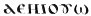

  
[Intangible Textual Heritage](../../index)  [Egyptian](../index.md) 
[Index](index)  [Previous](dmp16)  [Next](dmp18.md) 

------------------------------------------------------------------------

### COL. XIV.

\(1\) That which another man said to me; 'Open my eyes,' unto four
times. (2) \[A vessel-divination:\] 'Open my eyes; open thy eyes,' (and)
vice versa, unto three times. 'Open, Tat; Open, Nap,' three times; (3)
'open \[unto me?\]' three \[times?\], 'for I am Artamo, born of Hame-o
(?), the great basilisk of the East, rising in glory together with thy
father (4)at dawn; hail (*bis*), Heh, open to me Hah,' you say it with a
drawling (?) voice, 'Artamo, open to me Hah; if thou dost (5) not open
to me Hah, I will make thee open to me Hah. O Ibis (*bis*), sprinkle(?),
that I may (?) see the great god. Anubis, the power, (6) that is about
(?) my head, the great protector (?) of the *uzat*, the power, Anubis,
the good ox-herd, at every opening(?) (of the eye?) which I have (?)
made, (7) reveal thyself to me; for I am Nasthom,

p. 100 p. 101

\[paragraph continues\] Naszot, Nashoteb, Borilammai (*bis*), (8)
Mastinx, Anubis, Megiste, Arian, thou who art great, Arian, Pi-anuzy
(?), Arian, (9) he who is without. Hail, Phrix, Ix, Anaxibrox, Ambrox,
Eborx, Xon, (10) Nbrokhria, the great child, Anubis; for I am that
soldier. O ye of the Atef-crown, ye of Pephnun, Masphoneke; (11) hail!
let all that I have said come to pass here to-day; say, hail! thou art
Tham, Thamthom, Thamathom, (12) Tharnathomtham, Thamathouthi, Amon
(*bis*), thy correct name, whom they call Thom, (13) Anakthom; thou art
Itth; Thouthi is thy name, Sithom, Anithom Op-sao (?), Shatensro (14)
black; open to me the mouths of my vessel here to-day; come to me to the
mouths of my vessel, my bandage (?), let (15) my cup make the reflection
(?) of heaven; may the hounds of the *hulot* give me that which is just
in the abyss; may they tell me (16) that about which I inquire here
to-day truly (*bis*), there being no falsehood in them  , Makhopneuma.' (17) Formula:
you take a bowl of bronze, you engrave a figure of Anubis in it; you
fill it with water left to settle (?) and (18) guarded(?) lest(?) the
sun should reach it; you finish its (sur-)face (of the water) with fine
oil. You place it on \[three?\] new bricks, their lower sides being
sprinkled (19) with sand; you put four other bricks under the child; you
make the child lie down upon (?) his stomach; (20) you cause him (?) to
place his chin on the brick of the vessel; you make him look into

p. 102 p. 103

the oil, he having a cloth spread over his head, (21) there being a
lighted lamp on his right, and a censer with fire on his left; you put a
leaf of (22) Anubis-plant on the lamp, you put this incense on (the
fire); you recite these spells, which are above, to the vessel seven
times. The incense which you put (23) on (the fire): frankincense (?),
wax (?), styrax, turpentine (?), date-stone (?); grind them with wine;
you make them into a (24) ball and put them on (the fire). When you have
finished, you make the child open his eyes, you ask him, saying, 'Is the
god coming in?' If he says (25) 'The god has come in,' you recite before
him: formula; 'Thy bull(?) Mao, ho! Anubis, this soldier(?), this Kam,
(26) this Kem ... Pisreithi (*bis*), Sreithi (*bis*), Abrithi is thy
name, by thy correct name.' (27) You ask him concerning that which you
\[desire\]; when you have finished your inquiry which you are asking
about, you call to him seven times; you dismiss the god to his home. His
dismissal formula: (38) ' Farewell (*bis*) Anubis, the good ox-herd,
Anubis (*bis*), the son of a (?) jackal (and?) a dog . another volume
saith: the child of . (29) Isis (?) (and 7) a dog, Nabrishoth, the
Cherub (?) of Amenti, king of those of.....' Say seven times. You take
(30) the lamp from (?) the child, you take the vessel containing water,
you take the cloth off him. You do it also (31) by vessel-inquiry alone,
excellent (*bis*), tried (?), tested nine times.

The Anubis-plant. It grows in very numerous places;

p. 104 p. 015

\[paragraph continues\] (32) its leaf is like the leaf of Syrian \[plant
(?)\]; it turns (?) white; its flower is like the flower of conyza.

\(33\) ... you ... eye .... before you ... the vessel.

------------------------------------------------------------------------

[Next: Col. XV](dmp18.md)
