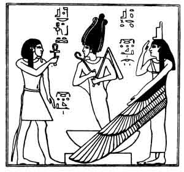

  
[Intangible Textual Heritage](../../index)  [Egypt](../index.md) 
[Index](index)  [Previous](efl01)  [Next](efl03.md) 

------------------------------------------------------------------------

p. 13

# CONTENTS

|                                                |                           |
|------------------------------------------------|---------------------------|
|                                                | PAGE                      |
| PREFACE                                        | [9](efl01.htm#page_9.md)     |
| CHAPTER I. The Belief in God Almighty          | [17](efl03.htm#page_17.md)   |
| CHAPTER II. Osiris the God of the Resurrection | [61](efl04.htm#page_61.md)   |
| CHAPTER III. The "Gods" of the Egyptians       | [108](efl05.htm#page_108.md) |
| CHAPTER IV. The judgment of the Dead           | [136](efl06.htm#page_136.md) |
| CHAPTER V. The Resurrection and Immortality    | [183](efl07.htm#page_183.md) |

 

LIST OF ILLUSTRATIONS

|                                                            |      |
|------------------------------------------------------------|------|
|                                                            | PAGE |
| The Resurrection of Osiris                                 | 16   |
| Osiris-Nepra, with wheat growing from his body             | 31   |
| Isis pouring out a libation in honor of the soul of Osiris | 32   |
| The Creation                                               | 43   |
| Osiris seated on his throne by, or above a lake of water   | 44   |

 

p. 14

|                                                                                      |     |
|--------------------------------------------------------------------------------------|-----|
| Osiris in the character of Menu and Harpokrates, as they sat in the disk of the moon | 55  |
| Osiris standing between Isis and Nephthys                                            | 56  |
| Osiris rising from his bier at the command of Horus                                  | 69  |
| Setting up the <u>T</u>e<u>t</u>                                                     | 69  |
| The king handing the <u>T</u>e<u>t</u> to Isis                                       | 69  |
| The <u>T</u>e<u>t</u> of Osiris                                                      | 70  |
| The <u>T</u>e<u>t</u>, from which proceeds "Life"                                    | 70  |
| Isis suckling Horus in the [papyrus](errata.htm#0.md) swamp                             | 79  |
| Osiris <u>H</u>emka begetting a son by Isis                                          | 80  |
| Osiris on his bier under which are vases containing his intestines                   | 80  |
| The soul of Râ meeting the soul of Osiris in Tattu                                   | 85  |
| Horus and his four sons standing before Osiris and Serapis                           | 86  |
| Osiris in his closed shrine, accompanied by Isis and his four grandsons              | 95  |
| Thoth and Horus binding together the thrones of Osiris, Isis, and Nephthys           | 96  |
| Osiris being embraced by Isis and Nephthys                                           | 117 |
| Isis and Nephthys bewailing the death of Osiris                                      | 118 |
| Thoth, the advocate of Osiris                                                        | 118 |

 

p. 15

|                                                                         |     |
|-------------------------------------------------------------------------|-----|
| The judgment of the dead in the hall of Maâti                           | 163 |
| The wicked being burnt in a pit of fire                                 | 164 |
| The deceased being led into the presence of Osiris                      | 173 |
| Osiris seated in judgment on top of a flight of nine steps              | 174 |
| The Elysian fields of the Egyptians according to the Papyrus of Nebseni | 197 |
| The "doubles" of Ani and his wife drinking water in the Other World     | 198 |
| Isis giving bread and water to the Heart-Soul                           | 198 |
| The Elysian Fields of the Egyptians according to the Papyrus of Ani     | 207 |
| Osiris seated in his shrine at Abydos                                   | 208 |
| The Elysian fields according to the Papyrus of Anhai                    | 213 |
| The weighing of the heart in the presence of Râ                         | 24  |
| The deceased setting out for the Other World                            | 214 |
| The deceased building himself a house in the Other World                | 214 |

 

p. 16

 

The resurrection of Osiris. From the bas-relief at Philae.

------------------------------------------------------------------------

[Next: Chapter I: The Belief in God Almighty](efl03.md)
