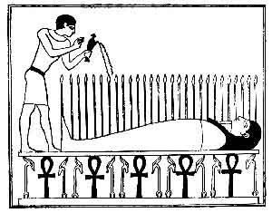
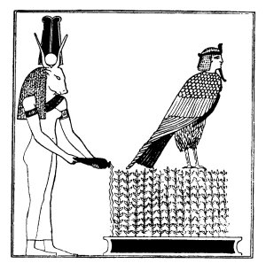
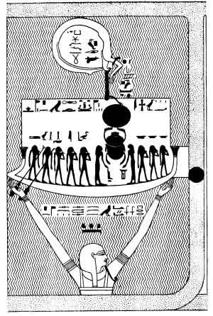
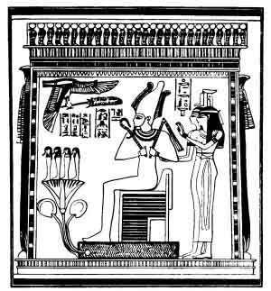
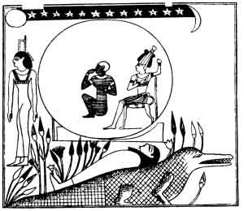
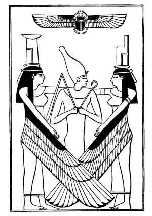

  
[Intangible Textual Heritage](../../index)  [Egypt](../index) 
[Index](index)  [Previous](efl02)  [Next](efl04) 

------------------------------------------------------------------------

p. 17

# EGYPTIAN IDEAS OF THE FUTURE LIFE.

## CHAPTER I.

#### THE BELIEF IN GOD ALMIGHTY.

A STUDY of ancient Egyptian religious texts will convince the reader
that the Egyptians believed in One God, who was self-existent, immortal,
invisible, eternal, omniscient, almighty, and inscrutable; the maker of
the heavens, earth, and underworld; the creator of the sky and the sea,
men and women, animals and birds, fish and creeping-things, trees and
plants, and the incorporeal beings who were the messengers that
fulfilled his wish and word, It is necessary to place this definition of
the first part of the belief of the Egyptian at the beginning of the
first chapter of this brief account of the principal religious ideas
which he held, for the whole of his theology and religion was based upon
it; and it is also necessary to add that, however

p. 18

far back we follow his literature, we never seem to approach a time when
he was without this remarkable belief. It is true that he also developed
polytheistic ideas and beliefs, and that he cultivated them at certain
periods of his history with diligence, and to such a degree that the
nations around, and even the stranger in his country, were misled by his
actions, and described him as a polytheistic idolater. But
notwithstanding all such departures from observances, the keeping of
which befitted those who believed in God and his unity, this sublime
idea was never lost sight of; on the contrary, it is reproduced in the
religious literature of all periods. Whence came this remarkable
characteristic of the Egyptian religion no man can say, and there is no
evidence whatsoever to guide us in formulating the theory that it was
brought into Egypt by immigrants from the East, as some have said, or
that it was a natural product of the indigenous peoples who formed the
population of the valley of the Nile some ten thousand years ago,
according to the opinion of others. All that is known is that it existed
there at a period so remote that it is useless to attempt to measure by
years the interval of time which has elapsed since it grew up and
established itself in the minds of men, and that it is exceedingly
doubtful if we shall ever have any very definite knowledge on this
interesting point.

But though we know nothing about the period of

p. 19

the origin in Egypt of the belief in the existence of an almighty God
who was One, the inscriptions show us that this Being was called by a
name which was something like *Neter*, [1](#fn_0)
the picture sign for which was an axe-head, made probably of stone, let
into a long wooden handle. The coloured picture character shews that the
axe-head was fastened into the handle by thongs of leather or string,
and judging by the general look of the object it must have been a
formidable weapon in strong, skilled hands. A theory has recently been
put forward to the effect that the picture character represents a stick
with a bit of coloured rag tied to the top, but it will hardly commend
itself to any archaeologist. The lines which cross the side of the
axe-head represent string or strips of leather, and indicate that it was
made of stone which, being brittle, was liable to crack; the picture
characters which delineate the object in the latter dynasties shew that
metal took the place of the stone axe-head, and being tough the new
substance needed no support. The mightiest man in the prehistoric days
was he who had the best weapon, and knew how to wield it with the
greatest effect; when the prehistoric hero of many fights and victories
passed to his rest, his own or a similar weapon was buried with him to
enable him to wage war successfully in the next world. The

p. 20

mightiest man had the largest axe, and the axe thus became the symbol of
the mightiest man. As he, by reason of the oft-told narrative of his
doughty deeds at the prehistoric camp fire at eventide, in course of
time passed from the rank of a hero to that of a god, the axe likewise
passed from being the symbol of a hero to that of a god. Far away back
in the early dawn of civilization in Egypt, the object which I identify
as an axe may have had some other signification, but if it had, it was
lost long before the period of the rule of the dynasties in that
country.

Passing now to the consideration of the meaning of the name for God,
*neter*, we find that great diversity of opinion exists among
Egyptologists on the subject. Some, taking the view that the equivalent
of the word exists in Coptic, under the form of *Nuti*, and because
Coptic is an ancient Egyptian dialect, have sought to deduce its meaning
by seeking in that language for the root from which the word may be
derived. But all such attempts have had no good result, because the word
Nuti stands by itself, and instead of being derived from a Coptic root
is itself the equivalent of the Egyptian *neter*, [1](#fn_1) and was taken over by the translators of the
Holy Scriptures from that language to express the words "God" and
"Lord." The Coptic root *nomti* cannot in any way be connected with
*nuti*, and the attempt to prove that the two are related was only

p. 21

made with the view of helping to explain the fundamentals of the
Egyptian religion by means of Sanskrit and other Aryan analogies. It is
quite possible that the word *neter* means "strength," "power," and the
like, but these are only some of its derived meanings, and we have to
look in the hieroglyphic inscriptions for help in order to determine its
most probable meaning. The eminent French Egyptologist, E. de Rougé,
connected the name of God, *neter*, with the other word *neter*,
"renewal" or "renovation," and it would, according to his view, seem as
if the fundamental idea of God was that of the Being who had the power
to renew himself perpetually--or in other words, "self-existence." The
late Dr. H. Brugsch partly accepted this view, for he defined *neter* as
being "the active power which produces and creates things in regular
recurrence; which bestows new life upon them, and gives back to them
their youthful vigour." [1](#fn_2) There seems to
be no doubt that, inasmuch as it is impossible to find any one word
which will render *neter* adequately and satisfactorily,
"self-existence" and "possessing the power to renew life indefinitely,"
may together be taken as the equivalent of *neter* in our own tongue. M.
Maspero combats rightly the attempt to make strong "the meaning of
*neter* (masc.), or *neterit* (fem.) in these words: "In the expressions
'a town *neterit* 'an arm *neteri*,' . . is it certain that 'a strong
city,'

p. 22

'a strong arm,' give its the primitive sense of *neter*? When among,
ourselves one says 'divine music,' 'a piece of divine poetry,' 'the
divine taste of a peach,' 'the divine beauty of a woman,' \[the word\]
divine is a hyperbole, but it would be a mistake to declare that it
originally meant 'exquisite' because in the phrases which I have
imagined one could apply it as 'exquisite music,' 'a piece of exquisite
poetry,' 'the exquisite taste of a peach,' 'the exquisite beauty of a
woman.' Similarly, in Egyptian, 'a town *neterit*' is 'a divine town;'
an arm *neteri*' is 'a divine arm,' and *neteri* is employed
metaphorically in Egyptian as is \[the word\] 'divine' in French,
without its being any more necessary to attribute to \[the word\]
*neteri* the primitive meaning of 'strong,' than it is to attribute to
\[the word\] 'divine' the primitive meaning of 'exquisite.'" [1](#fn_3) It may be, of course, that *neter* had
another meaning which is now lost, but it seems that the great
difference between God and his messengers and created things is that he
is the Being who is self-existent and immortal, whilst they are not
self-existent and are mortal.

Here it will be objected by those who declare that the ancient Egyptian
idea of God is on a level with that evolved by peoples and tribes who
stand comparatively little removed from very intelligent animals, that
such high conceptions as self-existence and immortality belong to a
people who are already on a

p. 23

high grade of development and civilization. This is precisely the case
with the Egyptians when we first know them. As a matter of fact, we know
nothing of their ideas of God before they developed sufficiently to
build the monuments which we know they built, and before they possessed
the religion, and civilization, and complex social system which their
writings have revealed to us. In the remotest prehistoric times it is
probable that their views about God and the future life were little
better than those of the savage tribes, now living, with whom some have
compared them. The primitive god was an essential feature of the family,
and the fortunes of the god varied with the fortunes of the family; the
god of the city in which a man lived was regarded as the ruler of the
city, and the people of that city no more thought of neglecting to
provide him with what they considered to be due to his rank and position
than they thought of neglecting to supply their own wants. In fact the
god of the city became the centre of the social fabric of that city, and
every inhabitant thereof inherited automatically certain duties, the
neglect of which brought stated pains and penalties upon him. The
remarkable peculiarity of the Egyptian religion is that the primitive
idea of the god of the city is always cropping up in it, and that is the
reason why we find semi-savage ideas of God side by side with some of
the most sublime conceptions, and it of course underlies

p. 24

all the legends of the gods wherein they possess all the attributes of
men and women. The Egyptian in his semi-savage state was neither better
nor worse than any other man in the same stage of civilization, but he
stands easily first among the nations in his capacity for development,
and in his ability for evolving conceptions concerning God and the
future life, which are claimed as the peculiar product of the cultured
nations of our time.

We must now, however, see how the word for God, *neter*, is employed in
religious texts and in works which contain moral precepts. In the text
of Unas, [1](#fn_4) a king who reigned about B.C.
3300, we find the passage:--"That which is sent by thy *ka* cometh to
thee, that which is sent by thy father cometh to thee, that which is
sent by Râ cometh to thee, and it arriveth in the train of thy Râ. Thou
art pure, thy bones are the gods and the goddesses of heaven, thou
existest at the side of God, thou art unfastened, thou comest forth
towards thy soul, for every evil word (or thing) which hath been written
in the name of Unas hath been done away." And, again, in the text of
Teta, [2](#fn_5) in the passage which refers to
the place in the eastern part of heaven "where the gods give birth unto
themselves, where that to which they give birth is born, and where they
renew their youth," it is said of this king, "Teta standeth up in the
form of

p. 25

the star . . . he weigheth words (*or* trieth deeds), and behold God
hearkeneth unto that which he saith." Elsewhere [1](#fn_6) in the same text we read, "Behold, Teta hath
arrived in the height of heaven, and the *henmemet* beings have seen
him; the Semketet [2](#fn_7) boat knoweth him,
and it is Teta who saileth it, and the Mântchet [3](#fn_8) boat calleth unto him, and it is Teta who
bringeth it to a standstill. Teta hath seen his body in the Semketet
boat, he knoweth the uraeus which is in the Mântchet boat, and God hath
called him in his name . . . and hath taken him in to Râ' And
again [4](#fn_9) we have: "Thou hast received the
form (or attribute) of God, and thou hast become great therewith before
the gods"; and of Pepi I., who reigned about B.C. 3000, it is said,
"This Pepi is God, the son of God." [5](#fn_10)

Now in these passages the allusion is to the supreme Being in the next
world, the Being who has the power to invoke and to obtain a favourable
reception for the deceased king, by Râ, the Sun-god, the type and symbol
of God. It may, of course, be urged that the word *neter* here refers to
Osiris, but it is not customary to speak of this god in such a way in
the texts; and even if we admit that it does, it only shows that the
powers of God have been attributed to Osiris, and that he was believed
to occupy the position in

p. 26

respect of Râ, and the deceased which the supreme Being himself
occupied. In the last two extracts given above we might read "a god"
instead of "God," but there is no object in the king receiving the form
or attribute of a nameless god; and unless Pepi becomes the son of God,
the honour which the writer of that text intends to ascribe to the king
becomes little and even ridiculous.

Passing from religious texts to works containing moral precepts, we find
much light thrown upon the idea of God by the writings of the early
sages of Egypt. First and foremost among these are the "Precepts of
Kaqemna" and the "Precepts of Ptah-hetep," works which were composed as
far back as B.C. 3000. The oldest copy of them which we possess is,
unfortunately, not older than B.C. 2500, but this fact in no way affects
our argument. These "precepts" are intended to form a work of direction
and guidance for a young man in the performance of his duty towards the
society in which he lived and towards his God. It is only fair to say
that the reader will look in vain in them for the advice which is found
in writings of a similar character composed at a later period; but as a
work intended to demonstrate the "whole duty of man" to the youth of the
time when the Great Pyramid was still a new building, these "precepts"
are very remarkable. The idea of God held by Ptah-hetep is illustrated
by the following passages:--

p. 27

1\. "Thou shalt make neither man nor woman to be afraid, for God is
opposed thereto; and if any man shall say that he will live thereby, He
will make him to want bread."

2\. "As for the nobleman who possesseth abundance of goods, he may act
according to his own dictates; and he may do with himself that which he
pleaseth; if he will do nothing at all, that also is as he pleaseth. The
nobleman by merely stretching out his hand doeth that which mankind
(*or* a person) cannot attain to; but inasmuch as the eating of bread is
according to the plan of God, this cannot be gainsaid."

3\. "If thou hast ground to till, labour in the field which God hath
given thee; rather than fill thy mouth with that which belongeth to thy
neighbours it is better to terrify him that hath possessions \[to give
them unto thee\]."

4\. "If thou abasest thyself in the service of a perfect man, thy
conduct shall be fair before God."

5\. "If thou wouldst be a wise man, make thou thy son to be pleasing
unto God."

6\. "Satisfy those who depend upon thee as far as thou art able so to
do; this should be done by those whom God hath favoured."

7\. "If, having been of no account, thou hast become great; and if,
having been poor, thou hast become rich; and if thou hast become
governor of the city, be not hard-headed on account of thy advancement,
because

p. 28

thou hast become merely the guardian of the things which God hath
provided."

8 "What is loved of God is obedience; God hateth disobedience."

9\. "Verily a good son is of the gifts of God." [1](#fn_11)

The same idea of God, but considerably amplified in some respects, may
be found in the Maxims of *Khensit-hetep*, a work which was probably
composed during the XVIIIth dynasty. This work has been studied in
detail by a number of eminent Egyptologists, and though considerable
difference of opinion has existed among them in respect of details and
grammatical niceties, the general sense of the maxims has been clearly
established. To illustrate the use of the word *neter*, the following
passages have been chosen from it: [2](#fn_12)--

1\. "God magnifieth his name."

2\. "What the house of God hateth is much speaking. Pray thou with a
loving heart all the petitions which are in secret. He will perform thy
business, he will hear that which thou sayest and will accept thine
offerings."

3\. "God decreeth the right."

p. 29

4\. "When thou makest an offering unto thy God, guard thou against the
things which are an abomination unto him. Behold thou his plans with
thine eye, and devote thyself to the adoration of his name. He giveth
souls unto millions of forms, and him that magnifieth him doth he
magnify."

5\. "If thy mother raise her hands to God he will hear her prayers \[and
rebuke thee\]."

7\. "Give thyself to God, and keep thou thyself daily for God."

Now, although the above passages prove the exalted idea which the
Egyptians held of the supreme Being, they do not supply us with any of
the titles and epithets which they applied to him; for these we must
have recourse to the fine hymns and religious meditations which form so
important a part of the "Book of the Dead." But before we quote from
them, mention must be made of the *neteru*, *i.e.*, the beings or
existences which in some way partake of the nature or character of God,
and are usually called "gods." The early nations that came in contact
with the Egyptians usually misunderstood the nature of these beings, and
several modern Western writers have done the same. When we examine these
"gods" closely, they are found to be nothing more nor less than forms,
or manifestations, or phases, or attributes, of one god, that god being
Râ the Sun-god, who, it must be remembered, was the type and symbol of
God. Nevertheless, the

p. 30

worship of the neteru by the Egyptians has been made the base of the
charge of "gross idolatry" which has been brought against them, and they
have been represented by some as being on the low intellectual level of
savage tribes. It is certain that from the earliest times one of the
greatest tendencies of the Egyptian religion was towards monotheism, and
this tendency may be observed in all important texts down to the latest
period; it is also certain that a kind of polytheism existed in Egypt
side by side with monotheism from very early times. Whether monotheism
or polytheism be the older, it is useless in our present state of
knowledge to attempt to enquire. According to Tiele, the religion of
Egypt was at the beginning polytheistic, but developed in two opposite
directions: in the one direction gods were multiplied by the addition of
local gods, and in the other the Egyptians drew nearer and nearer to
monotheism. [1](#fn_13) Dr. Wiedemann takes the
view that three main elements may be recognized in the Egyptian
religion: (1) A solar monotheism, that is to say one god, the creator of
the universe, who manifests his power especially in the sun and its
operations; (2) A cult of the regenerating power of nature, which
expresses itself in the adoration of ithyphallic gods, of fertile
goddesses, and of a series

p. 31

 

Osiris-Nepra, with wheat growing from his body. From a bas-relief at
Philae.

p. 32

 

The cow-headed Isis pouring out a libation in honor of the soul of
Osiris, which rises in the form of a man-headed hawk from the plants
growing in a sacred lake.

From the bas-relief at Philae.

p. 33

of animals and of various deities of vegetation; (3) A perception of an
anthropomorphic divinity, the life of whom in this world and in the
world beyond this was typical of the ideal life of man [1](#fn_14)--this last divinity being, of course,
Osiris. But here again, as Dr. Wiedemann says, it is an unfortunate fact
that all the texts which we possess are, in respect of the period of the
origin of the Egyptian religion, comparatively late, and therefore in
them we find these three elements mixed together, along with a number of
foreign matters, in such a way as to make it impossible to discover
which of them is the oldest. No better example can be given of the loose
way in which different ideas about a god and God are mingled in the same
text than the "Negative Confession" in the hundred and twenty-fifth
chapter of the Book of the Dead. Here, in the oldest copies of the
passages known, the deceased says, "I have mot cursed God" (l. 38), and
a few lines after (l. 42) he adds, "I have not thought scorn of the god
living in my city." It seems that here we have indicated two different
layers of belief, and that the older is represented by the allusion to
the "god of the city," in which case it would go back to the time. when
the Egyptian lived in a very primitive fashion. If we assume that God
(who is mentioned in line 38) is Osiris, it does not do away with the
fact that he was regarded as a being entirely different from the "god of

p. 34

the city" and that he was of sufficient importance to have one line of
the "Confession" devoted to him. The Egyptian saw no incongruity in
setting references to the "gods" side by side with allusions to a god
whom we cannot help identifying with the Supreme Being and the Creator
of the world; his ideas and beliefs have, in consequence, been sadly
misrepresented, and by certain writers he has been made an object of
ridicule. What, for example, could be a more foolish description of
Egyptian worship than the following? "Who knows not, O Volusius of
Bithynia, the sort of monsters Egypt, in her infatuation, worships. One
part venerates the crocodile; another trembles before an ibis gorged
with serpents. The image of a sacred monkey glitters in gold, where the
magic chords sound from Memnon broken in half, and ancient Thebes lies
buried in ruins, with her hundred gates. In one place they venerate
sea-fish, in another river-fish; there, whole towns worship a dog: no
one Diana. It is ail impious act to violate or break with the teeth a
leek or an onion. O holy nations! whose gods grow for them in their
gardens! Every table abstains from animals that have wool: it is a crime
there to kill a kid. But human flesh is lawful food." [1](#fn_15)

p. 35

The epithets which the Egyptians applied to their gods also bear
valuable testimony concerning the ideas which they held about God. We
have already said that the "gods" are only forms, manifestations, and
phases of Râ, the Sun-god, who was himself the type and symbol of God,
and it is evident from the nature of these epithets that they were only
applied to the "gods" because they represented some quality or attribute
which they would have applied to God had it been their custom to address
Him. Let us take as examples the epithets which are applied to Hâpi the
god of the Nile. The beautiful hymn to this god opens as follows:--

Homage to thee, O Hâpi! Thou comest forth in this land, and dost come in
peace to make Egypt to live, O thou hidden one, thou guide of the
darkness whensoever it is thy pleasure to be its guide. Thou waterest
the fields which Râ hath created, thou makest all animals to live, thou
makest the land to drink

p. 36

without ceasing; thou descendest the path of heaven thou art the friend
of meat and drink, thou art the giver of the grain, and thou makest
every place of work to flourish, O Ptah! . . . If thou wert to be
overcome in heaven the gods would fall down headlong, and mankind would
perish. Thou makest the whole earth to be opened (*or* ploughed up) by
the cattle, and prince and peasant lie down to rest. . . . His
disposition (or form) is that of Khnemu; when he shineth upon the earth
there is rejoicing, for all people are glad, the mighty man (?)
receiveth his meat, and every tooth hath food to consume."

After praising him for what he does for mankind and beasts, and for
making the herb to grow for the use of all men, the text says:--

"He cannot be figured in stone; he is not to be seen in the sculptured
images upon which men place the united crowns of the South and the North
furnished with uraei; neither works nor offerings can be made to him;
and he cannot be made to come forth from his secret place. The place
where he liveth is unknown; he is not to be found in inscribed shrines;
there existeth no habitation which can contain him; and thou canst not
conceive his form in thy heart."

First we notice that Hâpi is addressed by the names of Ptah and Khnemu,
not because the writer thought these three gods were one, but because
Hâpi as the great supplier of water to Egypt became, as it were,

p. 37

a creative god like Ptah and Khnemu. Next we see that it is stated to be
impossible to depict him in paintings, or even to imagine what his form
may be, for he is unknown and his abode cannot be found, and no place
can contain him. But, as a matter of fact, several pictures and
sculptures of Hâpi have been preserved, and we know that he is generally
depicted in the form of two gods; one has upon his head a papyrus plant,
and the other a lotus plant, the former being the Nile-god of the South,
and the latter the Nile-god of the North. Elsewhere he is portrayed in
the form of a large man having the breasts of a woman. It is quite
clear, then, that the epithets which we have quoted are applied to him
merely as a form of God. In another hymn, which was a favourite in the
XVIIIth and XIXth dynasties, Hâpi is called "One," and is said to have
created himself; but as he is later on in the text identified with Râ
the epithets which belong to the Sun-god are applied to him. The late
Dr. H. Brugsch collected [1](#fn_16) a number of
the epithets which are applied to the gods, from texts of all periods;
and from these we may see that the ideas and beliefs of the Egyptians
concerning God were almost identical with those of the Hebrews and
Muhammadans at later periods, When classified these epithets read
thus:--

"God is One and alone, and none other existeth

p. 38

with Him; God is the One, the One Who hath made all things.

"God is a spirit, a hidden spirit, the spirit of spirits, the great
spirit of the Egyptians, the divine spirit.

"God is from the beginning and He hath been from the beginning; He hath
existed from of old and was when nothing else had being. He existed when
nothing else existed, and what existeth He created after He had come
into being. He is the father of beginnings.

"God is the eternal One, He is eternal and infinite; and endureth for
ever and aye; He hath endured for countless ages, and He shall endure to
all eternity.

"God is the hidden Being, and no man hath known His form. No man hath
been able to seek out His likeness; He is hidden from gods and men, and
He is a mystery unto His creatures.

"No man knoweth how to know Him. His name remaineth hidden; His name is
a mystery unto His children. His names are innumerable, they are
manifold and none knoweth their number.

"God is truth, and He liveth by truth, and He feedeth thereon. He is the
King of truth, He resteth upon truth, He fashioneth truth, and He
executeth truth throughout all the world.

"God is life, and through Him only man liveth. He giveth life to man,
and He breatheth the breath of life into his nostrils.

"God is father and mother, the father of fathers,

p. 39

and the mother of mothers. He begetteth, but was never begotten; He
produceth, but was never produced, He begat Himself and produced
Himself. He createth, but was never created; He is the maker of His own
form, and the fashioner of His own body.

"God Himself is existence, He liveth in all things, and liveth upon all
things. He endureth without increase or diminution, He multiplieth
Himself millions of times, and He possesseth multitudes of forms and
multitudes of members.

"God hath made the universe, and He hath created all that therein is: He
is the Creator of what is in this world, of what was, of what is, and of
what shall be. He is the Creator of the world, and it was He Who
fashioned it with His hands before there was any beginning; and He
stablished it with that which went forth from Him. He is the Creator of
the heavens and the earth; the Creator of the heavens, and the earth,
and the deep; the Creator of the heavens, and the earth, and the deep,
and the waters, and the mountains. God hath stretched out the heavens
and founded the earth. What His heart conceived came to pass
straightway, and when He had spoken His word came to pass, and it shall
endure for ever.

"God is the father of the gods, and the father of the father of all
deities; He made His voice to sound, and the deities came into being,
and the gods sprang into existence after He had spoken with His mouth.
He

p. 40

formed mankind and fashioned the gods. He is the great Master, the
primeval Potter Who turned men and gods out of His bands, and He formed
men and gods upon a potter's table.

"The heavens rest upon His head, and the earth supporteth His feet;
heaven hideth His spirit, the earth hideth His form, and the underworld
shutteth up the mystery of Him within it. His body is like the air,
heaven resteth upon His head, and the new inundation \[of the Nile\]
containeth His form.

"God is merciful unto those who reverence Him, and He heareth him that
calleth upon Him. He protecteth the weak against the strong, and He
heareth the cry of him that is bound in fetters; He judgeth between the
mighty and the weak. God knoweth him that knoweth Him, He rewardeth him
that serveth Him, and He protecteth him that followeth Him."

We have now to consider the visible emblem, and the type and symbol of
God, namely the Sun-god Râ, who was worshipped in Egypt in prehistoric
times. According to the writings of the Egyptians, there was a time when
neither heaven nor earth existed, and when nothing had being except the
boundless primeval [1](#fn_17) water, which was,
however, shrouded with thick darkness. In this condition the primeval
water remained for a considerable time, notwithstanding that it
contained within it the germs of the things which afterwards

p. 41

came into existence in this world, and the world itself. At length the
spirit of the primeval water felt the desire for creative activity, and
having uttered the word, the world sprang straightway into being in the
form which had already been depicted in the mind of the spirit before he
spake the word which resulted in its creation. The next act of creation
was the formation of a germ, or egg, from which sprang Râ, the Sun-god,
within whose shining form was embodied the almighty power of the divine
spirit.

Such was the outline of creation as described by the late Dr. H.
Brugsch, and it is curious to see how closely his views coincide with a
chapter in the *Papyrus of Nesi Amsu* preserved in the British
Museum. [1](#fn_18) In the third section of this
papyrus we find a work which was written with the sole object of
overthrowing Âpep, the great enemy of Râ, and in the composition itself
we find two versions of the chapter which describes the creation of the
earth and all things therein. The god Neb-er-tcher is the speaker, and
he says:--

"I evolved the evolving of evolutions. I evolved myself under the form
of the evolutions of the god Khepera, which were evolved at the
beginning of all time. I evolved with the evolutions of the god Khepera;
I evolved by the evolution of evolutions--

p. 42

that is to say, I developed myself from the primeval matter which I
made, I developed myself out of the primeval matter. My name is Ausares
(Osiris), the germ of primeval matter. I have wrought my will wholly in
this earth, I have spread abroad and filled it, I have strengthened it
\[with\] my hand. I was alone, for nothing had been brought forth; I bad
not then emitted from myself either Shu or Tefnut. I uttered my own
name, as a word of power, from my own mouth, and I straightway evolved
myself. I evolved myself under the form of the evolutions of the god
Khepera, and I developed myself out of the primeval matter which has
evolved multitudes of evolutions from the beginning of time. Nothing
existed on this earth then, and I made all things. There was none other
who worked with me at that time. I performed all evolutions there by
means of that divine Soul which I fashioned there, and which had
remained inoperative in the watery abyss. I found no place there whereon
to stand. But I was strong in my heart, and I made a foundation for
myself, and I made everything which was made. I was alone. I made a
foundation for my heart (*or* will), and I created multitudes of things
which evolved themselves like unto the evolutions of the god Khepera,
and their offspring came into being from the evolutions of their births.
I emitted from myself the gods Shu and Tefnut, and from being One I
became Three; they

p. 43

 

The Creation. The god Nu rising out of the primeval water and bearing in
his hands the boat of Râ, the Sun-god, who is accompanied by a number of
deities . In the upper portion of the scene is the region of the
underworld which is enclosed by the body of Osiris, on whose head stands
the goddess Nut with arms stretched out to receive the disk of the sun.

p. 44

 

Osiris seated on his throne by, or above a lake of water. From the
Papyrus of Hunefer.

p. 45

sprang from me, and came into existence in this earth. . . . Shu and
Tefnut brought forth Seb and Nut, and Nut brought forth Osiris,
Horus-khent-an-maa, Sut, Isis, and Nephthys at one birth."

The fact of the existence of two versions of this remarkable Chapter
proves that the composition -is much older than the papyrus [1](#fn_19) in which it is found, and the variant
readings which occur in each make it certain that the Egyptian scribes
had difficulty in understanding what they were writing. It may be said
that this version of the cosmogony is incomplete, because it does not
account for the origin of any of the gods except those who belong to the
cycle of Osiris, and this objection is a valid one; but in this place we
are only concerned to shew that Râ, the Sun-god, was evolved from the
primeval abyss of water by the agency of the god Khepera, who brought
this result about by pronouncing his own name. The great cosmic gods,
such as Ptah and Khnemu, of whom mention will be made later, are the
offspring of another set of religious views, and the cosmogony in which
these play the leading parts is entirely different. We must notice, in
passing, that the god whose words we have quoted above declares that he
evolved himself under the form of Khepera, and that his name is Osiris,
"the primeval matter of primeval matter," and that, as a result, Osiris
is identical with Khepera in respect of his evolutions

p. 46

and new births. The word rendered "evolutions" is *kheperu*, literally
"rollings"; and that rendered "primeval matter" is *paut*, the original
"stuff" out of which everything was made. In both versions we are told
that men and women came into being from the tears which fell from the
Eye" of Khepera, that is to say from the Sun, which, the god says, "I
made take to up its place in my face, and afterwards it ruled the whole
earth."

We have seen how Râ has become the visible type and symbol of God, and
the creator of the world and of all that is therein; we may now consider
the position which he held with respect to the dead. As far back as the
period of the IVth dynasty,--about B.C. 3700, he was regarded as the
great god of heaven, and the king of all the gods, and divine beings,
and of the beatified dead who dwelt therein. The position of the
beatified in heaven is decided by Râ, and of all the gods there Osiris
only appears to have the power to claim protection for his followers;
the offerings which the deceased would make to Râ, are actually
presented to him by Osiris. At one time the Egyptian's greatest hope
seems to have been that he might not only become "God, the son of God,"
by adoption, but that Râ would become actually his father. For in the
text of Pepi. I., [1](#fn_20) it is said: "Pepi
is the son of Râ who loveth him; and he goeth forth and raiseth himself

p. 47

up to heaven. Râ hath begotten Pepi, and he goeth forth and raiseth
himself up to heaven. Râ hath conceived Pepi, and he goeth forth and
raiseth himself up to heaven. Râ hath given birth to Pepi, and he, goeth
forth and raiseth himself up to heaven." Substantially these ideas
remained the same from the earliest to the latest times, and Râ
maintained his position as the great head of the companies,
notwithstanding the rise of Amen into prominence, and the attempt to
make Aten the dominant god of Egypt by the so-called "Disk worshippers."
The following good typical examples of Hymns to Râ are taken from the
oldest copies of the Theban Recension of the Book of the Dead.

I. FROM THE PAPYRUS OF ANI. [1](#fn_21)

Homage to thee, O thou who hast come as Khepera, Khepera the creator of
the gods. Thou risest and thou shinest, and thou makest light to be in
thy mother Nut (*i.e.*, the sky); thou art crowned king of the gods. Thy
mother Nut doeth an act of homage unto thee with both her hands. The
land of Manu (*i.e.*, the land where the sun sets) receiveth thee with
satisfaction, and the goddess Maât embraceth thee both at morn and at
eve. [2](#fn_22) Hail, all ye gods of the

p. 48

Temple of tine Soul, [1](#fn_23) who weigh
heaven and earth in the balance, and who provide divine food in
abundance! Hail, Tatunen, thou One, thou Creator of mankind and Maker of
the substance of the gods of the south and of the north, of the west and
of the east! O come ye and acclaim Râ, the lord of heaven and the
Creator of the gods, and adore ye him in his beautiful form as he cometh
in the morning in his divine bark.

"O Râ, those who dwell in the heights and those who dwell in the depths
adore thee. The god Thoth and the goddess Maât have marked out for thee
\[thy course\] for each and every day. Thine enemy the Serpent hath been
given over to the fire, the serpent-fiend Sebau hath fallen down
headlong; his arms have been bound in chains, and thou hast hacked off
his legs; and the sons of impotent revolt shall nevermore rise up
against thee. The Temple of the Aged One [2](#fn_24) (*i.e.*, Râ) keepeth festival, and the
voice of those who rejoice is in the mighty dwelling. The gods exult
when they see thy rising, O Râ, and when thy beams flood the world with
light. The Majesty of the holy god goeth forth and advanceth even unto
the land of Manu; he maketh brilliant the earth at his birth each day;
he journeyeth on to the place where he was yesterday."

p. 49

II\. FROM THE PAPYRUS OF HUNEFER. [1](#fn_25)

"Homage to thee, O thou who art Râ when thou risest and Temu when thou
settest. Thou risest, thou risest, thou shinest, thou shinest, O thou
who art crowned king of the gods. Thou art the lord of heaven, thou art
the lord of earth; thou art the creator of those who dwell in the
heights, and of those who dwell in the depths. Thou art the One God who
came into being in the beginning of time. Thou didst create the earth,
thou didst fashion man, thou didst make the watery abyss of the sky,
thou didst form Hâpi (*i.e.*, the Nile), thou didst create the great
deep, and thou dost give life unto all that therein is. Thou hast knit
together the mountains, thou hast made mankind and the beasts of the
field to come into being, thou hast made the heavens and the earth.
Worshipped be thou whom the goddess Maât embraceth at morn and at eve.
Thou dost travel across the sky with thy heart swelling with joy; the
great deep of heaven is content thereat. The serpent-fiend Nak [2](#fn_26) hath fallen, and his arms are cut off. The
Sektet [3](#fn_27) boat receiveth fair winds,
and the heart of him that is in the shrine thereof rejoiceth.

"Thou art crowned Prince of heaven, and thou art

p. 50

the One \[dowered with all sovereignty\] who appearest in the sky. Râ is
he who is true of voice. [1](#fn_28) Hail, thou
divine youth, thou heir of everlastingness, thou self-begotten One!
Hail, thou who didst give thyself birth! Hail, One, thou mighty being,
of myriad forms and aspects, thou king of the world, prince of Annu
(Heliopolis), lord of eternity, and ruler of everlastingness! The
company of the gods rejoice when thou risest and dost sail across the
sky, O thou who art exalted in the Sektet boat."

Homage to thee, O Amen-Râ, [2](#fn_29) who dost
rest upon Maât [3](#fn_30) thou passest over
heaven and every face seeth thee. Thou dost wax great as thy Majesty
doth advance, and thy rays are upon all faces. Thou art unknown, and no
tongue can declare thy likeness; thou thyself alone \[canst do this\].
Thou art One . . . Men praise thee in thy name, and they swear by thee,
for thou art lord over them. Thou hearest with thine ears, and thou
seest with thine eyes. Millions of years have gone over the world. I
cannot tell the number of those through which thou hast passed. Thy
heart hath decreed a day of happiness in thy name of 'Traveller.' Thou
dost pass over and dost travel through untold spaces \[requiring\]
millions and hundreds

p. 51

of thousands of years \[to pass over\]; thou passest through them in
peace, and thou steerest thy way across the watery abyss to the place
which thou lovest; this thou doest in one little moment of time, and
then thou dost sink down and dost make an end of the hours."

III\. FROM THE PAPYRUS OF ANI. [1](#fn_31)

The following beautiful composition, part hymn and part prayer, is of
exceptional interest.

"Hail, thou Disk, thou lord of rays, who risest on the horizon day by
day! Shine thou with thy beams of light upon the face of Osiris Ani, who
is true of voice; for he singeth hymns of praise unto thee at dawn, and
he maketh thee to set at eventide with words of adoration. May the soul
of Ani come forth with thee into heaven, may he go forth in the Mâtet
boat. May he come into port in the Sektet boat, and may he cleave his
path among the never-resting stars in the heavens.

"Osiris Ani, being in peace and triumph, adoreth his lord, the lord of
eternity, saying, 'Homage to thee, O Heru-khuti (Harmachis), who art the
god Khepera, the self-created one; when thou risest on the horizon and
sheddest thy beams of light upon the lands of the North and of the
South, thou art

p. 52

beautiful, yea beautiful, and all the gods rejoice when they behold
thee, the king of heaven. Thee goddess Nebt-Unnut is stablished upon thy
head; and her uraei of the South and of the North are upon thy brow; she
taketh up her place before thee. The god Thoth is stablished in the bows
of thy boat to destroy utterly all thy foes. Those who are in the Tuat
(underworld) come forth to meet thee, and they bow low in homage as they
come towards thee, to behold thy beautiful form. And I have come before
thee that I may be with thee to behold thy Disk each day. May I not be
shut up \[in the tomb\], may I not be turned back, may the limbs of my
body be made new again when I view thy beauties, even as \[are those
of\] all thy favoured ones, because I am one of those who worshipped
thee upon earth. May I come unto the land of eternity, may I come even
unto the everlasting land, for behold, O my lord, this hast thou
ordained for me.'

"'Homage to thee, O thou who risest in thy horizon as Râ, thou restest
upon Maât. [1](#fn_32) Thou passest over the
sky, and every face watcheth thee and thy course, for thou hast been
hidden from their gaze. Thou dost show thyself at dawn and at eventide
day by day. The Sektet boat, wherein is thy Majesty, goeth forth with
might; thy beams are upon \[all\] faces thy rays of red and yellow
cannot be known, and thy

p. 53

bright beams cannot be told. The lands of the gods and the eastern lands
of Punt [1](#fn_33) must be seen ere that which
is hidden \[in thee\] may be measured. [2](#fn_34) Alone and by thyself thou dost manifest
thyself \[when\] thou comest into being above Nu. May I advance, even as
thou dost advance; may I never cease \[to go forward\], even as thy
Majesty ceaseth not \[to go forward\], even though it be for a moment;
for with strides dost thou in one brief moment pass over spaces which
\[man\] would need hundreds of thousands, yea, millions of years to pass
over; \[this\] thou doest, and then thou dost sink to rest. Thou puttest
an end to the hours of the night, and thou dost count them, even thou;
thou endest them in thine own appointed season, and the earth becometh
light. Thou settest thyself before thy handiwork in the likeness of Râ;
thou risest in the horizon.'

"Osiris, the scribe Ani, declareth his praise of thee when thou shinest,
and when thou risest at dawn be crieth in his joy at thy birth,
saying:--

"I Thou art crowned with the majesty of thy beauties; thou mouldest thy
limbs as thou dost advance, and thou bringest them forth without
birth-pangs in the form of Râ, as thou dost rise up in the celestial
height, Grant thou thalt I may come unto the heaven which

p. 54

is everlasting, and unto the mountain where dwell thy favoured ones. May
I be joined unto those shining beings, holy and perfect, who are in the
underworld and may I come forth with them to behold thy beauties when
thou shinest at eventide, and goest to thy mother Nut. Thou dost place
thyself in the west, and my hands adore \[thee\] when thou settest as a
living being. [1](#fn_35) Behold, thou art the
everlasting creator, and thou art adored \[as such when\] thou settest
in the heavens. I have given my heart to thee without wavering, O thou
who art mightier than the gods.'

"A hymn of praise to thee, O thou who risest like unto gold, and who
dost flood the world with light on the day of thy birth. Thy mother
giveth thee birth, and straightway thou dost give light upon the path of
\[thy\] Disk, O thou great Light who shinest in the heavens. Thou makest
the generations of men to flourish through the Nile-flood, and thou dost
cause gladness to exist in all lands, and in all cities, and in all
temples. Thou art glorious by reason of thy splendours, and thou makest
strong thy KA (*i.e.* Double) with divine foods, O thou mighty one of
victories, thou Power of Powers, who dost make strong thy throne against
evil fiends-thou who art glorious in Majesty in the Sektet boat, and
most mighty in the Âtet [2](#fn_36) boat!"

p. 55

 

Osiris in the character of Menu, the "god of the uplifted arm,'' and
Harpokrates as they sat in the disk of the moon. Below is the
Crocodile-god Sebek bearing the mummy of the god on his back. To the
left stands Isis. From a bas-relief at Philae.

p. 56

 

Osiris standing between Isis and Nephthys.  
From a bas-relief at Philae.

p. 57

This selection may be fittingly closed by a short hymn [1](#fn_37) which, though of a later date, reproduces
in a brief form all the essentials of the longer hymns of the XVIIIth
dynasty (about B.C. 1700 to 1400).

Homage to thee, O thou glorious Being, thou who art dowered \[with all
sovereignty\]. O Temu-Harmachis, [2](#fn_38)
when thou risest in the horizon of heaven, a cry of joy cometh forth to
thee from the mouth of all peoples. O thou beautiful Being, thou dost
renew thyself in thy season in the form of the Disk within thy mother
Hathor; [3](#fn_39) therefore in every place
every heart swelleth with joy at thy rising for ever. The regions of the
North and South come to thee with homage, and send forth acclamations at
thy rising in the horizon of heaven; thou illuminest the two lands with
rays of turquoise light. Hail, Râ, thou who art Râ-Harmachis, thou
divine man-child, heir of eternity, self-begotten and self-born, king of
the earth, prince of the underworld, governor of the regions of Aukert
(*i.e.*, the underworld)! Thou didst come forth from the water, thou
hast sprung from the god Nu, who cberisheth thee and ordereth thy
members. Hail, god of life, thou lord of love, all men live when thou
shinest; thou art crowned king of the gods. The goddess Nut doeth homage
unto thee, and the goddess

p. 58

\[paragraph continues\] Maât embraceth thee at all times. Those who are
in thy following sing unto thee with joy and bow down their foreheads to
the earth when they meet thee, thou lord of heaven, thou lord of earth,
thou king of Right and Truth, thou lord of eternity, thou prince of
everlastingness, thou sovereign of all the gods, thou god of life, thou
creator of eternity, thou maker of heaven, wherein thou art firmly
established. The company of the gods rejoice at thy rising, the earth is
glad when it beholdeth thy rays; the peoples that have been long dead
come forth with cries of joy to see thy beauties every day. Thou goest
forth each day over heaven and earth, and art made strong each day by
thy mother Nut. Thou passest through the heights of heaven, thy heart
swelleth with joy; the abyss of the sky is content thereat. The
Serpent-fiend hath fallen, his arms are hewn off, and the knife hath cut
asunder his joints. Râ liveth in Mart the beautiful. The Sektet boat
draweth on and cometh into port; the South and the North, the West and
the East, turn to praise thee, O thou primeval substance of the earth
who didst come into being of thine own accord. Isis and Nephthys salute
thee, they sing unto thee songs of joy at thy rising in the boat they
protect thee with their hands. The souls of the East follow thee, the
souls of the West praise thee. Thou art the ruler of all the gods, and
thou hast joy of heart within thy shrine; for the Serpent-fiend Nak

p. 59

hath been condemned to the fire, and thy heart shall be joyful for
ever."

From the considerations set forth in the preceding pages, and from the
extracts from religious texts of various periods, and from the hymns
quoted, the reader may himself judge the views which the ancient
Egyptian held concerning God Almighty and his visible type and symbol
Râ, the Sun-god. Egyptologists differ in their interpretations of
certain passages, but agree as to general facts. In dealing with the
facts it cannot be too clearly understood that the religious ideas of
the prehistoric Egyptian were very different from those of the cultured
priest of Memphis in the IInd dynasty, or those of the worshippers of
Temu or Atum, the god of the setting sun, in the IVth dynasty. The
editors of religious texts of all periods have retained many grossly
superstitious and coarse beliefs, which they knew well to be the
products of the imaginations of their savage, or semi-savage ancestors,
not because they themselves believed in them, or thought that the laity
to whom they ministered would accept them, but because of their
reverence for inherited traditions. The followers of every great
religion in the world have never wholly shaken off all the superstitions
which they have in all generations inherited from their ancestors; and
what is true of the peoples of the past is true, in a degree, of the
peoples of to-day. In the East the older the ideas, and beliefs,

p. 60

and traditions are, the more sacred they become; but this has not
prevented men there from developing high moral and spiritual conceptions
and continuing to believe in them, and among such must be counted the
One, self-begotten, and self-existent God whom the Egyptians worshipped.

------------------------------------------------------------------------

### Footnotes

[19:1](efl03.htm#fr_0) There is no *e* in
Egyptian, and this vowel is added merely to make the word pronounceable.

[20:1](efl03.htm#fr_1) The letter *r* has dropped
out in Coptic through phonetic decay.

[21:1](efl03.htm#fr_2) *Religion und Mythologie*,
p. 93.

[22:1](efl03.htm#fr_3) *La Mythologie
Égyptienne*, p. 215.

[24:1](efl03.htm#fr_4) Ed. Maspero, *Pyramides de
Saqqarah*, p. 25.

[24:2](efl03.htm#fr_5) *Ibid.*, p. 113.

[25:1](efl03.htm#fr_6) Ed. Maspero, *Pyramides de
Saqqarah*, p. 111.

[25:2](efl03.htm#fr_7) The morning boat of the
sun.

[25:3](efl03.htm#fr_8) The evening boat of the
sun.

[25:4](efl03.htm#fr_9) *Ibid.*, p. 150.

[25:5](efl03.htm#fr_10) *Ibid.*, p. 222.

[28:1](efl03.htm#fr_11) The text was published
by *Prisse d'Avennes*, entitled Facsimile d'un papyrus *Égyptien en
caractères hiératiques*, Paris, 1847. For a translation of the whole
work, see Virey, *Attudes sur le Papyrus Prisse*, Paris, 1887.

[28:2](efl03.htm#fr_12) They are given with
interlinear transliteration and translation in my *Papyrus of Ani*, p.
lxxxv. ff., where references to the older literature on the subject will
be found.

[30:1](efl03.htm#fr_13) *Geschiedenis van den
Godsdienst in de Oudheid*, Amsterdam, 1893, p. 25. A number of valuable
remarks on this subject are given by Lieblein in *Egyptian Religion*, p.
10.

[33:1](efl03.htm#fr_14) *Le Livre des Morts*
(Review in *Muséon*, Tom. xiii. 1893).

[34:1](efl03.htm#fr_15) Juvenal, Satire XV.
(Evans' translation in Bohn's Series, p. 180). Led astray by Juvenal,
our own good George Herbert (*Church Militant*) wrote:--

At first he (*i.e.*, Sin) got to Egypt, and did sow  
Gardens of gods, which every year did grow p.
35  
Fresh and fine deities. They were at great cost,  
Who for a god clearly a sallet lost.  
All, what a thing is man devoid of grace,  
Adoring garlic with an humble face,  
Begging his food of that which be may eat,  
Starving the while he worshippeth his meat!  
Who makes a root his god, how low is he,  
If God and man be severed infinitely!  
What wretchedness can give him any room,  
Whose house is foul, while he adores his broom?

The whole hymn has been published by Maspero in *Hymne au Nil*, Paris,
1868.

[37:1](efl03.htm#fr_16) Religion und Mythologie,
pp. 96-99.

[40:1](efl03.htm#fr_17) See Brugsch, *Religion*,
p. 101.

[41:1](efl03.htm#fr_18) No. 10,188. See my
transcript and translation of the whole papyrus in *Archæologia*, vol.
52, London, 1891.

[45:1](efl03.htm#fr_19) About B.C. 300.

[46:1](efl03.htm#fr_20) Ed. Maspero, line 576.

[47:1](efl03.htm#fr_21) See *The Chapters of
Coming Forth by Day*, p. 3.

[47:2](efl03.htm#fr_22) *I.e.*, Maât, the
goddess of law, order, regularity, and the like, maketh the sun to rise
each day in his appointed place and at his appointed time with absolute
and unfailing regularity.

[48:1](efl03.htm#fr_23) *I.e.*, the soul
referred to above in the account of the creation.

[48:2](efl03.htm#fr_24) *I.e.*, Râ of
Heliopolis.

[49:1](efl03.htm#fr_25) From the Papyrus of
Hunefer (Brit. Mus. No. 9901).

[49:2](efl03.htm#fr_26) A name of the serpent of
darkness which Râ slew daily.

[49:3](efl03.htm#fr_27) The boat in which Râ
sailed from noon to sunset.

[50:1](efl03.htm#fr_28) *I.e.*, whatsoever Râ
commandeth taketh place straightway; see the Chapter on the Judgment of
the Dead.

[50:2](efl03.htm#fr_29) On the god Amen, see the
chapter, "The Gods of the Egyptians."

[50:3](efl03.htm#fr_30) *I.e.* "thy existence,
and thy risings and settings are ordered and defined by fixed,
unchanging, and unalterable law."

[51:1](efl03.htm#fr_31) Plate 20.

[52:1](efl03.htm#fr_32) *I.e.*, unchanging and
unalterable law.

[53:1](efl03.htm#fr_33) *I.e.*, the east and
west coasts of the Red Sea, and the north-east coast of Africa.

[53:2](efl03.htm#fr_34) I am doubtful about the
meaning of this passage.

[54:1](efl03.htm#fr_35) *I.e.*, "because when
thou settest thou dost not die."

[54:2](efl03.htm#fr_36) The Sun's evening and
morning boats respectively.

[57:1](efl03.htm#fr_37) From the Papyrus of
Nekht (Brit. Mus. No. 10,471).

[57:2](efl03.htm#fr_38) The evening and morning
sun respectively.

[57:3](efl03.htm#fr_39) Like Nut, a goddess of
the sky, but particularly of that portion of it in which the sun rises.

------------------------------------------------------------------------

[Next: Chapter II: Osiris the God of the Resurrection](efl04)
