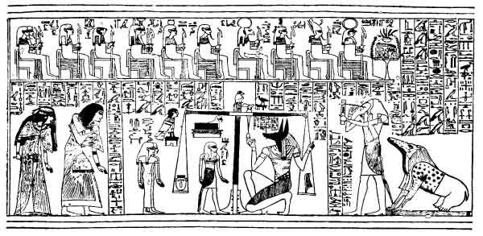
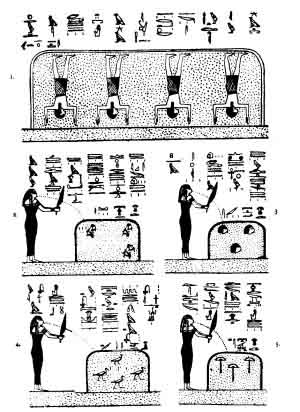
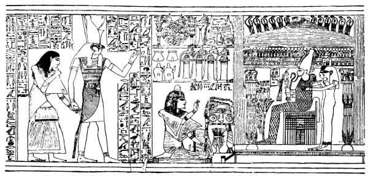
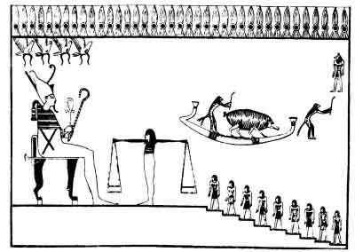

  
[Intangible Textual Heritage](../../index)  [Egypt](../index.md) 
[Index](index)  [Previous](efl05)  [Next](efl07.md) 

------------------------------------------------------------------------

p. 136

# CHAPTER IV.

### THE JUDGMENT OF THE DEAD.

THE belief that the deeds done in the body would be subjected to an
analysis and scrutiny by the divine powers after the death of a man
belongs to the earliest period of Egyptian civilization, and this belief
remained substantially the same in all generations. Though we have no
information as to the locality where the Last Judgment took place, or
whether the Egyptian soul passed into the judgment-hall immediately
after the death of the body, or after the mummification was ended and
the body was deposited in the tomb, it is quite certain that the belief
in the judgment was as deeply rooted in the Egyptians as the belief in
immortality. There seems to have been no idea of it general judgment
when all those who had lived in the world should receive their reward
for the deeds done in the body; on the contrary, all the evidence
available goes to show that each soul was dealt with individually, and
was either permitted to pass into the kingdom of Osiris and of the
blessed, or was destroyed straightway. Certain passages in the texts

p. 137

seem to suggest the idea of the existence of a place for departed
spirits wherein the souls condemned in the judgment might dwell, but it
must be remembered that it was the enemies of Râ, the Sun-god, that
inhabited this region; and it is impossible to imagine that the divine
powers who presided over the judgment would permit the souls of the
wicked to live after they had been condemned and to become enemies of
those who were pure and blessed. On the other hand, if we attach any
importance to the ideas of the Copts upon this subject, and consider
that they represent ancient beliefs which they derived from the
Egyptians traditionally, it must be admitted that the Egyptian
underworld contained some region wherein the souls of the wicked were
punished for an indefinite period. The Coptic lives of saints and
martyrs are full of allusions to the sufferings of the damned, but
whether the descriptions of these are due to imaginings of the mind of
the Christian Egyptian or to the bias of the scribe's opinions cannot
always be said. When we consider that the Coptic hell was little more
than a modified form of the ancient Egyptian Amenti, or Amentet, it is
difficult to believe that it was the name of the Egyptian underworld
only which was borrowed, and that the ideas and beliefs concerning it
which were held by the ancient Egyptians were not at the same time
absorbed. Some Christian writers are most minute in their classification
of the wicked in hell,

p. 138

as we may see from the following extract from the life of
Pisentios, [1](#fn_81.md) Bishop of Keft, in the
VIIth century of our era. The holy man had taken refuge in a tomb
wherein a number of mummies had been piled up, and when be had read the
list of the names of the people who had been buried there he gave it to
his disciple to replace. Then he addressed his disciple and admonished
him to do the work of God with diligence, and warned him that every man
must become even as were the mummies which lay before them. "And some,"
said he, "whose sins have been many are now in Amenti, others are in the
outer darkness, others are in pits and ditches filled with fire, and
others are in the river of fire: upon these last no one hath bestowed
rest. And others, likewise, are in a place of rest, by reason of their
good works." When the disciple had departed, the holy man began to talk
to one of the mummies who had been a native of the town of Erment, or
Armant, and whose father and mother had been called Agricolaos and
Eustathia. He had been a worshipper of Poseidon, and had never heard
that Christ had come into the world. "And," said he, "woe, woe is me
because I was born into the world. Why did not my mother's womb become
my tomb? When it became necessary for me: to die, the Kosmokratôr angels
were the first to come round about me, and they told me of all the sins
which

p. 139

\[paragraph continues\] I had committed, and they said unto me, 'Let him
that can save thee from the torments into which thou shalt be cast come
hither.' And they had in their hands iron knives, and pointed goads
which were like unto sharp spears, and they drove them. into my sides
and gnashed upon me with their teeth. When a little time afterwards my
eyes were opened I saw death hovering about in the air in its manifold
forms, and at that moment angels who were without pity came and dragged
my wretched soul from my body, and having tied it under the form of a
black horse they led me away to Amenti. Woe be unto every sinner like
unto myself who hath been born into the world! O my master and father, I
was then delivered into the hands of a multitude of tormentors who were
without pity and who had each a different form. Oh, what a number of
wild beasts did I see in the way! Oh, what a number of powers were there
that inflicted punishment upon me! And it came to pass that when I had
been cast into the outer darkness, I saw a great ditch which was more
than two hundred cubits deep, and it was filled with reptiles; each
reptile had seven heads, and the body of each was like unto that of a
scorpion. In this place also lived the Great Worm, the mere sight of
which terrified him that looked thereat. In his mouth he had teeth like
unto iron stakes, and one took me and threw me to this Worm which never
ceased to eat; then immediately

p. 140

all the \[other\] beasts gathered together near him, and when he had
filled his mouth \[with my flesh\], all the beasts who were round about
me filled theirs." In answer to the question of the holy man as to
whether he had enjoyed any rest or period without suffering, the mummy
replied: "Yea, O my father, pity is shown unto those who are in torment
every Saturday and every Sunday. As soon as Sunday is over we are cast
into the torments which we deserve, so that we may forget the years
which we have passed in the world; and as soon as we have forgotten the
grief of this torment we are cast into another which is still more
grievous."

Now, it is easy to see from the above description of the torments which
the wicked were supposed to suffer, that the writer had in his mind some
of the pictures with which we are now familiar, thanks to the excavation
of tombs which has gone on in Egypt during the last few years; and it is
also easy to see that he, in common with many other Coptic writers,
misunderstood the purport of them. The outer darkness, *i.e.*, the
blackest place of all in the underworld, the river of fire, the pits of
fire, the snake and the scorpion, and such like things, all have their
counterparts, or rather originals, in the scenes which accompany the
texts which describe the passage of the sun through the underworld
during the hours of the night. Having once misunderstood the general
meaning of such scenes,

p. 141

it was easy to convert the foes of Râ, the Sun-god, into the souls of
the damned, and to look upon the burning up of such foes--who were after
all only certain powers of nature personified--as the well-merited
punishment of those who had done evil upon the earth. How far the Copts
reproduced unconsciously the views which had been held by their
ancestors for thousands of years cannot be said, but even after much
allowance has been made for this possibility, there remains still to be
explained a large number of beliefs and views which seem to have been
the peculiar product of the Egyptian Christian imagination.

It has been said above that the idea of the judgment of the dead is of
very great antiquity in Egypt; indeed, it is so old that it is useless
to try to ascertain the date of the period when it first grew up. In the
earliest religious texts known to us, there are indications that the
Egyptians expected a judgment, but they are not sufficiently definite to
argue from; it is certainly doubtful if the judgment was thought to be
as thorough and as searching then as in the later period. As far back as
the reign of Men-kau-Râ, the Mycerinus of the Greeks, about B.C. 3600, a
religious text, which afterwards formed chapter 30B of the Book of the
Dead, was found inscribed on an iron slab, in the handwriting of the god
Thoth, by the royal son or prince Herutâtâf. [1](#fn_82.md) The original purpose of the composition

p. 142

of this text cannot be said, but there is little doubt that it was
intended to benefit the deceased in the judgment, and, if we translate
its title literally, it was intended to prevent his heart from "falling
away from him in the underworld." In the first part of it the deceased,
after adjuring his heart, says, "May naught stand up to oppose me in the
judgment; may there be no opposition to me in the presence of the
sovereign princes; may there be no parting of thee from me in the
presence of him that keepeth the Balance! . . .May the officers of the
court of Osiris (in Egyptian *Shenit*), who form the conditions of the
lives of men, not cause my name to stink! Let \[the judgment\] be
satisfactory unto me, let the hearing be satisfactory unto me, and let
me have joy of heart at the weight of words. Let not that which is false
be uttered against me before the Great God, the Lord of Amentet."

Now, although the papyrus upon which this statement and prayer are found
was written about two thousand years after Men-kau-Râ reigned, there is
no doubt that they were copied from texts which were themselves copied
at a much earlier period, and that the story of the finding of the text
inscribed upon an iron slab is contemporary with its actual discovery by
Herutâtâf. It is not necessary to inquire here whether the word "find"
(in Egyptian *qem*) means a genuine discovery or not, but it is clear
that those who had the papyrus copied saw no absurdity or impropriety

p. 143

in ascribing the text to the period of Men-kau-Râ. Another text, which
afterwards also became a chapter of the Book of the Dead, under the
title "Chapter of not letting the heart of the deceased be driven away
from him in the underworld," was inscribed on a coffin of the XIth
dynasty, about B.C. 2500, and in it we have the following petition: "May
naught stand up to oppose me in judgment in the presence of the lords of
the trial (literally, 'lords of things'); let it not be said of me and
of that which I have done, 'He hath done deeds against that which is
very right and true'; may naught be against me in the presence of the
Great God, the Lord of Amentet." [1](#fn_83.md)
From these passages we are right in assuming that before the end of the
IVth dynasty the idea of being "weighed in the balance" was already
evolved; that the religious schools of Egypt had assigned to a god the
duty of watching the balance when cases were being tried; that this
weighing in the balance took place in the presence of the beings called
Shenit, who were believed to control the acts and deeds of men; that it
was thought that evidence unfavourable to the deceased might be produced
by his foes at the judgment; that the weighing took place in the
presence of the Great God, the Lord of Amentet; and that the heart of
the deceased might fail him either physically or morally. The deceased
addresses his heart, calling it his "mother,"

p. 144

and next identifies it with his *ka* or double, coupling the mention of
the *ka* with the name of the god Khnemu: these facts are exceedingly
important, for they prove that the deceased considered his heart to be
the source of his life and being, and the mention of the god Khnemu
takes the date of the composition back to a period coeval with the
beginnings of religious thought in Egypt. It was the god Khnemu who
assisted Thoth in performing the commands of God at the creation, and
one very interesting sculpture at Philæ shows Khnemu in the act of
fashioning man upon a potter's wheel. The deceased, in mentioning
Khnemu's name, seems to invoke his aid in the judgment as fashioner of
man and as the being who is in some respects responsible for the manner
of his life upon earth.

In Chapter 30A there is no mention made of the "guardian of the
balance," and the deceased says, "May naught stand up to oppose me in
judgment in the presence of the lords of things!" The "lords of things"
may be either the "lords of creation," *i.e.*, the great cosmic gods, or
the "lords of the affairs \[of the hall of judgment\]," *i.e.*, of the
trial. In this chapter the deceased addresses not Khnemu, but "the gods
who dwell in the divine clouds, and who are exalted by reason of their
sceptres," that is to say, the four gods of the cardinal points, called
Mestha, Hâpi, Tuamutef, and Qebhsennuf, who also presided over the

p. 145

chief internal organs of the human body. Here, again, it seems as if the
deceased was anxious to make these gods in some way responsible for the
deeds done by him in his life, inasmuch as they presided over the organs
that were the prime movers of his actions. In any case, be considers
them in the light of intercessors, for he beseeches them to "speak fair
words unto Râ" on his behalf, and to make him to prosper before the
goddess Nehebka. In this case, the favour of Râ, the Sun-god, the
visible emblem of the almighty and eternal God, is sought for, and also
that of the serpent goddess, whose attributes are not yet accurately
defined, but who has much to do with the destinies of the dead. No
mention whatever is made of the Lord of Amentet--Osiris.

Before we pass to the consideration of the manner in which the judgment
is depicted upon the finest examples of the illustrated papyri,
reference must be made to an interesting vignette in the papyri of
Nebseni [1](#fn_84.md) and Amen-neb. [2](#fn_85.md) In both of these papyri we see a figure of
the deceased himself being weighed in the balance against his own heart
in the presence of the god Osiris. It seems probable that a belief was
current at one time in ancient Egypt concerning the possibility of the
body being weighed against the heart, with the view of finding out if
the former had obeyed the dictates of the latter; be that as it may,
however,

p. 146

it is quite certain that this remarkable variant of the vignette of
Chapter 30B had some special meaning and, as it occurs in two papyri
which date from the XVIIIth dynasty, we are justified in assuming that
it represents a belief belonging to a much older period. The judgment
here depicted must, in any case, be different from that which forms such
a striking scene in the later illustrated papyri of the XVIIIth and
following dynasties.

We have now proved that the idea of the judgment of the dead was
accepted in religious writings as early as the IVth dynasty, about B.C.
3600, but we have to wait nearly two thousand years before we find it in
picture form. Certain scenes which are found in the Book of the Dead as
vignettes accompanying certain texts or chapters, *e.g.*, the Fields of
Hetep, or the Elysian Fields, are exceedingly old, and are found on
sarcophagi of the XIth and XIIth dynasties; but the earliest picture
known of the Judgment Scene is not older than the XVIIIth dynasty. In
the oldest Theban papyri of the Book of the Dead no Judgement Scene is
forthcoming and when we find it wanting in such authoritative documents
as the Papyrus of Nebseni and that of Nu, [1](#fn_86.md) we must take it for granted that there was
some reason for its omission. In the great illustrated papyri in which
the Judgment Scene is given in full, it will be noticed that it comes at
the

p. 147

beginning of the work, and that it is preceded by hymns and by a
vignette. Thus, in the Papyrus of Ani, [1](#fn_87.md) we have a hymn to Râ, followed by a
vignette representing the sunrise, and a hymn to Osiris; and in the
Papyrus of Hunefer, [2](#fn_88.md) though the hymns
are different, the arrangement is the same. We are justified, then, in
assuming that the hymns and the Judgment Scene together formed an
introductory section to the Book of the Dead, and it is possible that it
indicates the existence of the belief, at least during the period of the
greatest power of the priests of Amen, from B.C. 1700 to B.C. 800, that
the judgment of the dead for the deeds done in the body preceded the
admission of the dead into the kingdom of Osiris. As the hymns which
accompany the Judgment Scene are fine examples of a high class of
devotional compositions, a few translations from some of them are here
given.

HYMN TO RÂ. [3](#fn_89.md)

Homage to thee, O thou who risest in Nu, [4](#fn_90.md) and who at thy manifestation dost make the
world bright with light; the whole company of the gods sing hymns of
praise unto thee after thou hast come forth.

p. 148

The divine Merti [1](#fn_91.md) goddesses who
minister unto thee cherish thee as King of the North and South, thou
beautiful and beloved Man-child. When thou risest men and women live.
The nations rejoice in thee, and the Souls of Annu [2](#fn_92) (Heliopolis.md) sing unto thee songs of joy.
The Souls of the city of Pe, [3](#fn_93.md) and the
Souls of the city of Nekhen [4](#fn_94.md) exalt
thee, the apes of dawn adore thee, and all beasts and cattle praise thee
with one accord. The goddess Seba overthroweth thine enemies, therefore
hast thou rejoicing in thy boat; thy mariners are content thereat. Thou
hast attained unto the Âtet boat, [5](#fn_95.md)
and thy heart swelleth with joy. O lord of the gods, when thou didst
create them they shouted for joy. The azure goddess Nut doth compass
thee on every side, and the god Nu floodeth thee with his rays of light.
O cast thou thy light upon me and let me see thy beauties, and when thou
goest forth over the earth I will sing praises unto thy fair face. Thou
risest in heaven's horizon, and thy disk is adored when it resteth upon
the mountain to give life unto the world."

"Thou risest, thou risest, and thou comest forth from the god Nu. Thou
dost renew thy youth, and

p. 149

thou dost set thyself in the place where thou wast yesterday. O thou
divine Child, who didst create thyself, I am not able \[to describe\]
thee. Thou hast come with thy risings, and thou hast made heaven and
earth resplendent with thy rays of pure emerald light. The land of
Punt [1](#fn_96.md) is stablished \[to give\] the
perfumes which thou smellest with thy nostrils. Thou risest, O
marvellous Being, in heaven, and the two serpent-goddesses, Merti, are
stablished upon thy brow. Thou art the giver of laws, O thou lord of the
world and of all the inhabitants thereof; all the gods adore thee."

HYMN TO OSIRIS. [2](#fn_97.md)

Glory be to thee, O Osiris Un-nefer, the great god within Abydos, king
of eternity and lord of everlastingness, the god who passest through
millions of years in thy existence. Thou art the eldest son of the womb
of Nut, thou wast engendered by Seb, the Ancestor of the gods, thou art
the lord of the Crowns of the North and of the South, and of the lofty
white crown. As Prince of the gods and of men thou hast received the
crook, and the whip, and the dignity of thy divine fathers. Let thy
heart which is in the mountain of Ament [3](#fn_98.md) be content, for thy son Horus is
stablished upon thy throne. Thou art crowned the lord of Tattu (Mandes)
and ruler

p. 150

in Abtu (Abydos). Through thee the world waxeth green in triumph before
the might of Neb-er-tcher. [1](#fn_99.md) Thou
leadest in thy train that which is, and that which is not yet, in thy
name of 'Ta-her-sta-nef;' thou towest along the earth in thy name of
'Seker;' thou art exceedingly mighty and most terrible in thy name of
'Osiris;' thou endurest for ever and for ever in thy name of
'Un-nefer.'"

Homage to thee, O thou King of kings, Lord of lords, Prince of Princes!
From the womb of Nut thou hast ruled the world and the underworld. Thy
body is of bright and shining metal, thy head is of azure blue, and the
brilliance of the turquoise encircleth thee. O thou god An, who hast had
existence for millions of years, who pervadest all things with thy body,
who art beautiful in countenance in the Land of Holiness (*i.e.*, the
underworld), grant thou to me splendour in heaven, might upon earth, and
triumph in the underworld. Grant thou that I may sail down to Tattu like
a living soul, and up to Abtu like the phœnix; and grant that I may
enter in and come forth from the pylons of the lands of the underworld
without let or hindrance. May loaves of bread be given unto me in the
house of coolness, and offerings of food and drink in Annu (Heliopolis),
and a homestead for ever and for ever in the Field of Reeds [2](#fn_100.md) with wheat and barley therefor."

p. 151

In the long and important hymn in the Papyrus of Hunefer [1](#fn_101.md) occurs the following petition, which is
put into the mouth of the deceased:--

"Grant that I may follow in the train of thy Majesty even as I did upon
earth. Let my soul be called \[into the presence\], and let it be found
by the side of the lords of right and truth. I have come into the City
of God, the region which existed in primeval time, with \[my\] soul, and
with \[my\] double, and. with \[my\] translucent form, to dwell in this
land. The God thereof is the lord of right and truth, he is the lord of
the *tchefau* food of the gods, and he is most holy. His land draweth
unto itself every land; the South cometh sailing down the river thereto,
and the North, steered thither by winds, cometh daily to make festival
therein according to the command of the God thereof, who is the Lord of
peace therein. And doth he not say, 'The happiness thereof is a care
unto me'? The god who dwelleth therein worketh right and truth; unto him
that doeth these things he giveth old age, and to him that followeth
after them rank and honour, until at length he attaineth unto a happy
funeral and burial in the Holy Land" (*i.e.*, the underworld).

The deceased, having recited these words of prayer and adoration to Râ,
the symbol of Almighty God, and to his son Osiris, next "cometh forth
into the Hall of Maâti, that he may be separated from every sin which

p. 152

he hath done, and may behold the faces of the gods." [1](#fn_102.md) From the earliest times the Maâti were
the two goddesses Isis and Nephthys, and they were so called because
they represented the ideas of straightness, integrity, righteousness,
what is right, the truth, and such like; the word Maât originally meant
a measuring reed or stick. They were supposed either to sit in the Hall
of Maât outside the shrine of Osiris, or to stand by the side of this
good in the shrine; an example of the former position will be seen in
the Papyrus of Ani (Plate 31), and of the latter in the Papyrus of
Hunefer (Plate 4). The original idea of the Hall of Maât or Maâti was
that it contained forty-two gods, a fact which we may see from the
following passage in the Introduction to Chapter CXXV. of the Book of
the Dead. The deceased says to Osiris:--

"Homage to thee, O thou great God, thou Lord of the two Maât goddesses!
I have come to thee, O my Lord, and I have made myself to come hither
that I may behold thy beauties. I know thee, and I know thy name, and I
know the names of the two and forty gods who live with thee in this Hall
of Maâti, who live as watchers of sinners and who feed upon their blood
on that day when the characters (*or* lives) of men are reckoned up
(*or* taken into account) in the presence of the god Un-nefer. Verily,
God of the Rekhti-Merti

p. 153

(*i.e.*, the twin sisters of the two eyes), the Lord of the city of
Maâti is thy name. Verily I have come to thee, and I have brought Maât
unto thee, and I have destroyed wickedness."

The deceased then goes on to enumerate the sins or offences which he has
not committed, and he concludes by saying: "I am pure; I am pure; I am
pure; I am pure. My purity is the purity of the great Bennu which is in
the city of Suten-henen (Heracleopolis), for, behold, I am the nostrils
of the God of breath, who maketh all mankind to live on the day when the
Eye of Râ, is full in Annu (Heliopolis) at the end of the second month
of the season PERT. [1](#fn_103.md) I have seen
the Eye of Râ when it was full in Annu; [2](#fn_104.md) therefore let not evil befall me either
in this land or in this Hall of Maâti, because I, even I, know the names
of the gods who are therein."

Now as the gods who live in the Hall of Maât with Osiris are two and
forty in number, we should expect that two and forty sins or offences
would be mentioned in the addresses which the deceased makes to them;
but this is not the case, for the sins enumerated in the Introduction
never reach this number. In the great illustrated papyri of the XVIIIth
and XIXth dynasties we find, however, that notwithstanding the fact that

p. 154

a large number of sins, which the deceased declares he has not
committed, are mentioned in the Introduction, the scribes and artists
added a series of negative statements, forty-two in number, which they
set out in a tabular form. This, clearly, is an attempt to make the sins
mentioned equal in number to the gods of the Hall of Maât, and it would
seem as if they preferred to compose an entirely new form of this
section of the one hundred and twenty-fifth chapter to making any
attempt to add to or alter the older section. The artists, then,
depicted a Hall of Maât, the doors of which are wide open, and the
cornice of which is formed of uraei and feathers, symbolic of Maât. Over
the middle of the cornice is a seated deity with hands extended, the
right over the Eye of Horus, and the left over a pool. At the end of the
Hall are seated the goddesses of Maât, *i.e.*, Isis and Nephthys, the
deceased adoring Osiris who is seated on a throne, a balance with the
heart of the deceased in one scale, and the feather, symbolic of Maât,
in the other, and Thoth painting a large feather. In this Hall sit the
forty-two gods, and as the deceased passes by each, the deceased
addresses him by his name and at the same time declares that he has not
committed a certain sin. An examination of the different papyri shows
that the scribes often made mistakes in writing this list of gods and
list of sins, and, as the result, the deceased is made to recite before
one god the confession which strictly

p. 155

belongs to another. Inasmuch as the deceased always says after
pronouncing the name of each god, "I have not done" such and such a sin,
the whole group of addresses has been called the "Negative Confession."
The fundamental ideas of religion and morality which underlie this
Confession are exceedingly old, and we may gather from it with tolerable
clearness what the ancient Egyptian believed to constitute his duty
towards God and towards his neighbour.

It is impossible to explain the fact that forty-two gods only are
addressed, and equally so to say why this number was adopted. Some have
believed that the forty-two gods represented each a nome of Egypt, and
much support is given to this view by the fact that most of the lists of
nomes make the number to be forty-two; but then, again, the lists do not
agree. The classical authors differ also, for by some of these writers
the nomes are said to be thirty-six in number, and by others forty-six
are enumerated. These differences may, however, be easily explained, for
the central administration may at any time have added to or taken from
the number of nomes for fiscal or other considerations, and we shall
probably be correct in assuming that at the time the Negative Confession
was drawn up in the tabular form in which we meet it in the XVIIIth
dynasty the nomes were forty-two in number. Support is also lent to this
view by the fact that the earliest form of the Confession, which forms
the

p. 156

Introduction to Chapter CXXV., mentions less than forty sins.
Incidentally we may notice that the forty-two gods are subservient to
Osiris, and that they only occupy a subordinate position in the Hall of
Judgment, for it is the result of the weighing of the heart of the
deceased in the balance that decides his future. Before passing to the
description of the Hall of Judgment where the balance is set, it is
necessary to give a rendering of the Negative Confession which,
presumably, the deceased recites before his heart is weighed in the
balance; it is made from the Papyrus of Nu. [1](#fn_105.md)

1\. "Hail Usekh-nemtet (*i.e.*, Long of strides), who comest forth from
Annu (Heliopolis), I have not done iniquity.

2\. "Hail Hept-seshet (*i.e.*, Embraced by flame), who comest forth from
Kher-âba, [2](#fn_106.md) I have not robbed with
violence.

3\. "Hail Fenti (*i.e.*, Nose), who comest forth from Khemennu
(Hermopolis), I have not done violence to any man.

4\. "Hail Âm-khaibitu (*i.e.*, Eater of shades), who comest forth from
the Qereret (*i.e.*, the cavern where the Nile rises), I have not
committed theft.

5\. "Hail Neha-hra (*i.e.*, Stinking face), who comest forth from
Restau, I have slain neither man nor woman.

6\. "Hail Rereti (*i.e.*, Double Lion-god), who comest forth from
heaven, I have not made light the bushel.

p. 157

7\. "Hail Maata-f-em-seshet (*i.e.*, Fiery eyes), who comest forth from
Sekhem (Letopolis), I have not acted deceitfully.

8\. "Hail Neba (*i.e.*, Flame), who comest forth and retreatest, I have
not purloined the things which belong unto God.

9\. "Hail Set-qesu (*i.e.*, Crusher of bones), who comest forth from
Suten-henen (Heracleopolis), I have not uttered falsehood.

10\. "Hail Khemi (*i.e.*, Overthrower), who comest forth from Shetait
(*i.e.*, the hidden place), I have not carried off goods by force.

11\. "Hail Uatch-nesert (*i.e.*, Vigorous of Flame), who comest forth
from Het-ka-Ptah. (Memphis), I have not uttered vile (or evil) words.

12\. "Hail Hra-f-ha-f (*i.e.*, He whose face is behind him), who comest
forth from the cavern and the deep, I have not carried off food by
force.

13\. "Hail Qerti (*i.e.*, the double Nile source), who comest forth from
the Underworld, I have not acted deceitfully.

14\. "Hail Ta-ret (*i.e.*, Fiery-foot), who comest forth out of the
darkness, I have not eaten my heart (*i.e.* lost my temper and become
angry).

15\. "Hail Hetch-abehu (*i.e.*, Shining teeth), who comest forth from
Ta-she (*i.e.*, the Fayyûm), I have invaded no \[man's land\].

16\. "Hail, Âm-senef (*i.e.*, Eater of blood), who comest

p. 158

forth from the house of the block, I have not slaughtered animals which
are the possessions of God.

17\. "Hail Âm-besek (*i.e.*, Eater of entrails), who comest forth from
Mâbet, I have not laid waste the lands which have been ploughed.

18\. "Hail Neb-Maât (*i.e.*, Lord of Maât), who comest forth from the
city of the two Maâti, I have not pried into matters to make mischief.

19\. "Hail Thenemi (*i.e.*, Retreater), who comest forth from Bast
(*i.e.*, Bubastis), I have not set my mouth in motion against any man.

20\. "Hail Anti, who comest forth from Annu (Heliopolis), I have not
given way to wrath without due cause.

21\. "Hail Tututef, who comest forth from the nome of Ati, I have not
committed fornication, and I have not committed sodomy.

22\. "Hail Uamemti, who comest forth from the house of slaughter, I have
not polluted myself.

23\. "Hail Maa-ant-f (*i.e.*, Seer of what is brought to him), who
comest forth from the house of the god Amsu, I have not lain with the
wife of a man.

24\. "Hail Her-seru, who comest forth from Nehatu, I have not made any
man to be afraid.

25\. "Hail Neb-Sekhem, who comest forth from the Lake of Kaui, I have
not made my speech to burn with anger. [1](#fn_107.md)

p. 159

26\. "Hail Seshet-kheru (*i.e.*, Orderer of speech), who comest forth
from Urit, I have not made myself deaf unto the words of right and
truth.

27\. "Hail Nekhen (*i.e.*, Babe), who comest forth from the Lake of
Heqât, I have not made another person to weep.

28\. "Hail Kenemti, who comest forth from Kenemet, I have not uttered
blasphemies.

29\. "Hail An-hetep-f (*i.e.*, Bringer of his offering), who comest
forth from Sau, I have not acted with violence.

30\. "Hail Ser-kheru (*i.e.*, Disposer of Speech), who comest forth from
Unsi, I have not hastened my heart. [1](#fn_108.md)

31\. "Hail Neb-hrau (*i.e.*, Lord of Faces), who comest forth from
Netchefet, I have not pierced (?) my skin (?) and I have not taken
vengeance on the god.

32\. "Hail Serekhi, who comest forth from Uthent, I have not multiplied
my speech beyond what should be said.

33\. "Hail Neb-âbui (*i.e.*, Lord of horns), who comest forth from
Sauti, I have not committed fraud, \[and I have not\] looked upon evil.

34\. "Hail Nefer-Tem, who comest forth from Ptah-het-ka (Memphis), I
have never uttered curses against the king.

35\. "Hail Tem-sep, who comest forth from Tattu, I have not fouled
running water.

p. 160

36\. "Hail Ari-em-ab-f, Who comest forth from Tebti, I have not exalted
my speech.

37\. "Hail Ahi, who comest forth from Nu, I have not uttered curses
against God.

38\. "Hail Uatch-rekhit \[who comest forth from his shrine (?)\], I have
not behaved with insolence.

39\. "Hail Neheb-nefert, who comest forth from his temple, I have not
made distinctions. [1](#fn_109.md)

40\. "Hail Neheb-kau, who comest forth from thy cavern, I have not
increased my wealth except by means of such things as are mine own
possessions.

41\. "Hail Tcheser-tep, who comest forth from thy shrine, I have not
uttered curses against that which belongeth to God and is with me.

42\. "Hail An-â-f (*i.e.*, Bringer of his arm), \[who comest forth from
Aukert\], I have not thought scorn of the god of the city."

A brief examination of this "Confession" shows that the Egyptian code of
morality was very comprehensive, and it would be very hard to find an
act, the commission of which would be reckoned a sin when the
"Confession" was put together, which is not included under one or other
part of it. The renderings of the words for certain sins are not always
definite or exact, because we do not know the precise idea which the
framer of this remarkable document had. The deceased states that he has
neither cursed God, nor thought scorn

p. 161

of the god of his city, nor cursed the king, nor committed theft of any
kind, nor murder, nor adultery, nor sodomy, nor crimes against the god
of generation; he has not been imperious or haughty, or violent, or
wrathful, or hasty in deed, or a hypocrite, or an accepter of persons,
or a blasphemer, or crafty, or avaricious, or fraudulent, or deaf to
pious words, or a party to evil actions, or proud, or puffed up; he has
terrified no man, he has not cheated in the market-place, and he has
neither fouled the public watercourse nor laid waste the tilled land of
the community. This is, in brief, the confession which the deceased
makes; and the next act in the Judgment Scene is weighing the heart of
the deceased in the scales. As none of the oldest papyri of the Book of
the Dead supplies us with a representation of this scene, we must have
recourse to the best of the illustrated papyri of the latter half of the
XVIIIth and of the XIXth dynasties. The details of the Judgment Scene
vary greatly in various papyri, but the essential parts of it are always
preserved. The following is the description of the judgment of Ani, as
it appears in his wonderful papyrus preserved in the British Museum.

In the underworld, and in that portion of it which is called the Hall of
Maâti, is set a balance wherein the heart of the deceased is to be
weighed. The beam is suspended by a ring upon a projection from the
standard of the balance made in the form of the feather which

p. 162

is the symbol of Maât, or what is right and true. The tongue of the
balance is fixed to the beam, and when this is exactly level, the tongue
is as straight as the standard; if either end of the beam inclines
downwards the tongue cannot remain in a perpendicular position. It must
be distinctly understood that the heart which was weighed in the one
scale was not expected to make the weight which was in the other to kick
the beam, for all that was asked or required of the deceased was that
his heart should balance exactly the symbol of the law. The standard was
sometimes surmounted by a human head wearing the feather of Maât;
sometimes by the head of a jackal, the animal sacred to Anubis; and
sometimes by the head of an ibis, the bird sacred to Thoth; in the
Papyrus of Ani a dog-headed ape, the associate of Thoth, sits on the top
of the standard. In some papyri (*e.g.*, those of Ani [1](#fn_110.md) and Hunefer [2](#fn_111).md), in addition to Osiris, the king of the
underworld and judge of the dead, the gods of his cycle or company
appear as witnesses of the judgment. In the Papyrus of the priestess
Anhai [3](#fn_112.md) in the British Museum the
great and the little companies of the gods appear as witnesses, but the
artist was so careless that instead of nine gods in each group he
painted six in one and five in the other. In the Turin papyrus [4](#fn_113.md) we see the whole of the forty-two gods,
to whom the deceased recited the

p. 163

 

The weighing of the heart of the scribe Ani in the balance in the
presence of the gods.

p. 164

 

1\. The wicked cast head downwards into a pit of fire.

2\. Enemies being burnt in a pit of fire.

3\. The heads of the damned being burnt in a pit of fire.

4\. The souls of the damned being burnt in a pit of fire.

5\. The shadows of the damned being burnt in a pit of fire.

From the Book Am-<u>T</u>uat.

p. 165

\[paragraph continues\] "Negative Confession," seated in the
judgment-hall.

The gods present at the weighing of Ani's heart are--

1\. RÂ-HARMACHIS, hawk-headed, the Sun-god of the dawn and of noon.

2\. TEMU, the Sun-god of the evening, the great god of Heliopolis. He is
depicted always in human form and with the face of a man, a fact which
proves that he had at a very early period passed through all the forms
in which gods are represented, and had arrived at that of a man. He has
upon his head the crowns of the South and North.

3\. SHU, man-headed, the son of Râ and Hathor, the personification of
the sunlight.

4\. TEFNUT, lion-headed, the twin-sister of Shu, the personification of
moisture.

6\. SEB, man-headed, the son of Shu, the personification of the earth.

6\. NUT, woman-headed, the female counterpart of the gods Nu and Seb;
she was the personification of the primeval water, and later of the sky.

7\. ISIS, woman-headed, the sister-wife of Osiris, and mother of Horus.

8\. NEPHTHYS, woman-headed, the sister-wife of Osiris, and mother of
Anubis.

9\. HORUS, the "great god," hawk-headed, whose worship was probably the
oldest in Egypt.

10\. HATHOR, woman-headed, the personification of that portion of the
sky where the sun rose and set.

p. 166

11\. HU, man-headed, and

12\. SA, also man-headed; these gods are present in the boat of Râ in
the scenes which depict the creation.

On one side of the balance kneels the god Anubis, jackal-headed, who
holds the weight of the tongue of the balance in his right hand, and
behind him stands Thoth, the scribe of the gods, ibis-headed, holding in
his hands a reed wherewith to write down the result of the weighing.
Near him is seated the tri-formed beast Âm-mit, the "Eater of the Dead,"
who waits to devour the heart of Ani should it be found to be light. In
the Papyrus of Neb-qet at Paris this beast is seen lying by the side of
a lake of fire, at each corner of which is seated a dog-headed ape; this
lake is also seen in Chapter CXXVI. of the Book of the Dead. The gods
who are seated before a table of offerings, and Anubis, and Thoth, and
Âm-mit, are the beings who conduct the case, so to speak, against Ani.
On the other side of the balance stand Ani and his wife Thuthu with
their heads reverently bent; they are depicted in human form, and wear
garments and ornaments similar to those which they wore upon earth. His
soul, in the form of a man-headed hawk standing upon a pylon, is
present, also a man-headed, rectangular object, resting upon a pylon,
which has frequently been supposed to represent the deceased in an
embryonic state. In the Papyrus of Anhai two of these objects appear,
one on each side of the balance; they are described as Shai and Renenet,

p. 167

two words which are translated by "Destiny" and "Fortune" respectively.
It is most probable, as the reading of the name of the object is
*Meskhenet*, and as the deity Meskhenet represents sometimes both Shai
and Renenet, that the artist intended the object to represent both
deities, even though we find the god Shai standing below it close to the
standard of the balance. Close by the soul stand two goddesses called
Meskhenet and Renenet respectively; the former is, probably, one of the
four goddesses who assisted at the resurrection of Osiris, and the
latter the personification of Fortune, which has already been included
under the *Meskhenet* object above, the personification of Destiny.

It will be remembered that Meskhenet accompanied Isis, Nephthys, Heqet,
and Khnemu to the house of the lady Rut-Tettet, who was about to bring
forth three children. When these deities arrived, having changed their
forms into those of women, they found Râ-user standing there. And when
they had made music for him, he said to them, "Mistresses, there is a
woman in travail here;" and they replied, "Let us see her, for we know
how to deliver a woman." Râ-user then brought them into the house, and
the goddesses shut themselves in with the lady Rut-Tettet. Isis took her
place before her, and Nephthys behind her, whilst Heqet hastened the
birth of the children; as each child was born Meskhenet stepped up to
him and said, "A king who shall have dominion over the whole

p. 168

land," and the god Khnemu bestowest health upon his limbs. [1](#fn_114.md) Of these five gods, Isis, Nephthys,
Meskhenet, Heqet, and Khnemu, the first three are present at the
judgment of Ani; Khnemu is mentioned in Ani's address to his heart (see
below), and only Heqet is unrepresented.

As the weighing of his heart is about to take place Ani says, "My heart,
my mother! My heart, my mother! My heart whereby I came into being! May
naught stand up to oppose me in the judgment; may there be no opposition
to me in the presence of the sovereign princes; may there be no parting
of thee from me in the presence of him that keepeth the Balance! Thou
art my *ka*, the dweller in my body; the god Khnemu who knitteth and
strengtheneth my limbs. Mayest thou come forth into the place of
happiness whither we go. May the \]princes of the court of Osiris, who
order the circumstances of the lives of men, not cause my name to
stink." Some papyri add, "Let it be satisfactory unto us, and let the
listening be satisfactory unto us, and let there be joy of heart unto us
at the weighing of words. Let not that which is false be uttered against
me before the great god, the lord of Amentet! Verily how great shalt
thou be when thou risest in triumph!"

The tongue of the balance having been examined

p. 169

by Anubis, and the ape having indicated to his associate Thoth that the
beam is exactly straight, and that the heart, therefore, counterbalances
the feather symbolic of Maât (*i.e.*, right, truth, law, etc.), neither
outweighing nor underweighing it, Thoth writes down the result, and then
makes the following address to the gods:--

"Hear ye this judgment. The heart of Osiris hath in very truth been
weighed, and his soul hath stood as a witness for him; it hath been
found true by trial in the Great Balance. There hath not been found any
wickedness in him; he hath not wasted the offerings in the temples; he
hath not done harm by his deeds; and he spread abroad no evil reports
while he was upon earth."

In answer to this report the company of the gods, who are styled "the
great company of the gods," reply, "That which cometh forth from thy
mouth, O Thoth, who dwellest in Khemennu (Hermopolis), is confirmed.
Osiris, the scribe Ani, triumphant, is holy and righteous. He hath not
sinned, neither hath he done evil against us. The Devourer Âm-mit shall
not be allowed to prevail over him, and meat-offerings and entrance into
the presence of the god Osiris shall be granted unto him, together with
a homestead for ever in the Field of Peace, as unto the followers of
Horus." [1](#fn_115.md)

p. 170

Here we notice at once that the deceased is identified with Osiris, the
god and judge of the dead, and that they have bestowed upon him the
god's own name; the reason of this is as follows. The friends of the
deceased performed for him all the ceremonies and rites which were
performed for Osiris by Isis and Nephthys, and it was assumed that, as a
result, the same things which took place in favour of Osiris would also
happen on behalf of the deceased, and that in fact, the deceased would
become the counterpart of Osiris. Everywhere in the texts of the Book of
the Dead the deceased is identified with Osiris, from B.C. 3400 to the
Roman period. Another point to notice is the application of the words
*maâ kheru* to the deceased, a term which I have, for want of a better
word, rendered "triumphant." These words actually mean "true of voice"
or "right of word," and indicate that the person to whom they are
applied has acquired the power of using his voice in such a way that
when the invisible beings are addressed by him they will render unto him
all the service which he has obtained the right to demand. It is well
known that in ancient times magicians and sorcerers were wont to address
spirits or demons in a peculiar tone of voice, and that all magical
formulæ were recited in a similar manner; the use of the wrong sound or
tone of voice would result in the most disastrous consequences to the
speaker, and perhaps in death. The deceased had

p. 171

to make his way through a number of regions in the underworld, and to
pass through many series of halls, the doors of which were guarded by
beings who were prepared, unless properly addressed, to be hostile to
the new-comer; he also had need to take passage in a boat, and to obtain
the help of the gods and of the powers of the various localities wherein
he wanted to travel if he wished to pass safely into the place where he
would be. The Book of the Dead provided him with all the texts and
formulæ which he would have to recite to secure this result, but unless
the words contained in them were pronounced in a proper manner, and said
in a proper tone of voice, they would have no effect upon the powers of
the underworld. The term *maâ kheru* is applied but very rarely to the
living, but commonly to the dead, and indeed the dead needed most the
power which these words indicated. In the case of Ani, the gods, having
accepted the favourable report of the result obtained by weighing Ani's
heart by Thoth, style him *maâ kheru*, which is equivalent to conferring
upon him power to overcome all opposition, of every kind, which he may
meet. Henceforth every door will open at his command, every god will
hasten to obey immediately Ani has uttered his name, and those whose
duty it is to provide celestial food for the beatified will do so for
him when once the order has been given. Before passing on to other
matters it is interesting to note that the term

p. 172

maâ kheru is not applied to Ani by himself in the Judgment Scene, nor by
Thoth, the scribe of the gods, nor by Horus when he introduces him to
Osiris; it is only the gods who can make a man *maâ kheru*, and thereby
he also escapes from the Devourer.

The judgment ended, Horus, the son of Isis, who has assumed all the
attributes of his father Osiris, takes Ani's left hand in his right and
leads him up to the shrine wherein the god Osiris is seated. The god
wears the white crown with feathers, and he holds in his hands a
sceptre, a crook, and whip, or flail, which typify sovereignty and
dominion. His throne is a tomb, of which the bolted doors and the
cornice of uraei may be seen painted on the side. At the back of his
neck hangs the *menat* or symbol of joy and happiness; on his right hand
stands Nephthys, and on his left stands Isis. Before him, standing on a
lotus flower, are the four children of Horus, Mestha, Hâpi, Tuamutef,
and Qebhsennuf, who presided over and protected the intestines of the
dead; close by hangs the skin of a bull with which magical ideas seem to
have been associated. The top of the shrine in which the god sits is
surmounted by uraei, wearing disks on their heads, and the cornice also
is similarly decorated. In several papyri the god is seen standing up in
the shrine, sometimes with and sometimes without the goddesses Isis and
Nephthys. In the Papyrus of Hunefer we find a most interesting variant
of this

p. 173

 

Horus, the son of Isis, leading the scribe Ani into the presence of
Osiris, the god and judge of the dead; before the shrine of the god Ani
kneels in adoration and presents offerings.

p. 174

 

Osiris seated in judgement placed on top of a flight of nine steps, on
which stand the nine gods of his Company. The pig in the boat represents
Set. In the right-hand corner stands Anubis. From a sarcophagus in the
Louvre.

p. 175

portion of the scene, for the throne of Osiris rests upon, or in, water.
This reminds us of the passage in the one hundred and twenty-sixth
chapter of the Book of the Dead in which the god Thoth says to the
deceased, "Who is he whose roof is of fire, whose walls are living
uraei, and the floor of whose house is a stream of running water? Who is
he, I say?" The deceased answers, "It is Osiris," and the god says,
"Come forward, then; for verily thou shalt be mentioned \[to him\]."

When Horus had led in Ani he addressed Osiris, saying, "I have come unto
thee, O Un-nefer, and I have brought the Osiris Ani unto thee. His heart
hath been found righteous and it hath come forth from the balance; it
hath not sinned against any god or any goddess. Thoth hath weighed it
according to the decree uttered unto him by the company of the gods; and
it is very true and right. Grant unto him cakes and ale; and let him
enter into thy presence; and may he be like unto the followers of Horus
for ever!" After this address Ani, kneeling by the side of tables of
offerings of fruit, flowers, etc., which he has brought unto Osiris,
says, "O Lord of Amentet, I am in thy presence. There is no sin in me, I
have not lied wittingly, nor have I done aught with a false heart. Grant
that I may be 'like unto those favoured ones who are round about thee,
and that I may be an Osiris greatly favoured of the beautiful god and

p. 176

beloved of the Lord of the world, \[I\], the royal scribe of Maât, who
loveth him, Ani, triumphant before Osiris." [1](#fn_116.md) Thus we come to the end of the scene of
the weighing of the heart.

The man who has passed safely through this ordeal has now to meet the
gods of the underworld, and the Book of the Dead provides the words
which "the heart which is righteous and sinless" shall say unto them.
One of the fullest and most correct texts of "the speech of the deceased
when he cometh forth true of voice from the Hall of the Maâti goddesses"
is found in the Papyrus of Nu; in it the deceased says:--

"Homage to you, O ye gods who dwell in the Hall of the Maâti goddesses,
I, even I, know you, and I know your names. Let me not fall under your
knives of slaughter, and bring ye not forward my wickedness unto the god
in whose train ye are; and let not evil hap come upon me by your means.
O declare ye me true of voice in the presence of Neb-er-tcher, because I
have done that which is right and true in Ta-mera (*i.e.*, Egypt). I
have not cursed God, therefore let not evil hap come upon me through the
King who dwelleth in his day.

"Homage to you, O ye gods., who dwell in the Hall of the Maâti
goddesses, who are without evil in your

p. 177

bodies, and who live upon right and truth, and who feed yourselves upon
right and truth in the presence of the god Horus, who dwelleth in his
divine Disk; deliver ye me from the god Baba [1](#fn_117.md) who feedeth upon the entrails of the
mighty ones upon the day of the great reckoning. O grant ye that I may
come to you, for I have not committed faults, I have not sinned, I have
not done evil, I have not borne false witness; therefore let nothing
\[evil\] be done unto me. I live upon right and truth, and I feed upon
right and truth. I have performed the commandments of men \[as well as\]
the things whereat are gratified the gods; I have made God to be at
peace \[with me by doing\] that which is his will. I have given bread to
the hungry man, and water to the thirsty man, and apparel to the naked
man, and a boat to the \[shipwrecked\] mariner. I have made holy
offerings to the gods, and sepulchral meals to the beatified dead. Be ye
then my deliverers, be ye then my protectors, and make ye not accusation
against me in the presence of \[Osiris\]. I am clean of mouth and clean
of hands; therefore let it be said unto me by those who shall behold me,
'Come in peace, come in peace.' I have heard the mighty word which the
spiritual bodies spake unto the Cat [2](#fn_118.md) in the house

p. 178

of Hapt-re. I have testified in the presence of Hra-f-ha-f, and he hath
given \[his\] decision. I have seen the things over which the Persea
tree spreadeth within Re-stau. I am he who hath offered up prayers to
the gods and who knoweth their persons. I have come, and I have advanced
to make the declaration of right and truth, and to set the Balance upon
what supporteth it in the region of Aukert.

"Hail, thou who art exalted upon thy standard (*i.e.*, Osiris), thou
lord of the 'Atefu' crown whose name is proclaimed as 'Lord of the
winds,' deliver thou me from thy divine messengers who cause dire deeds
to happen, and who cause calamities to come into being, and who are
without coverings for their faces, for I have done that which is right
and true for the Lord of right and truth. I have purified myself and my
breast with libations, and my hinder parts with the things which make
clean, and my inward parts have been \[immersed\] in the Pool of Right
and Truth. There is no single member of mine which lacketh right and
truth. I have been purified in the Pool of the South, and I have rested
in the City of the North, which is in the Field of the Grasshoppers,
wherein the divine sailors of Râ bathe at the second hour of the night
and at the third hour of the day; and the hearts of the gods are
gratified after they have passed through it, whether it be by night, or
whether it be by day. And I would that they should say unto me, 'Come
forward,' and 'Who art

p. 179

thou?' and 'What is thy name?' These are the words which I would have
the gods say unto me. \[Then would I reply\] 'My name is He who is
provided with flowers, and Dweller in his olive tree.' Then let them say
unto me straightway, 'Pass on,' and I would pass on to the city to the
north of the Olive tree. 'What then wilt thou see there?' \[say they.
And I say\] 'The Leg and the Thigh.' 'What wouldst thou say unto them?'
\[say they.\] 'Let me see rejoicings in the land of the Fenkhu' \[I
reply\]. 'What will they give thee? \[say they\]. 'A fiery flame and a
crystal tablet' \[I reply\]. 'What wilt thou do therewith?' \[say
they\]. 'Bury them by the furrow of Mââat as Things for the night' \[I
reply\]. 'What wilt thou find by the furrow of Mââat?' \[say they\]. 'A
sceptre of flint called Giver of Air' \[I reply\]. 'What wilt thou do
with the fiery flame and the crystal tablet after thou hast buried
them?' \[say they\]. 'I will recite words over them in the furrow. I
will extinguish the fire, and I will break the tablet, and I will make a
pool of water' \[I reply\]. Then let the gods say unto me, 'Come and
enter in through the door of this Hall of the Maâti goddesses, for thou
knowest us."'

After these remarkable prayers follows a dialogue between each part of
the Hall of Maâti and the deceased, which reads as follows:--

Door bolts. "We will not let thee enter in through us unless thou
tellest our names."

p. 180

Deceased. "'Tongue of the place of Right and Truth' is your name."

Right post. "I will not let thee enter in by me unless thou tellest my
name."

Deceased. "Scale of the lifter up of right and truth' is thy name."

Left post. "I will not let thee enter in by me unless thou tellest my
name."

Deceased. "'Scale of wine' is thy name."

Threshold. "I will not let thee pass over me unless thou tellest my
name."

Deceased. "'Ox of the god Seb' is thy name."

Hasp. "I will not open unto thee unless thou tellest my name."

Deceased. "'Leg-bone of his mother' is thy name."

Socket-hole. "I will not open unto thee unless thou tellest my name."

Deceased. "'Living Eye of Sebek, the lord of Bakhau,' is thy name."

Porter. "I will not open unto thee unless thou tellest my name."

Deceased. "'Elbow of the god Shu when he placeth himself to protect
Osiris' is thy name."

Side posts. "We will not let thee pass in by us, unless thou tellest our
names."

Deceased. "'Children of the uraei-goddesses' is your name."

"Thou knowest us; pass on, therefore, by us" \[say these\].

p. 181

Floor. "I will not let thee tread upon me, because I am silent and I am
holy, and because I do not know the names of thy feet wherewith thou
wouldst walk upon me; therefore tell them to me."

Deceased. "'Traveller of the god Khas' is the name of my right foot, and
'Staff of the goddess Hathor' is the name of my left foot."

"Thou knowest me; pass on, therefore, over me" \[it saith\].

Doorkeeper. "I will not take in thy name unless thou tellest my name."

Deceased. "'Discerner of hearts and searcher of the reins' is thy name."

Doorkeeper. "Who is the god that dwelleth in his hour? Utter his name."

Deceased. "'Mâau-Taui' is his name."

Doorkeeper. "And who is Mâau-Taui?"

Deceased. "He is Thoth."

Thoth. "Come! But why hast thou come?"

Deceased. "I have come and I press forward that my name may be
mentioned."

Thoth. "In what state art thou?

Deceased. "I am purified from evil things, and I am protected from the
baleful deeds of those who live in their days; and I am not of them."

Thoth. "Now will I make mention of thy name \[to the god\]. And who is
he whose roof is of fire, whose walls are living uraei, and the floor of

p. 182

whose house is a stream of water? Who is he, I say?"

Deceased. "It is Osiris."

Thoth. "Come forward, then; verily, mention of thy name shall be made
unto him. Thy cakes \[shall come\] from the Eye of Râ; and thine ale
\[shall come\] from the Eye of Râ; and thy sepulchral meals upon earth
\[shall come\] from the Eye of Râ."

With these words Chapter CXXV comes to an end. We have seen how the
deceased has passed through the ordeal of the judgment, and how the
scribes provided him with hymns and prayers, and with the words of a
confession with a view of facilitating his passage through the dread
Hall of the Maâti goddesses. Unfortunately the answer which the god
Osiris may be supposed to have made to his son Horus in respect of the
deceased is not recorded, but there is no doubt that the Egyptian
assumed that it would be favourable to him, and that permission would be
accorded him to enter into each and every portion of the underworld, and
to partake of all the delights which the beatified enjoyed under the
rule of Râ. and Osiris.

------------------------------------------------------------------------

### Footnotes

[138:1](efl06.htm#fr_81.md) Ed. Amélineau, Paris,
1887, p. 144 f.

[141:1](efl06.htm#fr_82.md) See *Chapters of Coming
Forth by Day*, Translation, p. 80.

[143:1](efl06.htm#fr_83.md) *Chapters of Coming
Forth by Day*, p. 78.

[145:1](efl06.htm#fr_84.md) British Museum, No.
9900.

[145:2](efl06.htm#fr_85.md) British Museum, No.
9964.

[146:1](efl06.htm#fr_86.md) British Museum, No.
10,477.

[147:1](efl06.htm#fr_87.md) British Museum, No.
10,470.

[147:2](efl06.htm#fr_88.md) British Museum, No.
9901.

[147:3](efl06.htm#fr_89.md) See *The Chapters of
Coming forth by Day*, p. 7.

[147:4](efl06.htm#fr_90.md) The sky personified.

[148:1](efl06.htm#fr_91.md) Literally, the Two
Eyes, *i.e.*, Isis and Nephthys.

[148:2](efl06.htm#fr_92.md) *I.e.*, Râ, Shu, and
Tefnut.

[148:3](efl06.htm#fr_93.md) Part of the city of
Buto (Per-Uatchit). The souls of Pe were Horus, Mestha, Hâpi.

[148:4](efl06.htm#fr_94.md) *I.e.*, Horus,
Tuamutef, and Qebhsennuf.

[148:5](efl06.htm#fr_95.md) *I.e.*, the boat in
which the sun travels until noon.

[149:1](efl06.htm#fr_96.md) *I.e.*, the land on
each side of the Red Sea and North-east Africa.

[149:2](efl06.htm#fr_97.md) See *The Chapters of
Coming Forth by Day*, p. 11.

[149:3](efl06.htm#fr_98.md) *I.e.*, the underworld.

[150:1](efl06.htm#fr_99.md) A name of Osiris.

[150:2](efl06.htm#fr_100.md) A division of the
"Fields of Peace" or Elysian Fields.

[151:1](efl06.htm#fr_101.md) See *The Chapters of
Coming Forth by Day*, pp. 343-346.

[152:1](efl06.htm#fr_102.md) This quotation is
from the title of Chapter CXXV. of the Book of the Dead.

[153:1](efl06.htm#fr_103.md) *I.e.*, the last day
of the sixth month of the Egyptian year, called by the Copts Mekhir.

[153:2](efl06.htm#fr_104.md) The allusion here
seems to be to the Summer or Winter Solstice.

[156:1](efl06.htm#fr_105.md) British Museum, No.
10,477.

[156:2](efl06.htm#fr_106.md) A city near Memphis.

[158:1](efl06.htm#fr_107.md) Literally, "I have
not been hot of mouth."

[159:1](efl06.htm#fr_108.md) *I.e.*, acted without
due consideration.

[160:1](efl06.htm#fr_109.md) *I.e.*, I have not
been guilty of favoritism.

[162:1](efl06.htm#fr_110.md) About B.C. 1500.

[162:2](efl06.htm#fr_111.md) About B.C. 1370.

[162:3](efl06.htm#fr_112.md) About B.C. 1000.

[162:4](efl06.htm#fr_113.md) Written in the
Ptolemaic period.

[168:1](efl06.htm#fr_114.md) See Erman, *Westcar
Papyrus*, Berlin, 1890, hieroglyphic transcript, plates 9 and 10.

[169:1](efl06.htm#fr_115.md) These are a class of
mythological beings, or demi-gods, who already in the Vth dynasty were
supposed to recite prayers on behalf of the deceased, and to assist
Horus and Set in performing funeral ceremonies. See my *Papyrus of Ani*,
p. cxxv.

[176:1](efl06.htm#fr_116.md) Or "true of voice in
respect of Osiris;" *i.e.*, Ani makes his petition, and Osiris is to
hear and answer because he has uttered the right words in the right
manner, and in the right tone of voice.

[177:1](efl06.htm#fr_117.md) The firstborn son of
Osiris.

[177:2](efl06.htm#fr_118.md) *I.e.*, Râ, as the
slayer of the serpent of darkness, the head of which he cuts off with a
knife. The usual reading is "which the Ass spake to the Cat;" the Ass
being Osiris and the Cat Râ.

------------------------------------------------------------------------

[Next: Chapter V: The Resurrection and Immortality](efl07.md)
