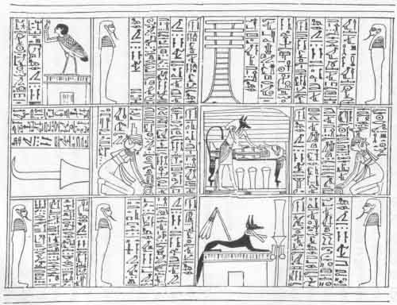
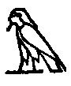

  
[Intangible Textual Heritage](../../index)  [Egypt](../index) 
[Index](index)  [Previous](ema03)  [Next](ema05) 

------------------------------------------------------------------------

p. 25

# CHAPTER II.

### MAGICAL STONES OR AMULETS.

"AMULET" is a name given to a class of objects and ornaments, and
articles of dress and wearing apparel, made of various substances which
were employed by the Egyptians, and later by other nations, to protect
the human body, either living or dead, from baleful influences, and from
the attacks of visible and invisible foes. The word "amulet" is derived
from an Arabic root meaning "to bear, to carry," hence "amulet" is
"something which is carried or worn," and the name is applied broadly to
any kind of talisman or ornament to which supernatural powers are
ascribed. It is not clear whether the amulet was intended first of all
to protect the living or the dead body, but it seems that it was
originally worn to guard its owner from savage animals and from
serpents. As time went on the development of religious ideas and beliefs
progressed, and as a result new amulets representing new views were
invented; and the objects which were able to protect the living were
made, by an easy transition

p. 26

in the minds of those who wore them, to protect the dead. Moreover, as
the preservation of the corruptible body, with the number of its members
complete and intact, was of the most vital importance for the life of
the spiritual and incorruptible body which was believed to spring
therefrom, under the influence of the new beliefs the dead body became a
veritable storehouse of amulets. Each member was placed under the
specific protection of some amulet, and a number of objects which were
believed to protect the body generally from serpents, worms, mildew,
decay and putrefaction were laid with a lavish hand in, and upon, and
about it, and between the bandages with which it was swathed. When men
in Egypt began to lay amulets on their dead cannot be said, and it is
equally impossible to say when the belief in the efficacy of such and
such an amulet sprang into being; it seems clear, however, that certain
amulets represent beliefs and superstitions so old that even the
Egyptians were, at times, doubtful about their origin and meaning.

Amulets are of two kinds: (1) those which are inscribed with magical
formulæ, and (2) those which are not. In the earliest times formulæ or
prayers were recited over the amulets that were worn by the living or
placed on the dead by priests or men set apart to perform religious
services by the community; but it was not in the power of every man to
employ them, and at a comparatively early date words of magical

p. 27

power and prayers were cut upon the amulets, which thus became possessed
of a twofold power, that is to say, the power which was thought to be
inherent in the substance of which the amulet was made, and that which
lay in the words inscribed upon it. The earliest name for the formulæ
found upon amulets is *hekau*, and it was so necessary for the deceased
to be provided with these hekau, or "words of power," that in the XVIth
Century B.C., and probably more than a thousand years earlier, a special
section [1](#fn_13) was inserted in the Book of
the Dead with the object of causing them to come to him from whatever
place they were in, "swifter than greyhounds and quicker than light."
The earliest Egyptian amulets known are pieces of green schist, of
various shapes, animal. and otherwise, which were laid upon the breast
of the deceased; these are found in large numbers in the pre-historic or
predynastic graves at several places in Egypt. It is most unlikely that
they were made by the aboriginal inhabitants of Egypt, for,
notwithstanding the various conjectures which have been made as to their
object and use, it is pretty certain that, as M. J. de Morgan
said, [2](#fn_14) they "belong to the cult."
According to this writer their use was exceedingly widespread until the
end of the neolithic period, but with the advent of the

p. 28

people whom we call Egyptians they become very rare. In the subsequent
period the animal forms disappear, and their place is taken by plaques
of schist, rectangular in shape, upon which are inscribed, in rough
outline, figures of animals, etc. The theory that these objects were
intended as whetstones, or as slabs upon which to rub down paint, will
not hold, for the reasons which M. J. de Morgan has given. Moreover, in
the green stone scarab which was laid upon the breast of the deceased in
dynastic times, we probably have a survival of the green schist amulet
of predynastic times in Egypt, both as regards the object with which it
was made and the material. But the custom of writing hekau, or words of
power, upon papyrus is almost as old as that of writing them upon stone,
and we see from the inscription on the walls of the corridors and
chambers of the pyramid of Unas, king of Egypt about B.C. 3300, that a
"book with words of magical power" was buried with him. [1](#fn_15) Elsewhere [2](#fn_16) we are told that the book which Teta, king
of Egypt about B.C. 3266, had with him "hath effect upon the heart of
the gods"; and there is no doubt that the object of every religious text
ever written on tomb, stele, amulet, coffin, papyrus, etc., was to bring
the gods under the power of the deceased, so that he might be able to
compel them to do his will.

p. 29

1\. THE AMULET OF THE HEART, 

The heart was not only the seat of the power of life, but also the
source of both good and evil thoughts; and it sometimes typified the
conscience. It was guarded after death with special care, and was
mummified separately, and then, with the lungs, was preserved in a jar
which was placed under the protection of the god Tuamutef. Its
preservation was considered to be of such importance that a text [1](#fn_17) was introduced into the Book of the Dead
at an early period, with the view of providing the deceased with a heart
in the place of that which had been removed in the process of
mummification. The text reads:--

"May my heart be with me in the House of Hearts! May my breast [2](#fn_18) be with me in the House of Hearts! May my
heart be with me, and may it rest there, or I shall not eat of the cakes
of Osiris on the eastern side of the Lake of Flowers, neither shall I
have a boat wherein to go down the Nile, nor another wherein to go up,
nor shall I be able to sail down the Nile with thee. May my mouth \[be
given\] to me that I may speak therewith, and my two legs to walk
therewith, and my two hands and arms to overthrow my foe. May the doors
of heaven be opened unto me; may Seb, the prince of the gods, open wide
his

p. 30

two jaws unto me; may he open my two eyes which are blindfolded; may he
cause me to stretch apart my two legs which are bound together; and may
Anpu (Anubis) make my thighs to be firm so that I may stand upon them.
May the goddess Sekhet make me to rise so that I may ascend into heaven,
and may that which I command in the House of the Ka of Ptah be done. I
shall understand with my heart, I shall gain the mastery over my heart,
I shall gain the mastery over my two hands, I shall gain the mastery
over my legs, I shall have the power to do whatsoever my *ka* (*i.e.*,
double) pleaseth. My soul shall not be fettered to my body at the gates
of the underworld, but I shall enter in and come forth in peace."

When the deceased had uttered these words, it was believed that he would
at once obtain the powers which he wished to possess in the next world;
and when he had gained the mastery over his heart, the heart, the
double, and the soul had the power to go where they wished and to do
what they pleased. The mention of the god Ptah and of his consort Sekhet
indicates that the Chapter was the work of the priests of Memphis, and
that the ideas embodied in it are of great antiquity. According to the
Papyrus of Nekhtu-Amen, the amulet of the heart, which is referred to in
the above Chapter, was to be made of lapis-lazuli, and there is no doubt
that this stone was believed to

p. 31

possess certain qualities which were beneficial to those who wore it. It
will also be remembered that, according to one tradition, [1](#fn_19) the text of the LXIVth Chapter of the Book
of the Dead was found written in letters of lapis-lazuli in the reign of
Hesep-ti, king of Egypt about B.C. 4300, and the way in which the fact
is mentioned in the Rubric to the Chapter proves that special importance
was attached to it.

 

Nefer-uben-f, a priest, guarding his heart against the destroyer of
hearts.  
(From Naville, Todtenbuch, vol. I. plate 39.)

But although a heart might be given to a man by means of the above
Chapter, it was necessary for the deceased to take the greatest care
that it was not carried off from him by a monster, who was part man and
part beast, and who went about seeking for hearts to carry away. To
prevent such a calamity no less than seven Chapters of the Book of the
Dead (Nos. XXVII., XXVIII., XXIX., XXIXA, XXX., XXXA,

p. 32

and XXXB) were written. The XXVIIth Chapter was connected with a heart
amulet made of a white, semi-transparent stone, and reads:--

"Hail, ye who carry away hearts! Hail, ye who steal hearts, and who make
the heart of a man to go through its transformations according to its
deeds, let not what he hath done harm him before you! Homage to you, O
ye lords of eternity, ye possessors of ever lastingness, take ye not
this heart of Osiris [1](#fn_20) into your
grasp, and cause ye not words of evil to spring up against it; for it is
the heart of Osiris, and it belongeth unto him of many names, [2](#fn_21) the mighty one whose words are his limbs,
and who sendeth forth his heart to dwell in his body. The heart of
Osiris is triumphant, and it is made new before the gods: he hath gained
power over it, and he hath not been judged according to what he hath
done. He hath gotten power over his own members. His heart obeyeth him,
he is the lord thereof, it is in his body, and it shall never fall away
therefrom. I, Osiris, victorious in peace, and triumphant in the
beautiful Amenta and on the mountain of eternity, bid thee \[O heart\]
to be obedient unto me in the underworld."

Another Chapter (XXIXB) was connected with a heart amulet made of
carnelian, of which so many examples may be found in large museums; the
text

p. 33

reads: "I am the Bennu, [1](#fn_22) the soul of
Râ, and the guide of the gods who are in the underworld. Their divine
souls came forth upon earth to do the will of their doubles, let
therefore the soul of the Osiris come forth to do the will of his
double." The Bennu was also the soul of Osiris, and thus the amulet
brought with it the protection of both Osiris and Râ.

But of all the Chapters which related to the heart, the most popular
among the Egyptians was that which is commonly known as XXXB, and its
importance from a religious point of view cannot be overstated. The
antiquity of the Chapter is undoubted, for according to the Papyrus of
Nu, [2](#fn_23) a document of the early part of
the XVIIIth dynasty, it dates from the time of Hesep-ti, king of Egypt
about B.C. 4300, and it seems that it formed a pendant or supplement to
the LXIVth Chapter, which professed to give the substance of all the
"Chapters of Coming Forth by Day" in a single Chapter. In the rubric to
the longer version of the Chapter, given in the same papyrus, [3](#fn_24) Chapter XXXB is connected with Herutâtâf,
the son of Khufu (Cheops), a man famed for wisdom, and it is there
ordered that the words of it be recited over a hard, green stone scarab,
which shall be laid in the breast of the deceased where the heart would
ordinarily be; this amulet would then perform for him the "opening of
the

p. 34

mouth," [1](#fn_25) for the words of the Chapter
would be indeed "words of power." From reciting the words of the Chapter
over a scarab to engraving them upon it was but a step, and this step
was taken as early as the IVth dynasty. The text is as follows:--

"My heart, my mother; my heart, my mother! My heart whereby I came into
being! May naught stand up to oppose me at \[my\] judgment; may there be
no opposition to me in the presence of the sovereign princes; may there
be no parting of thee from me in the presence of him that keepeth the
Balance! Thou art my double (*ka*), the dweller in my body, the god
Khnemu who knitteth and strengtheneth my limbs. Mayest thou come forth
into the place of happiness whither we go. May the *Shenit*, who form
the conditions of the lives of men, not make my name to stink. Let it be
satisfactory unto us, and let the listening be satisfactory unto us, and
let there be joy of heart unto us at the weighing of words. Let not that
which is false be uttered against me before the great god, the lord of
Amentet. Verily how great shalt thou be when thou risest in triumph."

It was this Chapter which the deceased recited when he was in the
Judgment Hall of Osiris, whilst his heart was being weighed in the
Balance against the feather symbolic of right and truth. From certain
papyri it seems as if the above words should, properly,

p. 35

be said by the deceased when he is being weighed against his own heart,
a conception which is quite different from that of the judgment of the
heart before the gods.

 

The scribe Nebsent being weighed in a balance against his heart in the
presence of Osiris.  
(From the Papyrus of Nebseni, sheet 4.)

2\. THE AMULET OF THE SCARAB, 

From what has been said above it will be seen that the amulet of the
heart, which was connected with the most important and most popular of
the Chapters for protecting the heart, was directed to be made in the
form of the scarab at a very early date. We can trace the ideas which
the Egyptians held about this insect as far back as the time of the
building of the Pyramids, [1](#fn_26) and there
is no doubt that they represented beliefs which even at that early
period were very old. The

p. 36

Egyptian seems to have reasoned thus: since the physical heart is taken
from the body before mummification, and the body has need of another to
act as the source of life and movement in its new life, another must be
put in its place. But a stone heart, whether made of lapis-lazuli or
carnelian, is only a stone heart after all, and even though by means of
prayers properly recited it prevents the physical heart from being
carried off by "those who plunder hearts," it possesses nothing of
itself which can be turned to account in giving new life and being to
the body on which it lies. But the scarab or beetle itself possesses
remarkable powers, and if a figure of the scarab be made, and the proper
words of power be written upon it, not only protection of the dead
physical heart, but also new life and existence will be given to him to
whose body it is attached. Moreover, the scarab was the type and symbol
of the god Khepera, the invisible power of creation which propelled the
sun across the sky. The particular beetle chosen by the Egyptians to
copy for amulets belongs to the family of dung-feeding Lamellicorns
which live in tropical countries. The species are generally of a black
hue, but amongst them are to be found some adorned with the richest
metallic colours. A remarkable peculiarity exists in the structure and
situation of the hind legs, which are placed so near the extremity of
the body, and so far from each other, as to give the insect a most

p. 37

extraordinary appearance when walking. This peculiar formation is,
nevertheless, particularly serviceable to its possessors in rolling the
balls of excrementitious matter in which they enclose their eggs. These
balls are at first irregular and soft, but, by degrees, and during the
process of rolling along, become rounded and harder; they are propelled
by means of the hind legs. Sometimes these balls are an inch and a half
or two inches in diameter, and in rolling them along the beetles stand
almost upon their beads, with the heads turned from the balls. These
manœuvres have for their object the burying of the balls in holes, which
the insects have previously dug for their reception; and it is upon the
dung thus deposited that the larvæ, when hatched, feed. It does not
appear that these beetles have the ability to distinguish their own
balls, as they will seize upon those belonging to another, in the case
of their having lost their own; indeed, it is said that several of them
occasionally assist in rolling the same ball. The males as well as the
females assist in rolling the pellets. They fly during the hottest part
of the day. [1](#fn_27)

Among the ancients several curious views were held about the scarab,
whether of the type *scarabæus sacer* or the *ateuchus
Ægyptiorium*, [2](#fn_28) and Ælian, Porphyry,

p. 38

and Horapollo declared that no female scarab existed. The last named
writer stated that the scarab denoted "only begotten," because it was a
creature self-produced, being unconceived by a female. He goes on to say
that, having made a ball of dung, the beetle rolls it from east to west,
and having dug a hole, he buries it in it for eight and twenty days; on
the twenty-ninth day he opens the ball, and throws it into the water,
and from it the scarabæi come forth. The fact that the scarab flies
during the hottest part of the day made the insect to be identified with
the sun, and the ball of eggs to be compared to the sun itself. The
unseen power of God, made manifest under the form of the god Khepera,
caused the sun to roll across the sky, and the act of rolling gave to
the scarab its name *kheper*, *i.e.*, "he who rolls." The sun contained
the germs of all life, and as the insect's ball contained the germs of
the young scarabs it was identified also with the sun as a creature
which produced life in a special way. Now, the god Khepera also
represented inert but living matter, which was about to begin a course
of existence, and at a very early period he was considered to be a god
of the resurrection; and since the scarab was identified with him that
insect became at once the symbol of the god and the type of the
resurrection. But the dead human body, from one aspect, contained the
germ of life, that is to say, the germ of the spiritual body, which was
called into being

p. 39

by means of the prayers that were recited and the ceremonies that were
performed on the day of the funeral; from this point of view the
insect's egg ball and the dead body were identical. Now, as the insect
had given potential life to its eggs in the ball, so, it was thought,
would a model of the scarab, itself the symbol of the god Khepera, also
give potential life to the dead body upon which it was placed, always
provided that the proper "words of power" were first said over it or
written upon it. The idea of "life" appears to have attached itself to
the scarab from time immemorial in Egypt and the Eastern Sûdân, for to
this day the insect is dried, pounded, and mixed with water, and then
drunk by women who believe it to be an unfailing specific for the
production of large families. In ancient days when a man wished to drive
away the effects of every kind of sorcery and incantations he might do
so by cutting off the head and wings of a large beetle, which he boiled
and laid in oil. The head and wings were then warmed up and steeped in
the oil of the *âpnent* serpent, and when they had been once more boiled
the man was to drink the mixture. [1](#fn_29)

The amulet of the scarab has been found in Egypt in untold thousands,
and the varieties are exceedingly numerous. They are made of green
basalt, green

p. 40

granite, limestone, green marble, blue paste, blue glass, purple, blue
and green glazed porcelain, etc.; and the words of power are usually cut
in outline on the base. In rare instances, the scarab has a human face
or head, and sometimes the backs are inscribed with figures of the boat
of Râ, of the *Bennu* bird, "the soul of Râ," and of the eye of Horus.
The green stone scarabs are often set in gold, and have a band of gold
across and

 

The scribe Ani holding a necklace with pectoral, on which is a figure of
the boat of Râ containing a scarab, or beetle, in the presence of
Anubis, the god of the dead. (From the Papyrus of Ani, plate 15.)

down the back where the wings join; sometimes the whole back is gilded,
and sometimes the base is covered with a plate of gold upon which the
words of power have been stamped or engraved. Occasionally the base of
the scarab is made in the form of a heart, a fact which proves the
closeness of the relationship which existed between the amulets of the
heart and scarab. In late times, that is to say about B.C. 1200,

p. 41

large funeral scarabs were set in pylon-shaped pectorals, made of
porcelain of various colours, upon which the boat of the Sun was either
traced in colours or worked in relief, and the scarab is placed so as to
appear to be carried in the boat; on the left stands Isis and on the
right Nephthys. [1](#fn_30) The oldest green
stone funeral scarab known to me is in the British Museum (No. 29,224);
it was found at Kûrna near Thebes and belongs to the period of the XIth
dynasty, about B.C. 2600. The name of the man for whom it was made (he
appears to have been an official of the Temple of Amen) was traced on it
in light coloured paint which was afterwards varnished; there are no
"words of power" on this interesting object.

When once the custom of burying scarabs with the bodies of the dead
became recognized, the habit of wearing them as ornaments by the living
came into fashion, and as a result scarabs of almost every sort and kind
may be found by the thousand in many collections, and it is probable
that the number of varieties of them was only limited by the ability of
those who manufactured them in ancient days to invent new sorts. The use
of the scarab amulet passed into Western Asia and into several countries
which lay on the Mediterranean, and those who wore it seem to have
attached to it much the same idea as its early inventors, the

p. 42

Egyptians. From a Greek magical papyrus translated by Goodwin [1](#fn_31) we may see that certain solemn ceremonies
were performed over a scarab before it was worn, even in the period of
the rule of the Greeks and Romans. Thus about the "ring of Horus" and
the "ceremony of the beetle" we are told to take a beetle, sculptured as
described below, and to place it on a paper table, and under the table
there shall be a pure linen cloth; under it put some olive wood, and set
on the middle of the table a small censer wherein myrrh and kyphi shall
be offered. And have at hand a small vessel of chrysolite into which
ointment of lilies, or myrrh, or cinnamon, shall be put, and take the
ring and lay it in the ointment, having first made it pure and clean,
and offer it up in the censer with kyphi and myrrh; leave the ring for
three days, and take it out and put it in a safe place. At the
celebration let there lie near at hand some pure loaves, and such fruits
as are in season, and having made another sacrifice upon vine sticks,
during the sacrifice take the ring out of the ointment, and anoint
thyself with the unction from it. Thou shalt anoint thyself early in the
morning, and turning towards the east shalt pronounce the words written
below. The beetle shall be carved out of a precious emerald; bore it and
pass a gold wire through it, and beneath the beetle carve the

p. 43

holy Isis, and having consecrated it as above written, use it. The
proper days for the celebration were the 7th, 9th, 10th, 12th, 14th,
16th, 21st, 24th, and 25th, from the beginning of the month; on other
days abstain. The spell to be recited began, "I am Thoth," the inventor
and founder of medicines and letters; "come to me, thou that art under
the earth, rise up to me, thou great spirit."

3\. THE AMULET OF THE BUCKLE 

This amulet represents the buckle of the girdle of Isis, and is usually
made of carnelian, red jasper, red glass, and of other substances of a
red colour; it is sometimes made of gold, and of substances covered with
gold. It is always associated with the CLVIth Chapter of the Book of the
Dead, which is frequently inscribed upon it, and which reads:--

"The blood of Isis, and the strength of Isis, and the words of power of
Isis shall be mighty to act as powers to protect this great and divine
being, and to guard him from him that would do unto him anything that he
holdeth in abomination."

But before the buckle was attached to the neck of the deceased, where
the rubric ordered it to be placed, it had to be dipped in water in
which *ânkham* flowers had been steeped; and when the words of the
Chapter of the Buckle given above had been recited over it,

p. 44

the amulet brought to the deceased the protection of the blood of Isis,
and of her words of power. It will be remembered that she raised the
dead body of Osiris by means of her words of power, and there is a
legend to the effect that she smote the Sun-god Râ with severe sickness
by the magical power which she possessed. Another object of the buckle
was to give the deceased access to every place in the underworld, and to
enable him to have "one hand towards heaven, and one hand towards
earth."

4\. THE AMULET OF THE TET. 

This amulet probably represents the tree trunk in which the goddess Isis
concealed the dead body of her husband, and the four cross-bars indicate
the four cardinal points; it became a symbol of the highest religious
importance to the Egyptians, and the setting up of the Tet at Busiris,
which symbolized the reconstituting of the body of Osiris, was one of
the most solemn of all the ceremonies performed in connexion with the
worship of Osiris. The Tet represents neither the mason's table nor a
Nilometer, as some have thought, It is always associated with the CLVth
Chapter of the Book of the Dead, which reads:--

"Rise up thou, O Osiris! Thou hast thy backbone, O Still-Heart! Thou
hast the fastenings of thy neck and back, O Still-Heart! Place thou
thyself upon

p. 45

 

The mummy of Ani the scribe, lying on a bier, attended by Isis,
Nephthys, Anubis, the four children of Horus, the *ushabti* figure, his
soul, the TET, etc. (From the Papyrus of Ani, plates 33, 34).

p. 47

thy base, I put water beneath thee, and I bring unto thee a Tet of gold
that thou mayest rejoice therein."

Like the buckle, the Tet had to be dipped in the water in which ânkham
flowers had been steeped, and laid upon the neck of the deceased, to
whom it gave the power to reconstitute the body and to become a perfect
KHU (*i.e.*, spirit) in the underworld. On coffins the right hand of the
deceased grasps the buckle, and the left the Tet; both are made of wood,
notwithstanding the fact that the rubric to the Chapter of the Te orders
the Tet to be made of gold.

5\. THE AMULET OF THE PILLOW, 

This amulet is a model of the pillow which is found placed under the
neck of the mummy in the coffin, and its object is to "lift up" and to
protect the head of the deceased; it is usually made of hæmatite, and is
inscribed with the text of the CLXVIth Chapter of the Book of the Dead,
which reads:--

"Thou art lifted up, O sick one that liest prostrate. They lift up thy
head to the horizon, thou art raised up, and dost triumph by reason of
what hath been done for thee. Ptah hath overthrown thine enemies, which
was ordered to be done for thee. Thou art Horus, the son of Hathor, . .
. who givest back the head after the slaughter. Thy head shall not be
carried away from thee after \[the slaughter\], thy head shall never,
never be carried away from thee."

p. 48

6\. THE AMULET OF THE VULTURE, 

This amulet was intended to cause the power of Isis as the "divine
mother" to be a protection for the deceased, and was made of gold in the
form of a vulture hovering in the air with outstretched wings and
holding in each talon the symbol of "life" 
 and was placed on the neck on the day of the funeral.
With this amulet the CLVIIth Chapter of the Book of the Dead was
associated, and it was ordered by the rubric to it to be recited over
it; this text reads:--

"Isis cometh and hovereth over the city, and she goeth about seeking the
secret habitations of Horus as he emergeth from his papyrus swamps, and
she raiseth up his shoulder which is in evil case. He is made one of the
company in the divine boat, and the sovereignty of the whole world is
decreed for him. He hath warred mightily, and he maketh his deeds to be
remembered; he hath made the fear of him to exist and awe of him to have
its being. His mother the mighty lady, protecteth him, and she hath
transferred her power unto him." The first allusion is to the care which
Isis shewed for Horus when she was bringing him up in the papyrus
swamps, and the second to his combat with Set, whom he vanquished
through the might of Isis.

p. 49

7\. THE AMULET OF THE COLLAR OF GOLD, 

This amulet was intended to give the deceased power to free himself from
his swathings; it is ordered by the rubric to the CLVIIIth Chapter of
the Book of the Dead to be placed on his neck on the day of the funeral,
and to be made of gold. The text of the Chapter reads:--"O my father, my
brother, my mother Isis, I am unswathed, and I see. I am one of those
who are unswathed and who see the god Seb." This amulet is very rare,
and appears to have been the expression of beliefs which grew up in the
period of the XXVIth dynasty, about B.C. 550.

8\. THE AMULET OF THE PAPYRUS SCEPTRE, 

This amulet was intended to give the deceased vigour and renewal of
youth; it was made of mother-of-emerald, or of light green or blue
porcelain, and, when the words of the CLIXth Chapter of the Book of the
Dead had been recited over it, it was placed on his neck on the day of
the funeral. In the XXVIth dynasty and later it seems as if the amulet
represented the power of Isis, who derived it from her father, the
husband of Renenet, the goddess of abundant harvests and food. At an
earlier period, judging from the text of the CLXth Chapter, the amulet
is put by the god

p. 50

\[paragraph continues\] Thoth into the hands of the deceased, who says,
"It is in sound state, and I am in sound state; it is not injured, and I
am not injured; it is not worn away, and I am not worn away."

9\. THE AMULET OF THE SOUL, 

This amulet was made of gold inlaid with precious stones in the form of
a human-headed hawk, and, when the words of the LXXXIXth Chapter of the
Book of the Dead had been recited over it, it was directed by the rubric
to the Chapter to be placed upon the breast of the deceased. The object
of the amulet is apparent from the text in which the deceased is made to
say, "Hail, thou god Anniu! Hail, thou god Pehrer, who dwellest in thy
hall! Grant thou that my soul may come unto me from wheresoever it may
be. If it would tarry, then let my soul be brought unto me from
wheresoever it may be. . . . Let me have possession of my soul and of my
spirit, and let me be true of voice with them wheresoever they may be. .
. . Hail, ye gods, who tow along the boat of the lord of millions of
years, who bring it above the underworld, and who make it to travel over
Nut, who make souls to enter into their spiritual bodies, . . . grant
that the soul of the Osiris [1](#fn_32)

p. 51

"may come forth before the gods, and that it may be true of voice with
you in the east of the sky, and follow unto the place where it was
yesterday, and enjoy twofold peace in Amentet. May it look upon its
natural body, may it rest upon its spiritual body, and may its body
neither perish nor suffer corruption for ever!" Thus the amulet of the
soul was intended to enable the soul both to unite with the mummified
body, and to be with its spirit (*khu*) and spiritual body at will.

10\. THE AMULET OF THE LADDER 

In tombs of the Ancient and Middle Empires small objects of wood and
other substances in the form of ladders have often been found, but the
signification of them is not always apparent. From the texts inscribed
upon the walls of the corridors and chambers of the pyramids of Unas,
Teta, Pepi, and other early kings, it is clear that the primitive
Egyptians believed that the floor of heaven, which also formed the sky
of this world, was made of an immense plate of iron, rectangular in
shape, the four corners of which rested upon four pillars which served
to mark the cardinal points. On this plate of iron lived the gods and
the blessed dead, and it was the aim of every good Egyptian to go there
after death. At certain sacred spots the edge of

p. 52

the plate was so near the tops of the mountains that the deceased might
easily clamber on to it and so obtain admission into heaven, but at
others the distance between it and the earth was so great that he needed
help to reach it. There existed a belief that Osiris himself experienced
some difficulty of getting up to the iron plate, and that it was only by
means of the ladder which his father Râ provided that he at length
ascended into heaven. On one side of the ladder stood Râ, and on the
other stood Horus, [1](#fn_33) the son of Isis,
and each god assisted Osiris to mount it. Originally the two guardians
of the ladder were Horus the Elder and Set, and there are several
references in the early texts to the help which they rendered to the
deceased, who was, of course, identified with the god Osiris. But, with
a view either of reminding these gods of their supposed duty, or of
compelling them to do it, the model of a ladder was often placed on or
near the dead body in the tomb, and a special composition was prepared
which had the effect of making the ladder become the means of the ascent
of the deceased into heaven. Thus in the text written for Pepi [2](#fn_34) the deceased is made to address the ladder
in these words: "Homage to thee, O divine Ladder! Homage to thee, O
Ladder of Set! Stand thou upright, O divine Ladder! Stand thou upright,
O Ladder of Set! Stand thou upright, O Ladder of Horus, whereby Osiris

p. 53

came forth into heaven when he made use of his magical power upon Râ. .
. . For Pepi is thy son, and Pepi is Horus, and thou hast given birth
unto Pepi even as thou hast given birth unto the god who is the lord of
the Ladder (*i.e.*, Horus); and thou shalt give unto Pepi the Ladder of
the god (*i.e.*, Horus), thou shalt give unto him the Ladder of the god
Set whereby this Pepi shall come forth into heaven when he shall have
made use of his magical power upon Râ. O 'thou god of those whose
doubles (*kau*) pass onwards, (when the Eye of Horus soareth upon the
wing of 'Thoth on the east side of the divine Ladder (or Ladder of God),
O men whose bodies \[would go\] into heaven, Pepi is the Eye of Horus,
and when the 'Eye turneth itself to any place where he is, Pepi goeth
side by side with the Eye of Horus, and O ye who are the brethren of the
gods, rejoice ye that Pepi journeyeth among you. And the brethren of
Pepi who axe the gods shall be glad when they meet Pepi, even as Horus
is glad when he meeteth his Eye. He hath placed his Eye before his
father Seb, and every god and every spirit stretcheth out his hand
towards Pepi when he cometh forth into heaven from the Ladder. Pepi hath
need neither to 'plough the earth,' nor to 'collect the offering'; and
he hath (need neither to go to the Hall which is in Annu (Heliopolis),
nor to the Hall of the Morning which is in Annu; for that which he seeth
and that which he

p. 54

heareth shall feed him and nourish him when he appeareth in heaven from
the Ladder. Pepi riseth like the uraeus on the forehead of Set, and
every god and every spirit stretcheth out his hand to Pepi on the
Ladder. Pepi hath gathered together his bones, be hath collected his
flesh, and he hath gone quickly into heaven by means of the two
fingers [1](#fn_35) of the god of the Ladder
(*i.e.*, Horus). Elsewhere [2](#fn_36) the gods
Khonsu, Sept, etc., are invoked to bring the ladder to Pepi, and the
ladder itself is adjured to come with its name, and in another
place [3](#fn_37) we read, Homage to thee, O
thou Ladder that supportest the golden vase of the Spirits of Pe and the
Spirits of Nekhen, stretch out thy hand to this Pepi, and let him take
his seat between the two great gods who (care in the place of this Pepi;
take him by the hand and lead him towards Sekhet-Hetep (*i.e.*, the
Elysian Fields), and let him take his seat among the stars which are in
the sky."

In the Theban Recension of the Book of the Dead the importance of the
ladder is also seen, for in Chapter CXLIX. [4](#fn_38) the deceased says, "I set up a Ladder
among the gods, and I am a divine being among them"; and in Chapter
CLIII. he says, "The

p. 55

\[paragraph continues\] Osiris Nu shall come forth upon your Ladder
which Râ hath made for him, and Horus and Set shall grasp him firmly by
the hand." Finally, when the custom of placing a model of the ladder in
the tomb fell into disuse, the priests provided for the necessity of the
dead by painting a ladder on the papyri that were inscribed with the
texts from the Book of the Dead and were buried with them. [1](#fn_39)

11\. THE AMULET OF THE TWO FINGERS, 

This amulet is intended to represent the two fingers, index and medius,
which the god Horus employed in helping his father Osiris up the
ladder [2](#fn_40) into heaven, as has been
described above; it is found in the interior of mummies and is usually
made of obsidian or hæmatite.

12\. THE AMULET OF THE EYE OF HORUS, 

The Eye of Horus amulet, or Utchat, is one of the commonest of all, and
its use seems to have been universal at all periods. It was made of
gold, silver, granite, hæmatite, carnelian, lapis-lazuli, porcelain,
wood, etc., although the rubric of a late Chapter of the Book of the
Dead [3](#fn_41) directs that the amulet

p. 56

should be made either of lapis-lazuli or of *mak* stone. The Utchat is
of two kinds, one facing to the left and the other to the right, and
together they represent the two eyes of Horus, one of which, according
to an ancient text, was white and the other black; from another point of
view one Utchat represents the Sun and the other the Moon, or Râ and
Osiris respectively. But speaking generally, when the Egyptians wore the
Utchat as an amulet they intended it to bring to them the blessings of
strength, vigour, protection, safety, good health, and the like, and
they had in their minds the Eye of Horus, probably the white one, or the
Sun. In religious texts the expression *meh Utchat*, *i.e.*, the
"filling of the Utchat," is often used, and from many considerations it
is clear that we must understand it to refer to the Sun at the summer
solstice; thus the amulet seems to have been intended to bring to its
wearer strength and health similar to that of the Sun at the season of
the year when it is most powerful. In the CLXVIIth Chapter of the Book
of the Dead the deceased is made to say, "The god Thoth hath brought the
Utchat, and he hath made it to rest after it departed, O Râ. It was
grievously afflicted by the storm, but Thoth made it to rest after it
departed out of the storm. I am sound, and it is sound; I am sound, and
it is sound; and Nebseni, the lord of piety, is sound." To obtain the
full benefit of the Utchat amulet for the deceased it was obligatory to

p. 57

make one in lapis-lazuli and to plate it with gold, and then to offer to
it offerings at the summer solstice; another had then to be made of
jasper and, if after the specified Chapter (CXL.) had been recited over
it, it was laid on any part of the body of the deceased, he would become
a god and take his place in the boat of Râ. At this solstice twelve
altars [1](#fn_42) had to be lighted, four for
Râ-Temu, four for the Utchat, and four for the other gods who had been
mentioned in the Chapter. An interesting example of the use of the
*utchat* occurs in a Greek spell for the discovery of a thief written as
late as the IVth century of our era. [2](#fn_43)
In it we are told to "take the herb *khelkbei* and *bugloss*, press out
the juice and burn the crushed leaves and mix the ashes with the juice.
Anoint and write upon a wall Khoô with these materials. And take a
common piece of wood, and cut a hammer out of it, and strike with it
upon the ear, pronouncing this spell:--'I adjure thee by the holy names,
render up the thief, who has carried away such \[and such\] a thing
Khalkhak, Khalkoum, Khiam, Khar, Khroum, Zbar, Bêri, Zbarkom, Khrê,
Kariôb, Pharibou, and by the terrible names αεεηηηιιιιοοοοουυυυυυωωωωωωω
{Greek *aeehhhiiiiooooouuuuuuwwwwwww*}'" [3](#fn_44) Following these words we have a picture of
the utchat

p. 58

with an arrangement of certain vowels on each side of it thus:

<table data-cellspacing="0" data-border="0" data-cellpadding="9" width="798">
<colgroup>
<col style="width: 33%" />
<col style="width: 33%" />
<col style="width: 33%" />
</colgroup>
<tbody>
<tr class="odd">
<td width="33%" data-valign="TOP">
 
ω 
υυ 
ιιιι 
ηηηηη 
εεεεεε 
ααααααα {Greek <em> 
w 
uu 
iiii 
hhhhh 
eeeeee 
aaaaaaa</em>}
</td>
<td width="33%" data-valign="TOP">
 
</td>
<td width="33%" data-valign="TOP">
 
α 
εε 
ηηη 
ιιιι 
ηηηηη 
εεεεεε 
ααααααα {Greek <em> 
a 
ee 
hhh 
iiii 
hhhhh 
eeeeee 
aaaaaaa</em>}
</td>
</tr>
</tbody>
</table>

The spell continues, "Render up the thief who has stolen such \[and
such\] a thing: as long as I strike the ear with this hammer, let the
eye of the thief be smitten and inflamed until it betrays him.' Saying
these words strike with the hammer." [1](#fn_45)

13\. THE AMULET OF "LIFE," 
 (ÂNKH).

The object which is represented by this amulet is unknown, and of all
the suggestions which have been made concerning it none is more unlikely
than that which would give it a phallic origin. Whatever it may
represent, it certainly symbolizes "life"; every god carries it, and it
seems, even in the earliest times, to be a conventional representation
of some object which in the remotest period had been used as an .
amulet. In the Papyrus of Ani (2nd edit., plate 2) the Ânkh rises from
the Tet, and the arms which project from it support the disk of the sun
as here seen. This amulet is made of

 

p. 59

various substances, and was chiefly employed as a pendant of a necklace.

14\. THE AMULET NEFER,  

This amulet signifies "happiness, good luck," etc., and represents a
musical instrument; it was made of carnelian, red stone, red porcelain,
and the like, and was a very favourite form for the pendants of
necklaces and strings of beads.

15\. THE AMULET OF THE SERPENT'S HEAD, 

This amulet was placed on the dead body to keep it from being bitten by
snakes in the underworld or tomb. It is made of red stone, red jasper,
red paste, and carnelian. As the goddess Isis is often typified by a
serpent, and red is a colour peculiar to her, it seems as if the idea
underlying the use of this amulet was to vanquish the snakes in the tomb
by means of the power of the great snake-goddess Isis. This power had
been transferred to it by means of the words of the XXXIVth Chapter of
the Book of the Dead, which are often inscribed upon it. The text reads:
"O Serpent! I am the flame which shineth upon the Opener of hundreds of
thousands of years, and the standard of the god Tenpu," or as others
say, "the standard of young plants and flowers. Depart ye from me, for I
am the divine Lynx." Some

p. 60

have thought that the snake's head represents the serpent which
surmounts the ram's head on the *urhekau* instrument used in performing
the ceremony of "Opening the mouth." [1](#fn_46)

 

The Kher-heb priest touching the statue of the deceased with the
*urhekau* instrument to effect the "opening of the mouth." (From the
*Papyrus of Ani*, plate 15)

16\. THE AMULET OF THE MENAT, 

This amulet was in use in Egypt as early as the VIth dynasty, and it was
worn or held or carried with the sistrum by gods, kings, priests,
priestesses, etc.; usually it is held in the hand, but it is often worn
on the neck. Its object was to bring joy and health to the wearer, and
it was believed to possess magical properties; it represented
nutrition [2](#fn_47) and

p. 61

strength, and the might of the male and female organs of generation,
mystically considered, was supposed to be united therein. The amulet is
made in bronze, stone, porcelain, and other substances, and when laid
upon the body of the dead brought to it the power of life and
reproduction.

17\. THE AMULET OF THE SAM, 

This amulet is probably intended to represent an organ of the human
body, and its use is very ancient; it is made of lapis-lazuli and other
hard stone substances, and in the late period is often found in the
swathings of mummies. Its primary meaning is "union," and refers to
animal pleasure.

18\. THE AMULET OF THE SHEN, 

This amulet is intended to represent the sun's orbit, and it became the
symbol of an undefined period of time, *i.e.*, eternity; it was laid
upon the body of the dead with the view of giving to it life which
should endure as long as the sun revolved in its orbit in the heavens.
In the picture of the mummy chamber [1](#fn_48)
the goddesses Isis and Nephthys are seen kneeling and resting their
hands on *shen*. Figures of the *shen* were

p. 62

painted upon stelæ, coffins, etc.; as an amulet it is commonly made of
lapis-lazuli or carnelian. The amulet of the cartouche   has been supposed to be
nothing more than *shen* elongated, but it probably refers to the
ordinary meaning of  
*i.e.*, "name."

19\. THE AMULET OF THE STEPS, 

This amulet seems to have two meanings: to lift up to heaven, and the
throne of Osiris. According to one legend, when the god Shu wished to
lift up the goddess Nut from the embrace of the god Seb, so that her
body, supported by her stretched-out arms and legs, might form the sky,
he found that he was not tall enough to do so; in this difficulty he
made use of a flight of steps, and having mounted to the top of these he
found himself able to perform his work. In the fourth section of the
Elysian Fields [1](#fn_49) three such flights of
steps are depicted. In the XXIInd Chapter of the Book of the Dead the
deceased prays that he "may have a portion with him who is on the top of
the steps," *i.e.*, Osiris, and in funeral vignettes this god is seen
seated upon the top of a flight of steps and holding his usual symbols
of sovereignty and dominion. The amulet of the Steps is usually made of
green or blue glazed porcelain.

p. 63

20\. THE AMULET OF THE FROG, 

This amulet is typical of teeming life and of the resurrection. The
frog-headed goddess Heqt, the wife of Khnemu, was associated with the
resurrection, and this amulet, when laid upon the body of the dead, was
intended to transfer to it her power. The frog is often represented on
the upper part of the Greek and Roman terra-cotta lamps which are found
in Egypt, and on one of them written in Greek is the legend, "I am the
resurrection." [1](#fn_50)

The amulets described above are those which are most commonly found in
the tombs and on mummies, but a few others are also known, *e.g.*,   the White crown of the South,
  the Red crown of the
North,   the horizon, or
place where the sun rises, 
 an angle, typifying protection,   the horns, disk, and plumes,
  or   the plummet, etc. Besides
these, any ring, or pendant, or ornament, or any object whatsoever, upon
which was inscribed the name of a god or his emblem, or picture, became
an amulet with protective powers; and it seems that these powers
remained active as long as the substance lasted and as long as the name,
or emblem, or picture, was not

p. 64

erased from it. The use of amulets was common in Egypt from the earliest
times to the Roman Period, and when the Egyptians embraced Christianity,
they, in common with the Gnostics and semi-Christian sects, imported
into their new faith many of the views and beliefs which their so-called
heathen ancestors had held, and with them the use of the names of
ancient Egyptian gods, and goddesses, and demons, and formulæ, which
they employed in much the same way as they were employed in the days of
old.

------------------------------------------------------------------------

### Footnotes

[27:1](ema04.htm#fr_13) *I.e.*, Chapter XXIV.,
which is entitled, "The Chapter of bringing words of power unto Osiris
in the underworld."

[27:2](ema04.htm#fr_14) *Ethnographie
Prehistorique*, p. 144.

[28:1](ema04.htm#fr_15) *Unas*, ed. Maspero,
line 584.

[28:2](ema04.htm#fr_16) *Teta*, ed. Maspero,
line 351.

[29:1](ema04.htm#fr_17) Chapter XXVI., entitled,
"The Chapter of giving a heart to the deceased."

[29:2](ema04.htm#fr_18) Literally,
"pericardium."

[31:1](ema04.htm#fr_19) See Chapters of Coming
Forth by Day (translation, p. 119).

[32:1](ema04.htm#fr_20) *I.e.*, the deceased who
was identified with Osiris, the god and judge of the dead.

[32:2](ema04.htm#fr_21) *I.e.*, Thoth.

[33:1](ema04.htm#fr_22) The Bennu bird is
usually identified with the phoenix.

[33:2](ema04.htm#fr_23) Brit. Mus., No. 10,477,
sheet 13.

[33:3](ema04.htm#fr_24) See sheet 21.

[34:1](ema04.htm#fr_25) See Chapter VI. (Magical
Ceremonies).

[35:1](ema04.htm#fr_26) King Teta is said to
"live like the scarab" (*Teta*, line 89); and in it is said, "Pepi is
the son of the Scarab which is born in Hetepet under the hair of the
northern Iusâas" (*Pepi*, line 422).

[37:1](ema04.htm#fr_27) See J. O. Westwood,
*Introduction to the Modern Classification of Insects*, London, 1839,
vol. i. p. 204 ff.

[37:2](ema04.htm#fr_28) See my *Mummy*, p. 233.

[39:1](ema04.htm#fr_29) See Joachim, *Das
älteste Buch über Heilkunde*, Berlin, 1800, p. 160.

[41:1](ema04.htm#fr_30) have given a summary of
the chief varieties of the funeral scarab in my *Papyrus of Ani*,
London, 1895, p. 262.

[42:1](ema04.htm#fr_31) *Fragment of a
Græco-Egyptian Work upon Magic* (Publications of the Cambridge
Antiquarian Society, 1852).

[50:1](ema04.htm#fr_32) *I.e.*, the deceased,
who is identified with the god Osiris.

[52:1](ema04.htm#fr_33) *Unas*, line 579.

[52:2](ema04.htm#fr_34) Line 192 f.

[54:1](ema04.htm#fr_35) Compare, "Give thou to
Pepi these two fingers which thou hast given to Nefert, the daughter of
the great god, as messengers from heaven to earth" (*Pepi*, line 422).

[54:2](ema04.htm#fr_36) Pepi, line 200.

[54:3](ema04.htm#fr_37) Pepi, line 471.

[54:4](ema04.htm#fr_38) See my *Chapters of
Coming Forth by Day*, translation, p. 270.

[55:1](ema04.htm#fr_39) See the Papyrus of Ani,
2nd edition, pl. 22.

[55:2](ema04.htm#fr_40) See Pepi, line 196.

[55:3](ema04.htm#fr_41) *I.e.*, CXL.

[57:1](ema04.htm#fr_42) One for each month of
the year.

[57:2](ema04.htm#fr_43) Kenyon, *Catalogue of
Greek Papyri*, p. 61.

[57:3](ema04.htm#fr_44) The seven vowels were
supposed in the Gnostic system to contain all the names of God, and
were, therefore, most powerful when used as a spell.

[58:1](ema04.htm#fr_45) See Goodwin, Fragment of
a Græco-Egyptian work upon Magic, p. 7.

[60:1](ema04.htm#fr_46) See the description of
this ceremony in Chapter VI.

[60:2](ema04.htm#fr_47) *Menat* is connected
with the root from which the word for "nurse" (*menât*) is derived; see
the article by Lefébure, "Le Menat et le Nom de l'Eunuque" in *Proc.
Soc. Bibl. Arch.*, 1891, p. 333 f.

[61:1](ema04.htm#fr_48) See *Papyrus of Ani*,
2nd edit, plates 33, 31.

[62:1](ema04.htm#fr_49) See *Papyrus of Ani*,
2nd edit., plate 35.

[63:1](ema04.htm#fr_50) See Lanzone,
*Dizionario*, p. 853.

------------------------------------------------------------------------

[Next: Chatper III. Magical Figures](ema05)
