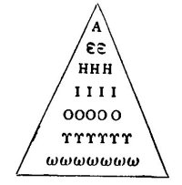
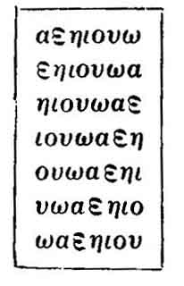
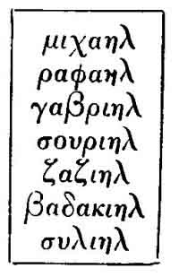
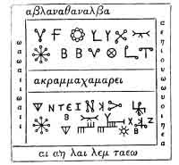

  
[Intangible Textual Heritage](../../index)  [Egypt](../index.md) 
[Index](index)  [Previous](ema06)  [Next](ema08.md) 

------------------------------------------------------------------------

p. 157

# CHAPTER V.

### MAGICAL NAMES.

THE Egyptians, like most Oriental nations, attached very great
importance to the knowledge of names, and the knowledge of how to use
and to make mention of names which possessed magical powers was a
necessity both for the living and the dead. It was believed that if a
man knew the name of a god or a devil, and addressed him by it, he was
bound to answer him and to do whatever he wished; and the possession of
the knowledge of the name of a man enabled his neighbour to do him good
or evil. The name that was the object of a curse brought down evil upon
its owner, and similarly the name that was the object of a blessing or
prayer for benefits secured for its master many good things. To the
Egyptian the name was as much a part of a man's being as his soul, or
his double (KA), or his body, and it is quite certain that this view was
held by him in the earliest times. Thus in the text which is inscribed
on the walls inside [1](#fn_103.md) the pyramid

p. 158

of Pepi L, king of Egypt about B.C. 3200, we read, "Pepi hath been
purified. He hath taken in his hand the *mâh* staff, he hath provided
himself with his throne, and he hath taken his seat in the boat of the
great and little companies of the gods. Ed maketh Pepi to sail to the
West, he stablisheth his seat above those of the lords of doubles, and
he writeth down Pepi at the head of those who live. The doors of Pekh-ka
which are in the abyss open themselves to Pepi, the doors of the iron
which is the ceiling of the sky open themselves to Pepi, and he passeth
through them; he hath his panther skin upon him, and the staff and whip
are in his hand. Pepi goeth forward with his flesh, Pepi is happy with
his name, and he liveth with his *ka* (double)." Curiously enough only
the body and name and double of the king are mentioned, just as if these
three constituted his whole economy; and it is noteworthy what
importance is attached to the name in this passage. In the text from the
pyramid of another king [1](#fn_104.md) we have a
prayer concerning the preservation of the name, which is of such
interest that a rendering of it in full is here given: it reads, "O
Great Company of the gods who dwell in Annu (Heliopolis), grant that
Pepi Nefer-ka-Râ may flourish (*literally* 'germinate'), and that his
pyramid, his ever lasting building, may flourish, even as the name of

p. 159

Temu, the chief of the nine gods, doth flourish. If the name of Shu, the
lord of the upper shrine in Annu, flourisheth, then Pepi shall flourish,
and his pyramid, his everlasting building, shall flourish! If the name
of Tefnut, the lady of the lower shrine in Annu, flourisheth, the name
of Pepi shall be established, and this his pyramid shall be established
to all eternity! If the name of Seb flourisheth at the 'homage of the
earth,' then the name of Pepi shall flourish, and this his pyramid shall
flourish, and this his building shall flourish unto all eternity! If the
name of Nut in the House of Shenth in Annu flourisheth, the name of Pepi
shall flourish, and this his pyramid shall flourish, and this his
building shall flourish unto all eternity! If the name of Osiris
flourisheth in the nome of Abydos, then the name of Pepi shall flourish,
and this his pyramid shall flourish, and this his building shall
flourish unto all eternity! If the name of Osiris Khent-Amentet
flourisheth, then the name of Pepi shall flourish, and this his pyramid
shall flourish, and this his building shall flourish unto all eternity!
If the name of Set, the dweller in Nubt (Ombos) flourisheth, then the
name of Pepi shall flourish, and this his pyramid shall flourish, and
this his building shall flourish unto all eternity! If the name of Horus
flourisheth, then the name of Pepi shall flourish, and this his pyramid
shall flourish, and this his building shall flourish unto all

p. 160

eternity! If the name of Râ flourisheth in the horizon, then the name of
Pepi shall flourish, and this his pyramid shall flourish, and this his
building shall flourish unto all eternity! If the name of Khent-merti
flourisheth in Sekhem (Letopolis), then the name of Pepi shall flourish,
and this his pyramid shall flourish, and this his building shall
flourish unto all eternity! If the name of Uatchet in Tep flourisheth,
then the name of Pepi shall flourish, and this his pyramid shall
flourish, and this his building shall flourish unto all eternity!" The
above prayer or formula was the origin of most of the prayers and texts
which had for their object the "making the name to germinate or
flourish," and which were copied so frequently in the Saïte, Ptolemaic,
and Roman periods. All these compositions show that from the earliest to
the latest times the belief as to the importance of the preservation of
the name never changed in Egypt, and the son who assisted in keeping
green his father's name, and in consequence his memory, performed a most
meritorious duty. But in the present chapter we are not so much
concerned with the ordinary as with the extraordinary uses to which a
name might be put, and the above facts have only been mentioned to prove
that a man's name was regarded as an essential part of himself, and that
the blotting out of the name of an individual was synonymous with his
destruction. Without a name no man could be identified in the

p. 161

judgment, and as a man only came into being upon this earth when his
name had been pronounced, so the future life could only be attained
after the gods of the world beyond the grave had become acquainted with
it and had uttered it.

According to the story of the Creation which is related in the Papyrus
of Nesi-Amsu, [1](#fn_105.md) before the world and
all that therein is came into being, only the great god Neb-er-tcher
existed, for even the gods were not born. Now when the time had come for
the god to create all things be says, "I brought (*i.e.*, fashioned) my
mouth, and I uttered my own name as a word of power, and thus I evolved
myself under the evolutions of the god Khepera, and I developed myself
out of the primeval matter which had evolved multitudes of evolutions
from the beginning of time. Nothing existed on this earth \[before me\],
I made all things. There was none other who worked with me at that time.
Elsewhere, that is to say, in the other version of the story, the god
Khepera says, I developed ct myself from the primeval matter which I
made, I developed myself out of the primeval matter. My name is'
Osiris,' the germ of primeval matter." Here, then, we have a proof that
the Egyptians regarded the creation as the result of the utterance of
the name of the god Neb-er-tcher or Khepera by himself. Again, in the
story of Râ and Isis, given in the preceding

p. 162

chapter, we have seen that although Isis was able to make a serpent and
to cause it to bite Râ, and to make him very ill, she was powerless to
do as she wished in heaven and upon earth until she had persuaded the
god to reveal to her his name by which he ruled the universe. In
yielding up his name to the goddess he placed himself in her power, and
in this example we have a striking instance of the belief that the
knowledge of the name of god, or devil, or human being, implied dominion
over that being. We have seen elsewhere that Râ, the type and symbol of
God, is described as the god of "many names," and in that wonderful
composition the XVIIth Chapter of the Book of the Dead, [1](#fn_106.md) we have the following statement:--"I am
the great god Nu, who gave birth unto himself, and who made his name to
become the company of the gods." Then the question, "What does this
mean?" or "Who is this?" is asked. And this is the answer: "It is Râ,
the creator of the name\[s\] of his limbs, which came into being in the
form of the gods who are in the following of Râ." From this we see that
all the "gods" of Egypt were merely personifications of the NAMES Of Râ,
and that each god was one of his members, and that a name of a god was
the god himself. Without the knowledge of the names of the gods and
devils of the underworld the dead Egyptian would have fared badly, for
his personal liberty would have been

p. 163

fettered, the roads and paths would have been blocked to him, the gates
of the mansions of the underworld would have been irrevocably shut in
his face, and the hostile powers which dogged his footsteps would have
made an end of him; these facts are best illustrated by the following
examples:--

When the deceased comes to the Hall of Judgment, at the very beginning
of his speech he says, "Homage to thee, O Great God, thou Lord of Maâti,
I have come to thee, O my Lord, and I have brought myself hither that 1
may behold thy beauties. I know thee, and I know thy name, and I know
the names of the two and forty gods who exist with thee in this Hall of
Maâti." [1](#fn_107.md) But although the gods may
be favourable to him, and he be found righteous in the judgment, he
cannot make his way among the other gods of the underworld without a
knowledge of the names of certain parts of the Hall of Maâti. After the
judgment he acquires the mystical name of "He who is equipped with the
flowers and the dweller in his olive tree," and it is only after he has
uttered this name that the gods say "Pass onwards." Next the gods invite
him to enter the Hall of Maâti, but he is not allowed to pass in until
he has, in answer to questions asked by the bolts, lintels, threshold,
fastenings, socket, door-leaves, and door-posts, told their names. The
floor of the Hall will not permit him to walk upon it unless he

p. 164

tells not only its name, but also the mystical names of his two legs and
feet wherewith he is about to tread upon it. When all this has been done
the guardian of the Hall says to him, "I will not announce thy name \[to
the god\] unless thou tellest me my name"; and the deceased replies,
"'Discerner of hearts and searcher of the reins' is thy name." In reply
to this the guardian says, "If I announce thy name thou must utter the
name of the god who dwelleth in his hour," and the deceased utters the
name "Mâau-Taui." But still the guardian is not satisfied, and he says,
"If I announce thy name thou must tell me who is he whose heaven is of
fire, whose walls \[are surmounted by\] living uraei, and the floor of
whose house is a stream of water. Who is he, I say? (*i.e.*, what is his
name?)" But the deceased has, of course, learnt the name of the Great
God, and he replies, "Osiris." The guardian of the Hall is now content,
and he says, "Advance, verily thy name shall be mentioned to him"; and
he further promises that the cakes, and ale, and sepulchral meals which
the deceased shall enjoy shall come from the "Eye of Râ,"

In another Chapter [1](#fn_108.md) the deceased
addresses seven gods, and says, "Hail, ye seven beings who make decrees,
who support the Balance on the night of the judgment of the Utchat, who
cut off heads, who hack necks in pieces, who take possession of hearts
by

p. 165

violence and rend the places where hearts are fixed, who make
slaughterings in the Lake of Fire, I know you, and I know your names;
therefore know ye me, even as I know your names." The deceased, having
declared that the seven gods know his name and he their names, has no
further apprehension that evil will befall him.

In one portion of the kingdom of Osiris there existed seven halls or
mansions through which the deceased was anxious to pass, but each of the
gates was guarded by a doorkeeper, a watcher, and a herald, and it
required special provision on the part of the deceased to satisfy these
beings that he had a right to pass them. In the first place, figures of
the seven gates had to be made in some substance (or painted upon
papyrus), as well as a figure of the deceased: the latter was made to
approach each of the gates and to stand before it and to recite an
address which had been specially prepared for the purpose. Meanwhile the
thigh, the head, the heart, and the hoof of a red bull were offered at
each gate, as well as a very large number of miscellaneous offerings
which need not be described in detail. But all these ceremonies would
not help the deceased to pass through the gates, unless be knew the
names of the seven doorkeepers, and the seven watchers, and the seven
heralds who guarded them. The gods of the first gate
were:--Sekhet-hra-âsht-aru, Semetu, and Hukheru; those of the second,
Tun-hât, Seqet-hra, and

p. 166

Sabes; of the third, Am-huat-ent-pehfi, Res-hra, and Uâau; of the
fourth, Khesef-hra-âsht-kheru, Res-ab, and Neteka-hra-khesef-atu; of the
fifth, Ânkh-em-fentu, Ashebu, and Tebherkehaat; of the sixth,
Akentauk-ha-kheru, An-hra, and Metes-hra-ari-she; of the seventh,
Metes-sen, Ââa-kheru, and Khesef-hra-khemiu. And the text, which the
deceased recites to the Halls collectively, begins, "Hail, ye Halls!
Hail, ye who made the Halls for Osiris! Hail, ye who watch your Halls!
Hail, ye who herald the affairs of the two lands for the god Osiris each
day, the deceased knoweth you, and he knoweth your names." [1](#fn_109.md) The names having been uttered, and the
addresses duly recited, the deceased went wherever he pleased in the
seven Halls of Osiris.

But beside the seven halls the deceased had to pass through the
twenty-one hidden pylons of the house of Osiris in the Elysian Fields,
and in order to do so he had to declare the names of the pylon and the
doorkeeper of each, and to make a short address besides. Thus to the
first pylon he says, "I have made my way, I know thee and I know thy
name, and I know the name of the god who guardeth thee. Thy name is
'Lady of tremblings, with lofty walls, the sovereign lady, the mistress
of destruction, who setteth in order the words which drive back the
whirlwind and the storm, who delivereth from destruction him that

p. 167

travelleth along the way'; and the name of thy doorkeeper is Neri." At
the second pylon he says, "I have made \[my\] way, I know thee, and I
know thy name, and I know the name of the god who guardeth thee. Thy
name is 'Lady of heaven, the mistress of the world, who devoureth with
fire, the lady of mortals, who knoweth mankind.' The name of thy
doorkeeper is Mes-Ptah," and so on at each of the pylons. In the later
and longer version of the chapter which was written to supply the
deceased with this knowledge he informs the god of each pylon what
purification he has undergone; thus to the god of the first pylon he
says, "I have anointed myself with *hâti* "unguent \[made from\] the
cedar, I have arrayed myself in apparel of *menkh* (linen), and I have
with me my sceptre made of *heti* wood." After the speech the god of the
pylon says, "Pass on, then, thou art pure."

When we remember that one of the oldest beliefs as to the future life
made it appear that it would be lived by man in the Sekhet-Aaru, or
Field of Reeds, a region which, as we know from the drawings of it which
have come down to us, was intersected by canals and streams, it is at
once clear that in order to pass from one part of it to another the
deceased would need a boat. Even assuming that he was fortunate enough
to have made his own way into this region, it was not possible for him
to take a boat with him. To meet, this difficulty a boat and all its
various parts were

p. 168

drawn upon the papyrus, upon which the selection of Chapters from the
Book of the Dead had been inscribed for him, and a knowledge of the text
of the chapter which belonged to it made the drawing to become an actual
boat. But before he could enter it, the post to which it was tied up,
and every part of the boat itself, demanded that he should tell them
their names, thus:--

Post at which to tie up. "Tell me my name." D. [1](#fn_110.md) "Lord of the two lands, dweller in the
shrine," is thy name.

Rudder. "Tell me my name." D. "Leg of Hâpiu" is thy name.

Rope. "Tell me my name." D. "Hairs with which Anpu finisheth the work of
my embalmment" is thy name.

Oar-ruts. "Tell us our name." D. "Pillars of the underworld" is your
name.

Hold. "Tell me my name." D. "Akau" is thy name.

Mast. "Tell me my name." D. "Bringer back of the lady after her
departure" is thy name.

Lower deck. "Tell me my name." D. "Standard of Ap-uat" is thy name.

Upper Post. "Tell me my name." D. "Throat of Mestha" is thy name.

Sail. "Tell me my name." D. "Nut" is thy name.

Leather Straps. "Tell us our name." D. "Those who

p. 169

are made from the hide of the Mnevis Bull, which was burned by Suti," is
your name.

Paddles. "Tell us our name." D. "Fingers of Horus the firstborn" is your
name.

Pump (?). "Tell me my name." D. "The hand of Isis which wipeth away the
blood of the Eye of Horus," is thy name.

Planks. "Tell us our names." D. "Mestha, Hâpi, Tuamutef, Qebhsennuf,
Haqau, Thet-em-âua, Maa-an-tef, Ari-nef-tchesef," are your names.

Rows. "Tell us our name." D. "He who is at the head of his nomes" is
your name.

Hull. "Tell me my name." D. "Mert" is thy name.

Rudder. "Tell me my name." D. "Âqa" is thy name; Shiner in the water,
hidden beam," is thy name.

Keel. "Tell me my name." D. "Thigh of Isis, which Râ cut off with the
knife to bring blood into the Sektet boat," is thy name.

Sailor. "Tell me my name." D. "Traveller" is thy name.

Wind. "Tell me my name." D. "The North Wind, which cometh from Tem to
the nostrils of Osiris," is thy name.

And when the deceased had declared to these their names, before he could
set out on his journey he was obliged to tell the river, and the
river-banks, and the ground their mystical names. This done, the boat

p. 170

admitted him as a passenger, and he was able to sail about to any part
of the Elysian Fields at will.

But among the beings whom the deceased wished to avoid in the underworld
were the beings who "lay snares, and who work the nets, and who are
fishers," and who would draw him into their nets. It seems as if it were
absolutely necessary that he should fall in with these beings and their
nets, for a whole chapter of the Book of the Dead was written with the
view of enabling him to escape from them unharmed; the god their leader
is called "the god whose face is behind him," and "the god who hath
gained the mastery over his heart." To escape from the net which was
worked by "the fishers who lay snares with their nets and who go round
about in the chambers of the waters," the deceased had to know the names
of the net, and of the ropes, and of the pole, and of the hooks, and of
each and every part of it; without this knowledge nothing could save him
from calamity. We unfortunately understand very few of the allusions to
mythological events which are contained in the names of the various
parts of the machinery which work the net, but it is quite certain that
they have reference to certain events in the lives of the gods who are
mentioned, and that these were well known to the writers and readers of
religious texts.

From the above descriptions of the means whereby the deceased made his
way through the gates and the

p. 171

halls of the underworld and escaped from the fowler and his net, it will
be readily understood that the knowledge of the name alone was, in some
cases, sufficient to help him out of his difficulties; but in others it
was necessary to have the name which was possessed of magical power
inscribed upon some object, amulet or otherwise. Moreover, some gods and
devils were thought to have the power to assume different forms, and as
each form carried with it its own name, to have absolute power over a
god of many forms it was necessary to know all his names. Thus in the
"Book of Overthrowing Âpep" [1](#fn_111.md) we are
told not only to make a wax figure of the monster, but also to write his
name upon it, so that when the figure is destroyed by being burnt in the
fire his name also may be destroyed; this is a striking example of the
belief that the name was an integral part of the economy of a living
creature. But Âpep possessed many forms and therefore many names, and
unless he could be invoked by these names he still had the power to do
evil; the above-mentioned book [2](#fn_112.md)
therefore supplies us with a list of his names, among which occur the
following:--"Tutu (*i.e.*, Doubly evil one), Hau-hra (*i.e.*, "Backward
Face), Hemhemti (*i.e.*, Roarer), Qetu (*i.e.*, Evil-doer), Âmam
(*i.e.*, Devourer), Saatet-ta (*i.e.*, Darkener of earth), Iubani,
Khermuti, Unti, Karauememti,

p. 172

Khesef-hra, Sekhem-hra, Khak-<u>a</u>b, Nâi, Uai, Beteshu, Kharebutu the
fourfold fiend," etc. All these names represent, as may be seen from the
few of which translations are given, various aspects of Âpep, the devil
of thunder, lightning, cloud, rain, mist, storm, and the like, and the
anxiety to personify these so that the personifications might be
attacked by means of magical ceremonies and words of power seems
positively childish.

Passing now to certain chapters of the Book of the Dead which are rich
in names of magical power, [1](#fn_113.md) we
notice that the god Amen, whose name meant the "hidden one," possessed
numerous names, upon the knowledge of which the deceased relied for
protection. Thus he says, "O Amen, [2](#fn_114.md)
Amen; O Re-Iukasa; O God, Prince of the gods of the east, thy name is
Na-ari-k, or (as others say) Ka-ari-ka, Kasaika is thy name.
Arethikasathika is thy name. Amen-na-an-ka-entek-share, or (as others
say) Thek-share-Amen-kerethi, is thy name. O Amen, let me make
supplication unto thee, for I, even I, know thy name. Amen is thy name.
Ireqai is thy name. Marqathai is thy name. Rerei is thy name. Nasaqbubu
is thy name. Thanasa-Thanasa is thy name. Shareshatha-katha is thy name.
O Amen, O Amen, O God, O God, O Amen, I adore thy name." In another
place [3](#fn_115.md) the deceased addresses
Sekhet-Bast-Râ, saying,

p. 173

"Thou art the fire-goddess Ami-seshet, whose opportunity escapeth her
not; thy name is Kaharesapusaremkakaremet, Thou art like unto the mighty
flame of Saqenaqat which is in the bow of the boat of thy father
Harepukakashareshabaiu, for behold, thus is \[the name uttered\] in the
speech of the Negroes, and of the Anti, and of the people of Nubia.
Sefiperemhesihrahaputchetef is thy name; Atareamtcherqemturennuparsheta
is the name of one of thy divine sons, and Panemma that of the other."
And in yet another chapter [1](#fn_116.md) the
deceased addressing the god Par says, "Thou art the mighty one of names
among the gods, the mighty runner whose strides are might thou art the
god the mighty one who comest and rescuest the needy one and the
afflicted from him that oppresseth him; give heed to my cry. I am the
Cow, and thy divine name is in my mouth, and I will utter it;
Haqabakaher is thy name; Âurauaaqersaanqrebathi is thy name; Kherserau
is thy name; Kharsatha is thy name. I praise thy name . . . . O be
gracious unto the deceased, and cause thou heat to exist under his head,
for, indeed, he is the soul of the great divine Body which resteth in
Annu (Heliopolis), whose names are Khukheperuru and Barekathatchara."

The examples of the use of names possessing magical powers described
above illustrate the semi-religious

p. 174

views on the subject of names which the Egyptians held, and we have now
to consider briefly the manner in which the knowledge of a name was
employed in uses less important than those which had for their object
the attainment of life and happiness in the world to come. In the famous
magical papyrus [1](#fn_117.md) which Chabas
published [2](#fn_118.md) we find a series of
interesting charms and magical formulæ which were written to preserve
its possessor from the attacks of sea and river monsters of every kind,
of which the following is an example. "Hail, lord of the gods! Drive
away from me the lions of the country of Meru (Meroë?), and the
crocodiles which come forth from the river, and the bite of all
poisonous reptiles which crawl forth from their holes. Get thee back, O
crocodile Mâk, thou son of Set! Move not by means of thy tail! Work not
thy legs and feet! Open not thy mouth! Let the water which is before
thee turn into a consuming fire, O thou whom the thirty-seven gods did
make, and whom the serpent of Râ did put in chains, O thou who wast
fettered with links of iron before the boat of Râ! Get thee back, O
crocodile Mâk, thou son of Set!" These words were to be said over a
figure of the god Amen painted on clay; the rod was to have four rams'
heads upon one neck, under his feet was to be a figure of the crocodile
Mâk, and

p. 175

to the right and left of him were to be the dog headed apes, *i.e.*, the
transformed spirits of the dawn, who sang hymns of praise to Râ when he
rose daily. [1](#fn_119.md) Again, let us suppose
that some water monster wished to attack a man in a boat. To avoid this
the man stood before the cabin of the boat and, taking a hard egg in his
hand, he said, "O egg of the water which hath been spread over the
earth, essence of the divine apes, the great one in the heaven above and
in the earth beneath, who dost dwell in the nests which are in the
waters, I have come forth with thee from the water, I have been with
thee in thy nest, I am Amsu of Coptos, I am Amsu, lord of Kebu." When he
had said these words he would appear to the animal in the water in the
form of the god Amsu, with whom he had identified himself, and it would
be afraid and flee. At the end of the papyrus in which the above
extracts occur we find a series of magical names which may be read
thus:--Atir-Atisa, Atirkaha-Atisa, Samumatnatmu-Atisa, Samuanemui-Atisa,
Samutekaari-Atisa, Samutekabaiu-Atisa, Samutchakaretcha-Atisa,
Tâuuarehasa, Qina, Hama, Senentuta-Batetsataiu, Anrehakatha-sataiu,
Haubailra-Haari. From these and similar magical names it is quite
certain that the Gnostics and other sects which held views akin to
theirs obtained the names which they were so fond of

p. 176

inscribing upon their amulets and upon the so-called magical papyri. The
last class of documents undoubtedly contains a very large proportion of
the magical ideas, beliefs, formulæ, etc., which were current in Egypt
from the time of the Ptolemies to the end of the Roman Period, but from
about B.C. 150 to A.D. 200 the papyri exhibit traces of the influence of
Greek, Hebrew, and Syrian philosophers and magicians, and from a passage
like the following [1](#fn_120.md) we may get a
proof of this:--"I call thee, the headless one, that didst create earth
and heaven, that didst create night and day, thee the creator of light
and darkness. Thou art Osoronnophris, whom no man hath seen at any time;
thou art Iabas, thou art Iapôs, thou hast distinguished the just and the
unjust, thou didst make female and male, thou didst produce seeds and
fruits, thou didst make men to love one another and to bate one another.
I am Moses thy prophet, to whom thou didst commit thy mysteries, the
ceremonies of Israel; thou didst produce the moist and the dry and all
manner of food. Listen to me: I am an angel of Phapro Osoronnophris;
this is thy true name, handed down to the prophets of Israel. Listen to
me. [2](#fn_121.md) . . ." In this passage the
name Osoronnophris is clearly a corruption of the old Egyptian names of
the

p. 177

great god of the dead "Ausar Unnefer," and Phapro seems to represent the
Egyptian *Per-âa* (literally, "great house") or "Pharaoh," with the
article *pa* "the" prefixed. It is interesting to note that Moses is
mentioned, a fact which seems to indicate Jewish influence.

In another magical formula we read, [1](#fn_122.md) "I call upon thee that didst create the
earth and bones, and all flesh and all spirit, that didst establish the
sea and that shakest the heavens, that didst divide the light from the
darkness, the great regulative mind, that disposest everything, eye of
the world, spirit of spirits, god of gods, the lord of spirits, the
immoveable Aeon, IAOOUÊI, hear my voice. I call upon thee, the ruler of
the gods, high-thundering Zeus, Zeus, king, Adonai, lord, Iaoouêe. I am
he that invokes thee in the Syrian tongue, the great god, Zaalaêr,
Iphphou, do thou not disregard the Hebrew appellation Ablanathanalb,
Abrasilôa. For I am Silthakhôoukh, Lailam, Blasalôth, Iaô, Ieô, Nebouth,
Sabiothar, Bôth, Arbathiaô, Iaoth, Sabaôth, Patoure, Zagourê, Baroukh
Adonai, Elôai, Iabraam, Barbarauô, Nau, Siph," etc. The spell ends with
the statement that it "loosens chains, blinds, brings dreams, creates
favour; it may be used in common for whatever purpose you will." In the
above we notice at once the use of the seven vowels which form "a name
wherein be contained all Names,

p. 178

and all Lights, and all Powers." [1](#fn_123.md)
The seven vowels have, of course, reference to the three vowels
"Iaô" [2](#fn_124.md) which were intended to
represent one of the Hebrew names for Almighty God, "Jâh." The names
"Adonai, Elôai," are also derived through the Hebrew from the Bible, and
Sabaôth is another well-known Hebrew word meaning "hosts"; some of the
remaining names could be explained, if space permitted, by Hebrew and
Syriac words. On papyri and amulets the vowels are written in magical
combinations in such a manner as to form triangles and other shapes;
with them are often found the names of the seven archangels of God; the
following are examples:--

|                                                                                       |                                                                                       |                                                                                       |
|---------------------------------------------------------------------------------------|---------------------------------------------------------------------------------------|---------------------------------------------------------------------------------------|
|   [3](#fn_125) |   [4](#fn_126) |   [5](#fn_127.md) |

 

In combination with a number of signs which owe their origin to the
Gnostics the seven vowels were

p. 179

sometimes engraved upon plaques, or written upon papyri, with the view
of giving the possessor power over gods or demons or his fellow
creatures. The example printed below is found on a papyrus in the
British Museum and accompanies a spell written for the-purpose of
overcoming the malice of enemies, and for giving security against alarms
and nocturnal visions. [1](#fn_128.md)

 

Amulet inscribed with signs and letters of magical power for overcoming
the malice of enemies.  
(From Brit. Mus., Greek Papyrus, Nu. CXXIV.--4th or 5th century.)

But of all the names found upon Gnostic gems two, *i.e.*, Khnoubis (or
Khnoumis), and Abrasax (or Abraxas), are of the most frequent
occurrence. The first is usually represented as a huge serpent having
the head of a lion surrounded by seven or twelve rays. Over the seven
rays, one on the point of each, are the seven vowels of the Greek
alphabet, which some suppose to

p. 180

refer to the seven heavens; and on the back of the amulet, on which the
figure of Khnoumis occurs, is usually found the sign of the triple S and
bar. Khnoumis is, of course, a form of the ancient Egyptian god Khnemu,
or "Fashioner" of man and beast, the god to whom many of the attributes
of the Creator of the universe were ascribed. Khnemu is, however, often
depicted with the head of a ram, and in the later times, as the
"beautiful ram of Râ," he has four heads; in the Egyptian monuments he
has at times the head of a hawk, but never that of a lion. The god
Abrasax is represented in a form which has a human body, the bead of a
hawk or cock, and legs terminating in serpents; in one hand he holds a
knife or dagger, and in the other a shield upon which is inscribed the
great name ΙΑΩ {Greek *IAW*}, or JÂH. Considerable difference of opinion
exists as to the meaning and derivation of the name Abrasax, but there
is no doubt that the god who bore it was a form of the Sun-god, and that
he was intended to represent some aspect of the Creator of the world.
The name was believed to possess magical powers of the highest class,
and Basileides, [1](#fn_129.md) who gave it
currency in the second century, seems to have regarded it as an
invincible name. It is probable, however, that its exact meaning was
lost at an early date, and that it

p. 181

soon degenerated into a mere magical symbol, for it is often found
inscribed on amulets side by side with scenes and figures with which,
seemingly, it cannot have any connexion whatever. Judging from certain
Gnostic gems in the British Museum, Abrasax is to be identified with the
polytheistic figure that stands in the upper part of the Metternich
stele depicted on p. 153. This figure has two bodies, one being that of
a man, and the other that of a bird; from these extend four wings, and
from each of his knees projects a serpent. He has two pairs of hands and
arms; one pair is extended along the wings, each hand holding the
symbols of "life," "stability," and "power," and two knives and two
serpents; the other pair is pendent, the right hand grasping the sign of
life, and the other a sceptre. His face is grotesque, and probably
represents that of Bes, or the sun as an old man; on his head is a
pylon-shaped object with figures of various animals, and above it a pair
of horns which support eight knives and the figure of a god with raised
hands and arms, which typifies "millions of years." The god stands upon
an oval wherein are depicted figures of various "typhonic" animals, and
from each side of his crown proceed several symbols of fire. Whether in
the Gnostic system Abraxas absorbed all the names and attributes of this
god of many forms cannot be said with certainty.

------------------------------------------------------------------------

### Footnotes

[157:1](ema07.htm#fr_103.md) Line 169.

[158:1](ema07.htm#fr_104.md) Pepi II. (ed.
Maspero, 1. 669, ff. Recueil, tom. xii. 1892, p. 146).

[161:1](ema07.htm#fr_105.md) See my paper in
*Archæologia*, Vol. LII., London, 1891.

[162:1](ema07.htm#fr_106.md) See *Chapters of
Coming Forth by Day*, p. 49.

[163:1](ema07.htm#fr_107.md) See *Chapters of
Coming Forth by Day*, p. 191.

[164:1](ema07.htm#fr_108.md) *See Chapters of
Coming Forth by Day*, p. 128.

[166:1](ema07.htm#fr_109.md) See *Chapters of
Coming Forth by Day*, p. 211.

[168:1](ema07.htm#fr_110.md) D. = the deceased.

[171:1](ema07.htm#fr_111.md) Papyrus of Nesi-Amsu,
col. xxiii. 1. 6. (*Archæologia*, vol. LII.)

[171:2](ema07.htm#fr_112.md) *Ibid.*, col. xxxii.
1. 13 f.

[172:1](ema07.htm#fr_113.md) Chapters CLXII.,
CLXIII., CLXIV., CLXV.

[172:2](ema07.htm#fr_114.md) See *Chapters of
Coming Forth by Day*, p. 295.

[172:3](ema07.htm#fr_115.md) *Ibid.*, p. 293.

[173:1](ema07.htm#fr_116.md) See *Chapters of
Coming Forth by Day*, p. 289.

[174:1](ema07.htm#fr_117.md) British Museum, No.
10,042.

[174:2](ema07.htm#fr_118.md) *Le Papyrus Magique
Harris*, Chalon-sur-Saône, 1860.

[175:1](ema07.htm#fr_119.md) See the scene in the
rounded portion of the Metternichstele illustrated on p. 149.

[176:1](ema07.htm#fr_120.md) See Goodwin,
*Fragment of a Græco-Egyptian Work upon Magic*, p. 7.

[176:2](ema07.htm#fr_121.md) Here follow a number
of names of which Reibet, Athelebersthe, Blatha, Abeu, Ebenphi, are
examples.

[177:1](ema07.htm#fr_122.md) Goodwin, *op. cit.*,
p. 21.

[178:1](ema07.htm#fr_123.md) See Kenyon, *Greek
Papyri in the British Museum*, London, 1893, p. 63.

[178:2](ema07.htm#fr_124.md) For Iaoouêi we should
probably read Iaô ouêi.

[178:3](ema07.htm#fr_125.md) British Museum,
Gnostic gem, No. G. 33.

[178:4](ema07.htm#fr_126.md) Kenyon, *Greek
Papyri*, p. 123.

[178:5](ema07.htm#fr_127.md) *Ibid.*, p. 123.
These names read Michael, Raphael, Gabriel, Souriel, Zaziel, Badakiel,
and Suliel.

[179:1](ema07.htm#fr_128.md) Kenyon, *op. cit.*,
P. 121.

[180:1](ema07.htm#fr_129.md) He of Alexandria, who
lived about A.D. 120. He was a disciple of Menander, and declared that
he had received the esoteric doctrine of Saint Peter from Glaucias, a
disciple of the Apostle.

------------------------------------------------------------------------

[Next: Chapter VI. Magical Ceremonies](ema08.md)
